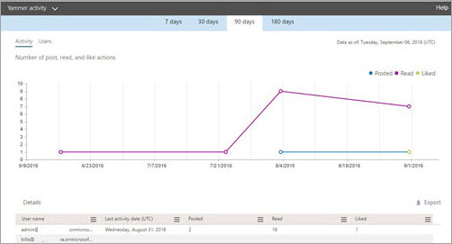
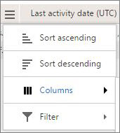

# 管理中心内的 Office 365 报告-Yammer 活动报告

作为 Microsoft 365 管理员，"**报告**" 仪表板显示有关您组织中的产品使用情况的数据。 查看[管理中心中的活动报表](activity-reports.md)。 使用" **Yammer 活动报表** "，可以通过查看使用 Yammer 发布、点赞或阅读消息的唯一用户数以及组织中生成的活动数来了解使用 Yammer 的组织的参与级别。 
  
> [!NOTE]
> 您必须是 Microsoft 365 或 Exchange、SharePoint、团队服务、团队通信或 Skype for Business 管理员中的全局管理员、全局读取器或报告阅读器才能查看报告。 
 
## 如何获取 Yammer 活动报表

1. 在管理中心，转到“**报表**”\> <a href="https://go.microsoft.com/fwlink/p/?linkid=2074756" target="_blank">使用情况</a>页面。

    
2. 从 "**选择报表**" 下拉下，选择 " **Yammer** \> **活动**"。
  
## Yammer 活动报表说明

可通过查看"活动"和"用户"图表，了解用户的 Yammer 活动。
  

  
活动报表包含以下信息。
  
- 使用天数选项卡来查看最近 7 天、30 天、90 天或 180 天的" **Yammer 活动** "报表趋势。 但是，如果您在报告中选择某一天，则该表将显示从当前日期起的最长28天（而不是报告生成日期）中的数据。 
    
- 每个报表包含此报表的生成日期。报表通常反映活动时间的 24 至 48 小时延迟。
    
- 可以查看" **活动** "图表以了解组织内进行的 Yammer 活动的数量变化趋势。可以分别了解已发布、已读或已点赞的消息。 
    
    
  
  - 在" **活动** "图表上，Y 轴表示已发布消息、已读消息或已点赞消息的活动数。 
    
- 可以查看" **用户** "图表以了解生成 Yammer 活动的唯一用户数的变化趋势。可以查看发布、阅读或点赞 Yammer 消息的用户的变化趋势。 
    
    
  
  - 在" **用户** "活动图表上，Y 轴表示用户发布、阅读或点赞 Yammer 消息。 
    
  - 这两个图表的 X 轴都表示此特定报表的所选日期范围。
    
- 您可以通过选择图例中的项目来筛选您在图表上看到的系列。 例如，在 "**活动**" 图表上，选择 "**已发布**"、"已**阅读**" 或 "已**赞**" 以仅查看与每个相关的信息。 
    
    
  
    选择此选项不会更改网格表中的信息。
    
- 该图标下的表格显示了每个用户级别的 Yammer 活动的细目。
    
    可以使用此菜单对数据进行筛选和排序。
    
    
  
    也可以添加和删除列。 可用列是：
    
  - " **用户名**"是用户的电子邮件地址。 可以显示实际的电子邮件地址或采用匿名字段。 
    
    此网格显示使用 Office 365 帐户登录到 Yammer 或使用单一登录登录到网络的用户。
    
  - **显示姓名**是用户的全名。可以显示实际的电子邮件地址或采用匿名字段。 
    
  - **用户状态**是以下三个值之一：已激活、已删除或已挂起。 
    
    这些报表显示已激活、已挂起和已删除用户的数据。报表并不反映待定用户，因为待定用户无法发布、阅读或点赞消息。
    
  - **状态更改日期 (UTC)** 表示 Yammer 中对用户状态进行更改的日期。 
    
  - **上次活动日期 (UTC)** 表示用户发布、阅读或点赞消息的最近日期。 
    
  - **已发布**表示指定时间段中用户发布的消息数。 
    
  - **已读**表示指定时间段中用户阅读的对话数。 
    
  - **已点赞**表示指定时间段中用户点赞的消息数。 
    
  - 已**分配的产品**是分配给此用户的产品。 
    
    如果组织的策略阻止你查看显示了可识别用户信息的报表，可更改所有这些报表的隐私设置。 请查看[Microsoft 365 管理中心的活动报告中](activity-reports.md)的 "**如何隐藏用户级别详细信息？** " 一节。
    
- 您还可以通过选择 "**导出**" 链接将报告数据导出到 Excel .csv 文件中。 此操作可导出所有用户的数据，使你能够对数据进行简单的排序和筛选，以进一步分析数据。 如果用户数量不足 2000，则可在报表中的表格内进行排序和筛选。 如果用户数超过 2000，则需要导出数据才能进行排序和筛选。 
    
## 这些报表中有哪些数据？

- **所有客户端** 这些报表将聚合所有客户端中的数据，包括浏览器中或 iOS 或 Android 应用上使用 Yammer 的情况。 
    
- **无外部网络数据** 这些报表中不包括外部网络数据。 
    
- **已激活的网络** 这些报表将显示 Office 365 订阅所包含的 Yammer 网络数据。图表将聚合所有登录到 Yammer 网络的用户的使用情况，而无论他们是使用 Office 365 还是 Yammer 登录的。 
    

