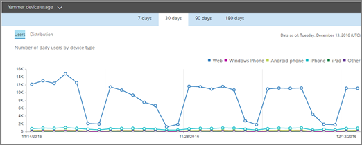

# 管理中心中的 Microsoft 365 报表 - Yammer 设备使用情况报告

Microsoft 365 **报表** 仪表板显示组织中各产品的活动概述。 它让你能够深入研究各产品级报表，以便更细致地了解每个产品内的活动。 请查看[报表概述主题](activity-reports.md)。
  
利用 Yammer 设备使用情况报表，了解你的用户正在哪些设备上使用 Yammer。可按设备类型查看每日用户数并按设备类型查看用户数。可查看所选时间段内的这两方面情况。也可查看每个用户的详细信息。
  
> [!NOTE]
> 你必须是 Microsoft 365 中的全局管理员、全局读者或报告读者，或者 Exchange、SharePoint、Teams 服务、Teams 通信或 Skype for Business 管理员才能查看报告。 
  
## 如何获取 Yammer 设备使用情况报表？

1. 在管理中心，转到“**报表**”\> <a href="https://go.microsoft.com/fwlink/p/?linkid=2074756" target="_blank">使用情况</a>页面。

    
2. 从"**选择报告"** 下拉列表中，选择 **"Yammer** \> **设备使用情况"。**
  
## Yammer 活动报表说明

通过查看" **用户**"和" **分布**"图表，可了解用户的 Yammer 设备使用情况。 
  
设备使用情况报表包含以下信息。
  
- 使用日期选项卡查看过去 7 天、30 天、90 天或 180 天的 **Yammer** 设备使用情况活动报告趋势。 但是，如果您选择报告中的某一天，则该表将显示自当前日期起最多 28 天的数据 (而不是报告生成日期) 。 
    
- 每个报表包含此报表的生成日期。报表通常反映活动时间的 24 至 48 小时延迟。
    
- 可浏览" **用户**"图表，按设备类型查看每日用户数。  
  
- 可浏览" **分布**"图表，按设备类型查看用户数。  
  
- 通过该图表下的" **详细信息**"表格，可详细了解每个用户级别的 Yammer 设备使用情况。 
    
    也可以添加和删除列。可用列是：
    
  - " **用户名**"是用户的电子邮件地址。 可以显示实际的电子邮件地址或采用匿名字段。 
    
    此网格显示使用 Microsoft 365 帐户登录 Yammer 的用户，或者使用单一登录登录网络的用户。
    
  - **显示姓名** 是用户的全名。可以显示实际的电子邮件地址或采用匿名字段。 
    
  - **用户状态** 是以下 3 个值之一：已激活、已删除或已挂起。 
    
    这些报表显示已激活、已挂起和已删除用户的数据。报表并不反映待定用户，因为待定用户无法发布、阅读或点赞消息。
    
  - " **Web**"指示用户是否已在 Web 上使用过 Yammer。 
    
  - " **Windows 手机**"指示用户是否已在 Windows 手机上使用过 Yammer 
    
  - " **Android 手机**"指示用户是否已在 Android 手机上使用过 Yammer。 
    
  - " **iPhone**"指示用户是否已在 iPhone 上使用过 Yammer。 
    
  - " **iPad**"指示用户是否已在 iPad 上使用过 Yammer。 
    
  - " **其他**"指示用户是否已在前面未列出的其他设备上使用过 Yammer。 
    
    如果组织的策略阻止你查看显示了可识别用户信息的报表，可更改所有这些报表的隐私设置。 请查看 Microsoft  [365](activity-reports.md)管理中心的活动报告中的如何隐藏用户级别详细信息？部分。
    
- 您还可以通过选择"导出"链接，将报告数据导出到 Excel .csv **文件中。** 此操作可导出所有用户的数据，使你能够对数据进行简单的排序和筛选，以进一步分析数据。 如果用户数量不足 2000，则可在报表中的表格内进行排序和筛选。 如果用户数超过 2000，则需要导出数据才能进行排序和筛选。 
    

