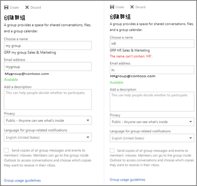
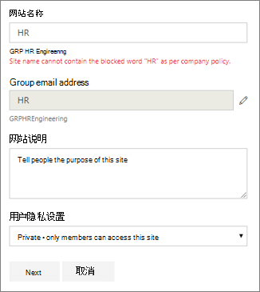

# Office 365 组命名策略

您可以使用组命名策略为组织中的用户创建的组强制实施一致的命名策略。 命名策略可帮助您和您的用户标识组、成员身份、地理区域或创建组的用户的功能。 命名策略还有助于对通讯簿中的组进行分类。 您可以使用该策略阻止在组名称和别名中使用特定字词。

命名策略适用于跨所有组工作负荷（如 Outlook、Microsoft 团队、SharePoint、Planner、Yammer 等）创建的组。 它将应用于组名称和组别名。 当用户创建组时，或者在编辑现有组的组名称或别名时，将应用此方法。

> [!TIP]
> Office 365 组命名策略仅适用于 Office 365 组。 它不适用于 Exchange Online 中创建的通讯组。 若要创建通讯组的命名策略，请参阅[创建通讯组命名策略](https://docs.microsoft.com/exchange/recipients-in-exchange-online/manage-distribution-groups/create-group-naming-policy)。

组命名策略包含以下功能：

- **前缀后缀命名策略**：可以使用前缀或后缀定义组的命名约定（例如： "GRP\_US\_My Group\_工程"）。 前缀/后缀可以是固定字符串或像 [部门] 这样的用户属性，将根据创建组的用户进行替换。

- **自定义阻止的单词**：您可以将特定于其组织的一组阻止词上传到用户创建的组中被阻止。 （例如： "CEO，工资表，HR"）。

## 许可要求

使用适用于 Office 365 组的 Azure AD 命名策略时，需要为每个具有一个或多个 Office 365 组成员的唯一用户（包括来宾）分配 Azure Active Directory Premium P1 许可证或 Azure AD Basic EDU 许可证。
这对于创建组命名策略的管理员来说也是必需的。

## 前缀-后缀命名策略

前缀和后缀可以是固定字符串，也可以是用户属性。

### 固定字符串

您可以使用简短字符串来帮助您区分 GAL 和组工作负荷的左侧导航组中的组。 某些常用前缀后缀是关键字，如 "Grp\_Name"、"\#name"、"\_name"

### 属性

您可以使用可帮助标识创建组（如 [部门]）的用户以及从 [国家/地区] 创建组的位置的属性。

|||
|:-----|:-----|
|**示例**|Policy = "GRP [个名] [部门]"|
||用户所在的部门 = 工程|
||创建的组名称 = "GRP My Group 工程"|

受支持的 Azure Active Directory （Azure AD）属性为 [部门]、[Company]、[Office]、[StateOrProvince]、[CountryOrRegion]、[标题]

- 不受支持的用户属性被视为固定字符串。 例如， "[邮政编码]"

- 不支持扩展属性和自定义属性。

建议使用已为组织中的所有用户填充的值的属性，而不要使用具有较长值的属性。

### 要查看的内容

- 在创建策略的过程中，总前缀和后缀字符串长度限制为53个字符。

- 前缀和后缀可以包含组名和组别名中支持的特殊字符。 当前缀和后缀包含在组别名中不允许的特殊字符时，它们将被删除并应用于组别名。 因此，在这种情况下，应用于组名称的前缀和后缀将不同于应用于组别名的前缀和后缀。

- 如果使用的是 Yammer Office 365 连接的组，请避免在命名策略中使用以下字符： @ \#、 \[、 \] \<、、和\>。 如果这些字符位于命名策略中，则常规 Yammer 用户将无法创建组。

## 自定义阻止的单词

您可以输入将在组名称和别名中阻止的阻止单词的逗号分隔列表。

阻止的词检查是对用户输入的组名称完成的。 因此，如果用户输入 "darnit"，而\_"prefix" 是命名策略，则\_"prefix darnit" 将失败。

不执行任何子字符串搜索;具体来说，用户输入名称和自定义阻止词之间的完全匹配是触发故障所必需的。 不执行子字符串搜索，以便用户可以像 "类" 那样使用一些常见词语，即使 "ass" 是一个被阻止的词也是如此。

**要查看的内容**：

- 被阻止的单词不区分大小写。

- 当用户输入被阻止的单词时，组客户端将显示一条错误消息，其中包含被阻止的单词。

- 使用的阻止词中没有字符限制。

- 有5000个字的上限可被设置为阻止的单词。

## 管理员替代

在所有组的工作负荷和终结点上，在这些策略中免除了选择性管理员，以便他们可以使用这些阻止的词以及所需的命名约定创建组。 下面列出了从组命名策略中免除的管理员角色。

- 全局管理员

- 合作伙伴第1层支持

- 合作伙伴第2层支持

- 用户帐户管理员

- 目录编写者

## 如何设置命名策略

若要设置命名策略，请执行以下操作：

1. 在 " [Azure Active Directory](https://aad.portal.azure.com)" 中的 "**管理**" 下，单击 "**组**"。
2. 在 "**设置**" 下，单击 "**命名策略**"。
3. 选择 "**组命名策略**" 选项卡。
4. 在 "**当前策略**" 下，选择是否需要前缀或后缀，或者同时选择这两者，并选中相应的复选框。
5. 在每个行的**属性**和**字符串**中进行选择，然后指定属性或字符串。
6. 添加所需的前缀和后缀后，单击 "**保存**"。

## 跨 Office 365 应用程序命名策略体验

Office 365 应用程序已更新，以在用户键入组名称和别名时显示命名策略组名称（带有前缀和后缀）的预览。 当用户输入阻止的单词时，他们将看到一条错误消息，以便可以删除被阻止的单词。

## Outlook 网页版

Web 上的 Outlook （以前称为 Outlook Web App 或 OWA）在用户键入组名称或组别名时显示命名策略修饰的名称。 当用户输入一个自定义阻止的 word 时，将在 UI 中显示一条错误消息以及阻止的 word，以便用户可以将其删除。 Web 体验快照中的 Outlook 如下所示。

## Outlook 桌面

在 Outlook 桌面版中创建的组符合命名策略。 Outlook 桌面应用程序尚未显示命名策略的预览，并且在用户输入组名称时不会返回自定义阻止的 word 错误。 但是，如果在组名称或别名中存在自定义阻止的单词，则会在选择 "创建"/"编辑" 时自动应用命名策略，并且用户将会看到错误。

## Microsoft Teams

Microsoft 团队显示当用户键入团队名称时的命名策略修饰名。 当用户输入一个已阻止的自定义单词时，将显示一条错误消息和被阻止的 word，以便用户可以将其删除。

## SharePoint

当用户键入站点名称或组电子邮件地址时，SharePoint 将显示命名策略名称。 当用户输入一个已阻止的自定义单词时，将显示一条错误消息以及被阻止的单词，以便用户可以将其删除。

## Microsoft Stream

Microsoft Stream 显示用户键入组名称或组电子邮件别名时的命名策略修饰名。 当用户输入一个已阻止的自定义单词时，将显示一条错误消息，其中包含被阻止的 word，以便用户可以将其删除。

## Outlook iOS 和 Android 应用

在 Outlook 应用程序中创建的组符合命名策略。 Outlook mobile 在输入组名称时显示 "命名策略预览"。 当用户输入一个已阻止的自定义单词时，将在创建组时显示一条错误消息，以便用户可以删除被阻止的单词。

## Planner

Planner 与命名策略兼容。 Planner 显示在输入计划名称时的命名策略预览。 当用户输入一个已阻止的自定义单词时，将在创建计划时显示一条错误消息，以便用户可以删除被阻止的单词。

## 用于客户接洽的 Dynamics 365

用于客户接洽的 Dynamics 365 符合命名策略。 Dynamics 365 显示用户键入组名称或组电子邮件别名时的命名策略修饰名。 当用户输入一个已阻止的自定义单词时，将显示一条错误消息，其中包含被阻止的 word，以便用户可以将其删除。

## 学校数据同步（SDS）

通过 SDS 创建的组符合命名策略，但不会自动应用命名策略。 SDS 管理员必须将前缀和后缀追加到需要为其创建组的类名，然后上传到 SDS。 否则，组创建/编辑会失败。

## Outlook 客户管理器（OCM）

Outlook 客户管理器符合命名策略。 命名策略将自动应用于在 Outlook 客户管理器中创建的组。 如果 "所有销售团队" 中的任何单词被定义为一个自定义的阻止单词，OCM 中的组创建将被阻止。 用户将无法创建 OCM 组，并将阻止使用 OCM 应用。 "

## 教室应用

在课堂应用中创建的组符合命名策略，但不会自动应用命名策略，并且在输入教室组名称时不向用户显示命名策略预览。 因此，用户必须输入具有前缀和后缀的修饰教室组名称。 否则，课堂组创建或编辑将失败，并出现错误。

## Power BI

Power BI 工作区中创建的组符合命名策略，但不会自动应用命名策略。 而且，用户在输入 Power BI 工作区名称时不会向用户显示命名策略预览。

建议的名称（应用了命名策略）显示在创建或编辑工作区的错误详细信息中。 这意味着用户必须输入带前缀和后缀的修饰的工作区名称。 否则，工作区创建或编辑将失败，并出现错误。

## Yammer

当用户使用其 Azure Active Directory 帐户登录到 Yammer 时创建组或编辑组名称时，组名称将符合命名策略。 这同时适用于 Office 365 连接的组和所有其他 Yammer 组。

如果在命名策略就绪之前创建了 Office 365 连接组，则组名称将不会自动遵循命名策略。 当用户编辑组名称时，系统将提示他们添加前缀和后缀。

如果命名策略包含不能位于 Yammer 组名称中的字符，则只有管理员能够在 Yammer 中创建连接的组。

## StaffHub

StaffHub 团队不遵循命名策略，但基础 Office 365 组也不遵循。 StaffHub 团队名称不会应用前缀和后缀，也不会检查是否存在自定义阻止的单词。 但 StaffHub 确实应用了前缀和后缀并删除了基础 Office 365 组中阻止的单词。

## Exchange PowerShell

Exchange PowerShell cmdlet 符合命名策略。 如果在组名称和组别名中未使用命名约定，则用户将使用建议的前缀和后缀以及自定义被阻止的单词获取相应的错误消息。

## Azure Active Directory PowerShell cmdlet

Azure Active Directory PowerShell cmdlet 符合命名策略。 如果在组名称和组别名中未使用命名约定，则用户将使用建议的前缀和后缀以及自定义被阻止的单词获取相应的错误消息。

## Exchange 管理中心

Exchange 管理中心（EAC）符合命名策略。 在 "创建" 或 "编辑" 操作时，如果组名称和组别名中未使用命名约定，则用户将获得相应的错误消息，其中包含建议的前缀和后缀以及自定义被阻止的词。

## Microsoft 365 管理中心

Microsoft 365 admin center 符合命名策略。 在 "创建" 或 "编辑" 操作中，将自动应用命名策略。 用户在输入被阻止的自定义单词时，会收到适当的错误。 Microsoft 365 管理中心尚未显示命名策略的预览，并且在用户输入组名称时不会返回已阻止的自定义 word 错误。

## Azure Active Directory 门户

Azure Active Directory 门户符合命名策略。 Azure Active Directory 门户显示在输入组名称时的命名策略预览。 当用户输入一个已阻止的自定义单词时，将在创建组时显示一条错误消息，以便用户可以删除被阻止的单词。

## 有关命名策略的更多文章

[为 Azure Active Directory 中的 Office 365 组强制实施命名策略](https://go.microsoft.com/fwlink/?linkid=868340)

[用于配置组设置的 Azure Active Directory cmdlet](https://go.microsoft.com/fwlink/?linkid=868341)
