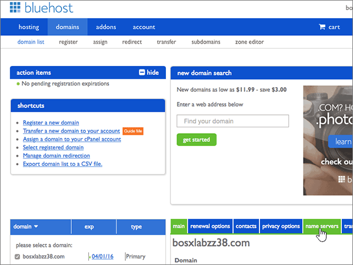

# 更改名称服务器以使用 Bluehost 设置 Microsoft

 如果找不到要查找的内容，请**[查看域常见问题解答](../setup/domains-faq.md)**。 
  
如果希望 Microsoft 为你管理 DNS 记录，请按照以下说明操作。 （如果愿意，您可以[在 Bluehost 管理所有 DNS 记录](create-dns-records-at-bluehost.md)。）
  
## 添加 TXT 记录进行验证

在将你的域用于 Microsoft 之前，我们必须确保你拥有此域。 你能够在域注册机构登录到你的帐户，并创建向 Microsoft 证明你拥有该域的 DNS 记录。
  
> [!NOTE]
> 此记录仅用于验证您是否拥有自己的域；它不会影响其他任何内容。 如果需要，您可以以后将其删除。 
  
1. 要开始，请使用[此链接](https://my.bluehost.com/cgi/dm)转到您在 Bluehost 上的域页面。 系统将会提示您先登录。
    
2. 在" **域**"页面上的" **域**"区域中，找到你要更改的域所在的行，然后选中该域对应的复选框。 
    
    （您可能需要向下滚动。） 
    
3. 在 " **domain_name** " 区域的 " **DNS 区域编辑器**" 行中，选择 "**管理 DNS 记录**"。
    
4. On the **DNS Zone Editor** page, in the Add DNS Record area, in the boxes for the new record, type or copy and paste the values from the following table. 
    
    (Choose the **Type** value from the drop-down list.) 
    
|||||
|:-----|:-----|:-----|:-----|
|**Host Record**   |**TTL**   |**类型**   |**TXT Value**   |
|@    |14400    |TXT    |MS=ms *XXXXXXXX*   **注意：** 此为示例。 从表中使用您的特定**目标或指向 "地址**" 值。 [如何查找此项？](../get-help-with-domains/information-for-dns-records.md)   |

   
5. 选择 "**添加记录**"。
    
6. 请在继续之前等待数分钟，以便您刚刚创建的记录可以通过 Internet 完成更新。
    
现在您已在域注册机构的网站上添加了记录，您将返回到 Microsoft 并请求搜索该记录。
  
当 Microsoft 找到正确的 TXT 记录时，您的域将会得到验证。
  
1. 在 Microsoft 管理中心，转到 "**设置** \> <a href="https://go.microsoft.com/fwlink/p/?linkid=834818" target="_blank">域</a>" 页。

    
2. 在“**域**”页面上，选择要验证的域。 
    
3. 在“**设置**”页面上，选择“**开始设置**”。
    
4. 在“**验证域**”页面上，选择“**验证**”。
    
> [!NOTE]
> Typically it takes about 15 minutes for DNS changes to take effect. 但是，有时可能需要更长时间，您所做的更改才会在 Internet 的 DNS 系统中更新。 如果在添加 DNS 记录后遇到邮件流问题或其他问题，请参阅在[添加域或 DNS 记录后查找并修复问题](../get-help-with-domains/find-and-fix-issues.md)。 
  
## 更改域的名称服务器 (NS) 记录

若要使用 Microsoft 完成域的设置，请在域注册机构更改您的域的 NS 记录以指向主名称服务器和辅助名称服务器。 这将设置 Microsoft 为您更新域的 DNS 记录。 我们将添加所有记录，以便电子邮件、Skype for Business Online 和你的公共网站全部设置为使用你的域。
  
> [!CAUTION]
> 当您将您的域的 NS 记录更改为指向 Microsoft 名称服务器时，当前与您的域相关联的所有服务都将受到影响。 例如，在进行此更改后，发送到您的域的所有电子邮件（如 rob@ *your_domain* .com）都将启动到 Microsoft。 
  
> [!IMPORTANT]
>  下面的过程将向您介绍如何从列表中删除任何其他不需要的名称服务器，以及如何添加正确的名称服务器（如果尚未列出）。 > 完成本节中的步骤后，应列出的唯一名称服务器为以下四个： > ns1.bdm.microsoftonline.com > ns2.bdm.microsoftonline.com > ns3.bdm.microsoftonline.com > ns4.bdm.microsoftonline.com 
  
1. 要开始，请使用[此链接](https://my.bluehost.com/cgi/dm)转到您在 Bluehost 上的域页面。 系统将会提示您先登录。
    
2. 在 "**域**" 页上的 " **domain_name** " 区域中，选中您的域的复选框，然后选择 "**名称服务器**"。
    
    
  
3. 在 " **domain_name** " 区域中，选择 "**使用自定义名称服务器**"。
    
    
  
4. 根据现在显示的页面上是否已列出名称服务器，继续执行以下两个过程之一：
    
  - 如果 **未** 列出名称服务器，则 [如果未列出名称服务器](#if-there-are-no-nameservers-already-listed)。
    
  - 如果 **已** 列出名称服务器，则 [如果已列出名称服务器](#if-there-are-nameservers-already-listed)。
    
### 如果未列出名称服务器

1. 在" **使用自定义名称服务器**"部分中，键入或复制并粘贴下表中的值。 
    
|||
|:-----|:-----|
|**第一个空行**   |ns1.bdm.microsoftonline.com    |
|**第二个空行**   |ns2.bdm.microsoftonline.com    |
   
   
  
2. 选择 "**添加行**"。
    
    
  
3. 在" **使用自定义名称服务器**"部分中，键入或将下表第一行中的值复制并粘贴到新的空行中。 
    
|||
|:-----|:-----|
|**第三个空行**   |ns3.bdm.microsoftonline.com    |
|**第四个空行**   |ns4.bdm.microsoftonline.com    |
   
    
  
4. 若要添加第四个 Nameserver 记录，请再次选择 "**添加行**"，并使用上表中最后一行的值创建记录。 
    
5. 选择 "**保存 nameserver 设置**"。
    
    
  
> [!NOTE]
> 你的名称服务器记录更新可能需要多达数小时才能在 Internet 的 DNS 系统中更新。 然后，你的 Microsoft 电子邮件和其他服务将全部设置为与你的域一起使用。 
  
### 如果已列出名称服务器

> [!CAUTION]
> Follow these steps only if you have existing nameservers other than the four correct nameservers. （也就是说，仅删除任何*未*命名为**ns1.bdm.microsoftonline.com**、 **ns2.bdm.microsoftonline.com**、 **ns3.bdm.microsoftonline.com**或**ns4.bdm.microsoftonline.com**的当前名称服务器。） 
  
1. 如果列有任何其他名称服务器，删除每个服务器，具体方法是将其选中，然后按键盘上的 **Delete** 键。 
    
    
  
2. 在" **使用自定义名称服务器**"部分中，键入或复制并粘贴下表中的值。 
    
|||
|:-----|:-----|
|**第一个空行**   |ns1.bdm.microsoftonline.com    |
|**第二个空行**   |ns2.bdm.microsoftonline.com    |
   
   
  
3. 选择 "**添加行**"。
    
    
  
4. 在" **使用自定义名称服务器**"部分中，键入或将下表第一行中的值复制并粘贴到新的空行中。 
    
|||
|:-----|:-----|
|**第三个空行**   |ns3.bdm.microsoftonline.com    |
|**第四个空行**   |ns4.bdm.microsoftonline.com    |
   
   
  
5. 若要添加第四个 Nameserver 记录，请再次选择 "**添加行**"，并使用上表中最后一行的值创建记录。 
    
6. 选择 "**保存 nameserver 设置**"。
    
    
  
> [!NOTE]
> 你的名称服务器记录更新可能需要多达数小时才能在 Internet 的 DNS 系统中更新。 然后，你的 Microsoft 电子邮件和其他服务将全部设置为与你的域一起使用。 
  
