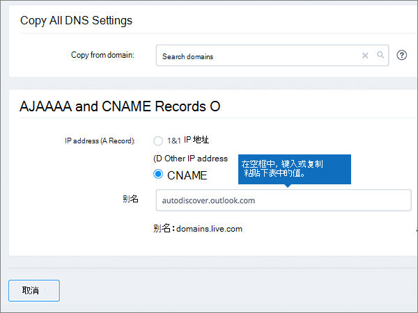
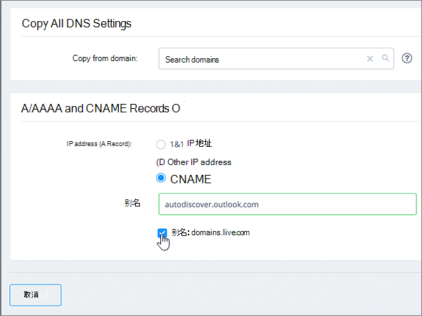

# 在 1&1 IONOS 为 Microsoft 创建 DNS 记录

 如果找不到要查找的内容，请**[查看域常见问题解答](../setup/domains-faq.md)**。 
  
> [!CAUTION]
> 请注意，1&1 IONOS 不允许域同时具有 MX 记录和顶级自动发现 CNAME 记录。 这将限制为 Microsoft 配置 Exchange Online 的方式。 有一种解决方法，但我们建议您在创建子域的过程 1&1 **IONOS 时使用它。** > [如果您选择在 1](https://docs.microsoft.com/microsoft-365/admin/setup/domains-faq)&1 IONOS 管理您自己的 Microsoft DNS 记录，请按照本文中的步骤验证您的域，并为电子邮件、Skype For business Online 等设置 DNS 记录。 
  
在 1&1 IONOS 中添加这些记录后，您的域将设置为与 Microsoft 服务一起使用。
  
  
> [!NOTE]
> Typically it takes about 15 minutes for DNS changes to take effect. 但是，有时可能需要更长时间，您所做的更改才会在 Internet 的 DNS 系统中更新。 如果在添加 DNS 记录后遇到邮件流问题或其他问题，请参阅[查找在添加域或 DNS 记录后遇到的问题并进行修复](../get-help-with-domains/find-and-fix-issues.md)。 
  
## 添加 TXT 记录进行验证

在将域用于 Microsoft 之前，必须确保你拥有该域。如果你能够在域注册机构处登录到你的帐户并创建 DNS 记录，便可向 Microsoft 证明你是域所有者。
  
> [!NOTE]
> 此记录仅用于验证您是否拥有自己的域；它不会影响其他任何内容。 如果需要，您可以以后将其删除。 
  
请按下列步骤操作或[观看视频（从 0:42 开始）](https://docs.microsoft.com/microsoft-365/admin/dns/create-dns-records-at-1-1-internet)。
  
1. 若要开始，请使用 [此链接](https://my.1and1.com/)转到域页面 1&1 IONOS。 You'll be prompted to log in.
    
2. 选择 " **管理域**"。
    
3. 在 "**域中心**" 页上，找到要更新的域，然后为该域选择 " ( **v**) 控制 **" 面板**。
    
4. 在 " **域设置** " 区域中，选择 " **编辑 DNS 设置**"。
    
5. 在 " **TXT 和 SRV 记录** " 部分中，选择 " **添加记录**"。
    
6. In the **Add Record** area, in the boxes for the new record, type or copy and paste the values from the following table. 
    
    （从下拉列表中选择“**类型**”值。） 
    
    ||||
    |:-----|:-----|:-----|
    |**类型**   |**前缀**   |**名称值**   |
    |TXT    | (将此字段留空)     |MS=ms *XXXXXXXX*    注意：这是一个示例。 在这里使用表中的特定“**目标地址或指向的地址**”值。 [如何查找此项？](../get-help-with-domains/information-for-dns-records.md)          |
   
7. 选择“**保存**”。
    
8. 再次选择 " **保存** "。 
    
9. 在 " **编辑 DNS 设置** " 对话框中，选择 **"是"**。
    
10. 请在继续之前等待数分钟，以便您刚刚创建的记录可以通过 Internet 完成更新。
    
在域注册机构网站添加了记录后，你将返回到 Microsoft 365 并请求 Microsoft 365 查找记录。
  
Microsof 找到正确的 TXT 记录表明域已通过验证。
  
1. 在 Microsoft 管理中心，转到“**设置**”\>“<a href="https://go.microsoft.com/fwlink/p/?linkid=834818" target="_blank">域</a>”页面。

    
2. 在“**域**”页面上，选择要验证的域。 
    
3. 在“**设置**”页面上，选择“**开始设置**”。
    
4. 在“**验证域**”页面上，选择“**验证**”。
    
> [!NOTE]
> Typically it takes about 15 minutes for DNS changes to take effect. 但是，有时可能需要更长时间，您所做的更改才会在 Internet 的 DNS 系统中更新。 如果在添加 DNS 记录后遇到邮件流问题或其他问题，请参阅[查找在添加域或 DNS 记录后遇到的问题并进行修复](../get-help-with-domains/find-and-fix-issues.md)。 
  
## 添加一条 MX 记录，确保发往你的域的电子邮件将会发送到 Microsoft

请执行以下步骤或 [观看视频 (从 3:22) 开始 ](https://docs.microsoft.com/microsoft-365/admin/dns/create-dns-records-at-1-1-internet)。
  
> [!NOTE]
> 如果你已向1und1.de 注册，请 [在此处登录](https://go.microsoft.com/fwlink/?linkid=859152)。 
  
1. 若要开始，请使用 [此链接](https://my.1and1.com/)转到域页面 1&1 IONOS。 You'll be prompted to log in.
    
2. 选择 " **管理域**"。
    
3. 在 "**域中心**" 页上，找到要更新的域，然后为该域选择 " ( **v**) 控制 **" 面板**。
    
4. 在 " **域设置** " 区域中，选择 " **编辑 DNS 设置**"。
    
5. 在 " **MX 记录** " 部分的 **邮件交换器 (MX 记录) ** 区域中，选择 " **其他邮件服务器**"。 （您可能需要向下滚动。）   
  
6. 如果已列出任何 MX 记录，请选择该记录，然后按键盘上的 **delete** 键，将其删除。  (如果尚未列出任何 MX 记录，请继续执行下一步。 )   
  
7. 在 " **MX 1** " 记录的框中，键入或复制并粘贴下表中的值。 
    
    |**MX 1**|**Priority**|
    |:-----|:-----|
    | *\<domain-key\>*  .mail.protection.outlook.com     注意： \<domain-key\> 从你的 Microsoft 帐户获取。 如何查找此内容？          |10      有关优先级的详细信息，请参阅[什么是 MX 优先级？](https://docs.microsoft.com/microsoft-365/admin/setup/domains-faq)   | 
    
     
  
8. 选择“**保存**”。 （您可能需要向下滚动。） 
  
9. 在 " **编辑 DNS 设置** " 对话框中，选择 **"是"**。 
  
## 添加 Microsoft 所需的六条 CNAME 记录

1&1 IONOS 需要解决方法，以便您可以将 MX 记录与 Microsoft 电子邮件服务所需的 CNAME 记录结合使用。 此替代方法要求您在 1&1 IONOS 创建一组子域，并将其分配给 CNAME 记录。
  
> [!IMPORTANT]
> 在开始此过程之前，请确保至少有两个可用的子域。 仅当您已经有在 1&1 IONOS 创建子域的经验时，才建议使用此解决方案。 
  
### 基本 CNAME 记录

请执行以下步骤或 [观看视频 (从 3:57) 开始 ](https://docs.microsoft.com/microsoft-365/admin/dns/create-dns-records-at-1-1-internet)。
  
> [!NOTE]
> 如果你已向1und1.de 注册，请 [在此处登录](https://go.microsoft.com/fwlink/?linkid=859152)。 
  
1. 若要开始，请使用 [此链接](https://my.1and1.com/)转到域页面 1&1 IONOS。 You'll be prompted to log in.
    
2. 选择 " **管理域**"。
    
3. 在 " **域中心** " 页上，找到要更新的域，然后选择 " **管理子域**"。   现在，您将创建两个子域并为每个子域设置一个 **别名** 值。  (这是必需的，因为 1&1 IONOS 仅支持一个顶级 CNAME 记录，但 Microsoft 需要多个 CNAME 记录。 )  首先，创建自动发现子域。
    
4. 在 " **子域概述** " 部分，选择 " **创建子域**"。
    
    
  
5. 在 "为新子域 **创建子域** " 框中，键入或复制并仅粘贴下表中的 " **创建子域** " 值。  (将在后续步骤中添加 **别名** 值。 ) 

    |**创建子域**|**Alias**|
    |:-----|:-----|
    |自动发现    |autodiscover.outlook.com   | 

    
  
6. 选择 " **创建子域**"。 
  
7. 在 " **子域概述** " 部分，找到刚创建的 " **自动发现** " 子域，然后选择该子域的 **" (v) 控制" 面板 ** 。  
  
8. 在 " **子域设置** " 区域中，选择 " **编辑 DNS 设置**"。  
  
9. 在 " **A/AAAA 记录 (Ip 地址) ** 部分的" **Ip 地址 (记录) ** 区域中，选择 " **CNAME**"。 
  
10. 在 " **别名：** " 框中，键入或复制并仅粘贴下表中的 **别名** 值。  
    
    |**创建子域**|**Alias**|
    |:-----|:-----|
    |自动发现    |autodiscover.outlook.com   |

    
  
11. 选中 " **我知道的已知** 免责声明" 对应的复选框。 
  
12. 选择“**保存**”。 
  
  
### 其他 CNAME 记录

以下过程中创建的其他 CNAME 记录将启用 Skype for Business Online 服务。 您将使用用于创建两个已创建的 CNAME 记录的相同步骤。
  
1. 创建第三个子域 (Lyncdiscover.) 。 在 " **子域概述** " 部分，选择 " **创建子域**"。
    
2. 在 "为新子域 **创建子域** " 框中，键入或复制并仅粘贴下表中的 " **创建子域** " 值。  (将在后续步骤中添加 **别名** 值。 )   
    
    |**创建子域**|**Alias**|
    |:-----|:-----|
    |lyncdiscover   |webdir.online.lync.com  |
   
3. 选择 " **创建子域**"。
    
4. 在 " **域中心** " 页上，选择 " **管理子域**"。
    
5. 在 " **子域概述** " 部分中，找到您刚创建的 **lyncdiscover.** 子域，然后选择该子域 ** (v) ** 控件的面板。  在 " **子域设置** " 区域中，选择 " **编辑 DNS 设置**"。
    
6. 在 " **A/AAAA 记录 (Ip 地址) ** 部分的" **Ip 地址 (记录) ** 区域中，选择 " **CNAME**"。
    
7. 在 " **别名：** " 框中，键入或复制并仅粘贴下表中的 **别名** 值。  
    
    |**创建子域**|**Alias**|
    |:-----|:-----|
    |lyncdiscover    |webdir.online.lync.com    |
   
8. 选中 " **我知道** 免责声明" 复选框，然后选择 " **保存**"。
    
9. 在 " **编辑 DNS 设置** " 对话框中，选择 **"是"**。
    
10. 创建第四个子域 (SIP) ：  在 " **子域概述** " 部分，选择 " **创建子域**"。
    
11. 在 "为新子域 **创建子域** " 框中，键入或复制并仅粘贴下表中的 " **创建子域** " 值。  (将在后续步骤中添加 **别名** 值。 )   
    
    |**创建子域**|**Alias**|
    |:-----|:-----|
    |sip    |sipdir.online.lync.com    |
   
12. 选择 " **创建子域**"。
    
13. 在 " **域中心** " 页上，选择 " **管理子域**"。
    
14. 在 " **子域概述** " 部分，找到您刚创建的 **sip** 子域，然后选择该子域的 **" (v) 控制" 面板 ** 。  在 " **子域设置** " 区域中，选择 " **编辑 DNS 设置**"。
    
15. 在 " **A/AAAA 记录 (Ip 地址) ** 部分的" **Ip 地址 (记录) ** 区域中，选择 " **CNAME**"。
    
16. 在 " **别名：** " 框中，键入或复制并仅粘贴下表中的 **别名** 值。 
    
    |**创建子域**|**Alias**|
    |:-----|:-----|
    |sip    |sipdir.online.lync.com    |
   
17. 选中 " **我知道** 免责声明" 复选框，然后选择 " **保存**"。
    
18. 在 " **编辑 DNS 设置** " 对话框中，选择 **"是"**。
    
### MDM 所需的 CNAME 记录

> [!IMPORTANT]
> 创建流程与你用于其他四个 CNAME 记录的流程一样，但需提供下表中的值。 
  
|**创建子域**|**Alias**|
|:-----|:-----|
|enterpriseregistration    |enterpriseregistration.windows.net    |
|enterpriseenrollment    |enterpriseenrollment-s.manage.microsoft.com    |
   
## 为 SPF 添加 TXT 记录以帮助防止垃圾邮件

> [!IMPORTANT]
> 一个域所拥有的 SPF 的 TXT 记录不能超过一个。 如果域具有多个 SPF 记录，你将收到电子邮件错误，其中随附发送和垃圾邮件分类问题。 如果你的域已有 SPF 记录，请不要为 Microsoft 创建新记录。 改为将所需的 Microsoft 值添加到当前记录，以便您具有包含两组值的  *单个*  SPF 记录。 需要示例吗？ 请查看 [Microsoft 的外部域名系统记录](https://docs.microsoft.com/microsoft-365/enterprise/external-domain-name-system-records)。 若要验证您的 SPF 记录，您可以使用其中一种[SPF 验证工具](../setup/domains-faq.md)。 
  
请执行以下步骤或 [观看视频 (从 5:09) 开始 ](https://docs.microsoft.com/microsoft-365/admin/dns/create-dns-records-at-1-1-internet)。
  
> [!NOTE]
> 如果你已向1und1.de 注册，请 [在此处登录](https://go.microsoft.com/fwlink/?linkid=859152)。 
  
1. 若要开始，请使用 [此链接](https://my.1and1.com/)转到域页面 1&1 IONOS。 You'll be prompted to log in.
    
2. 选择 " **管理域**"。
    
3. 在 "**域中心**" 页上，找到要更新的域，然后为该域选择 " (**v**) 控制 **" 面板**。
    
4. 在 " **域设置** " 区域中，选择 " **编辑 DNS 设置**"。
    
5. 在 " **TXT 和 SRV 记录** " 部分中，选择 " **添加记录**"。  （您可能需要向下滚动。）
    
6. In the **Add Record** area, in the boxes for the new record, type or copy and paste the values from the following table.  （从下拉列表中选择“**类型**”值。）  
    
    |**类型**|**前缀**|**名称值**|
    |:-----|:-----|:-----|
    |TXT    |(Leave this field empty.)    |v=spf1 include:spf.protection.outlook.com -all    **注意：** 建议复制粘贴此条目，以保证正确保留所有空格。           | 
    
    
  
7. 选择“**保存**”。 
  
8. 选择“**保存**”。 
  
9. 在 " **编辑 DNS 设置** " 对话框中，选择 **"是"**。 
  
## 添加 Microsoft 所需的两条 SRV 记录

请执行以下步骤或 [观看视频 (从 5:51) 开始 ](https://docs.microsoft.com/microsoft-365/admin/dns/create-dns-records-at-1-1-internet)。
  
> [!NOTE]
> 如果你已向1und1.de 注册，请 [在此处登录](https://go.microsoft.com/fwlink/?linkid=859152)。 
  
1. 若要开始，请使用 [此链接](https://my.1and1.com/)转到域页面 1&1 IONOS。 You'll be prompted to log in.
    
2. 选择 " **管理域**"。
    
3. 在 "**域中心**" 页上，找到要更新的域，然后为该域选择 " ( **v**) 控制 **" 面板**。
    
4. 在 " **域设置** " 区域中，选择 " **编辑 DNS 设置**"。
    
5. 在 " **TXT 和 SRV 记录** " 部分中，选择 " **添加记录**"。
    
6. 添加两条 SRV 记录中的第一条记录。 在 " **添加记录** " 区域中新记录的框内，键入或复制并粘贴下表中第一行的值。   (从下拉列表中选择 " **类型** " 和 " **TTL** " 值。 )  
    
    |**类型**|**服务**|**协议**|**名称**|**Host**|**优先级**|**权重**|**端口**|**TTL**|
    |:-----|:-----|:-----|:-----|:-----|:-----|:-----|:-----|:-----|
    |SRV    |sip    |tls    |(Leave this field empty.)    |sipdir.online.lync.com    |100    |1    |443    |3600 (1 h)     |
    |SRV    |sipfederationtls    |tcp    |(Leave this field empty.)    |sipfed.online.lync.com    |100    |1    |5061    |3600 (1 h)     |  
    
    
  
7. 选择“**保存**”。  
  
8. 选择“**保存**”。  
  
9. 在 " **编辑 DNS 设置** " 对话框中，选择 **"是"**。  
  
10. 添加另一条 SRV 记录。  在 " **TXT 和 SRV 记录** " 部分中，选择 " **添加记录**"。  在 " **添加记录** " 区域中，使用表中其他行的值创建记录，然后再次选择 " **添加**"、" **保存**" 和 **"是"** 以完成记录。 
    
> [!NOTE]
> Typically it takes about 15 minutes for DNS changes to take effect. 但是，有时可能需要更长时间，您所做的更改才会在 Internet 的 DNS 系统中更新。 如果在添加 DNS 记录后遇到邮件流问题或其他问题，请参阅[查找在添加域或 DNS 记录后遇到的问题并进行修复](../get-help-with-domains/find-and-fix-issues.md)。 
  
