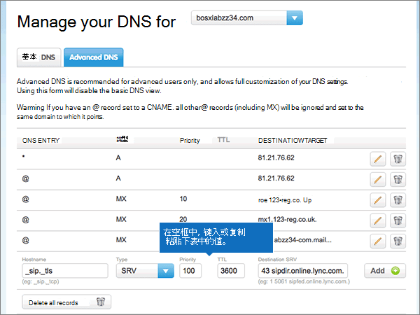

# 在 Microsoft 123-reg.co.uk 创建 DNS 记录

 **如果找不到要查找的内容，请 [查看域常见问题解答](../setup/domains-faq.yml)** 。 
  
如果 DNS 托管提供者是 123-reg.co.uk，请按本文中的步骤验证域并为电子邮件、Skype for Business Online 等设置 DNS 记录。
  
在添加这些记录 123-reg.co.uk，域将设置为使用 Microsoft 服务。
  
  
> [!NOTE]
> Typically it takes about 15 minutes for DNS changes to take effect. 但是，有时可能需要更长时间，您所做的更改才会在 Internet 的 DNS 系统中更新。 如果在添加 DNS 记录后遇到邮件流问题或其他问题，请参阅[查找在添加域或 DNS 记录后遇到的问题并进行修复](../get-help-with-domains/find-and-fix-issues.md)。 
  
## 添加 TXT 记录进行验证

在将域用于 Microsoft 之前，必须确保你拥有该域。如果你能够在域注册机构处登录到你的帐户并创建 DNS 记录，便可向 Microsoft 证明你是域所有者。
  
> [!NOTE]
> 此记录仅用于验证您是否拥有自己的域；它不会影响其他任何内容。 如果需要，您可以以后将其删除。 
  
1. 要开始，请使用[此链接](https://www.123-reg.co.uk/secure/cpanel/domain/overview)转到您在 123-reg.co.uk 上的域页面。 系统将会提示您先登录。
    
2. On the **Domain name overview** page, select the name of the domain that you want to edit. 
    
3. Choose **DNS** from the **Select action** drop-down list. 
    
4. 在" **管理 DNS"** 页上，选择" **高级 DNS"** 选项卡。 
    
5. In the **Advanced DNS** section, in the boxes for the new record, type or copy and paste the values from the following table. 
    
    (Choose the **Type** value from the drop-down list.) 
    
    ||||
    |:-----|:-----|:-----|
    |**主机名**   |**类型**   |**Destination TXT/SPF**   |
    |@    |TXT/SPF    |MS=ms *XXXXXXXX*    **注意：** 这是一个示例。 在这里使用表中的特定“**目标地址或指向的地址**”值。 [如何查找此项？](../get-help-with-domains/information-for-dns-records.md)          |
   
6. 选择“**添加**”。
    
7. 请在继续之前等待数分钟，以便您刚刚创建的记录可以通过 Internet 完成更新。
    
现在，你已在你的域注册机构网站添加了记录，你将返回到 Microsoft 并请求搜索该记录。
  
Microsof 找到正确的 TXT 记录表明域已通过验证。
  
1. 在 Microsoft 管理中心，转到“**设置**”\>“<a href="https://go.microsoft.com/fwlink/p/?linkid=834818" target="_blank">域</a>”页面。

    
2. 在“**域**”页面上，选择要验证的域。 
    
3. 在“**设置**”页面上，选择“**开始设置**”。
    
4. 在“**验证域**”页面上，选择“**验证**”。
    
> [!NOTE]
> Typically it takes about 15 minutes for DNS changes to take effect. 但是，有时可能需要更长时间，您所做的更改才会在 Internet 的 DNS 系统中更新。 如果在添加 DNS 记录后遇到邮件流问题或其他问题，请参阅[查找在添加域或 DNS 记录后遇到的问题并进行修复](../get-help-with-domains/find-and-fix-issues.md)。 
  
## 添加一条 MX 记录，确保发往你的域的电子邮件将会发送到 Microsoft

1. 要开始，请使用[此链接](https://www.123-reg.co.uk/secure/cpanel/domain/overview)转到您在 123-reg.co.uk 上的域页面。 系统将会提示您先登录。
    
2. On the **Domain name overview** page, select the name of the domain that you want to edit. 
    
3. Choose **DNS** from the **Select action** drop-down list. 
    
4. 在" **管理 DNS"** 页上，选择" **高级 DNS"** 选项卡。 
    
5. In the **Advanced DNS** section, in the boxes for the new record, type or copy and paste the values from the following table. 
    
    (Choose the **Type** value from the drop-down list.) 
    
    |**主机名**|**类型**|**优先级**|**目标 MX**|
    |:-----|:-----|:-----|:-----|
    |@    |MX    |1    有关优先级的详细信息，请参阅[什么是 MX 优先级？](../setup/domains-faq.yml)   | *\<domain-key\>*  .mail.protection.outlook.com。    **此值必须以句点 (.) 结尾。**   **注意：** 从 Microsoft 帐户获取 \<domain-key\>。 [如何查找此项？](../get-help-with-domains/information-for-dns-records.md)          |
   
    
  
6. 选择“**添加**”。
    
    
  
7. 如果有任何其他 MX 记录，通过选择每条记录的" **删除(回收站)**"图标将其删除。 
    
    
  
## 添加 Microsoft 所需的 5 条 CNAME 记录

1. 要开始，请使用[此链接](https://www.123-reg.co.uk/secure/cpanel/domain/overview)转到您在 123-reg.co.uk 上的域页面。 系统将会提示您先登录。
    
2. On the **Domain name overview** page, select the name of the domain that you want to edit. 
    
3. Choose **DNS** from the **Select action** drop-down list. 
    
4. 在" **管理 DNS"** 页上，选择" **高级 DNS"** 选项卡。 
    
5. 添加五条 CNAME 记录中的第一条。
    
    In the **Advanced DNS** section, in the boxes for the new record, type or copy and paste the values from the following table. 
    
    (Choose the **Type** value from the drop-down list.) 
    
    |**主机名**|**类型**|**目标 CNAME**|
    |:-----|:-----|:-----|
    |自动发现    |CNAME    |autodiscover.outlook.com.    **此值必须以句点 (.) 结尾。**   |
    |sip    |CNAME    |sipdir.online.lync.com.    **此值必须以句点 (.) 结尾。**   |
    |lyncdiscover    |CNAME    |webdir.online.lync.com.    **此值必须以句点 (.) 结尾。**   |
    |enterpriseregistration    |CNAME    |enterpriseregistration.windows.net.    **此值必须以句点 (.) 结尾。**   |
    |enterpriseenrollment    |CNAME    |enterpriseenrollment-s.manage.microsoft.com.    **此值必须以句点 (.) 结尾。**   |
   
    
  
6. 选择“**添加**”。
    
    
  
7. 添加其他 4 条 CNAME 记录。
    
    在"**高级 DNS"** 部分，使用表中下一行的值创建记录，然后再次选择"添加"以完成该记录。 
    
    重复此过程，直到创建了全部五条 CNAME 记录。
    
## 为 SPF 添加 TXT 记录以帮助防止垃圾邮件

> [!IMPORTANT]
> 一个域所拥有的 SPF 的 TXT 记录不能超过一个。 如果域具有多个 SPF 记录，你将收到电子邮件错误，其中随附发送和垃圾邮件分类问题。 如果你的域已有 SPF 记录，请不要为 Microsoft 创建新记录。 相反，将所需的 Microsoft 值添加到当前记录，以便你有一个  *包含这*  两组值的 SPF 记录。 需要示例吗？ 请查看 [Microsoft 的外部域名系统记录](../../enterprise/external-domain-name-system-records.md#external-dns-records-required-for-spf)。 若要验证 SPF 记录，可使用以下任一 [SPF 验证工具](../setup/domains-faq.yml)。 
  
1. 要开始，请使用[此链接](https://www.123-reg.co.uk/secure/cpanel/domain/overview)转到您在 123-reg.co.uk 上的域页面。 系统将会提示您先登录。
    
2. On the **Domain name overview** page, select the name of the domain that you want to edit. 
    
3. Choose **DNS** from the **Select action** drop-down list. 
    
4. 在" **管理 DNS"** 页上，选择" **高级 DNS"** 选项卡。 
    
5. In the **Advanced DNS** section, in the boxes for the new record, type or copy and paste the values from the following table. 
    
    (Choose the **Type** value from the drop-down list.) 
    
    |**主机名**|**类型**|**Destination TXT/SPF**|
    |:-----|:-----|:-----|
    |@    |TXT/SPF    |v=spf1 include:spf.protection.outlook.com -all    **注意：** 建议复制粘贴此条目，以保证正确保留所有空格。           |
   
    
  
6. 选择“**添加**”。
    
    
  
## 添加 Microsoft 所需的两条 SRV 记录

1. 要开始，请使用[此链接](https://www.123-reg.co.uk/secure/cpanel/domain/overview)转到您在 123-reg.co.uk 上的域页面。 系统将会提示您先登录。
    
2. On the **Domain name overview** page, select the name of the domain that you want to edit. 
    
3. Choose **DNS** from the **Select action** drop-down list. 
    
4. 在" **管理 DNS"** 页上，选择" **高级 DNS"** 选项卡。 
    
5. 添加两条 SRV 记录中的第一个：
    
    In the **Advanced DNS** section, in the boxes for the new record, type or copy and paste the values from the following table. 
    
    (Choose the **Type** value from the drop-down list.) 
    
    ||||||
    |:-----|:-----|:-----|:-----|:-----|
    |主机名|类型|优先级|TTL|目标 SRV|
    |_sip._tls|SRV|100|3600|1 443 sipdir.online.lync.com。 **此值必须以句点 (.) 结尾。**  **注意：** 建议复制粘贴此条目，以保证正确保留所有空格。           |
    |_sipfederationtls._tcp|SRV|100|3600|1 5061 sipfed.online.lync.com。 **此值必须以句点 (.) 结尾。**   **注意：** 建议复制粘贴此条目，以保证正确保留所有空格。           |
   
    
  
6. 选择“**添加**”。
    
    
  
7. 添加其他 SRV 记录：
    
    在"**高级 DNS"** 部分，使用表中第二行的值创建记录，然后再次选择"添加"以完成该记录。 
    
> [!NOTE]
> Typically it takes about 15 minutes for DNS changes to take effect. 但是，有时可能需要更长时间，您所做的更改才会在 Internet 的 DNS 系统中更新。 如果在添加 DNS 记录后遇到邮件流问题或其他问题，请参阅[查找在添加域或 DNS 记录后遇到的问题并进行修复](../get-help-with-domains/find-and-fix-issues.md)。 
