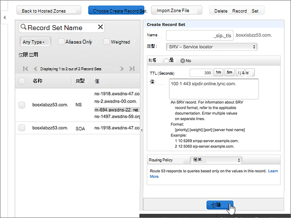

# 在 Amazon Web Services (AWS) 上为 Office 365 创建 DNS 记录

 如果找不到要查找的内容，请**[查看域常见问题解答](../setup/domains-faq.md)**。 
  
如果 AWS 是您的 DNS 托管提供商，请按照本文中的步骤验证您的域并为电子邮件、Skype Online for Business 等设置 DNS 记录。
  
在 AWS 添加这些记录后，你的域将设置为使用 Office 365 服务。
  
若要了解如何与 Office 365 结合使用网站的 Web 宿主和 DNS，请参阅[配合使用公共网站与 Office 365](https://support.office.com/article/choose-a-public-website-3325d50e-d131-403c-a278-7f3296fe33a9)。
  
> [!NOTE]
> Typically it takes about 15 minutes for DNS changes to take effect. 但是，有时可能需要更长时间，您所做的更改才会在 Internet 的 DNS 系统中更新。 如果在添加 DNS 记录后遇到邮件流问题或其他问题，请参阅[查找在将域或 DNS 记录添加到 Office 365 后遇到的问题并进行修复](../get-help-with-domains/find-and-fix-issues.md)。 
  
## 添加 TXT 记录进行验证

在将域用于 Office 365 之前，必须确保你拥有该域。如果你能够在域注册机构处登录到你的帐户并创建 DNS 记录，便可向 Office 365 证明你是所有者。
  
> [!NOTE]
> 此记录仅用于验证您是否拥有自己的域；它不会影响其他任何内容。 如果需要，您可以以后将其删除。 
  
1. 要开始，请使用[此链接](https://console.aws.amazon.com/route53/home)转到你在 AWS 上的域页面。 系统将会提示您先登录。
    
2. 在 "**资源**" 页上，选择 "**托管区域**"。
    
3. 在 "* * 托管区域 * *" 页上的 "**域名**" 列中，选择要编辑的域的名称。 
    
4. 选择 "**创建记录集**"。
    
5. In the **Create Record Set** area, in the boxes for the new record, type or copy and paste the values from the following table. 
    
    (Choose the **Type** and **Routing Policy** values from the drop-down lists.) 
    
    > [!TIP]
    > The quotation marks required by the onscreen instructions are supplied automatically. You don't need to type them manually. 
  
    |||||||
    |:-----|:-----|:-----|:-----|:-----|:-----|
    |**名称**   |**Type**   |**别名**   |**TTL（秒）**   |**值**   |**路由策略**   |
    |(Leave this field empty.)    |TXT - Text    |否    |300    |MS=ms *XXXXXXXX*   **注意：** 此为示例。 在这里使用来自 Office 365 中的表的具体**目标地址或指向的地址**值。 [如何查找此项？](../get-help-with-domains/information-for-dns-records.md)          |简单    |
   
6. 选择“**创建**”。
    
7. 请在继续之前等待数分钟，以便您刚刚创建的记录可以通过 Internet 完成更新。
    
现在你已在域注册机构网站添加了记录，然后将返回到 Office 365 并请求 Office 365 查找记录。
  
Office 365 找到正确的 TXT 记录时，表明你的域已通过验证。
  
1. 在管理中心，转到“**设置**”\> <a href="https://go.microsoft.com/fwlink/p/?linkid=834818" target="_blank">域</a>页面。

    
2. 在“**域**”页面上，选择要验证的域。 
    
3. 在“**设置**”页面上，选择“**开始设置**”。
    
4. 在“**验证域**”页面上，选择“**验证**”。
    
> [!NOTE]
> Typically it takes about 15 minutes for DNS changes to take effect. 但是，有时可能需要更长时间，您所做的更改才会在 Internet 的 DNS 系统中更新。 如果在添加 DNS 记录后遇到邮件流问题或其他问题，请参阅[查找在将域或 DNS 记录添加到 Office 365 后遇到的问题并进行修复](../get-help-with-domains/find-and-fix-issues.md)。 
  
## 添加一条 MX 记录，确保发往你的域的电子邮件发送到 Office 365

1. 要开始，请使用[此链接](https://console.aws.amazon.com/route53/home)转到你在 AWS 上的域页面。 系统将会提示您先登录。
    
2. 在 "**资源**" 页上，选择 "**托管区域**"。
    
3. 在 "**托管区域**" 页上的 "**域名**" 列中，选择要编辑的域的名称。 
    
4. 选择 "**创建记录集**"。
    
5. In the **Create Record Set** area, in the boxes for the new record, type or copy and paste the values from the following table. 
    
    (Choose the **Type** and **Routing Policy** values from the drop-down lists.) 
    
    |**名称**|**Type**|**别名**|**TTL（秒）**|**值**|**路由策略**|
    |:-----|:-----|:-----|:-----|:-----|:-----|
    |（将此字段留空。）    |MX - 邮件交换    |否    |300    |0  *\<域密钥\>*  .mail.protection.outlook.com。    0 是 MX 优先级值。 将其添加到 MX 值的开头，使用一个空格将其与其余部分隔开。    **此值必须以句点 (.) 结尾。**   **注意：** 从 Office 365 帐户获取 \<*域密钥*\>。 [如何查找此内容？](../get-help-with-domains/information-for-dns-records.md)          |简单    |
       
    
  
6. 选择“**创建**”。
    
    
  
7. 如果有任何其他 MX 记录，请删除它们。
    
    > [!IMPORTANT]
    > AWS 将 MX 记录存储为可能包含多个记录的集合。 **请勿**选择 "**删除记录集**"，因为这将删除所有 MX 记录，包括刚刚添加的记录。 请使用下面的说明。 
  
    首先，选择 MX 记录集。
    
    
  
    接下来，在" **编辑记录集**"区域中，通过选择" **值**"框中的条目并按键盘上的 **Delete** 键来删除每个已过时 MX 记录。 
    
    
  
8. 选择 "**保存记录集**"。
    
    
  
## 添加 Office 365 所需的五个 CNAME 记录

1. 要开始，请使用[此链接](https://console.aws.amazon.com/route53/home)转到你在 AWS 上的域页面。 系统将会提示您先登录。
    
2. 在 "**资源**" 页上，选择 "**托管区域**"。
    
3. 在 "**托管区域**" 页上的 "**域名**" 列中，选择要编辑的域的名称。 
    
4. 选择 "**创建记录集**"。
    
5. 添加第一条 CNAME 记录。
    
    在" **创建记录集**"区域中新记录的框内，键入或复制并粘贴下表第一行中的值。 
    
    （从下拉列表中选择" **类型**"和" **路由策略**"值。） 
    
    |**名称**|**Type**|**别名**|**TTL（秒）**|**值**|**路由策略**|
    |:-----|:-----|:-----|:-----|:-----|:-----|
    |autodiscover    |CNAME - 规范名称    |否    |300    |autodiscover.outlook.com。    **此值必须以句点 (.) 结尾。**   |简单    |
    |sip    |CNAME - 规范名称    |否    |300    |sipdir.online.lync.com。    **此值必须以句点 (.) 结尾。**   |简单    |
    |lyncdiscover    |CNAME - 规范名称    |否    |300    |webdir.online.lync.com。    **此值必须以句点 (.) 结尾。**   |简单    |
    |enterpriseregistration    |CNAME - 规范名称    |否    |300    |enterpriseregistration.windows.net。    **此值必须以句点 (.) 结尾。**   |简单    |
    |EnterpriseEnrollment    |CNAME - 规范名称    |否    |300    |enterpriseenrollment-s.manage.microsoft.com。    **此值必须以句点 (.) 结尾。**   |简单    |
   
    
  
6. 选择“**创建**”。
    
    
  
7. 添加其他 4 条 CNAME 记录。
    
    在 "**托管区域**" 页上，选择 "**创建记录集**"，使用表中下一行的值创建记录，然后再次选择 "**创建**" 以完成该记录。 
    
    重复此过程，直到创建完所有五个 CNAME 记录。
    
## 为 SPF 添加 TXT 记录以帮助防止垃圾邮件

> [!IMPORTANT]
> 一个域所拥有的 SPF 的 TXT 记录不能超过一个。 如果域具有多个 SPF 记录，你将收到电子邮件错误，其中随附发送和垃圾邮件分类问题。 If you already have an SPF record for your domain, don't create a new one for Office 365. 可以将所需的 Office 365 添加到当前记录，这样就拥有包含两组值的*单个*SPF 记录。 需要示例吗？ 请查看 [Office 365 的外部域名系统记录](https://support.office.com/article/c0531a6f-9e25-4f2d-ad0e-a70bfef09ac0)。 若要验证您的 SPF 记录，您可以使用其中一种[SPF 验证工具](../setup/domains-faq.md)。 
  
1. 要开始，请使用[此链接](https://console.aws.amazon.com/route53/home)转到你在 AWS 上的域页面。 系统将会提示您先登录。
    
2. 在 "**资源**" 页上，选择 "**托管区域**"。
    
3. 在 "**托管区域**" 页上的 "**域名**" 列中，选择要编辑的域的名称。 
    
4. 选择**TXT**记录集。 
    
    
  
5. 在" **编辑记录集**"区域中，找到现有记录的" **值:**"框，在当前条目的末尾按 Enter 键（键盘上）创建新行；然后在该新行（现有值下方）上，键入或复制粘贴下表中的值。（可查看该表下方说明中的示例。） 
    
    |**值:**|
    |:-----|
    |v=spf1 include:outlook.com -all    （系统会自动提供屏幕说明所需的引号。无需手动键入。）    **注意：** 建议复制粘贴此条目，以保证正确保留所有空格。           |
   
    
  
6. 选择 "**保存记录集**"。
    
    
  
## 添加 Office 365 所需的两条 SRV 记录

1. 要开始，请使用[此链接](https://console.aws.amazon.com/route53/home)转到你在 AWS 上的域页面。 系统将会提示您先登录。
    
2. 在 "**资源**" 页上，选择 "**托管区域**"。
    
3. 在 "**托管区域**" 页上的 "**域名**" 列中，选择要编辑的域的名称。 
    
4. 选择 "**创建记录集**"。
    
5. 添加第一条 SRV 记录：
    
    在" **创建记录集**"区域中新记录的框内，键入或复制并粘贴下表第一行中的值。 
    
    （从下拉列表中选择" **类型**"和" **路由策略**"值。） 
    
    |**名称**|**Type**|**别名**|**TTL（秒）**|**值**|**路由策略**|
    |:-----|:-----|:-----|:-----|:-----|:-----|
    |_sip _tls|SRV - 服务定位器|否|300|100 1 443 sipdir.online.lync.com。 **此值必须以句点（.）结尾**>  **注意：** 建议复制粘贴此条目，以保证正确保留所有空格。           |简单|
    |_sipfederationtls _tcp|SRV - 服务定位器|否|300|100 1 5061 sipfed.online.lync.com。 **This value MUST end with a period (.)**  **注意：** 建议复制粘贴此条目，以保证正确保留所有空格。           |简单|
   
    
  
6. 选择“**创建**”。
    
    
  
7. 添加其他 SRV 记录：
    
    在 "**托管区域**" 页上，选择 "**创建记录集**"，使用表中下一行的值创建记录，然后再次选择 "**创建**" 以完成该记录。 
    
> [!NOTE]
> Typically it takes about 15 minutes for DNS changes to take effect. 但是，有时可能需要更长时间，您所做的更改才会在 Internet 的 DNS 系统中更新。 如果在添加 DNS 记录后遇到邮件流问题或其他问题，请参阅[查找在将域或 DNS 记录添加到 Office 365 后遇到的问题并进行修复](../get-help-with-domains/find-and-fix-issues.md)。 
  
