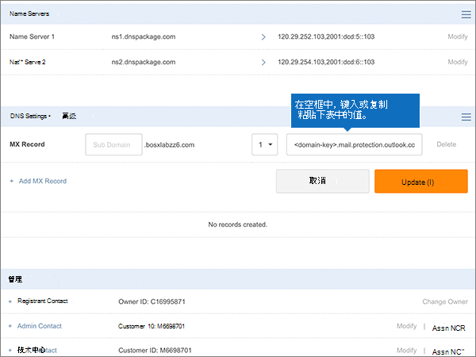
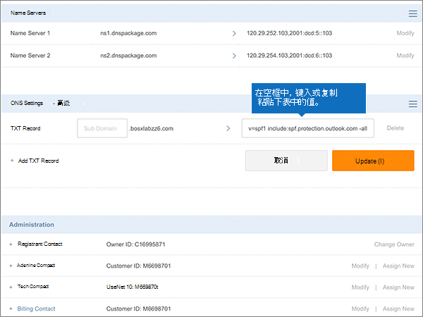
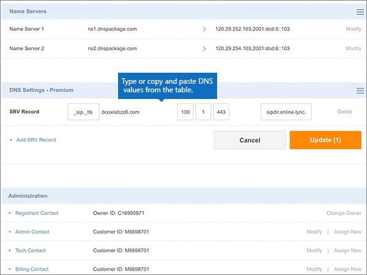

# 在适用于 Office 365 的古怪域中创建 DNS 记录Create DNS records at Crazy Domains for Office 365

 如果找不到要查找的内容，请**[查看域常见问题解答](../setup/domains-faq.md)**。**[Check the Domains FAQ](../setup/domains-faq.md)** if you don't find what you're looking for. 
  
如果古怪域是 DNS 托管提供商，请按照本文中的步骤验证您的域，并为电子邮件、Skype for Business Online 等设置 DNS 记录。If Crazy Domains is your DNS hosting provider, follow the steps in this article to verify your domain and set up DNS records for email, Skype for Business Online, and so on.
  
在古怪域中添加这些记录后，您的域将设置为与 Office 365 服务配合使用。After you add these records at Crazy Domains, your domain will be set up to work with Office 365 services.
  
若要了解如何与 Office 365 结合使用网站的 Web 宿主和 DNS，请参阅[配合使用公共网站与 Office 365](https://support.office.com/article/choose-a-public-website-3325d50e-d131-403c-a278-7f3296fe33a9)。To learn about webhosting and DNS for websites with Office 365, see [Use a public website with Office 365](https://support.office.com/article/choose-a-public-website-3325d50e-d131-403c-a278-7f3296fe33a9).
  
> [!NOTE]
> DNS 更改通常需要 15 分钟左右才能生效。 但是，有时可能需要更长时间，您所做的更改才会在 Internet 的 DNS 系统中更新。 如果添加 DNS 记录后遇到邮件流问题或其他问题，请参阅 [更改域名或 DNS 记录后出现的问题的疑难解答](../get-help-with-domains/find-and-fix-issues.md)。Typically it takes about 15 minutes for DNS changes to take effect. However, it can occasionally take longer for a change you've made to update across the Internet's DNS system. If you're having trouble with mail flow or other issues after adding DNS records, see [Troubleshoot issues after changing your domain name or DNS records](../get-help-with-domains/find-and-fix-issues.md). 
  
## 添加 TXT 记录进行验证Add a TXT record for verification

在将域用于 Office 365 之前，必须确保你拥有该域。如果你能够在域注册机构处登录到你的帐户并创建 DNS 记录，便可向 Office 365 证明你是所有者。Before you use your domain with Office 365, we have to make sure that you own it. Your ability to log in to your account at your domain registrar and create the DNS record proves to Office 365 that you own the domain.
  
> [!NOTE]
> 此记录仅用于验证您是否拥有自己的域；它不会影响其他任何内容。 如果需要，您可以以后将其删除。This record is used only to verify that you own your domain; it doesn't affect anything else. You can delete it later, if you like. 
  
1. 要开始，请使用[此链接](https://manage.crazydomains.com/members/domains/)转到你在 Crazy Domains 上的域页面。系统将会提示你首先登录。To get started, go to your domains page at Crazy Domains by using [this link](https://manage.crazydomains.com/members/domains/). You'll be prompted to log in first.
    
    
  
2. 在 "**我的帐户**" 部分，选择 "**域**"。In the **My Account** section, select **Domains**.
    
    
  
3. 在 "**域名**" 页上的 "**域**" 部分，选择要更新的域的名称。On the **Domain Names** page, in the **Domain** section, select the name of the domain that you are updating. 
    
    
  
4. 在 " **DNS 设置**" 部分中，选择下拉列表图标。In the **DNS Settings** section, select the drop-down list icon. 
    
    
  
5. 选择 "**添加记录**"。Select **Add Record**.
    
    
  
6. 从" **添加记录**"下拉列表中选择" **TXT 记录**"。Choose **TXT Record** from the **Add Record** drop-down list. 
    
    
  
7. 选择“**添加**”。Select **Add**.
    
    
  
8. 在新记录的框中，键入或复制粘贴下表中的值。In the boxes for the new record, type or copy and paste the values from the following table.
    
    |**子域****Sub Domain**|**文本记录****Text Record**|
    |:-----|:-----|
    |（将此字段留空。）(Leave this field empty.)    |MS=ms *XXXXXXXX*MS=ms *XXXXXXXX*    **注意：** 此为示例。**Note:** This is an example. 在这里使用来自 Office 365 中的表的具体**目标地址或指向的地址**值。Use your specific **Destination or Points to Address** value here, from the table in Office 365.           [如何查找此项？How do I find this?](../get-help-with-domains/information-for-dns-records.md)          |
   
    
  
9. 选择“更新”\*\*\*\*。Select **Update**.
    
    
  
10. 请在继续之前等待数分钟，以便您刚刚创建的记录可以通过 Internet 完成更新。Wait a few minutes before you continue, so that the record you just created can update across the Internet.
    
现在你已在域注册机构网站添加了记录，然后将返回到 Office 365 并请求 Office 365 查找记录。Now that you've added the record at your domain registrar's site, you'll go back to Office 365 and request Office 365 to look for the record.
  
Office 365 找到正确的 TXT 记录时，表明你的域已通过验证。When Office 365 finds the correct TXT record, your domain is verified.
  
1. 在管理中心，转到“**设置**”\> <a href="https://go.microsoft.com/fwlink/p/?linkid=834818" target="_blank">域</a>页面。In the admin center, go to the **Settings** \> <a href="https://go.microsoft.com/fwlink/p/?linkid=834818" target="_blank">Domains</a> page.

    
2. 在“**域**”页面上，选择要验证的域。On the **Domains** page, select the domain that you are verifying. 
    
    
  
3. 在“**设置**”页面上，选择“**开始设置**”。On the **Setup** page, select **Start setup**.
    
    
  
4. 在“**验证域**”页面上，选择“**验证**”。On the **Verify domain** page, select **Verify**.
    
    
  
> [!NOTE]
>  DNS 更改通常需要 15 分钟左右才能生效。 但是，有时可能需要更长时间，您所做的更改才会在 Internet 的 DNS 系统中更新。 如果添加 DNS 记录后遇到邮件流问题或其他问题，请参阅 [更改域名或 DNS 记录后出现的问题的疑难解答](../get-help-with-domains/find-and-fix-issues.md)。Typically it takes about 15 minutes for DNS changes to take effect. However, it can occasionally take longer for a change you've made to update across the Internet's DNS system. If you're having trouble with mail flow or other issues after adding DNS records, see [Troubleshoot issues after changing your domain name or DNS records](../get-help-with-domains/find-and-fix-issues.md). 
  
## 添加一条 MX 记录，确保发往你的域的电子邮件发送到 Office 365Add an MX record so email for your domain will come to Office 365

1. 要开始，请使用[此链接](https://manage.crazydomains.com/members/domains/)转到你在 Crazy Domains 上的域页面。系统将会提示你首先登录。To get started, go to your domains page at Crazy Domains by using [this link](https://manage.crazydomains.com/members/domains/). You'll be prompted to log in first.
    
    
  
2. 在 "**我的帐户**" 部分，选择 "**域**"。In the **My Account** section, select **Domains**.
    
    
  
3. 在 "**域名**" 页上的 "**域**" 部分，选择要更新的域的名称。On the **Domain Names** page, in the **Domain** section, select the name of the domain that you are updating. 
    
    
  
4. 在 " **DNS 设置**" 部分中，选择下拉列表图标。In the **DNS Settings** section, select the drop-down list icon. 
    
    
  
5. 选择 "**添加记录**"。Select **Add Record**.
    
    
  
6. 从 "**添加记录：** " 下拉列表中选择 " **MX 记录**"。Choose **MX Record** from the **Add Record:** drop-down list. 
    
    
  
7. 选择“**添加**”。Select **Add**.
    
    
  
8. 在新记录的框中，键入或复制并粘贴下表中的值。In the boxes for the new record, type or copy and paste the values from the following table.
    
    （从下拉列表中选择 "**优先级**" 值。）(Choose the **Priority** value from the drop-down list.) 
    
    |**区域邮件****Mail For Zone**|**Priority****Priority**|**分配给服务器****Assigned To Server**|
    |:-----|:-----|:-----|
    |(Leave this field empty.)(Leave this field empty.)    |11    有关优先级的详细信息，请参阅[什么是 MX 优先级？](https://support.office.com/article/2784cc4d-95be-443d-b5f7-bb5dd867ba83.aspx)For more information about priority, see [What is MX priority?](https://support.office.com/article/2784cc4d-95be-443d-b5f7-bb5dd867ba83.aspx)   | *\<域密钥\>*  .mail.protection.outlook.com*\<domain-key\>*  .mail.protection.outlook.com    **注意：** 从 Office 365 帐户中获取你\* \<的域密钥\> \* 。**Note:** Get your  *\<domain-key\>*  from your Office 365 account.           [如何查找此项？How do I find this?](../get-help-with-domains/information-for-dns-records.md)          |
       
   
  
9. 选择“更新”\*\*\*\*。Select **Update**.
    
    
  
10. 如果 " **Mx 记录**" 部分中列出了任何其他 MX 记录，请为其中一个记录选择 "**修改**"。If there are any other MX records listed in the **MX Record** section, select **Modify** for one of those records. 
    
    
  
11. 选择“删除”\*\*\*\*。Select **Delete**.
    
    
  
12. 选择 "**更新**" 以确认删除。Select **Update** to confirm the deletion. 
    
    
  
13. 使用相同的过程删除列表中的任何其他 MX 记录，只有在此过程之前添加的任何 MX 记录保持不变。Use the same process to remove any other MX records in the list, until only the one that you added earlier in this procedure remains.
    
## 添加 Office 365 所需的 6 条 CNAME 记录Add the six CNAME records that are required for Office 365

1. 要开始，请使用[此链接](https://manage.crazydomains.com/members/domains/)转到你在 Crazy Domains 上的域页面。系统将会提示你首先登录。To get started, go to your domains page at Crazy Domains by using [this link](https://manage.crazydomains.com/members/domains/). You'll be prompted to log in first.
    
    
  
2. 在 "**我的帐户**" 部分，选择 "**域**"。In the **My Account** section, select **Domains**.
    
    
  
3. 在 "**域名**" 页上的 "**域**" 部分，选择要更新的域的名称。On the **Domain Names** page, in the **Domain** section, select the name of the domain that you are updating. 
    
    
  
4. 在 " **DNS 设置**" 部分中，选择下拉列表图标。In the **DNS Settings** section, select the drop-down list icon. 
    
    
  
5. 选择 "**添加记录**"。Select **Add Record**.
    
    
  
6. 从 "**添加记录：** " 下拉列表中选择 " **CNAME 记录**"。Choose **CNAME Record** from the **Add Record:** drop-down list. 
    
    
  
7. 选择“**添加**”。Select **Add**.
    
    
  
8. 添加第一条 CNAME 记录（共 6 条）。Add the first of the six CNAME records.
    
    在新记录的框中，键入或复制并粘贴下表中第一行的值。In the boxes for the new record, type or copy and paste the values from the first row of the following table.
    
    |**子域****Sub Domain**|**的别名****Alias for**|
    |:-----|:-----|
    |自动发现autodiscover    |autodiscover.outlook.comautodiscover.outlook.com    |
    |sipsip    |sipdir.online.lync.comsipdir.online.lync.com    |
    |lyncdiscoverlyncdiscover    |webdir.online.lync.comwebdir.online.lync.com    |
    |enterpriseregistrationenterpriseregistration    |enterpriseregistration.windows.netenterpriseregistration.windows.net    |
    |enterpriseenrollmententerpriseenrollment    |enterpriseenrollment-s.manage.microsoft.comenterpriseenrollment-s.manage.microsoft.com    |
   
    
  
9. 选择 "**添加 CNAME 记录**"。Select **Add CNAME Record**.
    
    
  
10. 添加第二条 CNAME 记录。Add the second CNAME record.
    
    在新记录的框中，使用表中下一行的值，然后再次选择 "**添加 CNAME 记录**"。In the boxes for the new record, use the values from the next row in the table, and then again select **Add CNAME Record**.
    
    重复该过程，直到创建完全部 6 条 CNAME 记录。Repeat this process until you have created all six CNAME records.
    
11. 选择 "**更新**" 以保存所做的更改。Select **Update** to save your changes. 
    
    
  
## 为 SPF 添加 TXT 记录以帮助防止垃圾邮件Add a TXT record for SPF to help prevent email spam

> [!IMPORTANT]
> 一个域所拥有的 SPF 的 TXT 记录不能超过一个。You cannot have more than one TXT record for SPF for a domain. 如果域具有多个 SPF 记录，你将收到电子邮件错误，其中随附发送和垃圾邮件分类问题。If your domain has more than one SPF record, you'll get email errors, as well as delivery and spam classification issues. If you already have an SPF record for your domain, don't create a new one for Office 365.If you already have an SPF record for your domain, don't create a new one for Office 365. 可以将所需的 Office 365 添加到当前记录，这样就拥有包含两组值的*单个*SPF 记录。Instead, add the required Office 365 values to the current record so that you have a  *single*  SPF record that includes both sets of values. 
  
1. 要开始，请使用[此链接](https://manage.crazydomains.com/members/domains/)转到你在 Crazy Domains 上的域页面。系统将会提示你首先登录。To get started, go to your domains page at Crazy Domains by using [this link](https://manage.crazydomains.com/members/domains/). You'll be prompted to log in first.
    
    
  
2. 在 "**我的帐户**" 部分，选择 "**域**"。In the **My Account** section, select **Domains**.
    
    
  
3. 在 "**域名**" 页上的 "**域**" 部分，选择要更新的域的名称。On the **Domain Names** page, in the **Domain** section, select the name of the domain that you are updating. 
    
    
  
4. 在 " **DNS 设置**" 部分中，选择下拉列表图标。In the **DNS Settings** section, select the drop-down list icon. 
    
    
  
5. 选择 "**添加记录**"。Select **Add Record**.
    
    
  
6. 从 "**添加记录：** " 下拉列表中选择 " **TXT 记录**"。Choose **TXT Record** from the **Add Record:** drop-down list. 
    
    
  
7. 选择“**添加**”。Select **Add**.
    
    
  
8. 在新记录的框中，键入或粘贴下表中的值。In the boxes for the new record, type or paste the values from the following table.
    
    |**子域****Sub Domain**|**文本记录****Text Record**|
    |:-----|:-----|
    |（将此字段留空。）(Leave this field empty.)    |v=spf1 include:spf.protection.outlook.com -allv=spf1 include:spf.protection.outlook.com -all    **注意：** 建议复制粘贴此条目，以保证正确保留所有空格。**Note:** We recommend copying and pasting this entry, so that all of the spacing stays correct.           |
   
    
  
9. 选择“更新”\*\*\*\*。Select **Update**.
    
    
  
## 添加 Office 365 所需的两条 SRV 记录Add the two SRV records that are required for Office 365

1. 要开始，请使用[此链接](https://manage.crazydomains.com/members/domains/)转到你在 Crazy Domains 上的域页面。系统将会提示你首先登录。To get started, go to your domains page at Crazy Domains by using [this link](https://manage.crazydomains.com/members/domains/). You'll be prompted to log in first.
    
    
  
2. 在 "**我的帐户**" 部分，选择 "**域**"。In the **My Account** section, select **Domains**.
    
    
  
3. 在 "**域名**" 页上的 "**域**" 部分，选择要更新的域的名称。On the **Domain Names** page, in the **Domain** section, select the name of the domain that you are updating. 
    
    
  
4. 在 " **DNS 设置**" 部分中，选择下拉列表图标。In the **DNS Settings** section, select the drop-down list icon. 
    
    
  
5. 选择 "**添加记录**"。Select **Add Record**.
    
    
  
6. 从 "**添加记录：** " 下拉列表中选择 " **SRV 记录**"。Choose **SRV Record** from the **Add Record:** drop-down list. 
    
    
  
7. 选择“**添加**”。Select **Add**.
    
    
  
8. 添加两条 SRV 记录中的第一条记录。Add the first of the two SRV records.
    
    在新记录的框中，键入或复制并粘贴下表中第一行的值。In the boxes for the new record, type or copy and paste the values from the first row of the following table.
    
    |**记录类型****Record Type**|**子域****Sub Domain**|**优先级****Priority**|**权重****Weight**|**端口****Port**|**目标****Target**|
    |:-----|:-----|:-----|:-----|:-----|:-----|
    |SRV 记录SRV Record    |_sip _tls_sip._tls    |100100    |11    |443443    |sipdir.online.lync.comsipdir.online.lync.com    |
    |SRV 记录SRV Record    |_sipfederationtls _tcp_sipfederationtls._tcp    |100100    |11    |50615061    |sipfed.online.lync.comsipfed.online.lync.com    |
   
    
  
9. 选择 "**添加 SRV 记录**"。Select **Add SRV Record**.
    
    
  
10. 添加另一条 SRV 记录。Add the other SRV record.
    
    在新记录的框中，使用表中第二行的值。In the boxes for the new record, use the values from the second row in the table.
    
11. 选择 "**更新**" 以保存所做的更改。Select **Update** to save your changes. 
    
    
  
> [!NOTE]
> DNS 更改通常需要 15 分钟左右才能生效。 但是，有时可能需要更长时间，您所做的更改才会在 Internet 的 DNS 系统中更新。 如果添加 DNS 记录后遇到邮件流问题或其他问题，请参阅 [更改域名或 DNS 记录后出现的问题的疑难解答](../get-help-with-domains/find-and-fix-issues.md)。Typically it takes about 15 minutes for DNS changes to take effect. However, it can occasionally take longer for a change you've made to update across the Internet's DNS system. If you're having trouble with mail flow or other issues after adding DNS records, see [Troubleshoot issues after changing your domain name or DNS records](../get-help-with-domains/find-and-fix-issues.md). 
  
