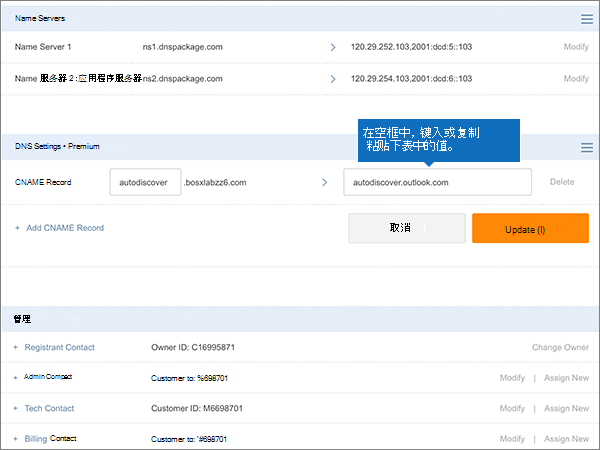

# 在适用于 Microsoft 的古怪域中创建 DNS 记录

 如果找不到要查找的内容，请**[查看域常见问题解答](../setup/domains-faq.md)**。 
  
如果古怪域是 DNS 托管提供商，请按照本文中的步骤验证您的域，并为电子邮件、Skype for Business Online 等设置 DNS 记录。
  
在古怪域中添加这些记录后，您的域将设置为与 Microsoft 服务配合使用。
  

  
> [!NOTE]
> DNS 更改通常需要 15 分钟左右才能生效。 但是，有时可能需要更长时间，您所做的更改才会在 Internet 的 DNS 系统中更新。 如果添加 DNS 记录后遇到邮件流问题或其他问题，请参阅 [更改域名或 DNS 记录后出现的问题的疑难解答](../get-help-with-domains/find-and-fix-issues.md)。 
  
## 添加 TXT 记录进行验证

在将域用于 Microsoft 之前，必须确保你拥有该域。如果你能够在域注册机构处登录到你的帐户并创建 DNS 记录，便可向 Microsoft 证明你是域所有者。
  
> [!NOTE]
> 此记录仅用于验证您是否拥有自己的域；它不会影响其他任何内容。 如果需要，您可以以后将其删除。 
  
1. 要开始，请使用[此链接](https://manage.crazydomains.com/members/domains/)转到你在 Crazy Domains 上的域页面。系统将会提示你首先登录。
    
    
  
2. 在 "**我的帐户**" 部分，选择 "**域**"。
    
    
  
3. 在 "**域名**" 页上的 "**域**" 部分，选择要更新的域的名称。 
    
    
  
4. 在 " **DNS 设置**" 部分中，选择下拉列表图标。 
    
    
  
5. 选择 "**添加记录**"。
    
    
  
6. 从" **添加记录**"下拉列表中选择" **TXT 记录**"。 
    
    
  
7. 选择“**添加**”。
    
    
  
8. 在新记录的框中，键入或复制粘贴下表中的值。
    
    |**子域**|**文本记录**|
    |:-----|:-----|
    |（将此字段留空。）    |MS=ms *XXXXXXXX*    **注意：** 这是一个示例。 在这里使用表中的特定“**目标地址或指向的地址**”值。           [如何查找此项？](../get-help-with-domains/information-for-dns-records.md)          |
   
    
  
9. 选择“更新”****。
    
    
  
10. 请在继续之前等待数分钟，以便您刚刚创建的记录可以通过 Internet 完成更新。
    
在在域注册机构网站添加了记录后，你将返回到 Microsoft 并请求记录。
  
Microsof 找到正确的 TXT 记录表明域已通过验证。
  
1. 在 Microsoft 管理中心，转到“**设置**”\>“<a href="https://go.microsoft.com/fwlink/p/?linkid=834818" target="_blank">域</a>”页面。

    
2. 在“**域**”页面上，选择要验证的域。 
    
    
  
3. 在“**设置**”页面上，选择“**开始设置**”。
    
    
  
4. 在“**验证域**”页面上，选择“**验证**”。
    
    
  
> [!NOTE]
>  DNS 更改通常需要 15 分钟左右才能生效。 但是，有时可能需要更长时间，您所做的更改才会在 Internet 的 DNS 系统中更新。 如果添加 DNS 记录后遇到邮件流问题或其他问题，请参阅 [更改域名或 DNS 记录后出现的问题的疑难解答](../get-help-with-domains/find-and-fix-issues.md)。 
  
## 添加一条 MX 记录，确保发往你的域的电子邮件将会发送到 Microsoft

1. 要开始，请使用[此链接](https://manage.crazydomains.com/members/domains/)转到你在 Crazy Domains 上的域页面。系统将会提示你首先登录。
    
    
  
2. 在 "**我的帐户**" 部分，选择 "**域**"。
    
    
  
3. 在 "**域名**" 页上的 "**域**" 部分，选择要更新的域的名称。 
    
    
  
4. 在 " **DNS 设置**" 部分中，选择下拉列表图标。 
    
    
  
5. 选择 "**添加记录**"。
    
    
  
6. 从 "**添加记录：** " 下拉列表中选择 " **MX 记录**"。 
    
    
  
7. 选择“**添加**”。
    
    
  
8. 在新记录的框中，键入或复制并粘贴下表中的值。
    
    （从下拉列表中选择 "**优先级**" 值。） 
    
    |**区域邮件**|**优先级**|**分配给服务器**|
    |:-----|:-----|:-----|
    |(Leave this field empty.)    |1    有关优先级的详细信息，请参阅[什么是 MX 优先级？](https://support.office.com/article/2784cc4d-95be-443d-b5f7-bb5dd867ba83.aspx)   | *\<域密钥\>*  .mail.protection.outlook.com    **注意：** 从你的 Microsoft 帐户中获取你* \<的域密钥\> * 。           [如何查找此项？](../get-help-with-domains/information-for-dns-records.md)          |
       
   
  
9. 选择“更新”****。
    
    
  
10. 如果 " **Mx 记录**" 部分中列出了任何其他 MX 记录，请为其中一个记录选择 "**修改**"。 
    
    
  
11. 选择“删除”****。
    
    
  
12. 选择 "**更新**" 以确认删除。 
    
    
  
13. 使用相同的过程删除列表中的任何其他 MX 记录，只有在此过程之前添加的任何 MX 记录保持不变。
    
## 添加 Microsoft 所需的六条 CNAME 记录

1. 要开始，请使用[此链接](https://manage.crazydomains.com/members/domains/)转到你在 Crazy Domains 上的域页面。系统将会提示你首先登录。
    
    
  
2. 在 "**我的帐户**" 部分，选择 "**域**"。
    
    
  
3. 在 "**域名**" 页上的 "**域**" 部分，选择要更新的域的名称。 
    
    
  
4. 在 " **DNS 设置**" 部分中，选择下拉列表图标。 
    
    
  
5. 选择 "**添加记录**"。
    
    
  
6. 从 "**添加记录：** " 下拉列表中选择 " **CNAME 记录**"。 
    
    
  
7. 选择“**添加**”。
    
    
  
8. 添加第一条 CNAME 记录（共 6 条）。
    
    在新记录的框中，键入或复制并粘贴下表中第一行的值。
    
    |**子域**|**的别名**|
    |:-----|:-----|
    |自动发现    |autodiscover.outlook.com    |
    |sip    |sipdir.online.lync.com    |
    |lyncdiscover    |webdir.online.lync.com    |
    |enterpriseregistration    |enterpriseregistration.windows.net    |
    |enterpriseenrollment    |enterpriseenrollment-s.manage.microsoft.com    |
   
    
  
9. 选择 "**添加 CNAME 记录**"。
    
    
  
10. 添加第二条 CNAME 记录。
    
    在新记录的框中，使用表中下一行的值，然后再次选择 "**添加 CNAME 记录**"。
    
    重复该过程，直到创建完全部 6 条 CNAME 记录。
    
11. 选择 "**更新**" 以保存所做的更改。 
    
    
  
## 为 SPF 添加 TXT 记录以帮助防止垃圾邮件

> [!IMPORTANT]
> 一个域所拥有的 SPF 的 TXT 记录不能超过一个。 如果域具有多个 SPF 记录，你将收到电子邮件错误，其中随附发送和垃圾邮件分类问题。 如果你的域已有 SPF 记录，请不要为 Microsoft 创建新记录。 改为将所需的 Microsoft 值添加到当前记录，以便您具有包含两组值的*单个*SPF 记录。 
  
1. 要开始，请使用[此链接](https://manage.crazydomains.com/members/domains/)转到你在 Crazy Domains 上的域页面。系统将会提示你首先登录。
    
    
  
2. 在 "**我的帐户**" 部分，选择 "**域**"。
    
    
  
3. 在 "**域名**" 页上的 "**域**" 部分，选择要更新的域的名称。 
    
    
  
4. 在 " **DNS 设置**" 部分中，选择下拉列表图标。 
    
    
  
5. 选择 "**添加记录**"。
    
    
  
6. 从 "**添加记录：** " 下拉列表中选择 " **TXT 记录**"。 
    
    
  
7. 选择“**添加**”。
    
    
  
8. 在新记录的框中，键入或粘贴下表中的值。
    
    |**子域**|**文本记录**|
    |:-----|:-----|
    |（将此字段留空。）    |v=spf1 include:spf.protection.outlook.com -all    **注意：** 我们建议您复制并粘贴此条目，以保证正确保留所有空格。           |
   
    
  
9. 选择“更新”****。
    
    
  
## 添加 Microsoft 所需的两条 SRV 记录

1. 要开始，请使用[此链接](https://manage.crazydomains.com/members/domains/)转到你在 Crazy Domains 上的域页面。系统将会提示你首先登录。
    
    
  
2. 在 "**我的帐户**" 部分，选择 "**域**"。
    
    
  
3. 在 "**域名**" 页上的 "**域**" 部分，选择要更新的域的名称。 
    
    
  
4. 在 " **DNS 设置**" 部分中，选择下拉列表图标。 
    
    
  
5. 选择 "**添加记录**"。
    
    
  
6. 从 "**添加记录：** " 下拉列表中选择 " **SRV 记录**"。 
    
    
  
7. 选择“**添加**”。
    
    
  
8. 添加两条 SRV 记录中的第一条记录。
    
    在新记录的框中，键入或复制并粘贴下表中第一行的值。
    
    |**记录类型**|**子域**|**优先级**|**权重**|**端口**|**目标**|
    |:-----|:-----|:-----|:-----|:-----|:-----|
    |SRV 记录    |_sip _tls    |100    |1    |443    |sipdir.online.lync.com    |
    |SRV 记录    |_sipfederationtls _tcp    |100    |1    |5061    |sipfed.online.lync.com    |
   
    
  
9. 选择 "**添加 SRV 记录**"。
    
    
  
10. 添加另一条 SRV 记录。
    
    在新记录的框中，使用表中第二行的值。
    
11. 选择 "**更新**" 以保存所做的更改。 
    
    
  
> [!NOTE]
> DNS 更改通常需要 15 分钟左右才能生效。 但是，有时可能需要更长时间，您所做的更改才会在 Internet 的 DNS 系统中更新。 如果添加 DNS 记录后遇到邮件流问题或其他问题，请参阅 [更改域名或 DNS 记录后出现的问题的疑难解答](../get-help-with-domains/find-and-fix-issues.md)。 
  
