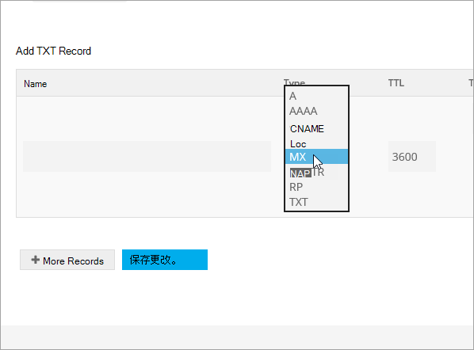

# 在 Freenom for Microsoft 创建 DNS 记录

[如果找不到 ](../setup/domains-faq.yml) 要查找的内容，请查看域常见问题解答。 
  
> [!CAUTION]
> Freenom 网站不支持 SRV 记录，这意味着多个 Skype for Business Online 和 Outlook Web App 功能将不起作用。 无论使用哪种 Microsoft 计划，都存在重大服务限制，您可能需要切换到其他 DNS 托管提供商。 
  
If despite the service limitations， you choose to manage your own Microsoft DNS records at Freenom， follow the steps in this article to verify your domain and set up DNS records for email and other services.
  
  
> [!NOTE]
> DNS 更改通常需要 15 分钟左右才能生效。 但是，有时可能需要更长时间，您所做的更改才会在 Internet 的 DNS 系统中更新。 如果添加 DNS 记录后遇到邮件流问题或其他问题，请参阅 [更改域名或 DNS 记录后出现的问题的疑难解答](../get-help-with-domains/find-and-fix-issues.md)。 
  
## 添加 TXT 记录进行验证

在将域用于 Microsoft 之前，必须确保你拥有该域。如果你能够在域注册机构处登录到你的帐户并创建 DNS 记录，便可向 Microsoft 证明你是域所有者。
  
> [!NOTE]
> 此记录仅用于验证您是否拥有自己的域；它不会影响其他任何内容。 如果需要，您可以以后将其删除。 
  
1. To get started， go to your domains page in Freenom by using [this link](https://my.freenom.com/). You'll be prompted to log in.
    
    
  
2. 选择 **"服务**"，然后选择"**我的域"。**
    
    
  
3. 对于要编辑的域，请选择"**管理域"。**
    
    
  
4. 选择 **"管理 Freenom DNS"。**
    
    
  
5. 在 **"添加记录"** 下的"**类型"** 列中，从菜单中选择 **"TXT"。** 
    
    
  
6. 在新记录的框中，键入或复制并粘贴下表中的值。 
    
    |**名称**|**类型**|**TTL**|**Target**|
    |:-----|:-----|:-----|:-----|
    |（保留为空白）    |TXT    |3600 (秒)     |MS=msXXXXXXXX    **注意：** 这是一个示例。 在这里使用表中的特定“**目标地址或指向的地址**”值。           [如何查找此项？](../get-help-with-domains/information-for-dns-records.md)          |
   
    
  
7. 选择 **"保存更改"。**
    
    
  
8. 请在继续之前等待数分钟，以便您刚刚创建的记录可以通过 Internet 完成更新。
    
在在域注册机构网站添加了记录后，你将返回到 Microsoft 并请求记录。
  
Microsof 找到正确的 TXT 记录表明域已通过验证。
  
1. 在 Microsoft 管理中心，转到“**设置**”\>“<a href="https://go.microsoft.com/fwlink/p/?linkid=834818" target="_blank">域</a>”页面。

    
2. 在“**域**”页面上，选择要验证的域。 
    
    
  
3. 在“**设置**”页面上，选择“**开始设置**”。
    
    
  
4. 在“**验证域**”页面上，选择“**验证**”。
    
    
  
> [!NOTE]
>  DNS 更改通常需要 15 分钟左右才能生效。 但是，有时可能需要更长时间，您所做的更改才会在 Internet 的 DNS 系统中更新。 如果添加 DNS 记录后遇到邮件流问题或其他问题，请参阅 [更改域名或 DNS 记录后出现的问题的疑难解答](../get-help-with-domains/find-and-fix-issues.md)。 
  
## 添加一条 MX 记录，确保发往你的域的电子邮件将会发送到 Microsoft

1. To get started， go to your domains page in Freenom by using [this link](https://my.freenom.com/). You'll be prompted to log in.
    
    
  
2. 选择 **"服务**"，然后选择"**我的域"。**
    
    
  
3. 对于要编辑的域，请选择"**管理域"。**
    
    
  
4. 将域的名称"服务"设置为默认 Freenom 名称服务器。 选择 **"管理工具"，** 然后选择"**名称服务器"。**
    
    
  
5. 确保选中 **"使用默认名称服务器**"，然后选择"**更改名称服务器"。**
    
    
  
6. 选择 **"管理 Freenom DNS"。**
    
    
  
7. 在 **"添加记录"** 下的"**类型"** 列中，从 **菜单中选择"MX"。** 
    
    
  
8. 在新记录的框中，键入或复制并粘贴下表中第一行的值。 
    
    |**名称**|**类型**|**TTL**|**Target**|**Priority**|
    |:-----|:-----|:-----|:-----|:-----|
    |（保留为空白）    |MX (Mail Exchanger)     |3600 (秒)     |\<domain-key\>.mail.protection.outlook.com    **注意：** 从  *\<domain-key\>*  Microsoft 帐户获取你的信息。   如何查找此内容？          |10      有关优先级的详细信息，请参阅[什么是 MX 优先级？](../setup/domains-faq.yml)   |
   
   
  
9. 选择 **"保存更改"。**
    
    
  
10. 如果存在任何其他 MX 记录，请全部删除。 对于每个记录，选择"删除 **"。** 当出现消息 **"是否确实要删除此条目？"** 时，选择"确定 **"。**
    
## 添加 Microsoft 所需的 CNAME 记录

1. To get started， go to your domains page in Freenom by using [this link](https://my.freenom.com/). You'll be prompted to log in.
    
    
  
2. 选择 **"服务**"，然后选择"**我的域"。**
    
    
  
3. 对于要编辑的域，请选择"**管理域"。**
    
    
  
4. 选择 **"管理 Freenom DNS"。**
    
    
  
5. 在 **"添加记录"** 下的"**类型**"列中，从 **菜单中选择"CNAME"。** 
    
    
  
6. 创建第一条 CNAME 记录。 在新记录的框中，键入或复制并粘贴下表中第一行的值。 
    
    |**名称**|**记录类型**|**TTL**|**Target**|
    |:-----|:-----|:-----|:-----|
    |自动发现    |CNAME    |3600 (秒)     |autodiscover.outlook.com    |
    |sip    |CNAME    |3600 (秒)     |sipdir.online.lync.com    |
    |lyncdiscover    |CNAME    |3600 (秒)     |webdir.online.lync.com    |
    |enterpriseregistration    |CNAME    |3600 (秒)     |enterpriseregistration.windows.net    |
    |enterpriseenrollment    |CNAME    |3600 (秒)     |enterpriseenrollment-s.manage.microsoft.com    |
   
    
  
7. 选择 **"保存更改"。**
    
    
  
8. 重复上述步骤以创建其他五条 CNAME 记录。 
    
    对于每个记录，键入或复制上表中下一行的值并将其粘贴到该记录的框中。
    
## 为 SPF 添加 TXT 记录以帮助防止垃圾邮件

> [!IMPORTANT]
> 一个域所拥有的 SPF 的 TXT 记录不能超过一个。 如果域具有多个 SPF 记录，你将收到电子邮件错误，其中随附发送和垃圾邮件分类问题。 如果你的域已有 SPF 记录，请不要为 Microsoft 创建新记录。 相反，将所需的 Microsoft 值添加到当前记录，以便你有一个  *包含这*  两组值的 SPF 记录。 

1. To get started， go to your domains page in Freenom by using [this link](https://my.freenom.com/). You'll be prompted to log in.
    
    
  
2. 选择 **"服务**"，然后选择"**我的域"。**
    
    
  
3. 对于要编辑的域，请选择"**管理域"。**
    
    
  
4. 选择 **"管理 Freenom DNS"。**
    
    
  
5. 在 **"添加记录"** 下的"**类型"** 列中，从菜单中选择 **"TXT"。** 
    
    
  
6. In the boxes for the new record, type or copy and paste the following values. 
    
    |**名称**|**记录类型**|**TTL**|**Target**|
    |:-----|:-----|:-----|:-----|
    |（保留为空白）    |TXT    |3600 (秒)     |v=spf1 include:spf.protection.outlook.com -all   **注意：** 建议复制粘贴此条目，以保证正确保留所有空格。           |
   
    
  
7. 选择 **"保存更改"。**
    
    
