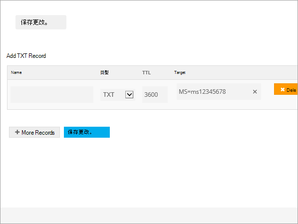
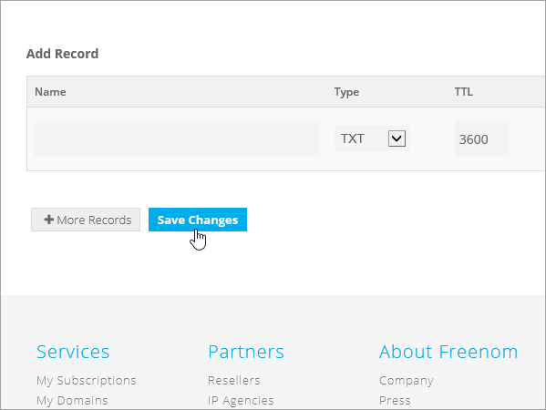
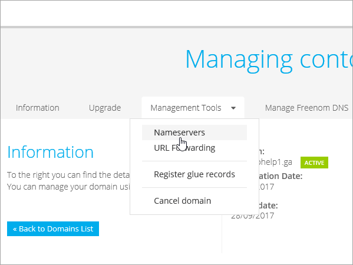
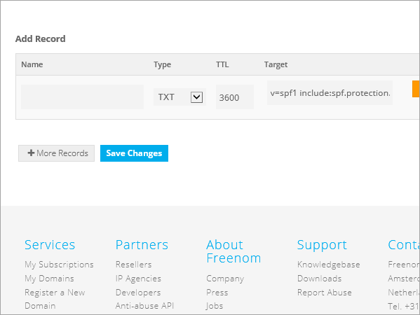

# 在 Freenom 处为 Microsoft 创建 DNS 记录

如果找不到您要查找的内容，[请检查域 FAQ](../setup/domains-faq.md) 。 
  
> [!CAUTION]
> Freenom 网站不支持 SRV 记录，这意味着多个 Skype for Business Online 和 Outlook Web App 功能将不起作用。 无论使用哪种 Microsoft 计划，都有显著的服务限制，您可能想要切换到其他 DNS 承载提供程序。 
  
如果考虑到服务限制，您可以选择在 Freenom 管理自己的 Microsoft DNS 记录，请按照本文中的步骤验证您的域并为电子邮件和其他服务设置 DNS 记录。
  
  
> [!NOTE]
> DNS 更改通常需要 15 分钟左右才能生效。 但是，有时可能需要更长时间，您所做的更改才会在 Internet 的 DNS 系统中更新。 如果添加 DNS 记录后遇到邮件流问题或其他问题，请参阅 [更改域名或 DNS 记录后出现的问题的疑难解答](../get-help-with-domains/find-and-fix-issues.md)。 
  
## 添加 TXT 记录进行验证

在将域用于 Microsoft 之前，必须确保你拥有该域。如果你能够在域注册机构处登录到你的帐户并创建 DNS 记录，便可向 Microsoft 证明你是域所有者。
  
> [!NOTE]
> 此记录仅用于验证您是否拥有自己的域；它不会影响其他任何内容。 如果需要，您可以以后将其删除。 
  
1. 若要开始，请使用 [此链接](https://my.freenom.com/)转到 Freenom 中的 "域" 页面。 You'll be prompted to log in.
    
    
  
2. 选择 " **服务**"，然后选择 **"我的域**"。
    
    
  
3. 对于要编辑的域，选择 " **管理域**"。
    
    
  
4. 选择 " **管理 FREENOM DNS**"。
    
    
  
5. 在 " **添加记录**" 下的 " **类型** " 列中，从菜单中选择 " **TXT** "。 
    
    
  
6. 在新记录的框中，键入或复制并粘贴下表中的值。 
    
    |**名称**|**类型**|**TTL**|**Target**|
    |:-----|:-----|:-----|:-----|
    |（保留为空白）    |TXT    |3600 (秒)     |MS = msXXXXXXXX    **注意：** 这是一个示例。 在这里使用表中的特定“**目标地址或指向的地址**”值。           [如何查找此项？](../get-help-with-domains/information-for-dns-records.md)          |
   
    
  
7. 选择 " **保存更改**"。
    
    
  
8. 请在继续之前等待数分钟，以便您刚刚创建的记录可以通过 Internet 完成更新。
    
在在域注册机构网站添加了记录后，你将返回到 Microsoft 并请求记录。
  
Microsof 找到正确的 TXT 记录表明域已通过验证。
  
1. 在 Microsoft 管理中心，转到“**设置**”\>“<a href="https://go.microsoft.com/fwlink/p/?linkid=834818" target="_blank">域</a>”页面。

    
2. 在“**域**”页面上，选择要验证的域。 
    
    
  
3. 在“**设置**”页面上，选择“**开始设置**”。
    
    
  
4. 在“**验证域**”页面上，选择“**验证**”。
    
    
  
> [!NOTE]
>  DNS 更改通常需要 15 分钟左右才能生效。 但是，有时可能需要更长时间，您所做的更改才会在 Internet 的 DNS 系统中更新。 如果添加 DNS 记录后遇到邮件流问题或其他问题，请参阅 [更改域名或 DNS 记录后出现的问题的疑难解答](../get-help-with-domains/find-and-fix-issues.md)。 
  
## 添加一条 MX 记录，确保发往你的域的电子邮件将会发送到 Microsoft

1. 若要开始，请使用 [此链接](https://my.freenom.com/)转到 Freenom 中的 "域" 页面。 You'll be prompted to log in.
    
    
  
2. 选择 " **服务**"，然后选择 **"我的域**"。
    
    
  
3. 对于要编辑的域，选择 " **管理域**"。
    
    
  
4. 将您的域的名称设置为默认的 Freenom 名称服务器。 选择 " **管理工具**"，然后选择 " **名称服务器**"。
    
    
  
5. 请确保已选择 " **使用默认名称服务器** "，然后选择 " **更改名称服务器**"。
    
    
  
6. 选择 " **管理 FREENOM DNS**"。
    
    
  
7. 在 " **添加记录**" 下的 " **类型** " 列中，从菜单中选择 " **MX** "。 
    
    
  
8. 在新记录的框中，键入或复制并粘贴下表中第一行的值。 
    
    |**名称**|**类型**|**TTL**|**Target**|**Priority**|
    |:-----|:-----|:-----|:-----|:-----|
    |（保留为空白）    |MX (邮件交换器)     |3600 (秒)     |\<domain-key\>。 mail.protection.outlook.com    **注意：***\<domain-key\>* 从你的 Microsoft 帐户获取你的。   如何查找此内容？          |10      有关优先级的详细信息，请参阅[什么是 MX 优先级？](https://docs.microsoft.com/microsoft-365/admin/setup/domains-faq)   |
   
   
  
9. 选择 " **保存更改**"。
    
    
  
10. 如果有任何其他 MX 记录，请将它们全部删除。 对于每个记录，选择 " **删除**"。 当 **您确实要删除此条目时？** 出现时，选择 **"确定"**。
    
## 添加 Microsoft 所需的 CNAME 记录

1. 若要开始，请使用 [此链接](https://my.freenom.com/)转到 Freenom 中的 "域" 页面。 You'll be prompted to log in.
    
    
  
2. 选择 " **服务**"，然后选择 **"我的域**"。
    
    
  
3. 对于要编辑的域，选择 " **管理域**"。
    
    
  
4. 选择 " **管理 FREENOM DNS**"。
    
    
  
5. 在 " **添加记录**" 下的 " **类型** " 列中，从菜单中选择 " **CNAME** "。 
    
    
  
6. 创建第一个 CNAME 记录。 在新记录的框中，键入或复制并粘贴下表中第一行的值。 
    
    |**名称**|**记录类型**|**TTL**|**Target**|
    |:-----|:-----|:-----|:-----|
    |自动发现    |CNAME    |3600 (秒)     |autodiscover.outlook.com    |
    |sip    |CNAME    |3600 (秒)     |sipdir.online.lync.com    |
    |lyncdiscover    |CNAME    |3600 (秒)     |webdir.online.lync.com    |
    |enterpriseregistration    |CNAME    |3600 (秒)     |enterpriseregistration.windows.net    |
    |enterpriseenrollment    |CNAME    |3600 (秒)     |enterpriseenrollment-s.manage.microsoft.com    |
   
    
  
7. 选择 " **保存更改**"。
    
    
  
8. 重复前面的步骤以创建其他五个 CNAME 记录。 
    
    对于每个记录，键入或复制并将上表中下一行的值粘贴到该记录的框中。
    
## 为 SPF 添加 TXT 记录以帮助防止垃圾邮件

> [!IMPORTANT]
> 一个域所拥有的 SPF 的 TXT 记录不能超过一个。 如果域具有多个 SPF 记录，你将收到电子邮件错误，其中随附发送和垃圾邮件分类问题。 如果你的域已有 SPF 记录，请不要为 Microsoft 创建新记录。 改为将所需的 Microsoft 值添加到当前记录，以便您具有包含两组值的  *单个*  SPF 记录。 

1. 若要开始，请使用 [此链接](https://my.freenom.com/)转到 Freenom 中的 "域" 页面。 You'll be prompted to log in.
    
    
  
2. 选择 " **服务**"，然后选择 **"我的域**"。
    
    
  
3. 对于要编辑的域，选择 " **管理域**"。
    
    
  
4. 选择 " **管理 FREENOM DNS**"。
    
    
  
5. 在 " **添加记录**" 下的 " **类型** " 列中，从菜单中选择 " **TXT** "。 
    
    
  
6. In the boxes for the new record, type or copy and paste the following values. 
    
    |**名称**|**记录类型**|**TTL**|**Target**|
    |:-----|:-----|:-----|:-----|
    |（保留为空白）    |TXT    |3600 (秒)     |v=spf1 include:spf.protection.outlook.com -all   **注意：** 建议复制粘贴此条目，以保证正确保留所有空格。           |
   
    
  
7. 选择 " **保存更改**"。
    
    
  

