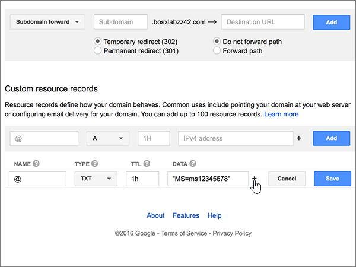

# 在 Google Domains 为 Office 365 创建 DNS 记录

 **如果找不到要查找的内容，请[查看域常见问题解答](../setup/domains-faq.md)** 。 
  
如果 DNS 托管提供商是 Google Domains，请按照本文中的步骤验证域并为电子邮件、Lync 等设置 DNS 记录。
  
在 Google Domains 添加这些记录后，域将设置为使用 Office 365 服务。
  
若要了解如何与 Office 365 结合使用网站的 Web 宿主和 DNS，请参阅[配合使用公共网站与 Office 365](https://support.office.com/article/choose-a-public-website-3325d50e-d131-403c-a278-7f3296fe33a9)。
  
> [!NOTE]
> Typically it takes about 15 minutes for DNS changes to take effect. 但是，有时可能需要更长时间，您所做的更改才会在 Internet 的 DNS 系统中更新。 如果在添加 DNS 记录后遇到邮件流问题或其他问题，请参阅[查找在将域或 DNS 记录添加到 Office 365 后遇到的问题并进行修复](../get-help-with-domains/find-and-fix-issues.md)。 
  
## 添加 TXT 记录进行验证

在将域用于 Office 365 之前，必须确保你拥有该域。如果你能够在域注册机构处登录到你的帐户并创建 DNS 记录，便可向 Office 365 证明你是所有者。
  
> [!NOTE]
> 此记录仅用于验证您是否拥有自己的域；它不会影响其他任何内容。 如果需要，您可以以后将其删除。 
  
1. 要开始，请使用[此链接](https://domains.google.com/registrar)转到你在 Google Domains 上的域页面。 系统将会提示您登录。 为此，请执行以下操作：
    
1. 选择 **"登录"**。
    
2. 输入登录凭据，然后再次选择 **"登录**"。
    
2. 在 "**我的域**" 页面上，找到要用于 Office 365 的域，然后选择它旁边的 "**管理**" 链接。 在左侧导航栏中，选择 " **DNS**"。
    
3. 在 "* * 自定义资源记录 * *" 部分中新记录的框内，键入或复制并粘贴下表中的值。 
    
    (You may have to scroll down.)
    
    (Choose the **Type** value from the drop-down list.) 
    
    |||||
    |:-----|:-----|:-----|:-----|
    |**名称**   |**Type**   |**TTL**   |**Data**   |
    |@    |TXT    |1H    |MS=ms *XXXXXXXX*    **注意：** 此为示例。 在这里使用来自 Office 365 中的表的具体**目标地址或指向的地址**值。 [如何查找此项？](../get-help-with-domains/information-for-dns-records.md)          |
   
4. 选择“**添加**”。
    
5. 请在继续之前等待数分钟，以便您刚刚创建的记录可以通过 Internet 完成更新。
    
现在你已在域注册机构网站添加了记录，然后将返回到 Office 365 并请求 Office 365 查找记录。
  
Office 365 找到正确的 TXT 记录时，表明你的域已通过验证。
  
1. 在管理中心，转到“**设置**”\> <a href="https://go.microsoft.com/fwlink/p/?linkid=834818" target="_blank">域</a>页面。

    
2. 在“**域**”页面上，选择要验证的域。 
    
3. 在“**设置**”页面上，选择“**开始设置**”。
    
4. 在“**验证域**”页面上，选择“**验证**”。
    
> [!NOTE]
> Typically it takes about 15 minutes for DNS changes to take effect. 但是，有时可能需要更长时间，您所做的更改才会在 Internet 的 DNS 系统中更新。 如果在添加 DNS 记录后遇到邮件流问题或其他问题，请参阅[查找在将域或 DNS 记录添加到 Office 365 后遇到的问题并进行修复](../get-help-with-domains/find-and-fix-issues.md)。 

  
## 添加一条 MX 记录，确保发往你的域的电子邮件发送到 Office 365

1. 要开始，请使用[此链接](https://domains.google.com/registrar)转到你在 Google Domains 上的域页面。 系统将会提示您登录。 为此，请执行以下操作：
    
2. 选择 **"登录"**。
    
3. 输入登录凭据，然后再次选择 **"登录**"。
4. 在 "**域**" 页上的 "**域**" 部分，为要编辑的域选择 "**配置 DNS** "。
    
    > [!IMPORTANT]
    > 如果有 G 套件电子邮件帐户，必须先删除与该帐户关联的 MX 记录。G 套件的 MX 记录将导致无法添加任何其他 MX 记录，包括 Office 365 所需的 MX 记录。请注意，删除 G 套件记录不会删除 G 套件帐户。若要删除 G 套件 MX 记录，请使用以下步骤。 
  
5. 在 "**综合记录**" 部分的 " **G 套件**" 区域中，选择 "**删除**"。
    
    (You may have to scroll down.)
    
    
  
6. 选择“删除”****。
    
    
  
7. In the **Custom resource records** section, in the boxes for the new record, type or copy and paste the values from the following table. 
    
    (You may have to scroll down.)
    
    (Choose the **Type** value from the drop-down list.) 
    
    |**名称**|**Type**|**TTL**|**Data**|
    |:-----|:-----|:-----|:-----|
    |@    |MX    |1H    |0  *\<域密钥\>*  .mail.protection.outlook.com。    **此值必须以句点 (.) 结尾。**   **0** 是 MX 优先级值。将其添加到 MX 值的开头，使用一个空格将其与其余部分隔开。    **注意：** 从 Office 365 帐户获取 \<*域密钥*\>。  如何查找此内容？          有关优先级的详细信息，请参阅[什么是 MX 优先级？](https://support.office.com/article/2784cc4d-95be-443d-b5f7-bb5dd867ba83.aspx)   |
   
    
  
5. 选择“**添加**”。
    
    
  
6. 如果有任何其他自定义 MX 记录，请将其删除。
    
1. 在 "MX 记录" 行中选择 "**编辑**"。 
    
    
  
2. 对于每个其他自定义 MX 记录，请选择 "**数据**" 框中的条目，然后按键盘上的**Delete**键以删除该记录。 
    
    继续操作，直到删除所有其他 MX 记录的" **数据**"条目。 
    
    
  
7. 删除了每个其他 MX 记录的**数据**输入后，请选择 "**保存**" 以保存所做的更改。 
    
    
  
## 添加 Office 365 所需的五个 CNAME 记录

1. 若要开始，请转到 [Google 域页面] （https://domains.google.com/registrar)并登录。
    
2. 在 "**域**" 页上的 "**域**" 部分，为要编辑的域选择 "**配置 DNS** "。 
    
3. 添加第一条 CNAME 记录。
    
    在" **自定义资源记录**"部分中新记录的框内，键入或复制粘贴下表第一行中的值。 
    
    (You may have to scroll down.)
    
    (Choose the **Type** value from the drop-down list.) 
    
    |**名称**|**Type**|**TTL**|**Data**|
    |:-----|:-----|:-----|:-----|
    |autodiscover    |CNAME    |1H    |autodiscover.outlook.com。    **This value MUST end with a period (.)**   |
    |sip    |CNAME    |1H    |sipdir.online.lync.com。    **This value MUST end with a period (.)**   |
    |lyncdiscover    |CNAME    |1H    |webdir.online.lync.com。    **This value MUST end with a period (.)**   |
    |enterpriseregistration    |CNAME    |1H    |enterpriseregistration.windows.net。    **This value MUST end with a period (.)**   |
    |enterpriseenrollment    |CNAME    |1H    |enterpriseenrollment-s.manage.microsoft.com。    **This value MUST end with a period (.)**   |
   
    
  
4. 选择“**添加**”。
    
    
  
5. 添加其他 4 条 CNAME 记录。
    
    在 "**自定义资源记录**" 部分，使用表中下一行的值创建记录，然后再次选择 "**添加**" 以完成该记录。 
    
    重复此过程，直到您已创建所有必需的 CNAME 记录。
    
## 为 SPF 添加 TXT 记录以帮助防止垃圾邮件

> [!IMPORTANT]
> 一个域所拥有的 SPF 的 TXT 记录不能超过一个。 如果域具有多个 SPF 记录，你将收到电子邮件错误，其中随附发送和垃圾邮件分类问题。 If you already have an SPF record for your domain, don't create a new one for Office 365. Instead, add the required Office 365 values to the current record so that you have a single SPF record that includes both sets of values. 需要示例吗？ 请查看 [Office 365 的外部域名系统记录](https://support.office.com/article/c0531a6f-9e25-4f2d-ad0e-a70bfef09ac0#bkmk_spfrecords)。 若要验证 SPF 记录，可使用以下任一 [SPF 验证工具](../setup/domains-faq.md)。 
  
1. 要开始，请使用[此链接](https://domains.google.com/registrar)转到你在 Google Domains 上的域页面。 系统将会提示您登录。 为此，请执行以下操作：
    
1. 选择 **"登录"**。
    
2. 输入登录凭据，然后再次选择 **"登录**"。
    
3. 在 "**域**" 页上的 "**域**" 部分，为要编辑的域选择 "**配置 DNS** "。 
    
4. 在 "**自定义资源记录**" 部分的 "TXT 记录" 行中，选择 "**编辑**"。 
    
    > [!IMPORTANT]
    > Google Domains 会将 TXT 记录存储为可能含有多条记录的集。存在至少一条其他 TXT 记录（例如用于验证域的 TXT 记录）时，必须向该记录集添加新的 TXT 记录。如果尝试将其他 TXT 记录作为单独条目进行输入，将始终出现" **记录重复**"错误信息。 
  
    
  
5. 选择 " **（+）** " 控件。 
    
    
  
6. 在新记录的框中，键入或复制粘贴下表中的值。
    
    （可能需要向下滚动。）
    
    |**数据**|
    |:-----|
    |v=spf1 include:spf.protection.outlook.com -all    

    > [!NOTE]
    > 我们建议您复制并粘贴此条目，以保证正确保留所有空格。           
   
   
  
7. 选择“**保存**”。
    
    
  
## 添加 Office 365 所需的两条 SRV 记录

1. 要开始，请使用[此链接](https://domains.google.com/registrar)转到你在 Google Domains 上的域页面。 系统将会提示您登录。 为此，请执行以下操作：
    
2. 选择 **"登录"**。
    
3. 输入登录凭据，然后再次选择 **"登录**"。
    
4. 在 "**域**" 页上的 "**域**" 部分，为要编辑的域选择 "**配置 DNS** "。 
    
5. 添加第一条 SRV 记录。
    
    In the **Custom resource records** section, in the boxes for the new record, type or copy and paste the values from the following table. 
    
    (You may have to scroll down.)
    
    (Choose the **Type** value from the drop-down list.) 
    
    |**名称**|**Type**|**TTL**|**数据**|
    |:-----|:-----|:-----|:-----|
    |_sip _tls|SRV|1H|100 1 443 sipdir.online.lync.com。 **此值必须以句点（.）结尾****注意：** 我们建议您复制并粘贴此条目，以确保所有的间距保持正确。           |
    |_sipfederationtls _tcp|SRV|1H|100 1 5061 sipfed.online.lync.com。 **This value MUST end with a period (.)**

    我们建议您复制并粘贴此条目，以保证正确保留所有空格。       
   
    
  
6. 选择“**添加**”。
    
    
  
7. 添加另一条 SRV 记录。
    
    在 "**自定义资源记录**" 部分，使用表中第二行的值创建记录，然后再次选择 "**添加**" 以完成该记录。 
    
    > [!NOTE]
    > Typically it takes about 15 minutes for DNS changes to take effect. 但是，有时可能需要更长时间，您所做的更改才会在 Internet 的 DNS 系统中更新。 如果在添加 DNS 记录后遇到邮件流问题或其他问题，请参阅[查找在将域或 DNS 记录添加到 Office 365 后遇到的问题并进行修复](../get-help-with-domains/find-and-fix-issues.md)。 
  
