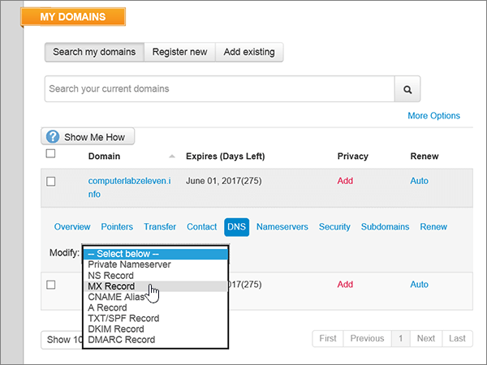
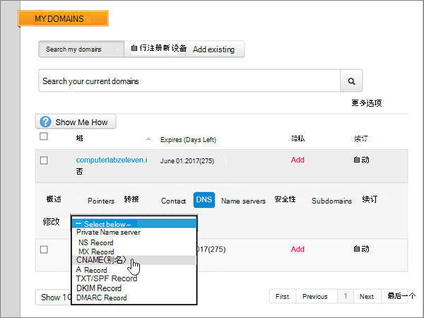

# 在 MyDomain 处为 Microsoft 创建 DNS 记录

  
 如果找不到要查找的内容，请**[查看域常见问题解答](../setup/domains-faq.md)**。 
  
> [!CAUTION]
> The MyDomain website doesn't support SRV records, which means several Skype for Business Online and Outlook Web App features won't work. No matter which Microsoft plan you use, if you manage your DNS records at MyDomain, there are [significant service limitations](https://docs.microsoft.com/microsoft-365/admin/setup/domains-faq), and you might want to switch to a different DNS hosting provider. 
  
如果忽略服务限制，选择在 MyDomain 处管理自己的 Microsoft DNS 记录，请按本文中的步骤为电子邮件、Skype for Business Online 等设置 DNS 记录。
    
在 MyDomain 添加这些记录后，你的域将设置为使用 Microsoft 服务。
  

  
> [!NOTE]
> Typically it takes about 15 minutes for DNS changes to take effect. 但是，有时可能需要更长时间，您所做的更改才会在 Internet 的 DNS 系统中更新。 如果在添加 DNS 记录后遇到邮件流问题或其他问题，请参阅[查找在添加域或 DNS 记录后遇到的问题并进行修复](../get-help-with-domains/find-and-fix-issues.md)。 
  
## 添加 TXT 记录进行验证

Before you use your domain with Microsoft, we have to make sure that you own it. Your ability to log in to your account at your domain registrar and create the DNS record proves to Microsoft that you own the domain.
  
> [!NOTE]
> This record is used only to verify that you own your domain; it doesn't affect anything else. You can delete it later, if you like. 
  
1. To get started, go to your domains page at MyDomain by using [this link](https://www.mydomain.com/controlpanel). You'll be prompted to log in first.
    
2. 在“**我的收藏夹**”部分，选择则“**域中心**”。
    
3. 在“**域**”下，选择要编辑的域名。
    
4. 在“**概述**”行，选择“**DNS**”。
    
5. 在“**修改**”下拉列表中，选择“**TXT/SPF 记录**”。
    
6. 在" **内容**"下方新记录对应的框中，键入或复制并粘贴下表中的值。
    
    ||
    |:-----|
    |**内容**   |
    |MS=ms *XXXXXXXX*    **注意：** 这是一个示例。 在这里使用表中的特定“**目标地址或指向的地址**”值。 [如何查找此项？](../get-help-with-domains/information-for-dns-records.md)          |
   
7. 选择“**添加**”。
    
8. 请在继续之前等待数分钟，以便您刚刚创建的记录可以通过 Internet 完成更新。
    
在在域注册机构网站添加了记录后，你将返回到 Microsoft 并请求记录。
  
Microsof 找到正确的 TXT 记录表明域已通过验证。
  
1. 在 Microsoft 管理中心，转到“**设置**”\>“<a href="https://go.microsoft.com/fwlink/p/?linkid=834818" target="_blank">域</a>”页面。
    
2. 在“**域**”页面上，选择要验证的域。 
    
3. 在“**设置**”页面上，选择“**开始设置**”。
    
4. 在“**验证域**”页面上，选择“**验证**”。
    
> [!NOTE]
> Typically it takes about 15 minutes for DNS changes to take effect. 但是，有时可能需要更长时间，您所做的更改才会在 Internet 的 DNS 系统中更新。 如果在添加 DNS 记录后遇到邮件流问题或其他问题，请参阅[查找在添加域或 DNS 记录后遇到的问题并进行修复](../get-help-with-domains/find-and-fix-issues.md)。 
  
## 添加一条 MX 记录，确保发往你的域的电子邮件将会发送到 Microsoft

1. To get started, go to your domains page at MyDomain by using [this link](https://www.mydomain.com/controlpanel). You'll be prompted to log in first.
    
2. 在“**我的收藏夹**”部分，选择则“**域中心**”。
    
3. 在“**域**”下，选择要编辑的域名。
    
4. 在“**概述**”行，选择“**DNS**”。
    
5. 在“**修改**”下拉列表中，选择“**MX 记录**”。
    
    
  
6. 在新记录的框中，键入或复制并粘贴下表中的值。
    
    |**Priority**|**Host**|**指向：**|
    |:-----|:-----|:-----|
    |0    有关优先级的详细信息，请参阅[什么是 MX 优先级？](https://docs.microsoft.com/microsoft-365/admin/setup/domains-faq)   |@    | *\<domain-key\>*  .mail.protection.outlook.com    **注意：** 从 Microsoft 帐户获取 \<*domain-key*\>。 > [如何查找此项？](../get-help-with-domains/information-for-dns-records.md)          |
   
    
  
7. 选择“**添加**”。
    
    
  
8. 如果存在任何其他现有 MX 记录，请在“**操作**”列中选择“**删除**”以删除每条 MX 记录。 
    
    
  
9. 选择“**确定**”。
    
    
  
## 添加 Microsoft 所需的 CNAME 记录

1. To get started, go to your domains page at MyDomain by using [this link](https://www.mydomain.com/controlpanel). You'll be prompted to log in first.
    
2. 在“**我的收藏夹**”部分，选择则“**域中心**”。
    
3. 在“**域**”下，选择要编辑的域名。
    
4. 在“**概述**”行，选择“**DNS**”。
    
5. 在“**修改**”下拉列表中，选择“**CNAME 别名**”。
    
    
  
6. 添加第一条 CNAME 记录。
    
    在新记录的框中，键入或复制并粘贴下表中第一行的值。
    
    |**Host**|**指向：**|
    |:-----|:-----|
    |自动发现    |autodiscover.outlook.com    |
    |sip    |sipdir.online.lync.com    |
    |lyncdiscover    |webdir.online.lync.com    |
    |enterpriseregistration    |enterpriseregistration.windows.net    |
    |enterpriseenrollment    |enterpriseenrollment-s.manage.microsoft.com    |
   
    
  
7. 选择“**添加**”以添加第一条记录。 
    
    
  
8. 添加第二条 CNAME 记录。
    
    使用上表中第二行的值，然后选择“**添加**”以添加第二条记录。 
    
    按同样的方法，使用表中第 3 到 6 行的值添加其余记录。
    
## 为 SPF 添加 TXT 记录以帮助防止垃圾邮件

> [!IMPORTANT]
> 一个域所拥有的 SPF 的 TXT 记录不能超过一个。 如果域具有多个 SPF 记录，你将收到电子邮件错误，其中随附发送和垃圾邮件分类问题。 如果你的域已有 SPF 记录，请不要为 Microsoft 创建新记录。 可以将所需的 Microsoft 值添加到当前记录，这样就拥有包含两组值的单个 SPF 记录。 需要示例吗？ 请查看 [Microsoft 的外部域名系统记录](https://docs.microsoft.com/office365/enterprise/external-domain-name-system-records#bkmk_spfrecords)。 若要验证 SPF 记录，可使用以下任一 [SPF 验证工具](../setup/domains-faq.md)。 
  
1. To get started, go to your domains page at MyDomain by using [this link](https://www.mydomain.com/controlpanel). You'll be prompted to log in first.
    
2. 在“**我的收藏夹**”部分，选择则“**域中心**”。
    
3. 在“**域**”下，选择要编辑的域名。
    
4. 在“**概述**”行，选择“**DNS**”。
    
5. 在“**修改**”下拉列表中，选择“**TXT/SPF 记录**”。
    
    
  
6. 在" **内容**"下方新记录对应的框中，键入或复制并粘贴下表中的值。
    
    |**内容**|
    |:-----|
    |v=spf1 include:spf.protection.outlook.com -all    **注意：** 建议复制粘贴此条目，以保证正确保留所有空格。           |
   
    
  
7. 选择“**添加**”。
    
    
  
## 添加 Microsoft 所需的两条 SRV 记录

> [!CAUTION]
> The MyDomain website doesn't support SRV records, which means several Skype for Business Online and Outlook Web App features won't work. No matter which Microsoft plan you use, if you manage your DNS records at MyDomain, there are [significant service limitations](https://docs.microsoft.com/microsoft-365/admin/setup/domains-faq), and you might want to switch to a different DNS hosting provider. 
  
> [!NOTE]
> Typically it takes about 15 minutes for DNS changes to take effect. 但是，有时可能需要更长时间，您所做的更改才会在 Internet 的 DNS 系统中更新。 如果在添加 DNS 记录后遇到邮件流问题或其他问题，请参阅[查找在添加域或 DNS 记录后遇到的问题并进行修复](../get-help-with-domains/find-and-fix-issues.md)。 
  
