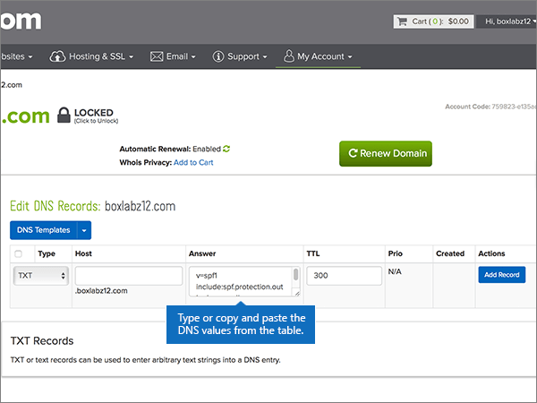

# 在 name.com 处为 Microsoft 创建 DNS 记录

 **如果找不到要查找的内容，请[查看域常见问题解答](../setup/domains-faq.md)** 。 
  
如果 DNS 托管提供者是 name.com，请按本文中的步骤验证域并为电子邮件、Skype for Business Online 等设置 DNS 记录。
  
在 name.com 中添加这些记录后，您的域将设置为与 Microsoft 服务一起使用。
  
若要了解 Microsoft 相关网站的托管和 DNS，请参阅[将公共网站与 microsoft 结合使用](https://support.office.com/article/choose-a-public-website-3325d50e-d131-403c-a278-7f3296fe33a9)。
  
> [!NOTE]
> DNS 更改通常需要 15 分钟左右才能生效。 但是，有时可能需要更长时间，您所做的更改才会在 Internet 的 DNS 系统中更新。 如果添加 DNS 记录后遇到邮件流问题或其他问题，请参阅 [更改域名或 DNS 记录后出现的问题的疑难解答](../get-help-with-domains/find-and-fix-issues.md)。 
  
## 添加 TXT 记录进行验证

在将你的域用于 Microsoft 之前，我们必须确保你拥有此域。 你能够在域注册机构登录到你的帐户，并创建向 Microsoft 证明你拥有该域的 DNS 记录。
  
> [!NOTE]
> 此记录仅用于验证您是否拥有自己的域；它不会影响其他任何内容。 如果需要，您可以以后将其删除。 
  
1. 若要开始，请使用[此链接](https://www.name.com/account/domain)转到 name.com 上你的域页面。系统将会提示你首先登录。
    
    
  
2. 在 **"我的域**" 下，选择要修改的域的名称。
    
    
  
3. 在 "**详细信息**" 列中，选择 "* * DNS 记录 * *"。 
    
    
  
4. 在新记录的框中，键入或复制并粘贴下表中的值。
    
    (Choose the **Type** value from the drop-down list.) 
    
    |||||
    |:-----|:-----|:-----|:-----|
    |**类型**   |**主机**   |**应答**   |**TTL**   |
    |TXT    |(Leave this field empty.)    |MS=ms *XXXXXXXX*    **注意：** 此为示例。 从表中使用您的特定**目标或指向 "地址**" 值。           [如何查找此内容？](../get-help-with-domains/information-for-dns-records.md)          |Use the default value (300).    |
   
    
  
5. 选择 "**添加记录**"。
    
    
  
6. 请在继续之前等待数分钟，以便您刚刚创建的记录可以通过 Internet 完成更新。
    
现在您已在域注册机构的网站上添加了记录，您将返回到 Microsoft 并请求该记录。
  
当 Microsoft 找到正确的 TXT 记录时，您的域将会得到验证。
  
1. 在管理中心，转到“**设置**”\> <a href="https://go.microsoft.com/fwlink/p/?linkid=834818" target="_blank">域</a>页面。
    
2. 在“**域**”页面上，选择要验证的域。 
    
    
  
3. 在“**设置**”页面上，选择“**开始设置**”。
    
    
  
4. 在“**验证域**”页面上，选择“**验证**”。
    
    
  
> [!NOTE]
> DNS 更改通常需要 15 分钟左右才能生效。 但是，有时可能需要更长时间，您所做的更改才会在 Internet 的 DNS 系统中更新。 如果添加 DNS 记录后遇到邮件流问题或其他问题，请参阅 [更改域名或 DNS 记录后出现的问题的疑难解答](../get-help-with-domains/find-and-fix-issues.md)。 
  
## 添加 MX 记录，以便你的域的电子邮件将发送给 Microsoft

1. 若要开始，请使用[此链接](https://www.name.com/account/domain)转到 name.com 上你的域页面。系统将会提示你首先登录。
    
    
  
2. 在 **"我的域**" 下，选择要修改的域的名称。
    
    
  
3. 在 "**详细信息**" 列中，选择 " **DNS 记录**"。 
    
    
  
4. 在新记录的框中，键入或复制并粘贴下表中的值。
    
    (Choose the **Type** value from the drop-down list.) 
    
    |**类型**|**主机**|**应答**|**TTL**|**优先级**|
    |:-----|:-----|:-----|:-----|:-----|
    |MX    |（将此字段留空。）    | *\<域密钥\>*  .mail.protection.outlook.com    **注意：** 从你的 Microsoft 帐户中获取你* \<的域密钥\> * 。           [如何查找此内容？](../get-help-with-domains/information-for-dns-records.md)          |Use the default value (300).    |0    有关优先级的详细信息，请参阅[什么是 MX 优先级？](https://support.office.com/article/2784cc4d-95be-443d-b5f7-bb5dd867ba83.aspx)   |
   
   
  
5. 选择 "**添加记录**"。
    
    
  
6. 如果存在任何其他 MX 记录，请使用以下两步操作删除这些记录：
    
    对于每个其他 MX 记录，请在 "**操作**" 列中选择 "**删除**"。 
    
    
  
    若要确认每个删除，请再次选择 "**操作**" 列中的 "**删除**"。 
    
    
  
    重复此两步操作，直到删除所有其他 MX 记录。
    
## 添加 Microsoft 所需的 CNAME 记录

1. 若要开始，请使用[此链接](https://www.name.com/account/domain)转到 name.com 上你的域页面。系统将会提示你首先登录。
    
    
  
2. 在 **"我的域**" 下，选择要修改的域的名称。
    
    
  
3. 在 "**详细信息**" 列中，选择 " **DNS 记录**"。 
    
    
  
4. 添加第一条 CNAME 记录。
    
    在新记录的框中，键入或复制并粘贴下表中第一行的值。
    
    （从下拉列表中选择" **类型**"值。） 
    
    |**类型**|**主机**|**应答**|**TTL**|
    |:-----|:-----|:-----|:-----|
    |CNAME    |自动发现    |autodiscover.outlook.com    |使用默认值 (300)。    |
    |CNAME    |sip    |sipdir.online.lync.com    |使用默认值 (300)。    |
    |CNAME    |lyncdiscover    |webdir.online.lync.com    |使用默认值 (300)。    |
    |CNAME    |enterpriseregistration    |EnterpriseRegistration.windows.net    |使用默认值 (300)。    |
    |CNAME    |enterpriseenrollment    |enterpriseenrollment-s.manage.microsoft.com    |使用默认值 (300)。    |
   
   
  
5. 选择 "**添加记录**" 以添加第一条记录。 
    
    
  
6. 添加第二条 CNAME 记录。
    
    使用上表中第二行的值，然后选择 "**添加记录**" 以添加第二条记录。 
    
    按同样的方法，使用表中第 3 到 6 行的值添加其余记录。
    
## 为 SPF 添加 TXT 记录以帮助防止垃圾邮件

> [!IMPORTANT]
> 一个域所拥有的 SPF 的 TXT 记录不能超过一个。 如果域具有多个 SPF 记录，你将收到电子邮件错误，其中随附发送和垃圾邮件分类问题。 如果你已有域的 SPF 记录，请不要为 Microsoft 创建一个新的。 改为将所需的 Microsoft 值添加到当前记录，以便您具有包含两组值的*单个*SPF 记录。 
  
1. 若要开始，请使用[此链接](https://www.name.com/account/domain)转到 name.com 上你的域页面。系统将会提示你首先登录。
    
    
  
2. 在 **"我的域**" 下，选择要修改的域的名称。

    
  
3. 在 "**详细信息**" 列中，选择 " **DNS 记录**"。 
    
    
  
4. 在新记录的框中，键入或复制并粘贴下表中的值。
    
    (Choose the **Type** value from the drop-down list.) 
    
    |**类型**|**主机**|**应答**|**TTL**|
    |:-----|:-----|:-----|:-----|
    |TXT    |(Leave this field empty.)    |v=spf1 include:spf.protection.outlook.com -all    **注意：** 我们建议您复制并粘贴此条目，以保证正确保留所有空格。           |Use the default value (300).    |
   
   
  
5. 选择 "**添加记录**"。
    
    
  
## 添加 Microsoft 所需的两条 SRV 记录

1. 若要开始，请使用[此链接](https://www.name.com/account/domain)转到 name.com 上你的域页面。系统将会提示你首先登录。
    
    
  
2. 在 **"我的域**" 下，选择要修改的域的名称。
    
    
  
3. 在 "**详细信息**" 列中，选择 " **DNS 记录 +**"。 
    
    
  
4. 添加第一条 SRV 记录：
    
    在新记录的框中，键入或复制并粘贴下表中第一行的值。
    
    （从下拉列表中选择" **类型**"值。） 
    
    |**类型**|**服务**|**权重**|**TTL**|**优先级**|**协议**|**端口**|**目标**|
    |:-----|:-----|:-----|:-----|:-----|:-----|:-----|:-----|
    |SRV|sip|1|使用默认值 (300)。|100|tls|443|sipdir.online.lync.com   **注意：** 我们建议您复制并粘贴此条目，以保证正确保留所有空格。           |
    |SRV|sipfederationtls|1|使用默认值 (300)。|100|tcp|5061|sipfed.online.lync.com  **注意：** 我们建议您复制并粘贴此条目，以保证正确保留所有空格。           |
   
   
  
5. 选择 "**添加记录**"。

    
  
6. 添加第二条 SRV 记录：

使用上表中下一行的值，然后选择 "**添加记录**" 以添加第二条记录。

>[!NOTE]
>DNS 更改通常需要 15 分钟左右才能生效。 但是，有时可能需要更长时间，您所做的更改才会在 Internet 的 DNS 系统中更新。 如果添加 DNS 记录后遇到邮件流问题或其他问题，请参阅 [更改域名或 DNS 记录后出现的问题的疑难解答](../get-help-with-domains/find-and-fix-issues.md)。
