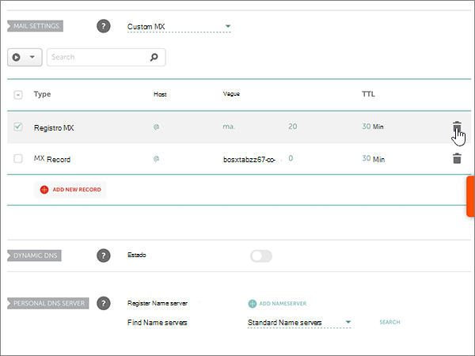

# 在 Namecheap 处为 Microsoft 创建 DNS 记录

 如果找不到要查找的内容，请**[查看域常见问题解答](../setup/domains-faq.md)**。 
  
如果 Namecheap 是您的 DNS 托管提供商，请按照本文中的步骤验证您的域并为电子邮件、Skype for Business Online 等设置 DNS 记录。
  
在 Namecheap 中添加这些记录后，您的域将设置为与 Microsoft 服务一起使用。
  
> [!NOTE]
> DNS 更改通常需要 15 分钟左右才能生效。 但是，有时可能需要更长时间，您所做的更改才会在 Internet 的 DNS 系统中更新。 如果添加 DNS 记录后遇到邮件流问题或其他问题，请参阅 [更改域名或 DNS 记录后出现的问题的疑难解答](../get-help-with-domains/find-and-fix-issues.md)。 
  
## 添加 TXT 记录进行验证

在将域用于 Microsoft 之前，必须确保你拥有该域。如果你能够在域注册机构处登录到你的帐户并创建 DNS 记录，便可向 Microsoft 证明你是域所有者。
  
> [!NOTE]
> 此记录仅用于验证您是否拥有自己的域；它不会影响其他任何内容。 如果需要，您可以以后将其删除。 
  
按照下面的步骤操作。
  
1. 若要开始，请使用[此链接](https://www.namecheap.com/myaccount/login.aspx?ReturnUrl=%2f)转到 Namecheap 上的 "域" 页面。 系统将提示您登录并继续。
    
    
  
2. 在 "**登录**" 页面上的 "**帐户**" 下，从下拉列表中选择 "**域列表**"。 
    
    
  
3. 在 "**域列表**" 页上，找到要编辑的域的名称，然后选择 "**管理**"。
    
    
  
4. 选择 "**高级 DNS**"。
    
    
  
5. 在 "**主机记录**" 部分，选择 "**添加新记录**"。
    
    
  
6. 在 "**类型**" 下拉中，选择 " **TXT 记录**"。
    
    > [!NOTE]
    > 当您选择 "**添加新记录**" 时，"类型" 下拉**类型**将自动显示。 
  
    
  
7. 在新记录的框中，键入或复制并粘贴下表中的值。
    
    （从下拉列表中选择 " **TTL** " 值。） 
    
    |**类型**|**主机**|**值**|**TTL**|
    |:-----|:-----|:-----|:-----|
    |TXT    |@    |MS=ms *XXXXXXXX*   **注意：** 这是一个示例。 在这里使用表中的特定“**目标地址或指向的地址**”值。  [如何查找此项？](../get-help-with-domains/information-for-dns-records.md)          |30分钟    |
       
    
  
8. 选择 "**保存更改**" （复选标记）控件。 
    
    
  
9. 请在继续之前等待数分钟，以便您刚刚创建的记录可以通过 Internet 完成更新。
    
在在域注册机构网站添加了记录后，你将返回到 Microsoft 并请求记录。
  
Microsof 找到正确的 TXT 记录表明域已通过验证。
  
1. 在管理中心，转到“**设置**”\>“<a href="https://go.microsoft.com/fwlink/p/?linkid=834818" target="_blank">域</a>”页面。
    
2. 在“**域**”页面上，选择要验证的域。 
    
    
  
3. 在“**设置**”页面上，选择“**开始设置**”。
    
    
  
4. 在“**验证域**”页面上，选择“**验证**”。
    
    
  
> [!NOTE]
> DNS 更改通常需要 15 分钟左右才能生效。 但是，有时可能需要更长时间，您所做的更改才会在 Internet 的 DNS 系统中更新。 如果添加 DNS 记录后遇到邮件流问题或其他问题，请参阅 [更改域名或 DNS 记录后出现的问题的疑难解答](../get-help-with-domains/find-and-fix-issues.md)。 

  
## 添加一条 MX 记录，确保发往你的域的电子邮件将会发送到 Microsoft

按照下面的步骤操作。
  
1. 若要开始，请使用[此链接](https://www.namecheap.com/myaccount/login.aspx?ReturnUrl=%2f)转到 Namecheap 上的 "域" 页面。 系统将提示您登录并继续。
    
    
  
2. 在 "**登录**" 页面上的 "**帐户**" 下，从下拉列表中选择 "**域列表**"。 
    
    
  
3. 在 "**域列表**" 页上，找到要编辑的域的名称，然后选择 "**管理**"。
    
    
  
4. 选择 "**高级 DNS**"。
    
    
  
5. 在 "**邮件设置**" 部分，从 "**电子邮件转发**" 下拉列表中选择 "**自定义 MX** "。 
    
    (You may have to scroll down.)
    
    
  
6. 选择 "**添加新记录**"。
    
    
  
7. 在新记录的框中，键入或复制并粘贴下表中的值。
    
    （"**优先级**" 框是 "**值**" 框右侧的未命名框。 从下拉列表中选择 " **TTL** " 值。 
    
    |**类型**|**主机**|**值**|**优先级**|**TTL**|
    |:-----|:-----|:-----|:-----|:-----|
    |MX 记录    |@    |\<*domain-key*\>mail.protection.outlook.com。    **This value MUST end with a period (.)**   **注意：** 从你的 Microsoft 帐户中获取你* \<的域密钥\> * 。  如何查找此内容？          |0    有关优先级的详细信息，请参阅[什么是 MX 优先级？](https://docs.microsoft.com/microsoft-365/admin/setup/domains-faq)   |30分钟    |
       
    
  
8. 选择 "**保存更改**" （复选标记）控件。 
    
    
  
9. 如果有任何其他 MX 记录，请使用以下两步过程删除每个：
    
    首先，选择要删除的记录的 "**删除" 图标**（垃圾桶）。 
    
    
  
    其次，选择 **"是"** 以确认删除。 
    
    
  
    删除在此过程前面添加的 MX 记录之外的所有 MX 记录。

  
## 添加 Microsoft 所需的六条 CNAME 记录

按照下面的步骤操作。
  
1. 若要开始，请使用[此链接](https://www.namecheap.com/myaccount/login.aspx?ReturnUrl=%2f)转到 Namecheap 上的 "域" 页面。 系统将提示您登录并继续。
    
    
  
2. 在 "**登录**" 页面上的 "**帐户**" 下，从下拉列表中选择 "**域列表**"。 
    
    
  
3. 在 "**域列表**" 页上，找到要编辑的域的名称，然后选择 "**管理**"。
    
    
  
4. 选择 "**高级 DNS**"。
    
    
  
5. 在 "**主机记录**" 部分，选择 "**添加新记录**"。
    
    
  
6. 在 "**类型**" 下拉菜单中，选择 " **CNAME 记录**"。
    
    > [!NOTE]
    > 当您选择 "**添加新记录**" 时，"类型" 下拉**类型**将自动显示。 
  
    
  
7. 在新记录的空框中，为**记录类型**选择 " **CNAME** "，然后键入或复制并粘贴下表中第一行的值。
    
    |**类型**|**主机**|**值**|**TTL**|
    |:-----|:-----|:-----|:-----|
    |CNAME    |autodiscover    |autodiscover.outlook.com。    **此值必须以句点 (.) 结尾。**   |3600    |
    |CNAME    |sip    |sipdir.online.lync.com。    **此值必须以句点 (.) 结尾。**   |3600    |
    |CNAME    |lyncdiscover    |webdir.online.lync.com。    **此值必须以句点 (.) 结尾。**   |3600    |
    |CNAME    |enterpriseregistration    |enterpriseregistration.windows.net。    **此值必须以句点 (.) 结尾。**   |3600    |
    |CNAME    |enterpriseenrollment    |enterpriseenrollment-s.manage.microsoft.com。    **此值必须以句点 (.) 结尾。**   |3600    |
       
    
  
8. 选择 "**保存更改**" （复选标记）控件。 
    
    
  
9. 使用前面的四个步骤和表中其他五行中的值，添加其他五个 CNAME 记录中的每个。

  
## 为 SPF 添加 TXT 记录以帮助防止垃圾邮件

> [!IMPORTANT]
> 一个域所拥有的 SPF 的 TXT 记录不能超过一个。 如果域具有多个 SPF 记录，你将收到电子邮件错误，其中随附发送和垃圾邮件分类问题。 如果你的域已有 SPF 记录，请不要为 Microsoft 创建新记录。 改为将所需的 Microsoft 值添加到当前记录，以便您具有包含两组值的*单个*SPF 记录。 

按照下面的步骤操作。
  
1. 若要开始，请使用[此链接](https://www.namecheap.com/myaccount/login.aspx?ReturnUrl=%2f)转到 Namecheap 上的 "域" 页面。 系统将提示您登录并继续。
    
2. 在 "**登录**" 页面上的 "**帐户**" 下，从下拉列表中选择 "**域列表**"。 
    
    
  
3. 在 "**域列表**" 页上，找到要编辑的域的名称，然后选择 "**管理**"。
    
    
  
4. 选择 "**高级 DNS**"。
    
    
  
5. 在 "**主机记录**" 部分，选择 "**添加新记录**"。
    
    
  
6. 在 "**类型**" 下拉中，选择 " **TXT 记录**"。
    
    > [!NOTE]
    > 当您选择 "**添加新记录**" 时，"类型" 下拉**类型**将自动显示。 
  
    
  
7. 在新记录的框中，键入或复制并粘贴下表中的以下值。
    
    （从下拉列表中选择 " **TTL** " 值。） 
    
    |**类型**|**主机**|**值**|**TTL**|
    |:-----|:-----|:-----|:-----|
    |TXT    |@    |v=spf1 include:spf.protection.outlook.com -all    **注意：** 我们建议您复制并粘贴此条目，以保证正确保留所有空格。           |30分钟    |
       
    
  
8. 选择 "**保存更改**" （复选标记）控件。 
    
    
  
## 添加 Microsoft 所需的两条 SRV 记录

1. 若要开始，请使用[此链接](https://www.namecheap.com/myaccount/login.aspx?ReturnUrl=%2f)转到 Namecheap 上的 "域" 页面。 You'll be prompted to sign in.
    
    
  
2. 在 "**登录**" 页面上的 "**帐户**" 下，从下拉列表中选择 "**域列表**"。 
    
    
  
3. 在 "**域列表**" 页上，找到要编辑的域的名称，然后选择 "**管理**"。
    
    
  
4. 选择 "**高级 DNS**"。
    
    
  
5. 在 "**主机记录**" 部分，选择 "**添加新记录**"。
    
    
  
6. 在 "**类型**" 下拉菜单中，选择 " **SRV 记录**"。
    
    > [!NOTE]
    > 当您选择 "**添加新记录**" 时，"类型" 下拉**类型**将自动显示。 
  
    
  
7. 在新记录的空框中，键入或复制并粘贴下表中第一行的值。
    
    |**服务**|**协议**|**优先级**|**权重**|**端口**|**目标**|**TTL**|
    |:-----|:-----|:-----|:-----|:-----|:-----|:-----|
    |_sip    |_tls    |100    |1    |443    |sipdir.online.lync.com。    **This value MUST end with a period (.)**   |30分钟    |
    |_sipfederationtls    |_tcp    |100    |1    |5061    |sipfed.online.lync.com。    **此值必须以句点 (.) 结尾。**   |30分钟    |
       
    
  
8. 选择 "**保存更改**" （复选标记）控件。 
    
    
  
9. 使用前面的四个步骤和表中第二行的值，添加另一条 SRV 记录。
    
> [!NOTE]
> DNS 更改通常需要 15 分钟左右才能生效。 但是，有时可能需要更长时间，您所做的更改才会在 Internet 的 DNS 系统中更新。 如果添加 DNS 记录后遇到邮件流问题或其他问题，请参阅 [更改域名或 DNS 记录后出现的问题的疑难解答](../get-help-with-domains/find-and-fix-issues.md)。 
  

  
