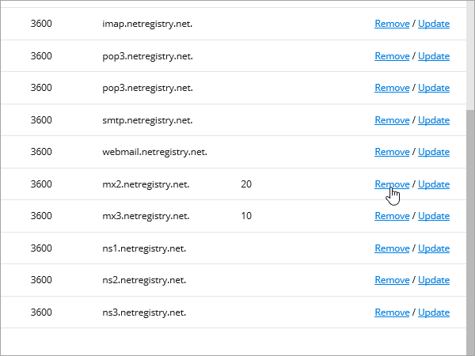

# 在 Netregistry 处为 Microsoft 创建 DNS 记录

如果找不到要查找的内容，请[查看域常见问题解答](../setup/domains-faq.md)。 
  
如果 Netregistry 是您的 DNS 托管提供商，请按照本文中的步骤验证您的域并为电子邮件、Skype for Business Online 等设置 DNS 记录。
  
下面是要添加的主要记录：
  
- [添加 TXT 记录进行验证](#add-a-txt-record-for-verification)
    
- [添加一条 MX 记录，确保发往你的域的电子邮件将会发送到 Microsoft](#add-an-mx-record-so-email-for-your-domain-will-come-to-microsoft)

- [添加 Microsoft 所需的 CNAME 记录](#add-the-cname-records-that-are-required-for-microsoft)
    
- [为 SPF 添加 TXT 记录以帮助防止垃圾邮件](#add-a-txt-record-for-spf-to-help-prevent-email-spam)
    
- [添加 Microsoft 所需的两条 SRV 记录](#add-the-two-srv-records-that-are-required-for-microsoft)
    
在 Netregistry 中添加这些记录后，您的域将设置为与 Microsoft 服务一起使用。
  
  
> [!NOTE]
> DNS 更改通常需要 15 分钟左右才能生效。 但是，有时可能需要更长时间，您所做的更改才会在 Internet 的 DNS 系统中更新。 如果添加 DNS 记录后遇到邮件流问题或其他问题，请参阅 [更改域名或 DNS 记录后出现的问题的疑难解答](../get-help-with-domains/find-and-fix-issues.md)。 
  
## 添加 TXT 记录进行验证

在将域用于 Microsoft 之前，必须确保你拥有该域。如果你能够在域注册机构处登录到你的帐户并创建 DNS 记录，便可向 Microsoft 证明你是域所有者。
  
> [!NOTE]
> 此记录仅用于验证您是否拥有自己的域；它不会影响其他任何内容。 如果需要，您可以以后将其删除。 
  
1. 若要开始，请使用[此链接](https://theconsole.netregistry.com.au/)转到 Netregistry 中的 "域" 页面。 You'll be prompted to log in.
    
    
  
2. 在要管理的域旁边，选择 "**管理**"。
    
    
  
3. 选择 "**区域管理器**"。
    
    
  
4. 在 "**添加区域记录**" 下，从列表中选择 " **TXT 记录**"，然后选择 "**创建新记录**"。
    
    
  
    > [!NOTE]
    > 必须在 TXT 框中的条目前后使用引号。 
  
    在 "**新建 TXT 记录**" 表单中，键入或复制并粘贴下表中的值。 
    
    |**名称**|**TTL （秒）**|**TXT （指向 "地址" 或 "值"）**|
    |:-----|:-----|:-----|
    |（保留为空白）    |3600（秒）    |"MS = msXXXXXXXX"    **注意：** 这是一个示例。 在这里使用表中的特定“**目标地址或指向的地址**”值。 [如何查找此项？](../get-help-with-domains/information-for-dns-records.md)  |
       
    
  
6. 选择 "**添加记录**"。
    
在在域注册机构网站添加了记录后，你将返回到 Microsoft 并请求记录。
  
Microsof 找到正确的 TXT 记录表明域已通过验证。
  
1. 在管理中心，转到“**设置**”\>“<a href="https://go.microsoft.com/fwlink/p/?linkid=834818" target="_blank">域</a>”页面。
    
2. 在“**域**”页面上，选择要验证的域。 
    
    
  
3. 在“**设置**”页面上，选择“**开始设置**”。
    
    
  
4. 在“**验证域**”页面上，选择“**验证**”。
    
    
  
> [!NOTE]
>  DNS 更改通常需要 15 分钟左右才能生效。 但是，有时可能需要更长时间，您所做的更改才会在 Internet 的 DNS 系统中更新。 如果添加 DNS 记录后遇到邮件流问题或其他问题，请参阅 [更改域名或 DNS 记录后出现的问题的疑难解答](../get-help-with-domains/find-and-fix-issues.md)。 
  
## 添加一条 MX 记录，确保发往你的域的电子邮件将会发送到 Microsoft

1. 若要开始，请使用[此链接](https://theconsole.netregistry.com.au/)转到 Netregistry 中的 "域" 页面。 You'll be prompted to log in.
    
    
  
2. 在要管理的域旁边，选择 "**管理**"。
    
    
  
3. 选择 "**区域管理器**"。
    
    
  
4. 在 "**当前区域记录**" 下，选择列表中每条 MX 记录旁边的 "**删除**"，删除默认的 MX 记录。 
    
    
  
5. 在 "**添加区域记录**" 下，从列表中选择 " **MX 记录**"，然后选择 "**创建新记录**"。
    
    
  
6. 在 "**新建 MX 记录**" 表单中，键入或复制并粘贴下表中的值。 
    
    |**名称**|**TTL （秒）**|**Exchange （指向 "地址" 或 "值"）**|**主机是否处于完全限定状态？**|**首选项（优先级）**|
    |:-----|:-----|:-----|:-----|:-----|
    |（保留为空白）    |3600（秒）    | *\<域密钥\>*  .mail.protection.outlook.com    **注意：** 从你的 Microsoft 帐户中获取你* \<的域密钥\> * 。  [如何查找此项？](../get-help-with-domains/information-for-dns-records.md)      |（选中 "" 复选框）    |10      For more information about priority, see What is MX priority?    |
       
    
  
7. 选择 "**添加记录**"。
    
    
  
## 添加 Microsoft 所需的 CNAME 记录

1. 若要开始，请使用[此链接](https://theconsole.netregistry.com.au/)转到 Netregistry 中的 "域" 页面。 You'll be prompted to log in.
    
    
  
2. 在要管理的域旁边，选择 "**管理**"。
    
    
  
3. 选择 "**区域管理器**"。
    
    
  
4. 在 "**添加区域记录**" 下，从列表中选择 " **CNAME 记录**"，然后选择 "**创建新记录**"。
    
    
  
5. 在新记录的框中，键入或复制并粘贴下表中的值。
    
    |**名称**|**Type**|**TTL**|**主机（指向或地址值）**|
    |:-----|:-----|:-----|:-----|
    |autodiscover    |CNAME    |3600（秒）    |autodiscover.outlook.com    |
    |sip    |CNAME    |3600（秒）    |sipdir.online.lync.com    |
    |lyncdiscover    |CNAME    |3600（秒）    |webdir.online.lync.com    |
    |enterpriseregistration    |CNAME    |3600（秒）    |enterpriseregistration.windows.net    |
    |enterpriseenrollment    |CNAME    |3600（秒）    |enterpriseenrollment-s.manage.microsoft.com    |
       
    
      
6. 选择 "**添加记录**"。
    
    
  
7. 重复前面的步骤以创建其他五个 CNAME 记录。
    
    对于每个记录，键入或复制并将上表中下一行的值粘贴到该记录的框中。
    
## 为 SPF 添加 TXT 记录以帮助防止垃圾邮件

> [!IMPORTANT]
> 一个域所拥有的 SPF 的 TXT 记录不能超过一个。 如果域具有多个 SPF 记录，你将收到电子邮件错误，其中随附发送和垃圾邮件分类问题。 如果你的域已有 SPF 记录，请不要为 Microsoft 创建新记录。 改为将所需的 Microsoft 值添加到当前记录，以便您具有包含两组值的*单个*SPF 记录。
  
1. 若要开始，请使用[此链接](https://theconsole.netregistry.com.au/)转到 Netregistry 中的 "域" 页面。 You'll be prompted to log in.
    
    
  
2. 在要管理的域旁边，选择 "**管理**"。
    
    
  
3. 选择 "**区域管理器**"。
    
    
  
4. 在 "**添加区域记录**" 下，从列表中选择 " **TXT 记录**"，然后选择 "**创建新记录**"。
    
    
  
5. 在新记录的框中，键入或复制并粘贴下表中的值。 
    
    > [!NOTE]
    > 必须在 TXT 框中的条目前后使用引号。 
  
    |**名称**|**Type**|**TTL**|**TXT 数据（目标）**|
    |:-----|:-----|:-----|:-----|
    |（保留为空白）    |TXT    |3600（秒）    |"v = spf1 包括 include spf.protection.outlook.com-all"    **注意：** 我们建议您复制并粘贴此条目，以保证正确保留所有空格。           |
   
    
  
6. 选择 "**添加记录**"。
    
    
  
## 添加 Microsoft 所需的两条 SRV 记录

1. 若要开始，请使用[此链接](https://theconsole.netregistry.com.au/)转到 Netregistry 中的 "域" 页面。 You'll be prompted to log in.
    
    
  
2. 在要管理的域旁边，选择 "**管理**"。
    
    
  
3. 选择 "**区域管理器**"。
    
    
  
4. 在 "**添加区域记录**" 下，从列表中选择 " **SRV 记录**"，然后选择 "**创建新记录**"。
    
    
  
5. 在新记录的框中，键入或复制并粘贴下表中的值。
    
    > [!NOTE]
    > "名称" 字段是服务（例如，_sip）和协议（例如，_tls）的组合。 
  
    |**类型**|**名称**|**TTL （秒）**|**优先级**|**权重**|**端口**|**目标**|
    |:-----|:-----|:-----|:-----|:-----|:-----|:-----|
    |SRV （服务）    |_sip _tls    |3600（秒）    |100    |1    |443    |sipdir.online.lync.com    |
    |SRV （服务）    |_sipfederationtls _tcp    |3600（秒）    |100    |1    |5061    |sipfed.online.lync.com    |
       
    
  
6. 选择 "**添加记录**"。
    
    
  
7. 重复前面的步骤以创建其他 SRV 记录。
    
    将上表中第二行的值键入或复制并粘贴到第二条记录的框中。
    
> [!NOTE]
> DNS 更改通常需要 15 分钟左右才能生效。 但是，有时可能需要更长时间，您所做的更改才会在 Internet 的 DNS 系统中更新。 如果添加 DNS 记录后遇到邮件流问题或其他问题，请参阅 [更改域名或 DNS 记录后出现的问题的疑难解答](../get-help-with-domains/find-and-fix-issues.md)。 
  

