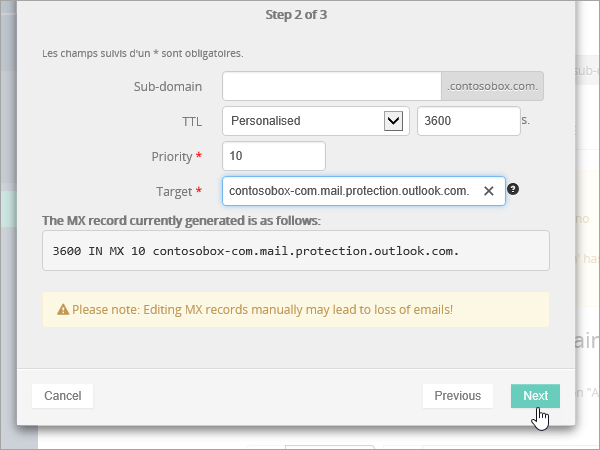
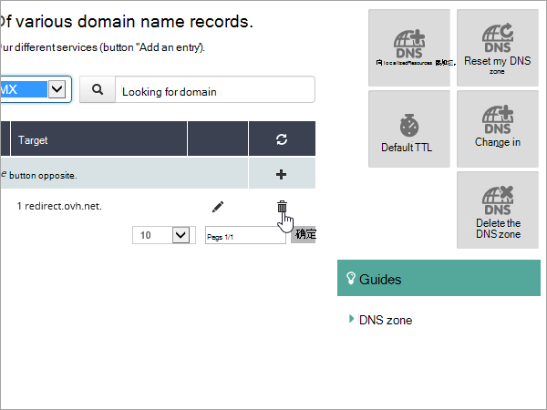

# 在 OVH 处为 Microsoft 创建 DNS 记录

如果找不到要查找的内容，请[查看域常见问题解答](../setup/domains-faq.md)。 
  
如果 OVH 是您的 DNS 托管提供商，请按照本文中的步骤验证您的域并为电子邮件、Skype for Business Online 等设置 DNS 记录。
  
下面是要添加的主要记录。 
  
- [在 OVH 处为 Microsoft 创建 DNS 记录](#create-dns-records-at-ovh-for-microsoft)
    
- [添加一条 MX 记录，确保发往你的域的电子邮件将会发送到 Microsoft](#add-an-mx-record-so-email-for-your-domain-will-come-to-microsoft)
    
- [添加 Microsoft 所需的 CNAME 记录](#add-the-cname-records-that-are-required-for-microsoft)
    
- [为 SPF 添加 TXT 记录以帮助防止垃圾邮件](#add-a-txt-record-for-spf-to-help-prevent-email-spam)
    
- [添加 Microsoft 所需的两条 SRV 记录](#add-the-two-srv-records-that-are-required-for-microsoft)
    
在 OVH 中添加这些记录后，您的域将设置为与 Microsoft 服务一起使用。

  
> [!NOTE]
>  DNS 更改通常需要 15 分钟左右才能生效。 但是，有时可能需要更长时间，您所做的更改才会在 Internet 的 DNS 系统中更新。 如果添加 DNS 记录后遇到邮件流问题或其他问题，请参阅 [更改域名或 DNS 记录后出现的问题的疑难解答](../get-help-with-domains/find-and-fix-issues.md)。 
  
## 添加 TXT 记录进行验证

在将域用于 Microsoft 之前，必须确保你拥有该域。如果你能够在域注册机构处登录到你的帐户并创建 DNS 记录，便可向 Microsoft 证明你是域所有者。
  
> [!NOTE]
> 此记录仅用于验证您是否拥有自己的域；它不会影响其他任何内容。 如果需要，您可以以后将其删除。 
  
1. 若要开始，请使用[此链接](https://www.ovh.com/manager/)转到 OVH 中的 "域" 页面。 You'll be prompted to log in.
    
    
  
2. 在 "**域**" 下，选择要编辑的域的名称。
    
    
  
3. 选择 " **DNS 区域**"。
    
    
  
4. 选择 "**添加条目**"。
    
    
  
5. 选择 " **TXT** "
    
    
  
6. 在新记录的框中，键入或复制并粘贴下表中的值。 若要分配 TTL 值，请从下拉列表中选择 "**个性化**"，然后在文本框中键入值。 
    
    |**记录类型**|**子域**|**TTL**|**值**|
    |:-----|:-----|:-----|:-----|
    |TXT    |（保留为空白）    |3600（秒）    |MS = msxxxxxxxx    **注意：** 这是一个示例。 在这里使用表中的特定“**目标地址或指向的地址**”值。           [如何查找此项？](../get-help-with-domains/information-for-dns-records.md)          |
   
7. 选择 "**确认**"。 
    
    
  
8. 请在继续之前等待数分钟，以便您刚刚创建的记录可以通过 Internet 完成更新。
    
在在域注册机构网站添加了记录后，你将返回到 Microsoft 并请求记录。
  
Microsof 找到正确的 TXT 记录表明域已通过验证。
  
1. 在管理中心，转到“**设置**”\>“<a href="https://go.microsoft.com/fwlink/p/?linkid=834818" target="_blank">域</a>”页面。
    
2. 在“**域**”页面上，选择要验证的域。 
    
    
  
3. 在“**设置**”页面上，选择“**开始设置**”。
    
    
  
4. 在“**验证域**”页面上，选择“**验证**”。
    
    
  
> [!NOTE]
>  DNS 更改通常需要 15 分钟左右才能生效。 但是，有时可能需要更长时间，您所做的更改才会在 Internet 的 DNS 系统中更新。 如果添加 DNS 记录后遇到邮件流问题或其他问题，请参阅 [更改域名或 DNS 记录后出现的问题的疑难解答](../get-help-with-domains/find-and-fix-issues.md)。 
  
## 添加一条 MX 记录，确保发往你的域的电子邮件将会发送到 Microsoft

1. 若要开始，请使用[此链接](https://www.ovh.com/manager/)转到 OVH 中的 "域" 页面。 You'll be prompted to log in.
    
    
  
2. 在 "**域**" 下，选择要编辑的域的名称。
    
    
  
3. 选择 " **DNS 区域**"。
    
    
  
4. 选择 "**添加条目**"。
    
    
  
5. 选择 " **MX**"。
    
    
  
6. 在新记录的框中，键入或复制并粘贴下表中的值。 若要分配 TTL 值，请从下拉列表中选择 "**个性化**"，然后在文本框中键入值。 
    
    > [!NOTE]
    > 默认情况下，OVH 对目标使用相对表示法，这会将域名添加到目标记录的末尾。 若要改为使用绝对表示法，请在目标记录中添加一个点，如下表所示。 
  
    |**记录类型**|**子域**|**TTL**|**Priority**|**Target**|
    |:-----|:-----|:-----|:-----|:-----|
    |MX    |（保留为空白）    |3600（秒）    |10      有关优先级的详细信息，请参阅[什么是 MX 优先级？](https://docs.microsoft.com/microsoft-365/admin/setup/domains-faq)   |\<domain-key\>. mail.protection.outlook.com。    **注意：***\<domain-key\>* 从你的 Microsoft 帐户获取你的。  [如何查找此项？](../get-help-with-domains/information-for-dns-records.md)  |
   
    
  
7. 选择“**下一步**”。
    
    
  
8. 选择 "**确认**"。
    
    
  
9. 如果有任何其他 MX 记录，请在 " **DNS 区域**" 页上的列表中将它们全部删除。 选择每个记录，然后在 "**操作**" 列中选择 "垃圾桶**删除**" 图标。 
    
    
  
10. 选择 "**确认**"。
    
## 添加 Microsoft 所需的 CNAME 记录

1. 若要开始，请使用[此链接](https://www.ovh.com/manager/)转到 OVH 中的 "域" 页面。 You'll be prompted to log in.
    
    
  
2. 在 "**域**" 下，选择要编辑的域的名称。
    
    
  
3. 选择 " **DNS 区域**"。
    
    
  
4. 选择 "**添加条目**"。
    
    
  
5. 选择 " **CNAME**"。
    
    
  
6. 创建第一个 CNAME 记录。
    
    在新记录的框中，键入或复制并粘贴下表中第一行的值。 若要分配 TTL 值，请从下拉列表中选择 "**个性化**"，然后在文本框中键入值。 
    
    |**记录类型**|**子域**|**Target**|**TTL**|
    |:-----|:-----|:-----|:-----|
    |CNAME    |autodiscover    |autodiscover.outlook.com。    |3600秒    |
    |CNAME    |sip    |sipdir.online.lync.com。    |3600秒    |
    |CNAME    |lyncdiscover    |webdir.online.lync.com。    |3600秒    |
    |CNAME    |enterpriseregistration    |enterpriseregistration.windows.net。    |3600秒    |
    |CNAME    |enterpriseenrollment    |enterpriseenrollment-s.manage.microsoft.com。    |3600秒    |
   
    
  
7. 选择“**下一步**”。
    
    
  
8. 选择 "**确认**"。
    
9. 重复前面的步骤以创建其他五个 CNAME 记录。
    
    对于每个记录，键入或复制并将上表中下一行的值粘贴到该记录的框中。
    
## 为 SPF 添加 TXT 记录以帮助防止垃圾邮件

> [!IMPORTANT]
> 一个域所拥有的 SPF 的 TXT 记录不能超过一个。 如果域具有多个 SPF 记录，你将收到电子邮件错误，其中随附发送和垃圾邮件分类问题。 如果你的域已有 SPF 记录，请不要为 Microsoft 创建新记录。 改为将所需的 Microsoft 值添加到当前记录，以便您具有包含两组值的*单个*SPF 记录。 
  
1. 若要开始，请使用[此链接](https://www.ovh.com/manager/)转到 OVH 中的 "域" 页面。 You'll be prompted to log in.
    
    
  
2. 在 "**域**" 下，选择要编辑的域的名称。
    
    
  
3. 选择 " **DNS 区域**"。
    
    
  
4. 选择 "**添加条目**"。
    
    
  
5. 选择 " **TXT**"。
    
6. In the boxes for the new record, type or copy and paste the following values.
    
    |**记录类型**|**子域**|**TTL**|**TXT 值**|
    |:-----|:-----|:-----|:-----|
    |TXT    |（保留为空白）    |3600（秒）    |v=spf1 include:spf.protection.outlook.com -all    **注意：** 我们建议您复制并粘贴此条目，以保证正确保留所有空格。           |
   
    
  
7. 选择“**下一步**”。
    
    
  
8. 选择 "**确认**"。
    
    
  
## 添加 Microsoft 所需的两条 SRV 记录

1. 若要开始，请使用[此链接](https://www.ovh.com/manager/)转到 OVH 中的 "域" 页面。 You'll be prompted to log in.
    
    
  
2. 在 "**域**" 下，选择要编辑的域的名称。
    
    
  
3. 选择 " **DNS 区域**"。
    
    
  
4. 选择 "**添加条目**"。
    
    
  
5. 选择 " **SRV**"。
    
    
  
6. 创建第一个 SRV 记录。
    
    在新记录的框中，键入或复制并粘贴下表中第一行的值。 若要分配 TTL 值，请从下拉列表中选择 "**个性化**"，然后在文本框中键入值。 
    
    |**记录类型**|**子域**|**优先级**|**权重**|**端口**|**TTL**|**Target**|
    |:-----|:-----|:-----|:-----|:-----|:-----|:-----|
    |SRV（服务）    |_sip _tls    |100    |1     |443    |3600（秒）    |sipdir.online.lync.com。    |
    |SRV（服务）    |_sipfederationtls _tcp    |100    |1     |5061    |3600（秒）    |sipfed.online.lync.com。    |
       
    
  
7. 选择“**下一步**”。
    
    
  
8. 选择 "**确认**"。
    
9. 重复前面的步骤以创建其他 SRV 记录。 将上表中第二行的值键入或复制并粘贴到第二条记录的框中。
    
> [!NOTE]
>  DNS 更改通常需要 15 分钟左右才能生效。 但是，有时可能需要更长时间，您所做的更改才会在 Internet 的 DNS 系统中更新。 如果添加 DNS 记录后遇到邮件流问题或其他问题，请参阅 [更改域名或 DNS 记录后出现的问题的疑难解答](../get-help-with-domains/find-and-fix-issues.md)。 
  
