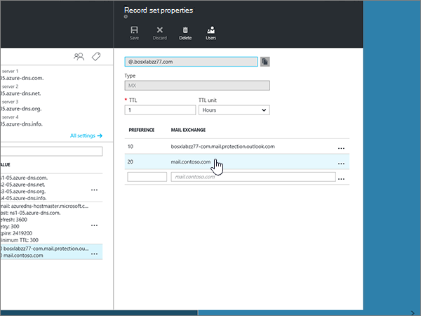
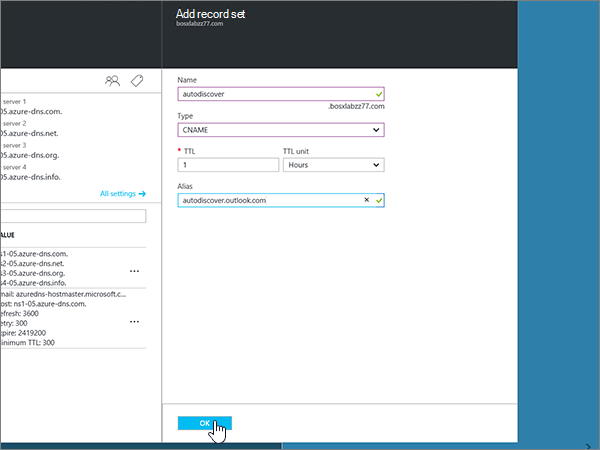

# 为 Azure DNS 区域创建 DNS 记录

 如果找不到要查找的内容，请 **[查看域常见问题解答](../setup/domains-faq.yml)**。 
  
如果 Azure 是 DNS 托管提供商，请按照本文中的步骤验证域，并设置电子邮件、Skype for Business Online 等的 DNS 记录。
  
下面是要添加的主要记录。 
  
- [更改域的名称服务器 (NS) 记录](#change-your-domains-nameserver-ns-records)
    
- [添加 TXT 记录进行验证](#add-a-txt-record-for-verification)

- [添加一条 MX 记录，确保发往你的域的电子邮件将会发送到 Microsoft](#add-an-mx-record-so-email-for-your-domain-will-come-to-microsoft)
    
- [添加 Microsoft 所需的四条 CNAME 记录](#add-the-four-cname-records-that-are-required-for-microsoft)
    
- [为 SPF 添加 TXT 记录以帮助防止垃圾邮件](#add-a-txt-record-for-spf-to-help-prevent-email-spam)
    
- [添加 Microsoft 所需的两条 SRV 记录](#add-the-two-srv-records-that-are-required-for-microsoft)
    
在 Azure 中添加这些记录后，你的域将设置为使用 Microsoft 服务。
  
> [!NOTE]
> DNS 更改通常需要 15 分钟左右才能生效。 但是，有时可能需要更长时间，您所做的更改才会在 Internet 的 DNS 系统中更新。 如果添加 DNS 记录后遇到邮件流问题或其他问题，请参阅 [更改域名或 DNS 记录后出现的问题的疑难解答](../get-help-with-domains/find-and-fix-issues.md)。 
  
## 更改域的名称服务器 (NS) 记录

> [!IMPORTANT]
> 必须在购买和注册域的域注册机构中执行此过程。 
  
注册 Azure 后，在 DNS 区域中创建了一个资源组，然后将域名分配给该资源组。 该域名注册到外部域注册机构;Azure 不提供域注册服务。
  
若要在 Microsoft 中验证和创建域的 DNS 记录，首先需要更改域注册机构的名称服务器，以便它们使用分配给你的资源组的 Azure 名称服务器。
  
若要在域注册机构的网站上更改域的名称服务器，请执行以下步骤。
  
1. 在域注册机构的网站上查找您可以在其中编辑您的域的名称服务器的区域。
    
2. 使用下表中的值创建两个名称机记录，或编辑现有名称机记录，以便它们与这些值匹配。 下面显示了 Azure 分配的名称服务器的示例。
    

**First nameserver：** 使用 Azure 分配的名称服务器值。  
**第二个名称器：** 使用 Azure 分配的名称服务器值。  

  
> [!TIP]
> You should use at least two name server records. 如果域注册机构的网站上列出了任何其他名称服务器，则应该将其删除。 
  
3. 保存所做的更改。
    
> [!NOTE]
> Your nameserver record updates may take up to several hours to update across the Internet's DNS system. 然后，你的 Microsoft 电子邮件和其他服务都将设置为使用你的域。 
  
## 添加 TXT 记录进行验证

在将域用于 Microsoft 之前，必须确保你拥有该域。如果你能够在域注册机构处登录到你的帐户并创建 DNS 记录，便可向 Microsoft 证明你是域所有者。
  
> [!NOTE]
> 此记录仅用于验证您是否拥有自己的域；它不会影响其他任何内容。 如果需要，您可以以后将其删除。 
  
1. To get started， go to your domains page at Azure by using [this link.](https://portal.azure.com ) 系统将会提示您先登录。
    
    
  
2. 使用 **仪表板页面上** 的搜索 **栏** ，键入 DNS **区域**。 在结果显示中，选择 **"服务"** 部分 **下的** DNS 区域。 重定向后，选择要更新的域。
    
    
  
3. 在 **域** 的"设置"页上的 **DNS 区域** 区域中，选择 **" + 记录集"。**
    
    
  
4. 在 **"添加记录集** "区域中新记录集的框中，从下表中选择值。 
    
     (从下拉列表中选择 **类型和** **TTL** 单位值。)  
    
    |**名称**|**类型**|**TTL**|**TTL 单位**|**值**|
    |:-----|:-----|:-----|:-----|:-----|
    |@    |TXT    |1     |工作时间    |MS=ms *XXXXXXXX*    **注意：** 这是一个示例。 在这里使用表中的特定“**目标地址或指向的地址**”值。           [如何查找此项？](../get-help-with-domains/information-for-dns-records.md)          |
   
    
  
5. 选择“**确定**”。
  
6. 请在继续之前等待数分钟，以便您刚刚创建的记录可以通过 Internet 完成更新。
    
在在域注册机构网站添加了记录后，你将返回到 Microsoft 并请求记录。
  
Microsof 找到正确的 TXT 记录表明域已通过验证。
  
1. 在管理中心，转到“**设置**”\>“<a href="https://go.microsoft.com/fwlink/p/?linkid=834818" target="_blank">域</a>”页面。
    
2. 在“**域**”页面上，选择要验证的域。 
    
    
  
3. 在“**设置**”页面上，选择“**开始设置**”。
    
    
  
4. 在“**验证域**”页面上，选择“**验证**”。
    
    
  
> [!NOTE]
>  DNS 更改通常需要 15 分钟左右才能生效。 但是，有时可能需要更长时间，您所做的更改才会在 Internet 的 DNS 系统中更新。 如果添加 DNS 记录后遇到邮件流问题或其他问题，请参阅 [更改域名或 DNS 记录后出现的问题的疑难解答](../get-help-with-domains/find-and-fix-issues.md)。 
  
## 添加一条 MX 记录，确保发往你的域的电子邮件将会发送到 Microsoft

1. To get started， go to your domains page at Azure by using [this link.](https://portal.azure.com ) 系统将会提示您先登录。
    
    
  
2. 在 **"仪表板** "页上 **的"所有** 资源"区域中，选择要更新的域。 
    
    
  
3. 在 **域** 的"设置"页上的 **DNS 区域** 区域中，选择 **" + 记录集"。**
    
    
  
4. 在 **"添加记录集** "区域中新记录集的框中，从下表中选择值。 
    
     (从下拉列表中选择 **类型和** **TTL** 单位值。)  
    
    |**名称**|**类型**|**TTL**|**TTL 单位**|**首选项**|**邮件交换**|
    |:-----|:-----|:-----|:-----|:-----|:-----|
    |@    |MX    |1     |工作时间    |10     有关优先级的详细信息，请参阅[什么是 MX 优先级？](https://docs.microsoft.com/microsoft-365/admin/setup/domains-faq)   | *\<domain-key\>*  .mail.protection.outlook.com    **注意：** 从  *\<domain-key\>*  Microsoft 帐户获取你的帐户。   [如何查找此项？](../get-help-with-domains/information-for-dns-records.md)  
   
    
  
5. 选择“**确定**”。
    
    
  
6. 如果"MX 记录"部分列出了任何其他 **MX** 记录，则必须删除它们。 
    
    首先，在 **DNS 区域** 区域中，选择 **MX 记录集**。
    
    
  
    接下来，选择要删除的 MX 记录。
    
    
  
7. 选择上下文 **菜单 (...) ，** 然后选择"删除 **"。**
    
    
  
8. 选择“**保存**”。
    
    
  
## 添加 Microsoft 所需的四条 CNAME 记录

1. To get started， go to your domains page at Azure by using [this link.](https://portal.azure.com ) 系统将会提示您先登录。
    
    
  
2. 在 **"仪表板** "页上 **的"所有** 资源"区域中，选择要更新的域。 
    
    
  
3. 在 **域** 的"设置"页上的 **DNS 区域** 区域中，选择 **" + 记录集"。**
    
    
  
4. 添加四条 CNAME 记录中的第一条。
    
    在 **"添加记录集** "区域中新记录集的框中，键入或复制粘贴下表中第一行的值。 
    
     (从下拉列表中选择 **类型和** **TTL** 单位值。)  
    
    |**名称**|**类型**|**TTL**|**TTL 单位**|**Alias**|
    |:-----|:-----|:-----|:-----|:-----|
    |自动发现    |CNAME    |1     |工作时间    |autodiscover.outlook.com    |
    |sip    |CNAME    |1     |工作时间    |sipdir.online.lync.com    |
    |lyncdiscover    |CNAME    |1     |工作时间    |webdir.online.lync.com    |
    
   
    
  
5. 选择“**确定**”。
    
    
  
6. 添加其他三条 CNAME 记录。
    
    在 **DNS 区域区域中，** 选择 **" + 记录集"。** 然后，在空记录集内，使用表中下一行的值创建记录，然后再次选择"确定"以完成该记录。 
    
    重复此过程，直到创建所有四条 CNAME 记录。
    
7.   (为 MDM) 2 条 CNAME 记录。可选。

> [!IMPORTANT]
> 如果你有适用于 Microsoft 的移动设备 (MDM) ，则必须创建另外两条 CNAME 记录。 创建流程与你用于其他四个 CNAME 记录的流程一样，但需提供下表中的值。  (如果没有 MDM，可以跳过此步骤。)  
  
|**名称**|**类型**|**TTL**|**TTL 单位**|**Alias**|
|:-----|:-----|:-----|:-----|:-----|
|enterpriseregistration    |CNAME    |1     |工作时间    |enterpriseregistration.windows.net    |
|enterpriseenrollment    |CNAME    |1     |工作时间    |enterpriseenrollment-s.manage.microsoft.com    |
   
## 为 SPF 添加 TXT 记录以帮助防止垃圾邮件

> [!IMPORTANT]
> 一个域所拥有的 SPF 的 TXT 记录不能超过一个。 如果域具有多个 SPF 记录，你将收到电子邮件错误，其中随附发送和垃圾邮件分类问题。 如果你的域已有 SPF 记录，请不要为 Microsoft 创建新记录。 相反，将所需的 Microsoft 值添加到当前记录，以便具有一个  *包含这*  两组值的 SPF 记录。 
  
1. To get started， go to your domains page at Azure by using [this link.](https://portal.azure.com ) 系统将会提示您先登录。
    
    
  
2. 在 **"仪表板** "页上 **的"所有** 资源"区域中，选择要更新的域。 
    
    
  
3. 在 **DNS 区域区域中** ，选择 **TXT 记录集**。
    
    
  
4. 在 **"记录集属性** "区域中新记录集的框中，从下表中选择值。 
    
     (从下拉列表中选择 **类型和** **TTL** 单位值。)  
    
    |**名称**|**类型**|**TTL**|**TTL 单位**|**值**|
    |:-----|:-----|:-----|:-----|:-----|
    |@    |TXT    |1     |工作时间    |v=spf1 include:spf.protection.outlook.com -all    **注意：** 建议复制粘贴此条目，以保证正确保留所有空格。           

    
  
5. 选择“**保存**”。
    
    
  
## 添加 Microsoft 所需的两条 SRV 记录

1. To get started， go to your domains page at Azure by using [this link.](https://portal.azure.com ) 系统将会提示您先登录。
    
    
  
2. 在 **"仪表板** "页上 **的"所有** 资源"区域中，选择要更新的域。 
    
    
  
3. 在 **域** 的"设置"页上的 **DNS 区域** 区域中，选择 **" + 记录集"。**
    
    
  
4. 添加两条 SRV 记录中的第一条记录。
    
    在 **"添加记录集** "区域中新记录集的框中，从下表的第一行中选择值。 
    
     (从下拉列表中选择 **类型和** **TTL** 单位值。)  
    
    |**名称**|**类型**|**TTL**|**TTL 单位**|**优先级**|**权重**|**端口**|**目标**|
    |:-----|:-----|:-----|:-----|:-----|:-----|:-----|:-----|
    |_sip._tls    |SRV    |1     |工作时间    |100    |1     |443    |sipdir.online.lync.com    |
    |_sipfederationtls._tcp    |SRV    |1     |工作时间    |100    |1     |5061    |sipfed.online.lync.com    

    
  
5. 选择“**确定**”。
    
    
  
6. 添加另一条 SRV 记录。
    
    在新记录的框中，键入或复制并粘贴表第二行的值。
    
> [!NOTE]
> DNS 更改通常需要 15 分钟左右才能生效。 但是，有时可能需要更长时间，您所做的更改才会在 Internet 的 DNS 系统中更新。 如果添加 DNS 记录后遇到邮件流问题或其他问题，请参阅 [更改域名或 DNS 记录后出现的问题的疑难解答](../get-help-with-domains/find-and-fix-issues.md)。 
  
