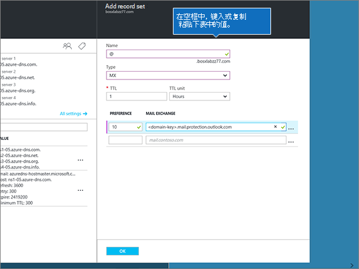
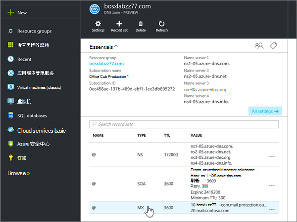
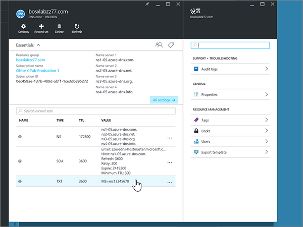

# 为 Azure DNS 区域创建 DNS 记录

 如果找不到要查找的内容，请**[查看域常见问题解答](../setup/domains-faq.md)**。 
  
如果 Azure 是你的 DNS 托管提供商，请按照本文中的步骤验证你的域并为电子邮件、Skype for Business Online 等设置 DNS 记录。
  
下面是要添加的主要记录。 
  
- [更改域的名称服务器 (NS) 记录](#change-your-domains-nameserver-ns-records)
    
- [添加 TXT 记录进行验证](#add-a-txt-record-for-verification)

- [添加一条 MX 记录，确保发往您的域的电子邮件发送到 Office 365](#add-an-mx-record-so-email-for-your-domain-will-come-to-office-365)
    
- [添加 Office 365 所需的四个 CNAME 记录](#add-the-four-cname-records-that-are-required-for-office-365)
    
- [为 SPF 添加 TXT 记录以帮助防止垃圾邮件](#add-a-txt-record-for-spf-to-help-prevent-email-spam)
    
- [添加 Office 365 所需的两条 SRV 记录](#add-the-two-srv-records-that-are-required-for-office-365)
    
在 Azure 中添加这些记录后，您的域将设置为与 Office 365 服务配合使用。
  
> [!NOTE]
> DNS 更改通常需要 15 分钟左右才能生效。 但是，有时可能需要更长时间，您所做的更改才会在 Internet 的 DNS 系统中更新。 如果添加 DNS 记录后遇到邮件流问题或其他问题，请参阅 [更改域名或 DNS 记录后出现的问题的疑难解答](../get-help-with-domains/find-and-fix-issues.md)。 
  
## 更改域的名称服务器 (NS) 记录

> [!IMPORTANT]
> 必须在购买和注册域的域注册机构中执行此过程。 
  
注册 Azure 时，您在 DNS 区域中创建了一个资源组，然后将您的域名分配给该资源组。 该域名注册到外部域注册机构;Azure 不提供域注册服务。
  
若要在 Office 365 中验证和创建域的 DNS 记录，首先需要更改域注册机构中的名称服务器，以便它们使用分配给您的资源组的 Azure 名称服务器。
  
若要在域注册机构的网站上更改域的名称服务器，请执行以下步骤。
  
1. 在域注册机构的网站上查找您可以在其中编辑您的域的名称服务器的区域。
    
2. 通过使用下表中的值创建两个名称服务器记录，或编辑现有的名称服务器记录以使其与这些值匹配。 下面显示了 Azure 分配的名称服务器的示例。
    

**第一个**名称服务器：使用 Azure 分配的名称服务器值。  
**第二个 nameserver：** 使用 Azure 分配的名称服务器值。  

  
> [!TIP]
> You should use at least two name server records. 如果在域注册机构的网站上列出了任何其他名称服务器，则应将其删除。 
  
3. 保存所做的更改。
    
> [!NOTE]
> 你的名称服务器记录更新可能需要多达数小时才能在 Internet 的 DNS 系统中更新。然后，你的 Office 365 电子邮件和其他服务将全部设置为使用你的域。 
  
## 添加 TXT 记录进行验证

在将域用于 Office 365 之前，必须确保你拥有该域。如果你能够在域注册机构处登录到你的帐户并创建 DNS 记录，便可向 Office 365 证明你是所有者。
  
> [!NOTE]
> 此记录仅用于验证您是否拥有自己的域；它不会影响其他任何内容。 如果需要，您可以以后将其删除。 
  
1. 若要开始，请使用[此链接](https://portal.azure.com )转到 Azure 上的 "域" 页面。 系统将会提示您先登录。
    
    
  
2. 在**仪表板**页面上使用**搜索栏**，在 " **DNS 区域**" 中键入。 在 "结果显示" 中，选择 "**服务**" 部分下的 " **DNS 区域**"。 重定向后，选择要更新的域。
    
    
  
3. 在您的域的 "**设置**" 页上的 " **DNS 区域**" 区域中，选择 " **+ 记录集**"。
    
    
  
4. 在 "**添加记录集**" 区域中新记录集对应的框中，选择下表中的值。 
    
    （从下拉列表中选择 "**类型**" 和 " **TTL 单位**" 值。） 
    
    |**名称**|**Type**|**TTL**|**TTL 单位**|**值**|
    |:-----|:-----|:-----|:-----|:-----|
    |@    |TXT    |1    |工作时间    |MS=ms *XXXXXXXX*    **注意：** 此为示例。 在这里使用来自 Office 365 中的表的具体**目标地址或指向的地址**值。           [如何查找此项？](../get-help-with-domains/information-for-dns-records.md)          |
   
    
  
5. 选择“确定”****。
  
6. 请在继续之前等待数分钟，以便您刚刚创建的记录可以通过 Internet 完成更新。
    
现在你已在域注册机构网站添加了记录，然后将返回到 Office 365 并请求 Office 365 查找记录。
  
Office 365 找到正确的 TXT 记录时，表明你的域已通过验证。
  
1. 在管理中心，转到“**设置**”\> <a href="https://go.microsoft.com/fwlink/p/?linkid=834818" target="_blank">域</a>页面。
    
2. 在“**域**”页面上，选择要验证的域。 
    
    
  
3. 在“**设置**”页面上，选择“**开始设置**”。
    
    
  
4. 在“**验证域**”页面上，选择“**验证**”。
    
    
  
> [!NOTE]
>  DNS 更改通常需要 15 分钟左右才能生效。 但是，有时可能需要更长时间，您所做的更改才会在 Internet 的 DNS 系统中更新。 如果添加 DNS 记录后遇到邮件流问题或其他问题，请参阅 [更改域名或 DNS 记录后出现的问题的疑难解答](../get-help-with-domains/find-and-fix-issues.md)。 
  
## 添加一条 MX 记录，确保发往你的域的电子邮件发送到 Office 365

1. 若要开始，请使用[此链接](https://portal.azure.com )转到 Azure 上的 "域" 页面。 系统将会提示您先登录。
    
    
  
2. 在 "**仪表板**" 页上的 "**所有资源**" 区域中，选择要更新的域。 
    
    
  
3. 在您的域的 "**设置**" 页上的 " **DNS 区域**" 区域中，选择 " **+ 记录集**"。
    
    
  
4. 在 "**添加记录集**" 区域中新记录集对应的框中，选择下表中的值。 
    
    （从下拉列表中选择 "**类型**" 和 " **TTL 单位**" 值。） 
    
    |**名称**|**Type**|**TTL**|**TTL 单位**|**首选项**|**邮件交换**|
    |:-----|:-----|:-----|:-----|:-----|:-----|
    |@    |MX    |1    |工作时间    |10     有关优先级的详细信息，请参阅[什么是 MX 优先级？](https://support.office.com/article/2784cc4d-95be-443d-b5f7-bb5dd867ba83.aspx)   | *\<域密钥\>*  .mail.protection.outlook.com    **注意：** 从 Office 365 帐户中获取你* \<的域密钥\> * 。   [如何查找此项？](../get-help-with-domains/information-for-dns-records.md)  
   
    
  
5. 选择“确定”****。
    
    
  
6. 如果 " **Mx 记录**" 一节中列出了任何其他 MX 记录，则必须将其删除。 
    
    首先，在 " **DNS 区域**" 区域中，选择**MX 记录集**。
    
    
  
    接下来，选择要删除的 MX 记录。
    
    
  
7. 选择**上下文菜单（**"..."），然后选择 "**删除**"。
    
    
  
8. 选择“**保存**”。
    
    
  
## 添加 Office 365 所需的四个 CNAME 记录

1. 若要开始，请使用[此链接](https://portal.azure.com )转到 Azure 上的 "域" 页面。 系统将会提示您先登录。
    
    
  
2. 在 "**仪表板**" 页上的 "**所有资源**" 区域中，选择要更新的域。 
    
    
  
3. 在您的域的 "**设置**" 页上的 " **DNS 区域**" 区域中，选择 " **+ 记录集**"。
    
    
  
4. 添加四个 CNAME 记录中的第一个。
    
    在 "**添加记录集**" 区域中新记录集对应的框中，键入或复制并粘贴下表中第一行的值。 
    
    （从下拉列表中选择 "**类型**" 和 " **TTL 单位**" 值。） 
    
    |**名称**|**Type**|**TTL**|**TTL 单位**|**Alias**|
    |:-----|:-----|:-----|:-----|:-----|
    |autodiscover    |CNAME    |1    |工作时间    |autodiscover.outlook.com    |
    |sip    |CNAME    |1    |工作时间    |sipdir.online.lync.com    |
    |lyncdiscover    |CNAME    |1    |工作时间    |webdir.online.lync.com    |
    
   
    
  
5. 选择“确定”****。
    
    
  
6. 添加其他三个 CNAME 记录中的每一个。
    
    在 " **DNS 区域**" 区域中，选择 " **+ 记录集**"。 然后，在空记录集中，使用表中下一行的值创建记录，然后再次选择 **"确定"** 以完成该记录。 
    
    重复此过程，直到创建了全部四个 CNAME 记录。
    
7.  Optional为 MDM 添加2个 CNAME 记录。

> [!IMPORTANT]
> 如果您有 Office 365 的 Mobile Device Manager (MDM)，则必须创建另外两个 CNAME 记录。 创建流程与你用于其他四个 CNAME 记录的流程一样，但需提供下表中的值。 （如果没有 MDM，则可以跳过此步骤。） 
  
|**名称**|**Type**|**TTL**|**TTL 单位**|**Alias**|
|:-----|:-----|:-----|:-----|:-----|
|enterpriseregistration    |CNAME    |1    |工作时间    |enterpriseregistration.windows.net    |
|enterpriseenrollment    |CNAME    |1    |工作时间    |enterpriseenrollment-s.manage.microsoft.com    |
   
## 为 SPF 添加 TXT 记录以帮助防止垃圾邮件

> [!IMPORTANT]
> 一个域所拥有的 SPF 的 TXT 记录不能超过一个。 如果域具有多个 SPF 记录，你将收到电子邮件错误，其中随附发送和垃圾邮件分类问题。 If you already have an SPF record for your domain, don't create a new one for Office 365. 可以将所需的 Office 365 添加到当前记录，这样就拥有包含两组值的*单个*SPF 记录。 
  
1. 若要开始，请使用[此链接](https://portal.azure.com )转到 Azure 上的 "域" 页面。 系统将会提示您先登录。
    
    
  
2. 在 "**仪表板**" 页上的 "**所有资源**" 区域中，选择要更新的域。 
    
    
  
3. 在 " **DNS 区域**" 区域中，选择 " **TXT" 记录集**。
    
    
  
4. 在 "**记录集属性**" 区域中新记录集对应的框中，选择下表中的值。 
    
    （从下拉列表中选择 "**类型**" 和 " **TTL 单位**" 值。） 
    
    |**名称**|**Type**|**TTL**|**TTL 单位**|**值**|
    |:-----|:-----|:-----|:-----|:-----|
    |@    |TXT    |1    |工作时间    |v=spf1 include:spf.protection.outlook.com -all    **注意：** 建议复制粘贴此条目，以保证正确保留所有空格。           

    
  
5. 选择“**保存**”。
    
    
  
## 添加 Office 365 所需的两条 SRV 记录

1. 若要开始，请使用[此链接](https://portal.azure.com )转到 Azure 上的 "域" 页面。 系统将会提示您先登录。
    
    
  
2. 在 "**仪表板**" 页上的 "**所有资源**" 区域中，选择要更新的域。 
    
    
  
3. 在您的域的 "**设置**" 页上的 " **DNS 区域**" 区域中，选择 " **+ 记录集**"。
    
    
  
4. 添加两条 SRV 记录中的第一条记录。
    
    在 "**添加记录集**" 区域中新记录集对应的框中，选择下表中第一行的值。 
    
    （从下拉列表中选择 "**类型**" 和 " **TTL 单位**" 值。） 
    
    |**名称**|**Type**|**TTL**|**TTL 单位**|**优先级**|**权重**|**端口**|**目标**|
    |:-----|:-----|:-----|:-----|:-----|:-----|:-----|:-----|
    |_sip _tls    |SRV    |1    |工作时间    |100    |1    |443    |sipdir.online.lync.com    |
    |_sipfederationtls _tcp    |SRV    |1    |工作时间    |100    |1    |5061    |sipfed.online.lync.com    

    
  
5. 选择“确定”****。
    
    
  
6. 添加另一条 SRV 记录。
    
    在新记录的框中，键入或复制并粘贴表中第二行的值。
    
> [!NOTE]
> DNS 更改通常需要 15 分钟左右才能生效。 但是，有时可能需要更长时间，您所做的更改才会在 Internet 的 DNS 系统中更新。 如果添加 DNS 记录后遇到邮件流问题或其他问题，请参阅 [更改域名或 DNS 记录后出现的问题的疑难解答](../get-help-with-domains/find-and-fix-issues.md)。 
  
