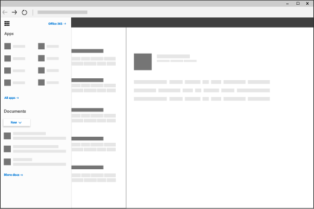

# 向应用启动器添加自定义磁贴Add custom tiles to the app launcher

::: moniker range="o365-21vianet"

> [!NOTE]
> 管理中心正在发生改变。The admin center is changing. 如果你的体验与此处提供的详细信息不匹配，请参阅[有关新版 Microsoft 365 管理中心](https://docs.microsoft.com/microsoft-365/admin/microsoft-365-admin-center-preview?view=o365-21vianet)。If your experience doesn't match the details presented here, see [About the new Microsoft 365 admin center](https://docs.microsoft.com/microsoft-365/admin/microsoft-365-admin-center-preview?view=o365-21vianet).

::: moniker-end

在 Microsoft 365 中，可以使用应用启动器快速轻松地访问您的电子邮件、日历、文档和应用程序， ([了解更多](https://support.microsoft.com/office/79f12104-6fed-442f-96a0-eb089a3f476a)) 。In Microsoft 365, you can quickly and easily get to your email, calendars, documents, and apps using the App launcher ([learn more](https://support.microsoft.com/office/79f12104-6fed-442f-96a0-eb089a3f476a)). 这些是使用 Microsoft 365 获取的应用以及从[SharePoint 应用商店](https://support.microsoft.com/office/dd98e50e-d3db-4ecb-9bb7-82b189822d43)或[Azure AD](https://msdn.microsoft.com/office/office365/howto/connect-your-app-to-o365-app-launcher)添加的自定义应用程序。These are apps you get with Microsoft 365 as well as custom apps that you add from the [SharePoint Store](https://support.microsoft.com/office/dd98e50e-d3db-4ecb-9bb7-82b189822d43) or [Azure AD](https://msdn.microsoft.com/office/office365/howto/connect-your-app-to-o365-app-launcher).
  
可将自己的自定义磁贴添加到应用启动器，这些磁贴指向 SharePoint 网站、外部网站、旧版应用等。自定义磁贴显示在应用启动器的" **全部**"应用下，可将其固定到" **主页**"应用，并指示用户执行相同操作。这样做便于查找相关网站、应用和资源来完成工作。 在以下示例中，名为"Contoso 门户"的自定义磁贴用于访问组织的主要 SharePoint 网站。You can add your own custom tiles to the app launcher that point to SharePoint sites, external sites, legacy apps, and more. The custom tile appears under the app launcher's **All** apps, but you can pin it to the **Home** apps and instruct your users to do the same. This makes it easy to find the relevant sites, apps, and resources to do your job. In the below example, a custom tile called "Contoso Portal" is used to access an organization's SharePoint intranet site. 
  

  
## 向应用启动器添加自定义磁贴Add a custom tile to the app launcher

1. 以全局管理员身份登录到管理中心，转到 "**设置**  >  **组织设置**"，然后选择 "**组织配置文件**" 选项卡。Sign in to the admin center as a Global Administrator, go to **Settings** > **Org Settings**, and choose the **Organization profile** tab.
    
2. 在 "**组织配置文件**" 选项卡上，选择 "**自定义应用启动器" 磁贴**。On the **Organization profile** tab, choose **Custom app launcher tiles**.
  
3. 选择 "**添加自定义磁贴**"。Select **Add a custom tile**. 
  
4. 为新磁贴输入" **磁贴名称**"。Enter a **Tile name** for the new tile. 该名称将显示在磁贴中。The name will appear in the tile. 
    
5. 为磁贴输入**网站的 URL** 。Enter a **URL of website** for the tile. 这是您希望用户在应用启动器上选择磁贴时要转到的位置。This is the location where you want your users to go when they select the tile on the app launcher. 在 URL 中使用 HTTPS。Use HTTPS in the URL. 提示：如果要为 SharePoint 网站创建磁贴，请导航到该网站，复制该 URL，然后将其粘贴到此处。TIP: If you're creating a tile for a SharePoint site, navigate to that site, copy the URL, and paste it here. 默认团队网站的 URL 如下所示：`https://<company_name>.sharepoint.com`The URL of your default team site looks like this: `https://<company_name>.sharepoint.com` 
  
6. 输入图块的**图像的 URL** 。Enter an **URL of the image** for the tile. 此图像显示在"我的应用"页面上和应用启动器中。The image appears on the My apps page and app launcher. 提示：图像应为60x60 像素，并且可供组织中的所有人使用，而无需进行身份验证。TIP: The image should be 60x60 pixels and be available to everyone in your organization without requiring authentication.

7. 为磁贴输入" **说明**"。Enter a **Description** for the tile. 当您在 "我的应用程序" 页上选择磁贴并选择 "**应用程序详细信息**" 时，会看到此You see this when you select the tile on the My apps page and select **App details**. 
  
8. 选择 "**保存更改**" 以创建自定义磁贴。Select **Save changes** to create the custom tile. 
    
自定义磁贴现显示在应用启动器中的" **全部**"选项卡上。Your custom tile now appears in the app launcher on the **All** tab for you and your users. 
  
## 将磁贴升级到应用启动器Promote the tile to App Launcher

1. 选择应用启动器图标并选择 "**所有应用**"。Select the app launcher icon and select the **All apps**. 
    
2. 找到您的应用程序的新磁贴，选择省略号，然后选择 "**固定到启动器**"。Locate the new tile for your app, select the ellipsis, and choose **Pin to launcher**.
  
    > [!NOTE]
    > 如果看不到先前步骤中创建的自定义磁贴，请确保你已分配有 Exchange Online 邮箱，且至少有一次成功登录到邮箱中。If you don't see the custom tile created in the previous steps, make sure you have an Exchange Online mailbox assigned to you and you've signed into your mailbox at least once. 这些步骤是 Microsoft 365 中的自定义磁贴所必需的。These steps are required for custom tiles in Microsoft 365. 
  
> [!IMPORTANT]
> 你和你的用户需要执行这些步骤，才能将"我的应用"页面中的自定义磁贴提升到应用启动器。Both you and your users need to perform these steps to promote custom tiles from the My apps page to the app launcher. 
  
## Edit or delete a custom tileEdit or delete a custom tile

1. 在管理中心中，转到 "**设置**组织设置" "  >  **Org Settings**  >  **组织配置文件** </a> " 选项卡。In the admin center, go to the **Settings** > **Org Settings** > **Organization profile**</a> tab.
    
2. 在 "**组织配置文件**" 页上的 "为**您的组织添加自定义磁贴**" 旁边，选择 "**编辑**"。On the **Organization profile** page, next to   **Add custom tiles for your organization**, select **Edit**.

3. 更新自定义磁贴的" **磁贴名称**"、" **URL**"、" **说明**"或" **图像 URL**"（请参阅[向应用启动器添加自定义磁贴](#add-a-custom-tile-to-the-app-launcher)）。Update the **Tile name**, **URL**, **Description**, or **Image URL** for the custom tile (see [Add a custom tile to the app launcher](#add-a-custom-tile-to-the-app-launcher)).
    
4. 选择 "**更新** \> **关闭**"。Select **Update** \> **Close**. 
    
若要删除自定义磁贴，请从 "**自定义磁贴**" 窗口中选择该图块，选择 "**删除磁贴**  >  **删除**"。To delete a custom tile, from the **Custom tiles** window, select the tile, select **Remove tile** > **Delete**. 
  
## 下一步做什么？What's next?

除了将磁贴添加到应用启动器之外，还可以将应用启动器磁贴添加到导航栏中 ([了解更多](https://support.microsoft.com/office/eb34a21b-52fa-4fbf-a8d5-146132242985)) 。In addition to adding tiles to the app launcher, you can add app launcher tiles to the navigation bar ([learn more](https://support.microsoft.com/office/eb34a21b-52fa-4fbf-a8d5-146132242985)). 若要自定义 Microsoft 365 的外观以与您的组织的品牌相匹配，请参阅[自定义 microsoft 365 主题](../setup/customize-your-organization-theme.md)。To customize the look and feel of Microsoft 365 to match your organization's brand, see [Customize the Microsoft 365 theme](../setup/customize-your-organization-theme.md).
  
