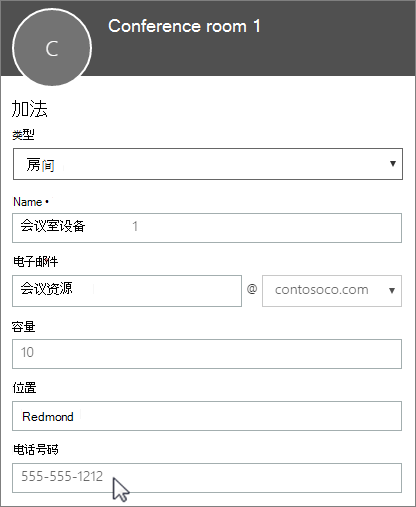

# 会议室和设备邮箱

如果你有供所有人使用的会议室、公司车辆或设备，则需要提供一种所有人均可预订这些资源的方法。最佳方法是在 Microsoft 365 中为每个资源创建会议室或设备邮箱。可以为你的一楼会议室、媒体设备或卡车创建一个这样的邮箱。
  
创建会议室或设备邮箱后，公司中的每个人都可以通过 Outlook 进行预订，将其用于会议或活动。了解下面两个选项卡上的“**使用方法**”以及“**设置方法**”。下面是关于会议室和设备邮箱的一些其他常见问题。 
  
## 使用会议室和设备邮箱

若要使用会议室或设备邮箱，可从计算机打开 Outlook 或登录到 Outlook 网页版。安排新会议并向会议添加会议室或设备，就像邀请其他员工或客户时的操作一样。现在已预订。
  
1. 在计算机上打开“**Outlook**”。 
    
2. 在" **开始**"选项卡上，选择" **新建项目**"\>" **会议**"。  或者，只需在日历中选择“**新建会议**”即可。
    
3. 在“收件人”字段中，除你想要邀请的与会者以外，键入要预订的会议室或设备的名称。 或者，单击“**收件人**”，然后从列表中双击会议室或设备。 然后，选择“**确定**”。 
  
4. 在“**主题**”行中，键入预订或会议的目的。 
    
5. 更改“**位置**”值或保留原样。 
    
6. 更改“**开始时间**”和“**结束时间**”。 或者，选择“**全天事件**”。 若要重复会议或预订，请选择顶部的“**定期**”。 
  
7. 键入描述用途的消息，然后根据需要附加任意文件。
    
8. 若要允许其他人联机加入或拨入会议，单击“**Skype 会议**”。
    
9. 若要确保已邀请的会议室、设备和人员均可用，单击顶部的“**日程安排助理**”。 然后在日历中选择一个可用时间。   提示：在日程安排日历中，蓝色表示会议室或设备处于已预订或占用状态。 选择日历上的白色或空闲区域。 
  
10. 完成后，选择“**发送**”。
    
## 设置会议室和设备邮箱

若要设置会议室或设备邮箱，请转到 Microsoft 365 管理中心。 （需要具有管理员权限才能执行此操作。）创建邮箱，并让所有人都知道他们可以通过预订，用于会议和活动。
  
1. 在管理中心，转到“**资源**”\> [会议室和设备](https://go.microsoft.com/fwlink/p/?linkid=2067334)页面。
  
2. 选择“**添加**”。
    
3. 填写会议室或设备字段：  
  
  - “**会议室**”或“**设备**”：你要创建的邮箱类型。
    
  - “**名称**”：友好名称或简短说明。
    
  - “**电子邮件**”：会议室或设备的电子邮件别名。这是向会议室或设备发送会议请求所必需的。
    
  - “**容量**”：会议室可以容纳的人数或同时使用设备的人数。
    
  - “**位置**”：建筑物或区域中的房间号或房间所在位置。
    
  - “**电话号码**”：房间本身的号码。这与使用 Skype for Business 时生成的会议电话号码不同。
    
4. 选择“**添加**”。
    
5. 选择所创建的会议室或设备邮箱以查看或编辑详细信息。
  
6. 如果进行了更改，请选择“**保存**”，然后“**关闭**”。

> [!Note]
> 为确保会议室和设备邮箱安全，请阻止登录这些邮箱。 有关详细信息，请参阅 [阻止登录共享邮箱帐户](https://docs.microsoft.com/office365/admin/email/create-a-shared-mailbox?view=o365-worldwide#block-sign-in-for-the-shared-mailbox-account)。

## 关于会议室和设备邮箱的常见问题

### 如何判断会议室或设备何时可用？

打开 Outlook，然后创建新会议。 将会议室或设备作为人员添加到会议，然后选择“**日程安排助理**”，查看会议室或设备可用性的实时日历视图。 如果时段未标颜色，则可用；如果是蓝色，则已预订。 
  
### 如何取消会议室或设备请求？

在 Outlook 中打开已安排的会议，然后像删除与会者一样从会议中删除会议室或设备。这将释放会议室，以供他人预订。
  
### 是否必须有人接受或拒绝每个会议室或设备请求？

 否，不需要其他人接受或拒绝请求。可决定是希望会议室/设备自动预定还是要由公司中的某位人员进行管理。 
  
### 会议室邮箱或设备邮箱是否需要产品许可证？

否。尽管组织中的大多数人需要许可证才能使用 Microsoft 365，但无需为会议室邮箱或设备邮箱分配许可证。
  
### 是否需要相关人员负责预定会议室或设备？

 否，无需相关人员管理会议室邮箱或设备邮箱。 
