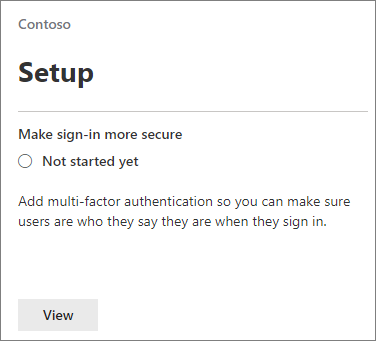

# 需要多重身份验证并设置条件访问策略

使用多重身份验证和条件访问策略保护对数据的访问。 这增加了大量额外的安全性。 Microsoft 提供了一组建议用于所有客户的基准条件访问策略。 基线策略是一组预定义的策略，可帮助保护组织免受许多常见攻击。 这些常见攻击可能包括密码加密、重播和网络钓鱼。

这些策略要求管理员和用户输入第二种形式的身份验证 (多重身份验证，或在某些情况下) MFA 身份验证。 例如，如果组织中用户尝试从不同的国家/地区或未知设备登录 Microsoft 365，则登录可能会被视为有风险。 用户必须提供一种额外的身份验证方法， (指纹或代码) 证明其身份。

目前，基准策略包括以下策略：

- 在 Microsoft 365 管理中心中设置：
  - **需要针对管理员的 MFA：** 要求对特权最大的管理员角色（包括全局管理员）进行多重身份验证。
  - **最终用户保护**：仅在登录存在风险时，才要求用户进行多重身份验证。 
- 在 Azure Active Directory 门户中设置：
  - **阻止旧式身份验证**：较旧的客户端应用和一些新应用不使用更新、更安全的身份验证协议。 这些较旧的应用可以绕过条件访问策略并获取对环境的未经授权的访问。 此策略阻止来自不支持条件访问的客户端的访问。 
  - **需要 MFA 进行服务管理**：需要多重身份验证来访问管理工具，包括 Azure 门户 (配置基线策略) 。

我们建议您启用所有这些基线策略。 启用这些策略后，将提示管理员和用户注册 Azure AD 多重身份验证。

有关这些策略详细信息，请参阅 [什么是基准策略](https://docs.microsoft.com/azure/active-directory/conditional-access/concept-baseline-protection)？

## 需要使用 MFA

若要要求所有用户使用第二种形式的 ID 登录：

1. 转到管理中心， <a href="https://go.microsoft.com/fwlink/p/?linkid=837890" target="_blank">https://admin.microsoft.com</a> 然后选择"设置 **"。**

2. 在"设置"页上 **，选择"****使登录更安全"卡中的"查看**"。

    
3. 在"使登录更安全"页上，选择"**开始使用"。**

4. 在"加强登录安全"窗格中，选中"要求管理员进行多重身份验证"和"要求用户注册多重身份验证"旁边的复选框，如果检测到风险，则阻止 **访问**。
    请务必从"查找用户 "框中的 MFA 要求中排除紧急或"破折 **"管理员** 帐户。

    

5. 选择 **页面** 底部的"创建策略"。

## 设置基线策略

1. 转到 [Azure 门户，](https://portal.azure.com)然后导航到 **Azure Active Directory** \> **条件访问** 以创建新 **策略**。

请参阅每个策略的以下特定说明：  
    - [要求管理员使用 MFA](https://docs.microsoft.com/azure/active-directory/conditional-access/howto-baseline-protect-administrators)  
    - [要求用户使用 MFA](https://docs.microsoft.com/azure/active-directory/conditional-access/howto-baseline-protect-end-users)  
    - [阻止传统身份验证](https://docs.microsoft.com/azure/active-directory/conditional-access/howto-baseline-protect-legacy-auth)  
    - [需要 MFA 进行服务管理](https://docs.microsoft.com/azure/active-directory/conditional-access/howto-baseline-protect-azure)

> [!NOTE]
> 预览策略不再存在，用户将需要创建自己的策略。

你可以设置额外的策略，例如要求批准的客户端应用。 有关详细信息，请参阅条件 [访问文档](https://docs.microsoft.com/azure/active-directory/conditional-access/)。
