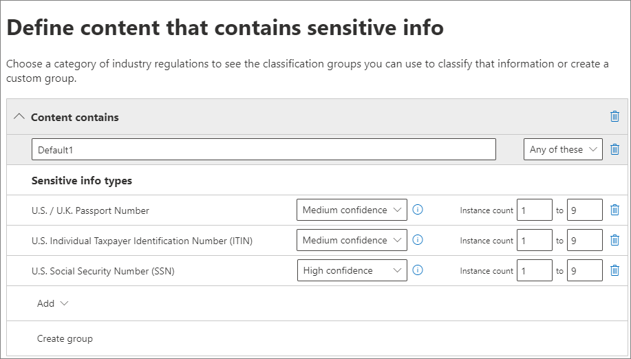

# <a name="automatically-apply-a-retention-label-to-retain-or-delete-content"></a>自动应用保留标签来保留或删除内容

>*[Microsoft 365 安全性与合规性许可指南](/office365/servicedescriptions/microsoft-365-service-descriptions/microsoft-365-tenantlevel-services-licensing-guidance/microsoft-365-security-compliance-licensing-guidance)。*

> [!NOTE]
> [规章记录](records-management.md#records)不支持这种情况。

[保留标签](retention.md)最强大的功能之一是能够将其自动应用于符合特定条件的内容。 此情况下，组织中的人员无需应用保留标签。 Microsoft 365 会代为操作。
  
自动应用保留标签的功能非常强大，这是因为：
  
- 无需为用户提供有关所有分类的培训。
    
- 无需依赖用户，即可对全部内容进行正确分类。
    
- 用户不再需要了解数据管理策略，反而可以专注于自己的工作。
    
当内容包含敏感信息、关键字或可搜索属性，或者[可训练分类器](classifier-get-started-with.md)的匹配项时，可以自动将保留标签应用于内容。

> [!TIP]
> 最近发布时，可使用可搜索属性标识 [团队会议](#microsoft-teams-meeting-recordings)。

将基于以下条件自动应用保留标签的流程：


按照以下说明进行两个管理步骤。

> [!NOTE]
> "自动策略" 使用服务侧标记（带条件）自动应用保留标签。 执行以下操作时，还可使用标签策略自动应用保留标签： 
>
> - 将保留标签应用于文档理解 SharePoint Syntex 中的模型
> - 将默认保留标签应用于 SharePoint 和 Outlook
>- 使用 Outlook 规则将保留标签应用于电子邮件
>
> 有关这些情况，请参阅 [在应用中创建和应用保留标签](create-apply-retention-labels.md)。

## <a name="before-you-begin"></a>准备工作

组织的全局管理员拥有创建和编辑保留标签及其策略的完全权限。 如果你未以全局管理员的身份登录，请参阅[创建和管理保留策略和保留标签所需的权限](get-started-with-retention.md#permissions-required-to-create-and-manage-retention-policies-and-retention-labels)。

## <a name="how-to-auto-apply-a-retention-label"></a>如何自动应用保留标签

首先，创建你的保留标签。 然后创建 "自动策略" 以应用该标签。 如果已创建保留标签，请跳转到 [创建自动策略](#step-2-create-an-auto-apply-policy)。

导航说明取决于你是否正在使用[记录管理](records-management.md)。 针对这两种情况提供了说明。

### <a name="step-1-create-a-retention-label"></a>步骤 1：创建保留标签

1. 在 [Microsoft 365 合规中心](https://compliance.microsoft.com/)，导航到以下位置之一：
    
    - 如果你正在使用记录管理：
        - “**解决方案**” > “**记录管理**” > “**文件计划**”选项卡 > + “**创建标签**” > “**保留标签**”
        
    - 如果你没有使用记录管理：
       - “**解决方案**” > “**信息治理**” > “**标签**”选项卡 > +“**创建标签**”
    
    没有立即看到你的选项？ 首先选择“**全部显示**”。 

2. 按照向导中的提示进行操作。 如果你正在使用记录管理：
    
    - 有关文件计划描述符的信息，请参阅[使用文件计划管理保留标签](file-plan-manager.md)
    
    - 若要使用保留标签来声明记录，请选择 **“将项目标记为记录”**，或者 **“将项目标记为合规性记录”**。 有关详细信息，请参阅[配置保留标签以声明记录](declare-records.md#configuring-retention-labels-to-declare-records)。

3. 创建标签后，你会看到用于发布标签、自动应用标签或 仅保存标签的选项：请选择“**将此标签自动应用到特定的内容类型**”，然后选择“**完成**”以启动“创建自动标记向导”，该向导将直接带你跳转到以下过程中的第 2 步。

若要编辑现有标签，请将其选中，然后选择“**编辑标签**”来启动“编辑保留向导”，这个向导使你能够更改来自第 2 步的标签说明和任何 [符合条件的设置](#updating-retention-labels-and-their-policies)。

### <a name="step-2-create-an-auto-apply-policy"></a>步骤 2：创建自动应用策略

创建自动应用策略时，根据指定的条件，选择要自动应用到内容的保留标签。

1. 在 [Microsoft 365 合规中心](https://compliance.microsoft.com/)，导航到以下位置之一：
    
    - 如果你正在使用记录管理：“**信息治理**”：
        - **“解决方案”** > **“记录管理”** > **“标签策略”** 选项卡 > **“自动应用标签”**
    
    - 如果你没有使用记录管理：
        - **“解决方案”** > **“信息治理”** > **“标签策略”** 选项卡 > **“自动应用标签”**
    
    没有立即看到你的选项？ 首先选择“**全部显示**”。 

2. 按照“创建自动标记向导”中的提示进行操作。
    
    有关配置自动应用保留标签的条件的信息，请参阅此页面上的[配置自动应用保留标签的条件](#configuring-conditions-for-auto-apply-retention-labels)部分。
    
    有关保留标签支持的位置的信息，请参阅[保留标签和位置](retention.md#retention-label-policies-and-locations)部分。

若要编辑现有的自动应用策略，请将其选中以启动“编辑保留策略向导”，该向导可用于更改从第 2 步中选定的保留标签和的任何[符合条件的设置](#updating-retention-labels-and-their-policies)。

使用自动应用标签策略标记内容后，无法通过更改内容或策略或新的自动应用标签策略自动删除或更改应用的标签。 有关详细信息，请参阅 [一次只能有一个保留标签](retention.md#only-one-retention-label-at-a-time)。

### <a name="configuring-conditions-for-auto-apply-retention-labels"></a>配置自动应用保留标签的条件

可将保留标签自动应用于包含以下各项的内容：

- [特定类型敏感信息](#auto-apply-labels-to-content-with-specific-types-of-sensitive-information)

- [指定与所创建的查询匹配的特定关键字或可搜索属性](#auto-apply-labels-to-content-with-keywords-or-searchable-properties)

- [可训练分类器的匹配项](#auto-apply-labels-to-content-by-using-trainable-classifiers)

#### <a name="auto-apply-labels-to-content-with-specific-types-of-sensitive-information"></a>将标签自动应用于包含特定类型敏感信息的内容

> [!WARNING]
> 该配置当前存在一个已知限制，即选定的敏感信息类型有匹配时，所有未标记的电子邮件始终应用所选的保留标签。 例如，即使将自动应用策略的范围限定于特定用户，或者为该策略选择了 Exchange 以外的位置，如果匹配，标签始终会应用于未标记的电子邮件。

为敏感信息创建自动应用保留标签策略时，可看到与创建数据丢失防护 (DLP) 策略时相同的策略模板列表。 每个策略模板都是预配置的，用于查找特定类型的敏感信息。 在下面的示例中，敏感信息类型来自" **隐私信息** "类别， **美国个人身份信息 （PII） 数据** 模板：



若要了解有关敏感信息类型的详细信息，请参阅“[敏感信息类型实体定义](sensitive-information-type-entity-definitions.md)”。 目前[此方案](create-custom-sensitive-information-types-with-exact-data-match-based-classification.md)[完全匹配](document-fingerprinting.md)和文档指纹信息。

选择策略模板后，可添加或删除任意类型的敏感信息，且可更改可信度级别和实例计数。在上一示例屏幕截图中，这些选项已更改，因此保留标签将仅在以下情况时自动应用：
  
- 检测到的敏感信息类型具有至少 **个敏感信息类型的匹配准确度（即 [置信水平](sensitive-information-type-learn-about.md#more-on-confidence-levels)）和** 对一种敏感信息类型的 **置信度高**。 许多敏感信息类型都由多个模式定义，其中具有较高匹配准确度的模式需要发现较多证据（如关键字、日期或地址），而具有较低匹配准确度的模式需要较少的证据。 置信水平越低，内容越容易与条件匹配，且且有可能带来更多误报。

- 内容包含 1 到 9 个这三种敏感信息类型的实例。 **到** 的默认值为 **任何值**。

有关这些选项的详细信息，请参阅 DLP 文档中的以下指南“[调整规则，使它们更易或更难匹配](data-loss-prevention-policies.md#tuning-rules-to-make-them-easier-or-harder-to-match)”。

使用敏感信息类型自动应用保留标签时要考虑的事项：

- 新增项目和已修改项目可自动添加标签。

#### <a name="auto-apply-labels-to-content-with-keywords-or-searchable-properties"></a>将标签自动应用于包含关键字或可搜索属性的内容

可使用包含特定字词、短语或可搜索属性值的查询对内容自动应用标签。可使用搜索运算符（如 AND、OR 和 NOT）优化查询。


有关使用关键字查询语言 (KQL) 的详细信息，请参阅[关键字查询语言 (KQL) 语法参考](/sharepoint/dev/general-development/keyword-query-language-kql-syntax-reference)。

基于查询的自动应用策略使用与电子数据展示内容搜索相同的搜索索引来识别内容。 有关可使用的可搜索属性的详细信息，请参阅[内容搜索的关键字查询和搜索条件](keyword-queries-and-search-conditions.md)。

使用关键字或可搜索属性自动应用保留标签时需要考虑的一些事项：

- 对于 SharePoint、OneDrive 和 Exchange，新增项目、已修改项目和现有项目将自动添加标签。

- 对于 SharePoint，这些 KQL 查询不支持爬网属性和自定义属性，你必须仅使用预定义的托管属性。 但是，你可以在租户级别使用与默认情况下启用为精简条件的预定义托管属性（RefinableDate00-19、RefinableString00-99、RefinableInt00-49、RefinableDecimals00-09 和 RefinableDouble00-09）的映射。 有关详细信息，请参阅 [SharePoint Server 中的已爬网和托管属性概述](/SharePoint/technical-reference/crawled-and-managed-properties-overview)，有关说明，请参阅[创建新的托管属性](/sharepoint/manage-search-schema#create-a-new-managed-property)。

- 如果将自定义属性映射到其中一个精简条件属性，请等待 24 小时，然后再在 KQL 查询中将其用于保留标签。

- 虽然 SharePoint 托管属性可以使用别名重命名，但请勿将它们用于标签中的 KQL 查询。 始终指定托管属性的实际名称，例如“RefinableString01”。

- 若要搜索包含空格或特殊字符的值，请使用双引号 (`" "`) 来包含短语；例如，`subject:"Financial Statements"`。

- 使用 *DocumentLink* 属性而不是 *Path* 来基于其 URL 匹配项目。 

- 不支持后缀通配符搜索（如 `*cat` ）或子字符串通配符搜索（如 `*cat*`）。 但是，支持前缀通配符搜索（如 `cat*`）。

- 请注意，部分索引项可能会导致未对预期项目进行标记，或者在你使用 Not 运算符时不对你希望从标签中排除的项目进行标记。 有关详细信息，请参阅[内容搜索中的部分索引项](partially-indexed-items-in-content-search.md)。


示例查询：

| 工作负载 | 示例 |
|:-----|:-----|
|Exchange   | `subject:"Financial Statements"` |
|Exchange   | `recipients:garthf@contoso.com` |
|SharePoint | `contenttype:document` |
|SharePoint | `site:https://contoso.sharepoint.com/sites/teams/procurement AND contenttype:document`|
|Exchange 或 SharePoint | `"customer information" OR "private"`|

更复杂的示例：

当 Word 文档或 Excel 电子表格包含关键字 **password**、**passwords** 或 **pw** 时，以下 SharePoint 查询将识别这些文件：

```
(password OR passwords OR pw) AND (filetype:doc* OR filetype:xls*)
```

以下 Exchange 查询可识别电子邮件中包含单词 **nda** 或短语 **保密协议** 的任何 Word 文档或 PDF：

```
(nda OR "non disclosure agreement") AND (attachmentnames:.doc* OR attachmentnames:.pdf)
```

以下 SharePoint 查询可识别包含信用卡号的文档： 

```
sensitivetype:"credit card number"
```

以下查询包含一些典型关键字，可帮助识别包含法律内容的文档或电子邮件：

```
ACP OR (Attorney Client Privilege*) OR (AC Privilege)
```

以下查询包含一些典型关键字，可帮助识别人力资源相关的文档或电子邮件： 

```
(resume AND staff AND employee AND salary AND recruitment AND candidate)
```

请注意，最后一个示例使用的最佳做法是始终在关键字之间包含运算符。 两个关键字（或两个 property:value 表达式）之间的空格与使用 AND 相同。 通过始终添加运算符，可更轻松地看出此示例查询将仅识别包含所有这些关键字的内容，而不是包含任何关键字的内容。 如果打算识别包含任何关键字的内容，请指定 OR，而不是 AND。 如本示例所示，当你始终指定运算符时，正确解读查询更为简单。 

##### <a name="microsoft-teams-meeting-recordings"></a>Microsoft Teams 会议记录

> [!NOTE]
> 保留和删除 Teams 会议记录文件的功能目前处于预览阶段，在将记录保存到 OneDrive 或SharePoint 前，该功能将无法工作。 有关详细信息，请参阅[使用 OneDrive for Business 和 SharePoint 或 Stream 进行会议记录](/MicrosoftTeams/tmr-meeting-recording-change)。

若要确定存储在用户的 OneDrive 帐户或 SharePoint 中的 Microsoft Teams 会议记录，请为 **关键字查询编辑器** 指定以下内容：

``` 
ProgID:Media AND ProgID:Meeting
```

大多数情况下，会议记录将保存到 OneDrive。但对于频道会议，它们将保存在SharePoint 中。


#### <a name="auto-apply-labels-to-content-by-using-trainable-classifiers"></a>使用可训练分类器向内容自动应用标签

选择可训练分类器的选项后，可选择其中一个内置分类器或选择自定义分类器。 内置分类器包含 **简历**、**源代码**、**有针对性的骚扰**、**侮辱** 和 **威胁**：


> [!CAUTION]
> 我们正在弃用 **冒犯性语言** 内置分类器，因为它会生成大量误报。 请不要使用此内置分类器，如果你正在使用它，则应将其业务流程中移出。 我们建议改用 **针对性的骚扰**、**侮辱** 和 **猥亵** 内置分类器。

要通过此选项自动应用标签，SharePoint 网站和邮箱必须至少有 10 MB 的数据。

有关可训练分类器的详细信息，请参阅 [了解可训练分类器（预览版）](classifier-learn-about.md)。

> [!TIP]
> 如果你将可训练分类器用于 Exchange，请参阅 [如何重新培训内容资源管理器中的分类器](classifier-how-to-retrain-content-explorer.md)。

使用可训练的分类器自动应用保留标签时要考虑的事项：

- 新增项目和已修改项目可以自动添加标签，以及过去六个月的现有项目。

## <a name="how-long-it-takes-for-retention-labels-to-take-effect"></a>保留标签需要多长时间才能生效

自动应用保留标签时，可能需要等待长达 7 天，才能将保留标签应用于与条件匹配的所有现有内容。
  


如果 7 天后未显示期望的标签，请从合规中心的 **标签策略** 页面中检查自动应用策略的 **状态**。 如果看到“**关闭(错误)**”状态，并且在位置详细信息中看到一条消息显示部署策略（针对 SharePoint）或尝试重新部署策略（针对 OneDrive）所用的时间超过预期，请尝试运行 [RetentionCompliancePolicy](/powershell/module/exchange/set-retentioncompliancepolicy) PowerShell 命令，重新尝试策略分发：

1. [连接到安全与合规中心 PowerShell](/powershell/exchange/connect-to-scc-powershell)。

2. 运行以下命令：
    
    ``` PowerShell
    Set-RetentionCompliancePolicy -Identity <policy name> -RetryDistribution
   ```

## <a name="updating-retention-labels-and-their-policies"></a>更新保留标签及其策略

在编辑保留标签或自动应用策略，并且该保留标签已应用到内容时，更新后的设置将自动应用于此内容以及新标识的内容。

某些设置无法在创建并保存标签或策略后更改，包括：
- 保留标签和策略名称以及保留期以外的其他保留设置。 但是，如果保留期基于项目的标记时间，则不能更改保留期。
- 用于将项目标记为记录的选项。

### <a name="deleting-retention-labels"></a>创建保留标签。

可以删除当前未包含在任何保留标签策略中的保留标签、不针对基于事件保留而配置的保留标签，或将项目标记为法规记录的保留标签。

对于可以删除的保留标签，如果已应用到项目，则删除操作将失败，并且你将看到指向内容资源管理器的链接，以标识已标记的项目。

但是，内容资源管理器可能需要多达两天时间才能显示标记的项目。 在这种情况下，可能会删除保留标签，而不显示指向内容资源管理器的链接。

## <a name="locking-the-policy-to-prevent-changes"></a>锁定策略以防止更改

如果需要确保任何人都无法关闭策略、删除策略或降低其限制性，请参阅[使用保留锁定来限制对保留策略和保留标签策略的更改](retention-preservation-lock.md)。

## <a name="next-steps"></a>后续步骤

有关使用事件驱动的保留和 SharePoint 中带有托管属性的自动应用保留标签策略来开启保留期的示例方案，请参阅[使用保留标签管理 SharePoint 中存储的文档的生命周期](auto-apply-retention-labels-scenario.md)。