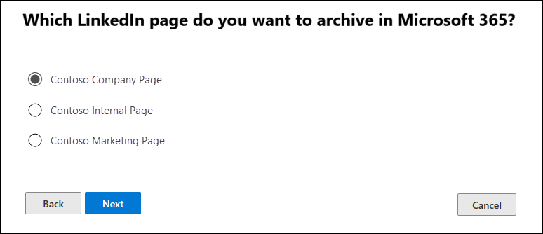

# 设置连接器以存档 LinkedIn 数据

使用 Microsoft 365 合规性中心中的连接器从 LinkedIn 公司页面导入和存档数据。 在设置和配置连接器后，它会每24小时连接到特定 "LinkedIn 公司" 页面的帐户。 连接器将发布到公司页面的邮件转换为电子邮件，然后将这些项目导入到 Microsoft 365 中的邮箱中。

在将 LinkedIn 公司页面数据存储在邮箱中之后，您可以将 Microsoft 365 合规性功能（如诉讼保留、内容搜索、就地存档、审核和 Microsoft 365 保留策略）应用于 LinkedIn 数据。 例如，可以使用内容搜索来搜索这些项目，或将存储邮箱与高级电子数据展示事例中的管理员相关联。 创建连接器以在 Microsoft 365 中导入和存档 LinkedIn 数据可帮助您的组织遵守政府和法规策略。

## 授予同意，分配角色，并验证凭据

- 您的组织必须同意允许 Office 365 导入服务访问组织中的邮箱数据。 若要同意此请求，请转到[此页](https://login.microsoftonline.com/common/oauth2/authorize?client_id=570d0bec-d001-4c4e-985e-3ab17fdc3073&response_type=code&redirect_uri=https://portal.azure.com/&nonce=1234&prompt=admin_consent)，使用 Microsoft 365 全局管理员的凭据登录，然后接受该请求。

- 必须在 Exchange Online 中为创建 LinkedIn 公司页面连接器的用户分配邮箱导入导出角色。 这是在 Microsoft 365 合规性中心的 "**数据连接器**" 页中添加连接器所必需的。 默认情况下，不会向 Exchange Online 中任何角色组分配此角色。 您可以将邮箱导入导出角色添加到 Exchange Online 中的 "组织管理" 角色组。 或者，您可以创建角色组，分配邮箱导入导出角色，然后将相应的用户添加为成员。 有关详细信息，请参阅文章 "管理 Exchange Online 中的角色组" 中的 "[创建角色组](https://docs.microsoft.com/Exchange/permissions-exo/role-groups#create-role-groups)" 或 "[修改角色组](https://docs.microsoft.com/Exchange/permissions-exo/role-groups#modify-role-groups)" 部分。

- 您必须具有作为您要存档的 "LinkedIn 公司" 页面的管理员的 LinkedIn 用户帐户的登录凭据（电子邮件地址或电话号码和密码）。 设置连接器时，可以使用这些凭据登录到 LinkedIn。

## 创建 LinkedIn 连接器

1. 转到 <https://compliance.microsoft.com> ，然后单击 "**数据连接器**  >  **LinkedIn 公司" 页面**。

2. 在 " **LinkedIn 公司页面**产品" 页上，单击 "**添加连接器**"。

3. 在 "**服务条款**" 页上，选择 "**接受**"。

4. 在 "**使用 Linkedin 登录**" 页面上，单击 "**使用 linkedin 登录**"。

   显示 LinkedIn 登录页。

   

5. 在 "LinkedIn 登录" 页面上，输入与要存档的 "公司" 页面相关联的 LinkedIn 帐户的电子邮件地址（或电话号码）和密码，然后单击 "**登录**"。

   将显示一个向导页，其中包含与您登录的帐户关联的所有 LinkedIn 公司页面的列表。 仅可为一个公司页面配置连接器。 如果您的组织具有多个 LinkedIn 公司页面，则必须为每个公司创建一个连接器。

   

6. 选择要存档其项目的公司页面，然后单击 "**下一步**"。

7. 在 "**选择存储位置**" 页上，单击 "" 框中，选择 LinkedIn 项目将导入到其中的 Microsoft 365 邮箱的电子邮件地址，然后单击 "**下一步**"。 项目将导入到此邮箱的 "收件箱" 文件夹中。

8. 在 "**提供管理员同意**" 中，单击 "**提供许可**"，然后按照步骤操作。 您必须是全局管理员，才能同意 Office 365 导入服务以访问组织中的数据。

9. 单击 "**下一步**" 查看连接器设置，然后单击 "**完成**" 以完成连接器设置。

创建连接器后，可以返回到 "**数据连接器**" 页，以查看新连接器的导入过程的进度（如有必要，请选择 "**刷新**" 以更新连接器列表）。 "**状态**" 列中的值为 "**正在等待启动**"。 启动初始导入过程需要长达24小时。 在第一次运行连接器并导入 LinkedIn 项目后，连接器将每24小时运行一次，并导入 "LinkedIn 公司" 页上的 "在前24小时内创建的任何新项目"。

若要查看更多详细信息，请选择 "**数据连接器**" 页上的列表中的连接器以显示弹出页面。 在 "**状态**" 下，显示的日期范围表示创建连接器时选择的年龄筛选器。

## 更多信息

LinkedIn 项将导入到 Microsoft 365 中存储邮箱的 "LinkedIn" 子文件夹中。 它们显示为电子邮件。
