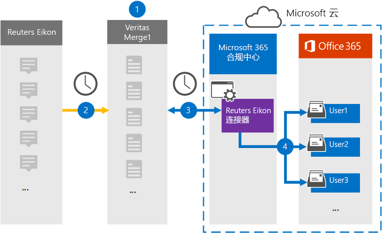

# 设置连接器以存档 Reuters Eikon 数据

使用 Microsoft 365 合规性中心中的 Globanet 连接器将数据从 Reuters Eikon 平台导入并存档到 Microsoft 365 组织中的用户邮箱。 Globanet 提供了 [Reuters Eikon](https://globanet.com/eikon/) 连接器，该连接器配置为定期捕获第三方数据源 (中的项目) 并将这些项目导入到 Microsoft 365。 连接器将用户的 Reuters Eikon 帐户中的内容（如人员到个人邮件、组聊天、附件和免责声明）转换为电子邮件格式，然后将这些项目导入到 Microsoft 365 中的用户邮箱中。

在 Reuters Eikon 数据存储在用户邮箱中之后，可以应用 Microsoft 365 合规性功能，如诉讼保留、电子数据展示、保留策略和保留标签，以及通信合规性。 使用 Reuters Eikon 连接器在 Microsoft 365 中导入和存档数据可帮助您的组织遵守政府和法规策略。

## 存档 Reuters Eikon 数据概述

以下概述说明了使用连接器将 Microsoft 365 中的 Reuters Eikon 数据存档的过程。

1. 您的组织与 Reuters Eikon 协同工作，以设置和配置 Reuters Eikon 网站。

2. 每24小时一次，将 Reuters Eikon 项目复制到 Globanet Merge1 网站。 连接器还将 Reuters Eikon 项目转换为电子邮件格式。

3. 您在 Microsoft 365 合规性中心中创建的 Reuters Eikon 连接器每天连接到 Globanet Merge1 网站，并将内容传输到 Microsoft 云中的安全 Azure 存储位置。

4. 连接器使用自动用户映射的 *电子邮件* 属性的值将项目导入到特定用户的邮箱中，如 [步骤 3](#step-3-map-users-and-complete-the-connector-setup)中所述。 在用户邮箱中创建名为 **Reuters Eikon** 的收件箱文件夹中的子文件夹，然后将这些项目导入该文件夹中。 连接器通过使用 *电子邮件* 属性的值来实现此功能。 每个 Reuters Eikon 项目都包含此属性，该属性填充项目的每个参与者的电子邮件地址。

## 准备工作

- 为 Microsoft 连接器创建 Globanet Merge1 帐户。 若要执行此操作，请联系 [Globanet 客户支持](https://globanet.com/ms-connectors-contact)。 当您在步骤1中创建连接器时，需要登录到此帐户。

- 在第1步中创建 Reuters Eikon 连接器的用户 (并在步骤3中完成) 必须将其分配给 Exchange Online 中的邮箱导入导出角色。 此角色是在 Microsoft 365 合规性中心中的 " **数据连接器** " 页上添加连接器所必需的。 默认情况下，此角色不会分配给 Exchange Online 中的任何角色组。 您可以将邮箱导入导出角色添加到 Exchange Online 中的 "组织管理" 角色组。 或者，您可以创建角色组，分配邮箱导入导出角色，然后将相应的用户添加为成员。 有关详细信息，请参阅文章 "管理 Exchange Online 中的角色组" 中的 " [创建角色组](https://docs.microsoft.com/Exchange/permissions-exo/role-groups#create-role-groups) " 或 " [修改角色组](https://docs.microsoft.com/Exchange/permissions-exo/role-groups#modify-role-groups) " 部分。

## 步骤1：设置 Reuters Eikon 连接器

第一步是访问 Microsoft 365 合规性中心中的 " **数据连接器** " 页，并为 Reuters Eikon 数据创建一个连接器。

1. 转到 [https://compliance.microsoft.com](https://compliance.microsoft.com/) ，然后单击 " **Data 连接器**  >  **Reuters Eikon**"。

2. 在 " **Reuters Eikon** 产品说明" 页上，单击 " **添加连接器**"。

3. 在 " **服务条款** " 页上，单击 " **接受**"。

4. 输入标识连接器的唯一名称，然后单击 " **下一步**"。

5. 登录到您的 Merge1 帐户以配置连接器。

## 步骤2：在 Globanet Merge1 网站上配置 Reuters Eikon 连接器

第二步是在 Merge1 网站上配置 Reuters Eikon 连接器。 有关如何在 Globanet Merge1 网站上配置 Reuters Eikon 连接器的信息，请参阅 [Merge1 第三方连接器用户指南](https://docs.ms.merge1.globanetportal.com/Merge1%20Third-Party%20Connectors%20Reuters%20Eikon%20User%20Guide%20.pdf)。

单击 " **保存" & "完成**" 后，将转回到 Microsoft 365 合规性中心，转到 "连接器向导" 中的 " **用户映射** " 页。

## 步骤3：映射用户并完成连接器设置

若要映射用户并完成 Microsoft 365 合规性中心中的连接器设置，请按照以下步骤操作：

1. 在 "将 **外部用户映射到 Microsoft 365 用户** " 页上，启用自动用户映射。 Reuters Eikon 项目包含一个名为 " *Email*" 的属性，其中包含组织中的用户的电子邮件地址。 如果连接器可以将此地址与 Microsoft 365 用户相关联，则会将这些项目导入该用户的邮箱中。

2. 在 " **管理员同意** " 页面上，单击 " **提供同意** " 按钮。 你将被重定向到 Microsoft 网站。 单击 " **接受** " 以提供许可。

   您的组织必须同意允许 Office 365 导入服务访问组织中的邮箱数据。 若要提供管理员同意，必须使用 Microsoft 365 全局管理员的凭据登录，然后接受同意请求。 如果你未以全局管理员身份登录，则可以转到 [此页](https://login.microsoftonline.com/common/oauth2/authorize?client_id=570d0bec-d001-4c4e-985e-3ab17fdc3073&response_type=code&redirect_uri=https://portal.azure.com/&nonce=1234&prompt=admin_consent) ，并使用全局管理员凭据登录以接受请求。

3. 单击 " **下一步**"，查看设置，然后转到 " **数据连接器** " 页，查看新连接器的导入过程的进度。

## 步骤4：监视 Reuters Eikon 连接器

在创建 Reuters Eikon 连接器之后，可以在 Microsoft 365 合规性中心中查看连接器状态。

1. 转到 [https://compliance.microsoft.com](https://compliance.microsoft.com) 并单击左侧导航中的 " **数据连接器** "。

2. 单击 " **连接器** " 选项卡，然后选择 " **Reuters" Eikon** 连接器以显示弹出页面，其中包含有关连接器的属性和信息。

3. 在 " **连接器状态与源**" 下，单击 " **下载日志** " 链接以打开 " (" 或 "保存") 连接器的状态日志。 此日志包含有关已导入到 Microsoft 云的数据的信息。

## 已知问题

- 目前，我们不支持导入大于 10 MB 的附件或项目。 较大项目的支持将在以后提供。
