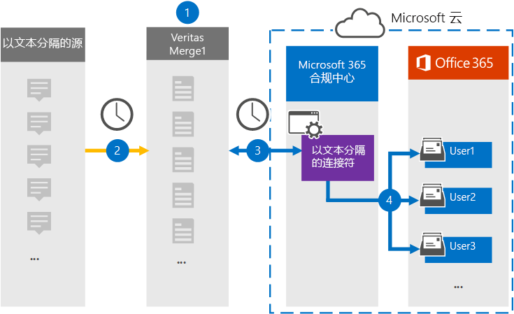

# 设置连接器以存档文本分隔的数据

使用 Microsoft 365 合规中心中的 Globanet 连接器将文本分隔的数据导入并存档到 Microsoft 365 组织的用户邮箱。 Globanet 提供了一个文本分隔连接器，该连接器配置为定期捕获第三方数据源 (中的项目) 将这些项目导入到 Microsoft 365。 连接器将内容从文本分隔的数据源转换为电子邮件格式，然后将这些项目导入到 Microsoft 365 中的用户邮箱。

文本分隔的数据存储在用户邮箱中后，可以应用 Microsoft 365 合规性功能，如诉讼保留、电子数据展示、保留策略和保留标签。 使用文本分隔的数据连接器在 Microsoft 365 中导入和存档数据可帮助组织遵守政府及法规策略。

## 对文本分隔的数据进行存档的概述

以下概述介绍使用连接器在 Microsoft 365 中存档文本分隔源信息的过程。

1. 您的组织使用文本分隔源来设置和配置文本分隔的网站。

2. 每 24 小时一次，来自文本分隔源的聊天消息将复制到 Globanet Merge1 网站。 连接器还会将内容转换为电子邮件格式。

3. 在 Microsoft 365 合规中心内创建的文本分隔连接器每天连接到 Globanet Merge1 网站，将邮件传输至 Microsoft 云中的安全 Azure 存储位置。

4. 连接器使用自动用户映射的 *Email* 属性值将转换后的邮件项目导入特定用户的邮箱，如步骤 3 中所述。 在用户邮箱中创建名为 **"Text- Delimited"** 的"收件箱"文件夹中的新子文件夹，邮件项目将导入到该文件夹中。 连接器使用 Email 属性的值确定将项目导入到哪个 *邮箱* 。 每封邮件都包含此属性，其中填充了每个参与者的电子邮件地址。

## 开始之前

- 为 Microsoft 连接器创建 Globanet Merge1 帐户。 若要创建此帐户，请联系 [Globanet 客户支持](https://globanet.com/ms-connectors-contact)。 在步骤 1 中创建连接器时，将登录到此帐户。

- 必须在步骤 1 中创建文本分隔的连接器 (在步骤 3) 中完成该连接器的用户必须分配至 Exchange Online 中的邮箱导入导出角色。 在 Microsoft 365 合规中心的"数据连接器"页面上添加连接器需要此角色。 默认情况下，此角色不会分配给 Exchange Online 中的角色组。 可以将"邮箱导入导出"角色添加到 Exchange Online 中的"组织管理"角色组。 也可以创建角色组，分配邮箱导入导出角色，然后将相应的用户添加为成员。 有关详细信息，请参阅"在Exchange Online中管理角色组"一文的创建角色组或修改角色组部分。

## 步骤 1：设置文本分隔的连接器

第一步是访问 Microsoft 365 合规中心的"数据连接器"页面，并创建用于文本分隔数据的连接器。 

1. 转到 ， [https://compliance.microsoft.com](https://compliance.microsoft.com/) 然后单击"数据 **连接器** 文本  >  **分隔"。**

2. 在文本 **分隔的产品** 说明页上，单击添加 **连接器**。

3. 在"**服务条款"页上**，单击"接受 **"。**

4. 输入标识连接器的唯一名称，然后单击下一 **步**。

5. 登录到 Merge1 帐户以配置连接器。

## 步骤 2：在 Globanet Merge1 网站上配置文本分隔连接器

第二步是在 Merge1 网站上配置文本分隔的连接器。 有关在 Globanet Merge1 网站上配置文本分隔连接器的信息，请参阅 [Merge1 Third-Party Connectors User Guide](https://docs.ms.merge1.globanetportal.com/Merge1%20Third-Party%20Connectors%20text-delimited%20User%20Guide%20.pdf)。

单击 **"保存&** 完成"后，将显示 Microsoft  365 合规中心中的连接器向导中的"用户映射"页。

## 步骤 3：映射用户并完成连接器设置

若要映射用户并完成 Microsoft 365 合规中心中的连接器设置，请按照以下步骤操作：

1. 在" **将外部用户映射到 Microsoft 365** 用户"页上，启用自动用户映射。 Text- Delimited source items include a property called *Email*， which contains email addresses for users in your organization. 如果连接器可以将此地址与 Microsoft 365 用户关联，则项目将导入该用户的邮箱。

2. 单击 **"下** 一步"，查看设置，然后转到"数据连接器"页以查看新连接器的导入过程的进度。

## 步骤 4：监视文本分隔的连接器

创建文本分隔连接器后，可以在 Microsoft 365 合规中心查看连接器状态。

1. 转到左侧 [https://compliance.microsoft.com](https://compliance.microsoft.com) 导航 **导航中的"数据** 连接器"，然后单击" 数据连接器"。

2. 单击 **"连接器"** 选项卡，然后选择" **文本分隔** 的连接器"以显示飞出页。 此页面包含有关连接器的属性和信息。

3. 在 **"源的连接器状态"** 下， **单击"下载** 日志"链接 (或) 连接器的状态日志。 此日志包含有关已导入到 Microsoft 云的数据的信息。

## 已知问题

- 目前，我们不支持导入大于 10 MB 的附件或项目。 稍后将提供对较大项目的支持。