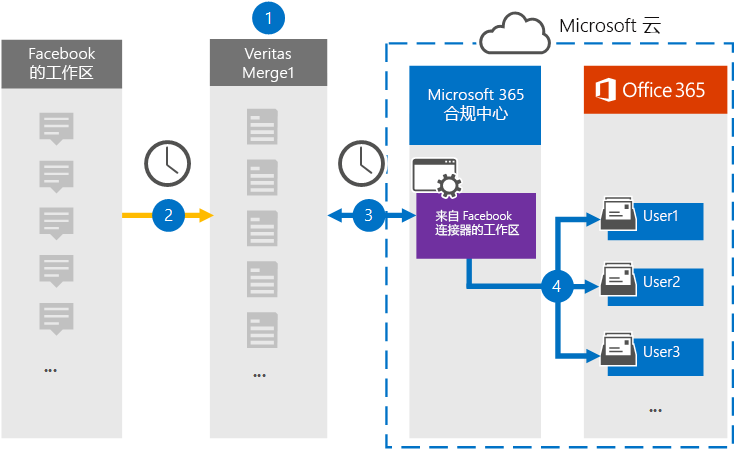

# 设置连接器以从 Facebook 数据存档 Workplace

使用 Microsoft 365 合规中心中的 Globanet 连接器将工作区数据从 Facebook 导入并存档到 Microsoft 365 组织的用户邮箱。 Globanet 提供 [来自 Facebook](https://globanet.com/workplace/) 的 Workplace 连接器，配置为定期捕获第三方数据源 (中的项目) 将这些项目导入到 Microsoft 365。 连接器将工作区中的聊天、附件、帖子和视频等内容转换为电子邮件格式，然后将这些项目导入 Microsoft 365 中的用户邮箱。

在工作区数据存储在用户邮箱中后，可以应用 Microsoft 365 合规性功能，如诉讼保留、电子数据展示、保留策略和保留标签以及通信合规性。 使用来自 Facebook 连接器的 Workplace 在 Microsoft 365 中导入和存档数据可帮助组织遵守政府政策和法规策略。

## 从 Facebook 数据存档工作区概述

以下概述介绍了使用连接器在 Microsoft 365 中存档 Workplace 数据的过程。

1. 你的组织与 Facebook 的 Workplace 合作，以设置和配置工作区网站。

2. 每 24 小时一次，工作区中的项目将复制到 Globanet Merge1 网站。 连接器还将这些项目的内容转换为电子邮件格式。

3. 在 Microsoft 365 合规中心创建的来自 Facebook 连接器的 Workplace 每天连接到 Globanet Merge1，将工作区项目转移到 Microsoft 云中安全的 Azure 存储位置。

4. 连接器使用自动用户映射的 *Email* 属性值将转换的项目导入特定用户的邮箱，如步骤 3 中所述。 从 Facebook 创建名为 **Workplace** 的收件箱文件夹中的子文件夹，工作区项目将导入该文件夹。 连接器通过使用 Email *属性的值来实现* 此操作。 每个 Workplace 项目都包含此属性，此属性填充了每个聊天或帖子参与者的电子邮件地址。

## 开始之前

- 为 Microsoft 连接器创建 Globanet Merge1 帐户。 若要创建此帐户，请联系 [Globanet 客户支持部门](https://globanet.com/ms-connectors-contact)。 在步骤 1 中创建连接器时，将登录到此帐户。

- 创建自定义集成以通过 API 从 Workplace 检索数据，以便实现合规性和 https://my.workplace.com/work/admin/apps/ 电子数据展示目的。

   创建集成时，Workplace 平台会生成一组用于生成用于身份验证的令牌的唯一凭据。 这些令牌在步骤 2 中来自 Facebook 连接器配置向导的 Workplace 中使用。 有关如何创建应用程序的分步说明，请参阅 [Merge1 第三方连接器用户指南](https://docs.ms.merge1.globanetportal.com/Merge1%20Third-Party%20Connectors%20Workplace%20from%20Facebook%20User%20Guide%20.pdf)。

- 在步骤 1 中通过 Facebook 连接器创建工作区 (步骤 3) 必须分配给 Exchange Online 中的邮箱导入导出角色。 在 Microsoft 365 合规中心的"数据连接器"页上添加连接器需要此角色。 默认情况下，此角色不会分配给 Exchange Online 中的角色组。 可以将邮箱导入导出角色添加到 Exchange Online 中的组织管理角色组。 也可以创建一个角色组，分配邮箱导入导出角色，然后将相应的用户添加为成员。 有关详细信息，请参阅"在Exchange Online中管理角色组"一文的"创建角色组或修改角色组"部分。

## 步骤 1：从 Facebook 连接器设置工作区

第一步是访问 Microsoft 365 合规中心中的"数据连接器"页，并创建工作区数据的连接器。 

1. 转到 [https://compliance.microsoft.com](https://compliance.microsoft.com/) Facebook，然后单击"**数据连接器**  >  **工作区"。**

2. 在 **"来自 Facebook 产品说明的工作区**"页上，单击 **"添加连接器"。**

3. 在"**服务条款"页上**，单击"**接受"。**

4. 输入标识连接器的唯一名称，然后单击"下一 **步"。**

5. 登录到 Merge1 帐户以配置连接器。

## 步骤 2：在 Globanet Merge1 网站上通过 Facebook 连接器配置 Workplace

第二步是在 Merge1 网站上通过 Facebook 连接器配置 Workplace。 若要了解如何从 Facebook 连接器配置 Workplace，请参阅 [Merge1 第三方连接器用户指南](https://docs.ms.merge1.globanetportal.com/Merge1%20Third-Party%20Connectors%20Workplace%20from%20Facebook%20User%20Guide%20.pdf)。

单击 **"保存&** 完成"后，将显示 Microsoft  365 合规中心连接器向导中的"用户映射"页。

## 步骤 3：映射用户并完成连接器设置

若要映射用户并完成 Microsoft 365 合规中心中的连接器设置，请按照以下步骤操作：

1. 在 **"将外部用户映射到 Microsoft 365** 用户"页上，启用自动用户映射。 工作区项目包括一个称为 *"电子邮件* "的属性，该属性包含组织中用户的电子邮件地址。 如果连接器可以将此地址与 Microsoft 365 用户关联，则项目将导入该用户的邮箱。

2. 单击 **"** 下一步"，查看设置，然后转到"数据连接器"页以查看新连接器的导入过程的进度。

## 步骤 4：通过 Facebook 连接器监视工作区

通过 Facebook 连接器创建 Workplace 后，可以在 Microsoft 365 合规中心内查看连接器状态。

1. 转到 [https://compliance.microsoft.com](https://compliance.microsoft.com) 左侧导航 **中并** 单击"数据连接器"。

2. 单击 **"连接器"** 选项卡，然后从 **Facebook 连接器中选择工作区** 以显示飞出页面。 此页面包含有关连接器的属性和信息。

3. 在 **"源的** 连接器状态"下，单击"下载日志"链接 (或保存) 连接器的状态日志。 此日志包含有关已导入到 Microsoft 云的数据的信息。

## 已知问题

- 目前，我们不支持导入大于 10 MB 的附件或项目。 稍后将提供对较大项目的支持。
