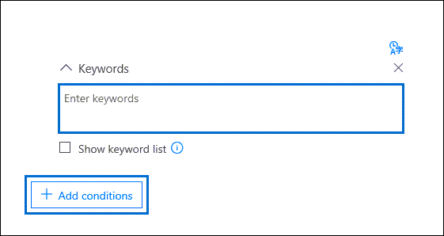

# 为集合生成搜索查询Advanced eDiscoveryBuild search queries for collections in Advanced eDiscovery

在 Advanced eDiscovery 案例创建集合时配置搜索查询时，可以使用关键字查找特定内容和条件，以缩小搜索范围以返回与法律调查最相关的项目。When configuring the search query when creating a [collection](collections-overview.md) in an Advanced eDiscovery case, you can use keywords to find specific content and conditions to narrow the scope of the search to return items that are most relevant to your legal investigation.

## 关键字搜索Keyword searches

在搜索查询的 **"关键字"** 框中键入关键字查询。Type a keyword query in the **Keywords** box in the search query. 您可以指定关键字、电子邮件属性（如发送日期和接收日期）或文档属性（如文件名或上次更改文档的日期）。You can specify keywords, email message properties, such as sent and received dates, or document properties, such as file names or the date that a document was last changed. 可以使用采用布尔运算符的更复杂查询，例如 **AND**、**OR**、**NOT** 和 **NEAR**。You can use more complex queries that use a Boolean operator, such as **AND**, **OR**, **NOT**, and **NEAR**. 您还可以搜索敏感信息 (例如 SharePoint 文档中的社会保险号) 和 OneDrive (不在电子邮件) 中，或者搜索在外部共享的文档。You can also search for sensitive information (such as social security numbers) in documents in SharePoint and OneDrive (not in email messages), or search for documents that have been shared externally. 如果将 **关键字** 框留空，则指定内容位置中的所有内容都将位于搜索结果中。If you leave the **Keywords** box empty, all content located in the specified content locations is in the search results.

## 关键字列表Keyword list

或者，也可以选中"显示关键字 **列表** "复选框，并在每行中键入关键字或关键字短语。Alternatively, you can select the **Show keyword list** check box and the type a keyword or keyword phrase in each row. 每行中的关键字由逻辑运算符 (该逻辑运算符在搜索查询语法) 中表示为 *c：s，* 其功能类似于所创建的搜索查询中的 **OR** 运算符。The keywords in each row are connected by a logical operator (which is represented as *c:s* in the search query syntax) that is similar in functionality to the **OR** operator in the search query that's created. 这意味着任何行中包含任何关键字的项目均在搜索结果中。This means items that contain any keyword in any row are in the search results. 在搜索查询中，关键字列表中最多可以添加 180 Advanced eDiscovery行。You can add up to 180 rows in the keyword list in Advanced eDiscovery search queries.

为什么使用关键字列表？Why use the keyword list? 您可以获取显示关键字列表中每个关键字匹配的项数的统计信息。You can get statistics that show how many items match each keyword in the keyword list. 这可以帮助您快速识别最有效且最 (最) 关键字。This can help you quickly identify the keywords that are the most (and least) effective. 您还可以使用关键字短语 (关键字列表中的一行) 括号。You can also use a keyword phrase (surrounded by parentheses) in a row in the keywords list. 有关搜索统计信息详细信息，请参阅搜索 [统计信息](search-statistics-in-advanced-ediscovery.md)。For more information about search statistics, see [Search statistics](search-statistics-in-advanced-ediscovery.md).

## 条件Conditions

您可以添加搜索条件来缩小搜索范围并返回更精确的结果集。You can add search conditions to narrow the scope of a search and return a more refined set of results. 每个条件向开始搜索时创建和运行的搜索查询添加一个子句。Each condition adds a clause to the search query that is created and run when you start the search. 条件在逻辑上由逻辑运算符 (在搜索查询语法) 中表示为 *c：c，* 在功能上与 **AND** 运算符类似。在逻辑上，条件与关键字框中指定的关键字查询相连。A condition is logically connected to the keyword query specified in the keyword box by a logical operator (which is represented as *c:c* in the search query syntax) that is similar in functionality to the **AND** operator. 这意味着项目必须满足关键字查询和要包括在搜索结果中的一个或多个条件。That means items have to satisfy both the keyword query and one or more conditions to be included in the search results. 这就是条件如何帮助缩小结果范围的原理。This is how conditions help to narrow your results. 有关可在搜索查询中使用的条件的列表和说明，请参阅关键字查询和搜索条件 中的" [搜索条件"部分](keyword-queries-and-search-conditions.md#search-conditions)。For a list and description of conditions that you can use in a search query, see the "Search conditions" section in [Keyword queries and search conditions](keyword-queries-and-search-conditions.md#search-conditions).
