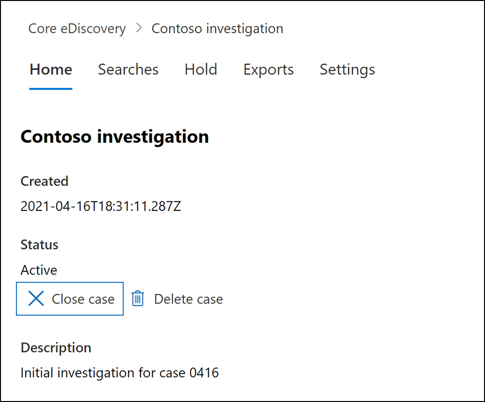

# 关闭、重新打开和删除核心电子数据展示案例

本文介绍如何关闭、重新打开和删除 Microsoft 365 中的核心电子数据展示事例。

## 关闭案例

完成核心电子数据展示案例支持的法律案件或调查后，可以关闭该案例。 下面是关闭案例时发生的情况：
  
- 如果案件集包含任何电子数据展示保留，将关闭它们。 关闭保留后，称为延迟保留 (30 天的宽限期) 将应用于已保留的内容位置。 这有助于防止立即删除内容，并且使管理员有机会在延迟保留期到期后永久删除内容之前搜索和还原内容。 有关详细信息，请参阅从电子数据展示保留 [中删除内容位置](create-ediscovery-holds.md#removing-content-locations-from-an-ediscovery-hold)。

- 关闭案例仅关闭与该案例相关联的保留。 如果其他保留设置在内容位置上 (如诉讼保留、保留策略或不同核心电子数据展示案例的保留) 仍将保留这些保留。

- 该案例仍在安全与合规中心的"核心电子数据展示"Microsoft 365列出。 将保留已关闭案例的详细信息、保留、搜索和成员。

- 可以在案例关闭后对其进行编辑。 例如，可以添加或删除成员、创建搜索和导出搜索结果。 活动案例和已关闭事例之间的主要区别在于关闭事例时关闭电子数据展示保留。

关闭案件：
  
1. 在Microsoft 365中心，单击 **"电子数据** 展示  >  **核心**"以显示组织中核心电子数据展示事例的列表。

2. 单击要关闭的案例的名称。

   

3. 在主页上的"状态"**下**，单击"**关闭大小写"。**

    将显示一条警告，指出将关闭与案例关联的保留。

4. 单击 **"是** "关闭案例。

    案例主页上的状态从"活动 **"更改为"****关闭"。**

5. 在" **核心电子数据展示"** 页上，单击 **"刷新** "以更新已关闭案例的状态。 完成结束过程可能需要多达 60 分钟。

    该过程完成后，在核心电子数据展示页面上将案例的状态更改为"已关闭 **"。**

## 重新打开已关闭的案例

重新打开案例时，关闭案例时已就位的任何电子数据展示保留不会自动恢复。 重新打开案例后，你必须转到保留页并打开以前的保留。  要打开保留，请选择它以显示弹出页面，然后将 **状态** 开关设置为 **“开”**。
  
1. 在Microsoft 365中心，单击 **"电子数据** 展示  >  **核心**"以显示组织中核心电子数据展示事例的列表。

2. 单击要重新打开的案例的名称。

   

3. 在主页上的"状态"**下**，单击"**重新打开案例"。**

    将显示一条警告，指出关闭案例时与案例关联的保留不会自动打开。

4. 单击 **"是** "重新打开该案例。

    案例主页飞出页面上的状态从 **"已关闭"** 更改为"**活动"。**

5. 在" **核心电子数据展示"** 页上，单击" **刷新** "以更新重新打开案例的状态。 可能需要 60 分钟才能完成重新打开过程。 

    该过程完成后，在核心电子数据展示页面上将案例的状态更改为"活动 **"。**

6.  (可选) 若要启用与重新打开的案例关联的任何保留项，请转到保留选项卡，选择保留，然后选择保留项飞出页面上的"状态"下的复选框。 
  
## 删除案例

还可以删除主动和已关闭的核心电子数据展示事例。 删除事例时，将删除事例的所有搜索和导出，并且从事例合规中心中"核心电子数据展示"页上的事例Microsoft 365事例列表。 不能重新打开已删除的大小写。

必须先删除与 (相关联的所有电子数据展示保留) ，然后才能删除案例。  这包括删除状态为"关"的 **保留**。 

若要删除电子数据展示保留，请：

1. 转到要 **删除** 的保留项选项卡。

2. 选择要删除的保留。

3. 在飞出页面上， **单击删除**。

      

删除案件：

1. 在Microsoft 365中心，单击 **"电子数据** 展示  >  **核心**"以显示组织中核心电子数据展示事例的列表。

2. 单击要删除的案例的名称。

3. 在案例主页上的"状态"**下**，单击"**删除大小写"。**

      

如果你尝试删除的案例仍包含电子数据展示保留，你将收到错误消息。 您必须删除与案例关联的所有保留，然后重试以删除该案例。
