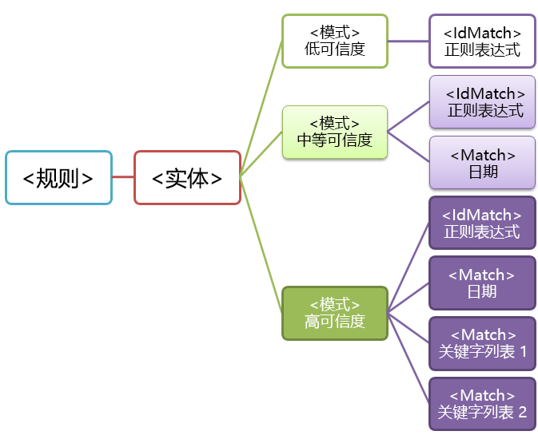
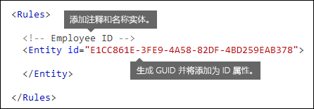
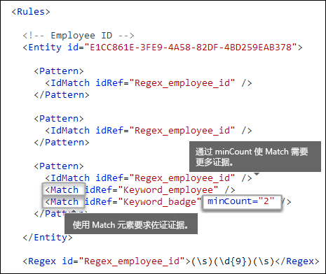
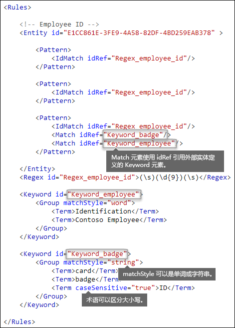
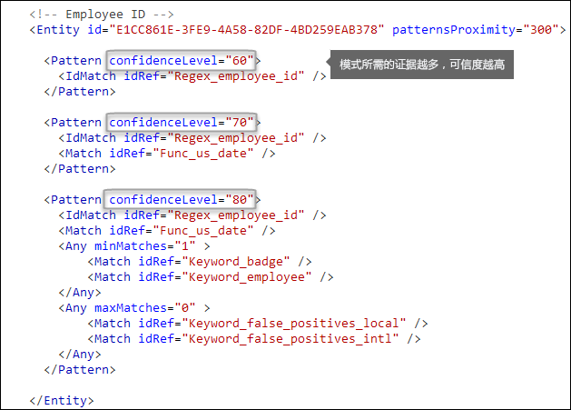
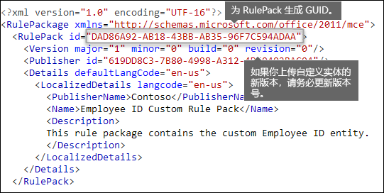

# <a name="create-a-custom-sensitive-information-type-using-powershell"></a>使用 PowerShell 创建自定义敏感信息类型

本主题介绍如何使用 PowerShell 创建定义自己的自定义 [敏感信息类型](sensitive-information-type-entity-definitions.md)的 XML *规则包* 文件。 需要了解如何创建正则表达式。 为提供示例，本主题创建识别员工 ID 的自定义敏感信息类型。 可以此示例 XML 为起点，创建自己的 XML 文件。 如果不熟悉敏感信息类型，请参阅[了解敏感信息类型](sensitive-information-type-learn-about.md)。

创建正常可用的 XML 文件后，可使用 Microsoft 365 PowerShell 将其上传到 Microsoft 365。 然后便可在策略中使用自定义敏感信息类型，测试其是否能按需检测敏感信息。

> [!NOTE]
> 如果不需要 PowerShell 提供的细化控制，可以在合规中心中创建自定义敏感信息类型。 有关详细信息，请参阅[创建自定义敏感信息类型](create-a-custom-sensitive-information-type.md)。

## <a name="important-disclaimer"></a>重要免责声明

由于客户环境和内容匹配要求的多样性，Microsoft 支持部门无法帮助提供自定义内容匹配定义（例如，定义自定义分类或正则表达式（也称为“RegEx”）模式）。对于自定义内容匹配的开发、测试和调试，Microsoft 365 客户将需要依赖于内部 IT 资源，或使用 Microsoft 咨询服务 (MCS) 等外部咨询资源。支持工程师可提供针对该功能的有限支持，但无法保证任何自定义内容匹配开发都能满足客户的要求或义务。作为可提供的支持类型的示例，可以提供示例正则表达式模式以供测试使用。或者，支持人员可以帮助对现有 RegEx 模式（单个特定内容示例未按预期触发）进行故障排除。

请参阅本主题中的[要注意的潜在验证问题](#potential-validation-issues-to-be-aware-of)。

有关用于处理文本的 Boost.RegEx（以前称为 RegEx++）引擎的详细信息，请参阅 [Boost.Regex 5.1.3](https://www.boost.org/doc/libs/1_68_0/libs/regex/doc/html/)。

## <a name="sample-xml-of-a-rule-package"></a>规则包 XML 示例

下面就是本主题将创建的规则包 XML 示例。下面各部分介绍了元素和特性。
  
```xml
<?xml version="1.0" encoding="UTF-16"?>
<RulePackage xmlns="http://schemas.microsoft.com/office/2011/mce">
<RulePack id="DAD86A92-AB18-43BB-AB35-96F7C594ADAA">
    <Version build="0" major="1" minor="0" revision="0"/>
    <Publisher id="619DD8C3-7B80-4998-A312-4DF0402BAC04"/>
    <Details defaultLangCode="en-us">
        <LocalizedDetails langcode="en-us">
            <PublisherName>Contoso</PublisherName>
            <Name>Employee ID Custom Rule Pack</Name>
            <Description>
            This rule package contains the custom Employee ID entity.
            </Description>
        </LocalizedDetails>
    </Details>
</RulePack>
<Rules>
<!-- Employee ID -->
    <Entity id="E1CC861E-3FE9-4A58-82DF-4BD259EAB378" patternsProximity="300" recommendedConfidence="70">
        <Pattern confidenceLevel="60">
            <IdMatch idRef="Regex_employee_id"/>
        </Pattern>
        <Pattern confidenceLevel="70">
            <IdMatch idRef="Regex_employee_id"/>
            <Match idRef="Func_us_date"/>
        </Pattern>
        <Pattern confidenceLevel="80">
            <IdMatch idRef="Regex_employee_id"/>
            <Match idRef="Func_us_date"/>
            <Any minMatches="1">
                <Match idRef="Keyword_badge" minCount="2"/>
                <Match idRef="Keyword_employee"/>
            </Any>
            <Any minMatches="0" maxMatches="0">
                <Match idRef="Keyword_false_positives_local"/>
                <Match idRef="Keyword_false_positives_intl"/>
            </Any>
        </Pattern>
    </Entity>
    <Regex id="Regex_employee_id">(\s)(\d{9})(\s)</Regex>
    <Keyword id="Keyword_employee">
        <Group matchStyle="word">
            <Term>Identification</Term>
            <Term>Contoso Employee</Term>
        </Group>
    </Keyword>
    <Keyword id="Keyword_badge">
        <Group matchStyle="string">
            <Term>card</Term>
            <Term>badge</Term>
            <Term caseSensitive="true">ID</Term>
        </Group>
    </Keyword>
    <Keyword id="Keyword_false_positives_local">
        <Group matchStyle="word">
            <Term>credit card</Term>
            <Term>national ID</Term>
        </Group>
    </Keyword>
    <Keyword id="Keyword_false_positives_intl">
        <Group matchStyle="word">
            <Term>identity card</Term>
            <Term>national ID</Term>
            <Term>EU debit card</Term>
        </Group>
    </Keyword>
    <LocalizedStrings>
        <Resource idRef="E1CC861E-3FE9-4A58-82DF-4BD259EAB378">
            <Name default="true" langcode="en-us">Employee ID</Name>
            <Description default="true" langcode="en-us">
            A custom classification for detecting Employee IDs.
            </Description>
            <Description default="false" langcode="de-de">
            Description for German locale.
            </Description>
        </Resource>
    </LocalizedStrings>
</Rules>
</RulePackage>
```

## <a name="what-are-your-key-requirements-rule-entity-pattern-elements"></a>关键要求是什么？[Rule、Entity、Pattern 元素]

开始前，有必要了解规则 XML 架构的基本结构，以及如何使用这种结构来定义用于标识适当内容的自定义敏感信息类型。
  
一个规则定义一个或多个实体（敏感信息类型），且每个实体定义一个或多个模式。 模式是原则在评估电子邮件和文档等内容时查找的对象。

在本主题中，XML 标记使用规则来表示定义实体的模式，该实体也称为敏感信息类型。 所以在本主题中，出现规则时，请将其视为实体或敏感信息类型，而非条件和操作。
  
### <a name="simplest-scenario-entity-with-one-pattern"></a>最简单方案：包含一个模式的实体

下面是最简单的方案。 希望策略识别包含组织员工 ID 的内容，该 ID 由九位数字组成。 此时，模式是指规则中包含的可识别九位数字的正则表达式。 包含九位数字的任何内容都满足该模式。
  

  
虽然简单，但此模式可能会标识许多误报内容，因为包含任何九位数的匹配内容不一定是员工 ID。
  
### <a name="more-common-scenario-entity-with-multiple-patterns"></a>更常见方案：包含多个模式的实体

因此，更常见的做法是使用多个模式定义实体。这样，除了实体（如九位数）外，这些模式还可标识证据（如关键字或日期）。
  
例如，若要更有胜算地标识包含员工 ID 的内容，除了九位数外，还可以定义另一种模式来标识聘用日期，并再定义一种模式来标识聘用日期和关键字（如“员工 ID”）。
  

  
对于此结构，请务必注意以下几点：
  
- 需要更多证据的模式具有更高的可信度级别。 这一点十分有用，因为稍后在策略中使用此敏感信息类型时，可仅通过较高可信度级别的匹配来使用限制性更高的操作（如阻止内容）；通过较低可信度级别的匹配来使用限制性较低的操作（如发送通知）。

- 支持元素 IdMatch 和 Match 引用的正则表达式和关键字实际上是 Rule 元素（而不是 Pattern 元素）的子级。这些支持元素是由 Pattern 引用，但包含在 Rule 中。也就是说，单个定义的支持元素（如正则表达式或关键字列表）可被多个实体和模式引用。

## <a name="what-entity-do-you-need-to-identify-entity-element-id-attribute"></a>需要标识什么实体？[Entity 元素，id 特性]

实体是包含明确定义的模式的敏感信息类型，如信用卡号。每个实体都有一个唯一 GUID 作为自己的 ID。
  
### <a name="name-the-entity-and-generate-its-guid"></a>命名实体并生成 GUID

1. 在选择的 XML 编辑器中，添加规则和实体元素。
2. 添加一个包含自定义实体名称的注释 - 在本示例中实体为员工 ID。 稍后将实体名称添加到本地化的字符串部分，创建策略时，会在 UI 中显示该名称。
3. 生成实体的 GUID。 有几种方法可生成 GUID，可在 PowerShell 中通过键入 **[guid]::NewGuid()** 轻松生成。 稍后还要将实体 GUID 添加到本地化的字符串部分。
  

  
## <a name="what-pattern-do-you-want-to-match-pattern-element-idmatch-element-regex-element"></a>要匹配什么模式？[Pattern 元素、IdMatch 元素、Regex 元素]

模式包含敏感信息类型要查找的内容列表。其中可能包括正则表达式、关键字和内置函数（用于执行任务，如运行正则表达式以查找日期或地址）。敏感信息类型可包含多个具有唯一可信度的模式。
  
以下所有模式的共同点是，全都引用同一个正则表达式，以查找两边是空格 (\s) ... (\s) 的九位数 (\d{9})。此正则表达式由 IdMatch 元素引用，同时也是所有查找“员工 ID”实体的模式的通用要求。IdMatch 是模式尝试匹配的标识符，如员工 ID、信用卡号或身份证号。每个 Pattern 元素只能有一个 IdMatch 元素。
  

  
在满足条件的情况下，模式返回一个计数和可信度级别，可用于策略中的条件。 将检测敏感信息类型的条件添加到策略时，可编辑计数和可信度级别，如以下所示。 本主题稍后会介绍可信度级别（也称为匹配准确度）。
  

  
创建正则表达式时，请注意一些潜在问题。例如，如果编写并上传的正则表达式标识过多内容，这可能会影响性能。若要详细了解这些潜在问题，请参阅后面的[要注意的潜在验证问题](#potential-validation-issues-to-be-aware-of)部分。
  
## <a name="do-you-want-to-require-additional-evidence-match-element-mincount-attribute"></a>是否需要其他证据？[Match 元素、minCount 特性]

除了 IdMatch 外，模式还可以使用 Match 元素来要求发现其他证据，如关键字、正则表达式、日期或地址。
  
一个 Pattern 可包含多个 Match 元素；可以直接将 Match 元素添加到 Pattern 元素中，也可以使用 Any 元素合并 Match 元素。Match 元素通过隐式 AND 运算符进行联接；必须符合所有 Match 元素，才算与模式匹配。可使用 Any 元素引入 AND 或 OR 运算符（有关详细信息，请参阅后面的部分）。
  
可选的 minCount 特性可用于指定，必须为每个 Match 元素找到多少个匹配实例。例如，可指定至少必须找到关键字列表中的两个关键字时，才算符合模式。
  

  
### <a name="keywords-keyword-group-and-term-elements-matchstyle-and-casesensitive-attributes"></a>关键字 [Keyword、Group 和 Term 元素，matchStyle 和 caseSensitive 特性]

通常建议在标识敏感信息（如员工 ID）时，要求将关键字用作确证性证据。例如，除了匹配九位数外，还建议查找“卡”、“徽章”或“ID”等字词。为此，请使用 Keyword 元素。Keyword 元素有 id 特性，可供多个模式或实体中的多个 Match 元素引用。
  
关键字以 Term 元素列表的形式包含在 Group 元素中。Group 元素包含有以下两个可取值的 matchStyle 特性：
  
- **matchStyle="word"**：标识两边是空格或其他分隔符的整个字词的字词匹配。应始终使用 word，除非需要匹配部分字词或亚洲语言字词。 
    
- **matchStyle="string"**：标识无论两边是什么的字符串的字符串匹配。例如，“id”匹配“bid”和“idea”。仅在需要匹配亚洲语言字词或关键字可能是其他字符串的一部分时，才使用 string。 
    
最后，可使用 Term 元素的 caseSensitive 特性，以指定内容必须与关键字完全匹配，包括字母大小写。
  

  
### <a name="regular-expressions-regex-element"></a>正则表达式 [Regex 元素]

在本示例中，“员工 ID”实体已使用 IdMatch 元素为模式引用正则表达式，以标识两边是空格的九位数。此外，模式还可使用 Match 元素来引用其他 Regex 元素，以标识确证性证据，如采用美国邮政编码格式的五位数或九位数。
  
### <a name="additional-patterns-such-as-dates-or-addresses-built-in-functions"></a>日期或地址等其他模式 [内置函数]

除内置的敏感信息类型外，敏感信息类型还可使用内置函数，可识别美国日期、欧洲日期、到期日或美国地址等补强证据。 Microsoft 365 不支持上传自己的自定义函数，但创建自定义敏感信息类型时，实体可引用内置函数。
  
例如，由于员工 ID 徽章中有聘用日期，因此这个自定义实体可使用内置函数 `Func_us_date` 标识采用美国通用格式的日期。 
  
有关详细信息，请参阅 [DLP 函数查找什么](what-the-dlp-functions-look-for.md)。
  

  
## <a name="different-combinations-of-evidence-any-element-minmatches-and-maxmatches-attributes"></a>不同证据组合 [Any 元素、minMatches 和 maxMatches 特性]

在 Pattern 元素中，所有 IdMatch 和 Match 元素都是通过隐式 AND 运算符进行联接。也就是说，必须符合所有 IdMatch 和 Match 元素，才算符合模式。不过，可使用 Any 元素对 Match 元素进行分组，从而创建更灵活的匹配逻辑。例如，可使用 Any 元素匹配所有或确切的一部分 Match 子元素，或不匹配任何 Match 子元素。
  
Any 元素有可选的 minMatches 和 maxMatches 特性，可用于定义必须符合多少个 Match 子元素才算与模式匹配。请注意，这些特性定义的是必须符合的 Match 元素数量，而不是为与模式匹配而找到的证据实例数。若要定义为特定匹配找到的最小实例数（如列表中的两个关键字），请使用 Match 元素的 minCount 特性（见上文）。
  
### <a name="match-at-least-one-child-match-element"></a>至少匹配一个 Match 子元素

若要规定至少必须符合多少个 Match 元素，可使用 minMatches 特性。实际上，这些 Match 元素是通过隐式 OR 运算符进行联接。如果从任一列表中找到美国格式日期或关键字，就符合以下 Any 元素。

```xml
<Any minMatches="1" >
     <Match idRef="Func_us_date" />
     <Match idRef="Keyword_employee" />
     <Match idRef="Keyword_badge" />
</Any>
```
    
### <a name="match-an-exact-subset-of-any-children-match-elements"></a>匹配确切的一部分 Match 子元素

若要规定必须符合确切数量的 Match 元素，可以将 minMatches 和 maxMatches 设置为相同值。仅当找到确切的一个日期或关键字时，才符合以下 Any 元素。如果找到多个，便与模式不匹配。

```xml
<Any minMatches="1" maxMatches="1" >
     <Match idRef="Func_us_date" />
     <Match idRef="Keyword_employee" />
     <Match idRef="Keyword_badge" />
</Any>
```
  
### <a name="match-none-of-children-match-elements"></a>与任何 Match 子元素都不匹配

若要规定只要缺少某证据才算符合模式，可以将 minMatches 和 maxMatches 同时设置为 0。如果关键字列表或其他证据可能发出误报，这样做就很有用。
  
例如，“员工 ID”实体查找关键字“卡”，因为这可能会指代“ID 卡”。不过，如果“卡”仅出现在短语“信用卡”中，此内容中的“卡”就不太可能表示“ID 卡”。因此，可以将“信用卡”作为关键字，添加到匹配模式时要排除的术语列表。
  
```xml
<Any minMatches="0" maxMatches="0" >
    <Match idRef="Keyword_false_positives_local" />
    <Match idRef="Keyword_false_positives_intl" />
</Any>
```

### <a name="match-a-number-of-unique-terms"></a>匹配多个唯一术语

如果要匹配多个唯一术语，请使用 *uniqueResults* 参数，将其设置为 *true*，如下例所示：

```xml
<Pattern confidenceLevel="75">
    <IdMatch idRef="Salary_Revision_terms" />
    <Match idRef=" Salary_Revision_ID " minCount="3" uniqueResults="true" />
</Pattern>
```

在此示例中，使用至少三个唯一匹配为薪资修订定义模式。 
  
## <a name="how-close-to-the-entity-must-the-other-evidence-be-patternsproximity-attribute"></a>另一证据必须与实体有多接近？[patternsProximity 特性]

敏感信息类型要查找表示员工 ID 的模式，此模式还查找确证性证据，如“ID”等关键字。很明显，此证据越接近，模式就越有可能是实际员工 ID。可使用 Entity 元素的必需特性 patternsProximity，确定模式中的另一证据必须与实体有多接近。
  

  
对于实体中的每种模式，patternsProximity 特性值都定义针对相应模式指定的其他所有 Match 与 IdMatch 位置的距离（以 Unicode 字符数为单位）。接近度窗口以 IdMatch 位置为关键主体，向 IdMatch 左右延伸。
  

  
下面的示例展示了接近度窗口如何影响模式匹配，其中“员工 ID”自定义实体的 IdMatch 元素要求至少必须有一个关键字或日期确证性匹配。仅 ID1 匹配，因为对于 ID2 和 ID3，在接近度窗口中找不到任何确证性证据或只找到部分确证性证据。
  

  
请注意，对于电子邮件，邮件正文和每个附件均被视为独立项。也就是说，接近度窗口不会超越各项末端。对于每一项（附件或正文），idMatch 和确证性证据都必须驻留在相应项中。
  
## <a name="what-are-the-right-confidence-levels-for-different-patterns-confidencelevel-attribute-recommendedconfidence-attribute"></a>什么是各个模式的合适可信度？[confidenceLevel 特性、recommendedConfidence 特性]

模式需要的证据越多，模式匹配时所标识的实际实体（如员工 ID）的可信度就越高。例如，与只要求匹配九位数 ID 的模式相比，要求匹配九位数 ID、聘用日期和关键字（极为接近）的模式的可信度更高。
  
Pattern 元素具有必需的 confidenceLevel 属性。 可将 confidenceLevel（1 到 100 间的整数）的值视为实体中每个模式的唯一 ID - 实体中的模式必须具有不同的可信度级别。 整数的具体值无关紧要 - 只需选取对符合性团队有意义的数字即可。 上传自定义敏感信息类型并创建策略后，可在创建的规则的条件中引用这些可信度级别。
  

  
除每个模式的 confidenceLevel 外，Entity 还有一个 recommendedConfidence 属性。 可将推荐的可信度属性视为规则的默认可信度级别。 在策略中创建规则时，如果不指定规则要使用的可信度级别，则该规则将基于推荐的实体可信度级别进行匹配。 请注意，规则包中的每个实体 ID 都必须使用 recommendedConfidence 属性，如果该属性缺失，将无法保存使用敏感信息类型的策略。 
  
## <a name="do-you-want-to-support-other-languages-in-the-ui-of-the-compliance-center-localizedstrings-element"></a>是否要在合规中心的 UI 中支持其他语言？ [LocalizedStrings 元素]

如果符合性团队使用 Microsoft 365 合规中心在不同区域设置和不同语言环境中创建策略，则可提供本地化版本的自定义敏感信息类型的名称和描述。 若符合性团队使用支持语言的 Microsoft 365，则 UI 中会出现本地化的名称。
  

  
Rule 元素必须包含 LocalizedStrings 元素，因为其中包含引用自定义实体 GUID 的 Resource 元素。相应地，每个 Resource 元素都包含一个或多个 Name 和 Description 元素，这些元素使用 langcode 特性来提供特定语言的本地化字符串。
  

  
请注意，本地化字符串只能用于决定自定义敏感信息类型在合规中心的 UI 中的显示方式。 不能使用本地化字符串来提供不同版本的本地化关键字列表或正则表达式。
  
## <a name="other-rule-package-markup-rulepack-guid"></a>其他规则包标记 [RulePack GUID]

最后，每个 RulePackage 的开头都有一些需要填写的常规信息。可以下面的标记为模板，将“...”占位符替换为你自己的信息。
  
最重要的是，必须为 RulePack 生成 GUID。在上文中，已为实体生成了 GUID；这是 RulePack 的第二个 GUID。虽然生成 GUID 的方法有很多，但可通过在 PowerShell 中键入 [guid]::NewGuid() 轻松完成。
  
Version 元素也很重要。当你首次上传规则包时，Microsoft 365 会记录版本号。稍后，如果更新规则包并上传新版本，请务必更新版本号，否则 Microsoft 365 便不会部署规则包。
  
```xml
<?xml version="1.0" encoding="utf-16"?>
<RulePackage xmlns="http://schemas.microsoft.com/office/2011/mce">
  <RulePack id=". . .">
    <Version major="1" minor="0" build="0" revision="0" />
    <Publisher id=". . ." /> 
    <Details defaultLangCode=". . .">
      <LocalizedDetails langcode=" . . . ">
         <PublisherName>. . .</PublisherName>
         <Name>. . .</Name>
         <Description>. . .</Description>
      </LocalizedDetails>
    </Details>
  </RulePack>
  
 <Rules>
    . . .
 </Rules>
</RulePackage>

```

完成后，RulePack 元素应如下所示。
  

  
## <a name="changes-for-exchange-online"></a>针对 Exchange Online 的变化

以前，你可能已使用过 Exchange Online PowerShell 为 DLP 导入自定义敏感信息类型。 现在，可以自定义可用于 Exchange 管理中心中和合规中心的敏感信息类型。 此次改进后，应使用合规中心 PowerShell 导入自定义敏感信息类型，不再可从 Exchange PowerShell 导入它们。 自定义敏感信息类型将像往常一样正常工作，但是，在合规中心进行的更改可能需要至多一小时才会出现在 Exchange 管理中心。
  
请注意，在合规中心中，可以使用 **[New-DlpSensitiveInformationTypeRulePackage](https://docs.microsoft.com/powershell/module/exchange/new-dlpsensitiveinformationtyperulepackage)** cmdlet 上载规则包。 （以前，在 Exchange 管理中心中，使用的是 **ClassificationRuleCollection**`cmdlet。） 
  
## <a name="upload-your-rule-package"></a>上传规则包


若要上传规则包，请按照以下步骤操作：
  
1. 将文件另存为采用 Unicode 编码的 .xml 文件。
    
2. [连接到合规中心 PowerShell](https://go.microsoft.com/fwlink/p/?LinkID=799771)
    
3. 使用以下语法：

   ```powershell
   New-DlpSensitiveInformationTypeRulePackage -FileData (Get-Content -Path "PathToUnicodeXMLFile" -Encoding Byte -ReadCount 0)
   ```

   本示例从 C:\My Documents 上传名为 MyNewRulePack.xml 的 Unicode XML 文件。

   ```powershell
   New-DlpSensitiveInformationTypeRulePackage -FileData (Get-Content -Path "C:\My Documents\MyNewRulePack.xml" -Encoding Byte -ReadCount 0)
   ```

   有关语法和参数的详细信息，请参阅 [New-DlpSensitiveInformationTypeRulePackage](https://docs.microsoft.com/powershell/module/exchange/new-dlpsensitiveinformationtyperulepackage)。

   > [!NOTE]
   > 自定义敏感信息类型集合的限制是 10。

4. 若要验证是否已成功新建敏感信息类型，请按以下任一步骤操作：

   - 运行 [Get-DlpSensitiveInformationTypeRulePackage](https://docs.microsoft.com/powershell/module/exchange/get-dlpsensitiveinformationtyperulepackage) cmdlet，验证新规则包是否已列出：

     ```powershell
     Get-DlpSensitiveInformationTypeRulePackage
     ``` 

   - Run the [Get-DlpSensitiveInformationType](https://docs.microsoft.com/powershell/module/exchange/get-dlpsensitiveinformationtype)，验证敏感信息类型是否已列出：

     ```powershell
     Get-DlpSensitiveInformationType
     ``` 

     对于自定义敏感信息类型，Publisher 属性值将不是 Microsoft Corporation。

   - 将 \<Name\> 替换为敏感信息类型的 Name 值（例如，员工 ID），然后运行 [Get-DlpSensitiveInformationType](https://docs.microsoft.com/powershell/module/exchange/get-dlpsensitiveinformationtype) cmdlet：

     ```powershell
     Get-DlpSensitiveInformationType -Identity "<Name>"
     ```
    
## <a name="potential-validation-issues-to-be-aware-of"></a>要注意的潜在验证问题

当你上传规则包 XML 文件时，系统会验证 XML，并检查是否有已知的错误模式和明显的性能问题。验证检查正则表达式时，需要检查其中是否有下面的一些已知问题：
  
- 不得以匹配所有项的交替符“|”开头或结尾，因为这被视为空匹配。
    
  例如，“|a”或“b|”无法通过验证。
    
- 不得以“{0,m}”模式开头或结尾，它不具备功能性，只会削弱性能。
    
  例如，“.{0,50}ASDF”或“ASDF.{0,50}”无法通过验证。
    
- 组中既不得有“.{0,m}”或“.{1,m}”，也不得有“.\*”或“.+”。
    
  例如，“(.{0,50000})”无法通过验证。
    
- 组中不得有任何字符包含“{0,m}”或“{1,m}”重复符。
    
  例如，“(a\*)”无法通过验证。
    
- 不得以“.{1,m}”开头或结尾；请改用“.”
    
  例如，“.{1,m}asdf”无法通过验证；请改用“.asdf”。
    
- 组中不得有无限重复符（如“\*”或“+”）。
    
  例如，“(xx)\*”和“(xx)+”无法通过验证。
    
如果自定义敏感信息类型存在可能会影响性能的问题，便无法上传，且可能会导致以下错误消息之一出现：
  
- **泛型限定符匹配的内容量超过预期(例如，“+”、“\*”)**
    
- **环视断言**
    
- **与常规限定符一同使用的分组复杂**
    
## <a name="recrawl-your-content-to-identify-the-sensitive-information"></a>对内容重新爬网以标识敏感信息

Microsoft 365 使用搜索爬取器识别网站内容中的敏感信息并进行分类。 SharePoint Online 和 OneDrive for Business 网站中的内容更新时会自动重新爬取内容。 但若要确定所有现有内容中的新自定义类型的敏感信息，必须重新爬取该内容。
  
在 Microsoft 365 中，无法手动请求对整个租户进行重新爬网，但可以对网站集、列表或库这样做。请参阅[手动请求对网站、库或列表进行爬网和重新编制索引](https://docs.microsoft.com/sharepoint/crawl-site-content)。
  
## <a name="remove-a-custom-sensitive-information-type"></a>删除自定义敏感信息类型

> [!NOTE]
> 删除自定义敏感信息类型前，请先验证没有 DLP 策略或 Exchange 邮件流规则（亦称为“传输规则”）仍在引用此敏感信息类型。

在合规中心 PowerShell 中，有两种方法可以删除自定义敏感信息类型：

- 删除各个自定义敏感信息类型：使用[修改自定义敏感信息类型](#modify-a-custom-sensitive-information-type)中介绍的方法。导出包含自定义敏感信息类型的自定义规则包，从 XML 文件中删除敏感信息类型，然后将更新的 XML 文件导回现有的自定义规则包。

- 删除自定义规则包及其包含的所有自定义敏感信息类型：本部分介绍了此方法。

1. [连接到合规中心 PowerShell](https://go.microsoft.com/fwlink/p/?LinkID=799771)

2. 若要删除自定义规则包，请使用 [Remove-DlpSensitiveInformationTypeRulePackage](https://docs.microsoft.com/powershell/module/exchange/remove-dlpsensitiveinformationtyperulepackage) cmdlet：

   ```powershell
   Remove-DlpSensitiveInformationTypeRulePackage -Identity "RulePackageIdentity"
   ```

   可使用 Name 值（适用于任何语言）或 `RulePack id` (GUID) 值来标识规则包。

   本示例删除名为“Employee ID Custom Rule Pack”的规则包。

   ```powershell
   Remove-DlpSensitiveInformationTypeRulePackage -Identity "Employee ID Custom Rule Pack"
   ```

   有关语法和参数的详细信息，请参阅 [Remove-DlpSensitiveInformationTypeRulePackage](https://docs.microsoft.com/powershell/module/exchange/remove-dlpsensitiveinformationtyperulepackage)。

3. 若要验证是否已成功删除自定义敏感信息类型，请执行以下任意步骤：

   - 运行 [Get-DlpSensitiveInformationTypeRulePackage](https://docs.microsoft.com/powershell/module/exchange/get-dlpsensitiveinformationtyperulepackage) cmdlet，验证规则包不再列出：

     ```powershell
     Get-DlpSensitiveInformationTypeRulePackage
     ```

   - 运行 [Get-DlpSensitiveInformationType](https://docs.microsoft.com/powershell/module/exchange/get-dlpsensitiveinformationtype) cmdlet，验证已删除的规则包中的敏感信息类型不再列出：

     ```powershell
     Get-DlpSensitiveInformationType
     ```

     对于自定义敏感信息类型，Publisher 属性值将不是 Microsoft Corporation。

   - 将 \<Name\> 替换为敏感信息类型的 Name 值（例如，员工 ID），然后运行 [Get-DlpSensitiveInformationType](https://docs.microsoft.com/powershell/module/exchange/get-dlpsensitiveinformationtype) cmdlet ，验证敏感信息类型是否不再列出：

     ```powershell
     Get-DlpSensitiveInformationType -Identity "<Name>"
     ```

## <a name="modify-a-custom-sensitive-information-type"></a>修改自定义敏感信息类型

在合规中心 PowerShell 中，若要修改自定义敏感信息类型，需要执行以下操作：

1. 将包含自定义敏感信息类型的现有规则包导出到 XML 文件（或者，如果已有 XML 文件，则使用它）。

2. 修改导出的 XML 文件中的自定义敏感信息类型。

3. 将更新的 XML 文件导回现有规则包。

若要连接到合规中心 PowerShell，请参阅[连接到合规中心 PowerShell](https://go.microsoft.com/fwlink/p/?LinkID=799771)。

### <a name="step-1-export-the-existing-rule-package-to-an-xml-file"></a>步骤 1：将现有的规则包导出到 XML 文件

> [!NOTE]
> 如果有 XML 文件的副本 （例如，只需创建并导入它），可跳到下一步来修改 XML 文件。

1. 如果你还不确定，请运行 [Get-DlpSensitiveInformationTypeRulePackage](https://docs.microsoft.com/powershell/module/exchange/get-dlpsensitiveinformationtype) cmdlet，查找自定义规则包的名称：

   ```powershell
   Get-DlpSensitiveInformationTypeRulePackage
   ```

   > [!NOTE]
   > 包含内置敏感信息类型的内置规则包被称为 Microsoft 规则包。 包含你在“合规中心” UI中创建的自定义敏感信息类型的规则包称为 Microsoft.SCCManaged.CustomRulePack。

2. 使用 [Get-DlpSensitiveInformationTypeRulePackage](https://docs.microsoft.com/powershell/module/exchange/get-dlpsensitiveinformationtyperulepackage) cmdlet，将自定义规则包存储到变量：

   ```powershell
   $rulepak = Get-DlpSensitiveInformationTypeRulePackage -Identity "RulePackageName"
   ```

   例如，如果规则包的名称是“Employee ID Custom Rule Pack”，请运行以下 cmdlet：

   ```powershell
   $rulepak = Get-DlpSensitiveInformationTypeRulePackage -Identity "Employee ID Custom Rule Pack"
   ```

3. 使用 [Set-Content](https://docs.microsoft.com/powershell/module/microsoft.powershell.management/set-content?view=powershell-6) cmdlet 将自定义规则包导出到 XML 文件：

   ```powershell
   Set-Content -Path "XMLFileAndPath" -Encoding Byte -Value $rulepak.SerializedClassificationRuleCollection
   ```

   本示例将规则包导出到 C:\My Documents 文件夹中名为 ExportedRulePackage.xml 的文件。

   ```powershell
   Set-Content -Path "C:\My Documents\ExportedRulePackage.xml" -Encoding Byte -Value $rulepak.SerializedClassificationRuleCollection
   ```

#### <a name="step-2-modify-the-sensitive-information-type-in-the-exported-xml-file"></a>步骤 2：修改导出的 XML 文件中的敏感信息类型

本文前面介绍了 XML 文件中的敏感信息类型和文件中的其他元素。

#### <a name="step-3-import-the-updated-xml-file-back-into-the-existing-rule-package"></a>步骤 3：将更新的 XML 文件导回现有规则包。

若要将更新的 XML 导回现有规则包，请使用 [Set-DlpSensitiveInformationTypeRulePackage](https://docs.microsoft.com/powershell/module/exchange/set-dlpsensitiveinformationtyperulepackage) cmdlet：

```powershell
Set-DlpSensitiveInformationTypeRulePackage -FileData ([Byte[]]$(Get-Content -Path "C:\My Documents\External Sensitive Info Type Rule Collection.xml" -Encoding Byte -ReadCount 0))
```

有关语法和参数的详细信息，请参阅 [Set-DlpSensitiveInformationTypeRulePackage](https://docs.microsoft.com/powershell/module/exchange/set-dlpsensitiveinformationtyperulepackage)。

## <a name="reference-rule-package-xml-schema-definition"></a>参考：规则包 XML 架构定义

可复制此标记，并将它另存为 XSD 文件，以用来验证规则包 XML 文件。
  
```xml
<?xml version="1.0" encoding="utf-8"?>
<xs:schema xmlns:mce="http://schemas.microsoft.com/office/2011/mce"
           targetNamespace="http://schemas.microsoft.com/office/2011/mce"
           xmlns:xs="https://www.w3.org/2001/XMLSchema"
           elementFormDefault="qualified"
           attributeFormDefault="unqualified"
           id="RulePackageSchema">
  <!-- Use include if this schema has the same target namespace as the schema being referenced, otherwise use import -->
  <xs:element name="RulePackage" type="mce:RulePackageType"/>
  <xs:simpleType name="LangType">
    <xs:union memberTypes="xs:language">
      <xs:simpleType>
        <xs:restriction base="xs:string">
          <xs:enumeration value=""/>
        </xs:restriction>
      </xs:simpleType>
    </xs:union>
  </xs:simpleType>
  <xs:simpleType name="GuidType" final="#all">
    <xs:restriction base="xs:token">
      <xs:pattern value="[0-9a-fA-F]{8}\-([0-9a-fA-F]{4}\-){3}[0-9a-fA-F]{12}"/>
    </xs:restriction>
  </xs:simpleType>
  <xs:complexType name="RulePackageType">
    <xs:sequence>
      <xs:element name="RulePack" type="mce:RulePackType"/>
      <xs:element name="Rules" type="mce:RulesType">
        <xs:key name="UniqueRuleId">
          <xs:selector xpath="mce:Entity|mce:Affinity|mce:Version/mce:Entity|mce:Version/mce:Affinity"/>
          <xs:field xpath="@id"/>
        </xs:key>
        <xs:key name="UniqueProcessorId">
          <xs:selector xpath="mce:Regex|mce:Keyword|mce:Fingerprint"></xs:selector>
          <xs:field xpath="@id"/>
        </xs:key>
        <xs:key name="UniqueResourceIdRef">
          <xs:selector xpath="mce:LocalizedStrings/mce:Resource"/>
          <xs:field xpath="@idRef"/>
        </xs:key>
        <xs:keyref name="ReferencedRuleMustExist" refer="mce:UniqueRuleId">
          <xs:selector xpath="mce:LocalizedStrings/mce:Resource"/>
          <xs:field xpath="@idRef"/>
        </xs:keyref>
        <xs:keyref name="RuleMustHaveResource" refer="mce:UniqueResourceIdRef">
          <xs:selector xpath="mce:Entity|mce:Affinity|mce:Version/mce:Entity|mce:Version/mce:Affinity"/>
          <xs:field xpath="@id"/>
        </xs:keyref>
      </xs:element>
    </xs:sequence>
  </xs:complexType>
  <xs:complexType name="RulePackType">
    <xs:sequence>
      <xs:element name="Version" type="mce:VersionType"/>
      <xs:element name="Publisher" type="mce:PublisherType"/>
      <xs:element name="Details" type="mce:DetailsType">
        <xs:key name="UniqueLangCodeInLocalizedDetails">
          <xs:selector xpath="mce:LocalizedDetails"/>
          <xs:field xpath="@langcode"/>
        </xs:key>
        <xs:keyref name="DefaultLangCodeMustExist" refer="mce:UniqueLangCodeInLocalizedDetails">
          <xs:selector xpath="."/>
          <xs:field xpath="@defaultLangCode"/>
        </xs:keyref>
      </xs:element>
      <xs:element name="Encryption" type="mce:EncryptionType" minOccurs="0" maxOccurs="1"/>
    </xs:sequence>
    <xs:attribute name="id" type="mce:GuidType" use="required"/>
  </xs:complexType>
  <xs:complexType name="VersionType">
    <xs:attribute name="major" type="xs:unsignedShort" use="required"/>
    <xs:attribute name="minor" type="xs:unsignedShort" use="required"/>
    <xs:attribute name="build" type="xs:unsignedShort" use="required"/>
    <xs:attribute name="revision" type="xs:unsignedShort" use="required"/>
  </xs:complexType>
  <xs:complexType name="PublisherType">
    <xs:attribute name="id" type="mce:GuidType" use="required"/>
  </xs:complexType>
  <xs:complexType name="LocalizedDetailsType">
    <xs:sequence>
      <xs:element name="PublisherName" type="mce:NameType"/>
      <xs:element name="Name" type="mce:RulePackNameType"/>
      <xs:element name="Description" type="mce:OptionalNameType"/>
    </xs:sequence>
    <xs:attribute name="langcode" type="mce:LangType" use="required"/>
  </xs:complexType>
  <xs:complexType name="DetailsType">
    <xs:sequence>
      <xs:element name="LocalizedDetails" type="mce:LocalizedDetailsType" maxOccurs="unbounded"/>
    </xs:sequence>
    <xs:attribute name="defaultLangCode" type="mce:LangType" use="required"/>
  </xs:complexType>
  <xs:complexType name="EncryptionType">
    <xs:sequence>
      <xs:element name="Key" type="xs:normalizedString"/>
      <xs:element name="IV" type="xs:normalizedString"/>
    </xs:sequence>
  </xs:complexType>
  <xs:simpleType name="RulePackNameType">
    <xs:restriction base="xs:token">
      <xs:minLength value="1"/>
      <xs:maxLength value="64"/>
    </xs:restriction>
  </xs:simpleType>
  <xs:simpleType name="NameType">
    <xs:restriction base="xs:normalizedString">
      <xs:minLength value="1"/>
      <xs:maxLength value="256"/>
    </xs:restriction>
  </xs:simpleType>
  <xs:simpleType name="OptionalNameType">
    <xs:restriction base="xs:normalizedString">
      <xs:minLength value="0"/>
      <xs:maxLength value="256"/>
    </xs:restriction>
  </xs:simpleType>
  <xs:simpleType name="RestrictedTermType">
    <xs:restriction base="xs:string">
      <xs:minLength value="1"/>
      <xs:maxLength value="100"/>
    </xs:restriction>
  </xs:simpleType>
  <xs:complexType name="RulesType">
    <xs:sequence>
      <xs:choice maxOccurs="unbounded">
        <xs:element name="Entity" type="mce:EntityType"/>
        <xs:element name="Affinity" type="mce:AffinityType"/>
        <xs:element name="Version" type="mce:VersionedRuleType"/>
      </xs:choice>
      <xs:choice minOccurs="0" maxOccurs="unbounded">
        <xs:element name="Regex" type="mce:RegexType"/>
        <xs:element name="Keyword" type="mce:KeywordType"/>
        <xs:element name="Fingerprint" type="mce:FingerprintType"/>
        <xs:element name="ExtendedKeyword" type="mce:ExtendedKeywordType"/>
      </xs:choice>
      <xs:element name="LocalizedStrings" type="mce:LocalizedStringsType"/>
    </xs:sequence>
  </xs:complexType>
  <xs:complexType name="EntityType">
    <xs:sequence>
      <xs:element name="Pattern" type="mce:PatternType" maxOccurs="unbounded"/>
      <xs:element name="Version" type="mce:VersionedPatternType" minOccurs="0" maxOccurs="unbounded" />
    </xs:sequence>
    <xs:attribute name="id" type="mce:GuidType" use="required"/>
    <xs:attribute name="patternsProximity" type="mce:ProximityType" use="required"/>
    <xs:attribute name="recommendedConfidence" type="mce:ProbabilityType"/>
    <xs:attribute name="workload" type="mce:WorkloadType"/>
  </xs:complexType>
  <xs:complexType name="PatternType">
    <xs:sequence>
      <xs:element name="IdMatch" type="mce:IdMatchType"/>
      <xs:choice minOccurs="0" maxOccurs="unbounded">
        <xs:element name="Match" type="mce:MatchType"/>
        <xs:element name="Any" type="mce:AnyType"/>
      </xs:choice>
    </xs:sequence>
    <xs:attribute name="confidenceLevel" type="mce:ProbabilityType" use="required"/>
  </xs:complexType>
  <xs:complexType name="AffinityType">
    <xs:sequence>
      <xs:element name="Evidence" type="mce:EvidenceType" maxOccurs="unbounded"/>
      <xs:element name="Version" type="mce:VersionedEvidenceType" minOccurs="0" maxOccurs="unbounded" />
    </xs:sequence>
    <xs:attribute name="id" type="mce:GuidType" use="required"/>
    <xs:attribute name="evidencesProximity" type="mce:ProximityType" use="required"/>
    <xs:attribute name="thresholdConfidenceLevel" type="mce:ProbabilityType" use="required"/>
    <xs:attribute name="workload" type="mce:WorkloadType"/>
  </xs:complexType>
  <xs:complexType name="EvidenceType">
    <xs:sequence>
      <xs:choice maxOccurs="unbounded">
        <xs:element name="Match" type="mce:MatchType"/>
        <xs:element name="Any" type="mce:AnyType"/>
      </xs:choice>
    </xs:sequence>
    <xs:attribute name="confidenceLevel" type="mce:ProbabilityType" use="required"/>
  </xs:complexType>
  <xs:complexType name="IdMatchType">
    <xs:attribute name="idRef" type="xs:string" use="required"/>
  </xs:complexType>
  <xs:complexType name="MatchType">
    <xs:attribute name="idRef" type="xs:string" use="required"/>
    <xs:attribute name="minCount" type="xs:positiveInteger" use="optional"/>
    <xs:attribute name="uniqueResults" type="xs:boolean" use="optional"/>
  </xs:complexType>
  <xs:complexType name="AnyType">
    <xs:sequence>
      <xs:choice maxOccurs="unbounded">
        <xs:element name="Match" type="mce:MatchType"/>
        <xs:element name="Any" type="mce:AnyType"/>
      </xs:choice>
    </xs:sequence>
    <xs:attribute name="minMatches" type="xs:nonNegativeInteger" default="1"/>
    <xs:attribute name="maxMatches" type="xs:nonNegativeInteger" use="optional"/>
  </xs:complexType>
  <xs:simpleType name="ProximityType">
    <xs:union>
      <xs:simpleType>
        <xs:restriction base='xs:string'>
          <xs:enumeration value="unlimited"/>
        </xs:restriction>
      </xs:simpleType>
      <xs:simpleType>
        <xs:restriction base="xs:positiveInteger">
          <xs:minInclusive value="1"/>
        </xs:restriction>
      </xs:simpleType>
    </xs:union>
  </xs:simpleType>
  <xs:simpleType name="ProbabilityType">
    <xs:restriction base="xs:integer">
      <xs:minInclusive value="1"/>
      <xs:maxInclusive value="100"/>
    </xs:restriction>
  </xs:simpleType>
  <xs:simpleType name="WorkloadType">
    <xs:restriction base="xs:string">
      <xs:enumeration value="Exchange"/>
      <xs:enumeration value="Outlook"/>
    </xs:restriction>
  </xs:simpleType>
  <xs:simpleType name="EngineVersionType">
    <xs:restriction base="xs:token">
      <xs:pattern value="^\d{2}\.01?\.\d{3,4}\.\d{1,3}$"/>
    </xs:restriction>
  </xs:simpleType>
  <xs:complexType name="VersionedRuleType">
    <xs:choice maxOccurs="unbounded">
      <xs:element name="Entity" type="mce:EntityType"/>
      <xs:element name="Affinity" type="mce:AffinityType"/>
    </xs:choice>
    <xs:attribute name="minEngineVersion" type="mce:EngineVersionType" use="required" />
  </xs:complexType>
  <xs:complexType name="VersionedPatternType">
    <xs:sequence>
      <xs:element name="Pattern" type="mce:PatternType" maxOccurs="unbounded"/>
    </xs:sequence>
    <xs:attribute name="minEngineVersion" type="mce:EngineVersionType" use="required" />
  </xs:complexType>
  <xs:complexType name="VersionedEvidenceType">
    <xs:sequence>
      <xs:element name="Evidence" type="mce:EvidenceType" maxOccurs="unbounded"/>
    </xs:sequence>
    <xs:attribute name="minEngineVersion" type="mce:EngineVersionType" use="required" />
  </xs:complexType>
  <xs:simpleType name="FingerprintValueType">
    <xs:restriction base="xs:string">
      <xs:minLength value="2732"/>
      <xs:maxLength value="2732"/>
    </xs:restriction>
  </xs:simpleType>
  <xs:complexType name="FingerprintType">
    <xs:simpleContent>
      <xs:extension base="mce:FingerprintValueType">
        <xs:attribute name="id" type="xs:token" use="required"/>
        <xs:attribute name="threshold" type="mce:ProbabilityType" use="required"/>
        <xs:attribute name="shingleCount" type="xs:positiveInteger" use="required"/>
        <xs:attribute name="description" type="xs:string" use="optional"/>
      </xs:extension>
    </xs:simpleContent>
  </xs:complexType>
  <xs:complexType name="RegexType">
    <xs:simpleContent>
      <xs:extension base="xs:string">
        <xs:attribute name="id" type="xs:token" use="required"/>
      </xs:extension>
    </xs:simpleContent>
  </xs:complexType>
  <xs:complexType name="KeywordType">
    <xs:sequence>
      <xs:element name="Group" type="mce:GroupType" maxOccurs="unbounded"/>
    </xs:sequence>
    <xs:attribute name="id" type="xs:token" use="required"/>
  </xs:complexType>
  <xs:complexType name="GroupType">
    <xs:sequence>
      <xs:choice>
        <xs:element name="Term" type="mce:TermType" maxOccurs="unbounded"/>
      </xs:choice>
    </xs:sequence>
    <xs:attribute name="matchStyle" default="word">
      <xs:simpleType>
        <xs:restriction base="xs:NMTOKEN">
          <xs:enumeration value="word"/>
          <xs:enumeration value="string"/>
        </xs:restriction>
      </xs:simpleType>
    </xs:attribute>
  </xs:complexType>
  <xs:complexType name="TermType">
    <xs:simpleContent>
      <xs:extension base="mce:RestrictedTermType">
        <xs:attribute name="caseSensitive" type="xs:boolean" default="false"/>
      </xs:extension>
    </xs:simpleContent>
  </xs:complexType>
  <xs:complexType name="ExtendedKeywordType">
    <xs:simpleContent>
      <xs:extension base="xs:string">
        <xs:attribute name="id" type="xs:token" use="required"/>
      </xs:extension>
    </xs:simpleContent>
  </xs:complexType>
  <xs:complexType name="LocalizedStringsType">
    <xs:sequence>
      <xs:element name="Resource" type="mce:ResourceType" maxOccurs="unbounded">
      <xs:key name="UniqueLangCodeUsedInNamePerResource">
        <xs:selector xpath="mce:Name"/>
        <xs:field xpath="@langcode"/>
      </xs:key>
      <xs:key name="UniqueLangCodeUsedInDescriptionPerResource">
        <xs:selector xpath="mce:Description"/>
        <xs:field xpath="@langcode"/>
      </xs:key>
    </xs:element>
    </xs:sequence>
  </xs:complexType>
  <xs:complexType name="ResourceType">
    <xs:sequence>
      <xs:element name="Name" type="mce:ResourceNameType" maxOccurs="unbounded"/>
      <xs:element name="Description" type="mce:DescriptionType" minOccurs="0" maxOccurs="unbounded"/>
    </xs:sequence>
    <xs:attribute name="idRef" type="mce:GuidType" use="required"/>
  </xs:complexType>
  <xs:complexType name="ResourceNameType">
    <xs:simpleContent>
      <xs:extension base="xs:string">
        <xs:attribute name="default" type="xs:boolean" default="false"/>
        <xs:attribute name="langcode" type="mce:LangType" use="required"/>
      </xs:extension>
    </xs:simpleContent>
  </xs:complexType>
  <xs:complexType name="DescriptionType">
    <xs:simpleContent>
      <xs:extension base="xs:string">
        <xs:attribute name="default" type="xs:boolean" default="false"/>
        <xs:attribute name="langcode" type="mce:LangType" use="required"/>
      </xs:extension>
    </xs:simpleContent>
  </xs:complexType>
</xs:schema>
```

## <a name="more-information"></a>更多信息

- [数据丢失防护策略概述](data-loss-prevention-policies.md)

- [敏感信息类型属性定义](sensitive-information-type-entity-definitions.md)

- [DLP 函数查找什么](what-the-dlp-functions-look-for.md)
