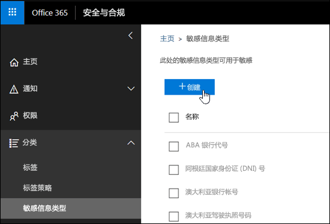
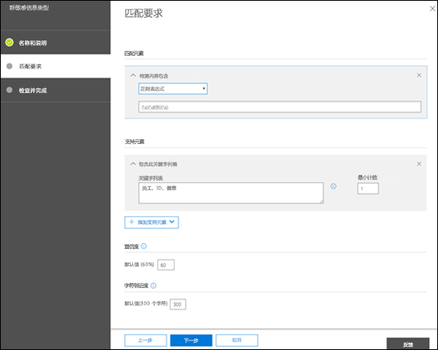
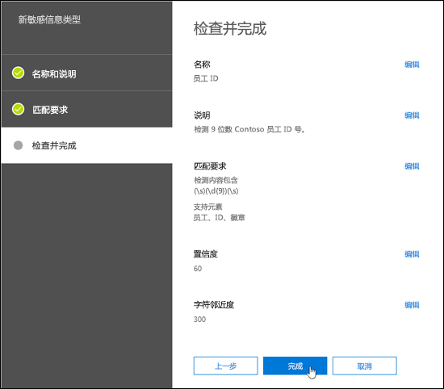
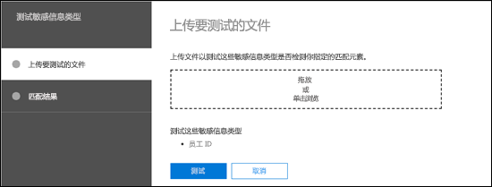

<!-- rename md file to match the display name -->
# 在安全与合规中心内创建自定义敏感信息类型

阅读本文，以在安全与合规中心 ([https://protection.office.com](https://protection.office.com))内创建自定义敏感信息类型。 使用此方法创建的自定义敏感信息类型将添加到名为 `Microsoft.SCCManaged.CustomRulePack` 的规则包中。

此外，还可以使用 PowerShell 和精确的数据匹配功能创建自定义敏感信息类型。 若要了解有关这些方法的详细信息，请参阅：
- [使用安全与合规中心 PowerShell 创建自定义敏感信息类型](create-a-custom-sensitive-information-type-in-scc-powershell.md)
- [使用精确数据匹配 (EDM) 为 DLP 创建自定义敏感信息类型](create-custom-sensitive-information-types-with-exact-data-match-based-classification.md)

> [!NOTE]
> Microsoft 365 信息保护现可为以下语言提供双字节字符集语言支持（预览）：
> - 简体中文
> - 繁体中文
> - 韩语
> - 日语
> 
>此功能预览仅在商业云中提供，并且仅在以下地区推出：
> - 日本
> - 韩国
> - 中国大陆
> - 香港特别行政区
> - 澳门特别行政区
> - 中国台湾
>
>此支持适用于敏感信息类型。 有关详细信息，请参阅[双字节字符集的信息保护支持发行说明（预览版）](mip-dbcs-relnotes.md)。

## 准备工作

> [!NOTE]
> 应该拥有全局管理员或合规性管理员权限，以便可以通过 UI 创建、测试和部署自定义的敏感信息类型。 请参阅 Office 365 中的[关于管理员角色](https://docs.microsoft.com/office365/admin/add-users/about-admin-roles?view=o365-worldwide)。

- 组织必须具有包含数据丢失防护 (DLP) 的订阅（如 Office 365 企业版）。 请参阅[邮件策略和合规性服务说明](https://docs.microsoft.com/office365/servicedescriptions/exchange-online-protection-service-description/messaging-policy-and-compliance-servicedesc)。 

- 自定义敏感信息类型需要熟悉正则表达式 (RegEx)。有关用于处理文本的 Boost.RegEx（以前称为 RegEx++）引擎的详细信息，请参阅 [Boost.Regex 5.1.3](https://www.boost.org/doc/libs/1_68_0/libs/regex/doc/html/)。

  在创建自定义分类或正则表达式模式时，不可从 Microsoft 客户服务和支持获取帮助。 支持工程师可对功能提供有限的支持，例如提供用于测试目的的示例正则表达式，或者帮助排查未如期触发的现有正则表达式模式的问题，但无法保证所有自定义内容匹配开发都将满足你的要求或义务。

- DLP 使用搜索爬网程序来确定 SharePoint Online 和 OneDrive for Business 网站中的敏感信息并对其分类。 要确定现有内容中新的自定义敏感信息类型，必须对该内容重新爬网。 根据计划对内容进行爬网，但你可手动重新爬网内容来查找网站集、列表或库。 有关详细信息，请参阅[Manually request crawling and re-indexing of a site, a library or a list](https://docs.microsoft.com/sharepoint/crawl-site-content)（手动请求对网站、库或列表进行爬网和重新编制索引）。

## 在安全与合规中心内创建自定义敏感信息类型

在安全与合规中心内，依次转到“分类”****\>“敏感信息类型”****，再单击“创建”****。

设置的含义相当显而易见，而且向导中的相关页也对这些设置进行了说明：

- **名称**

- **说明**

- **临近度**

- **可信度**

- **主要模式元素**（关键字、正则表达式或字典）

- 可选**支持性模式元素**（关键字、正则表达式或字典）和相应**最低成本**值。

应用场景如下：需要创建能够在内容中检测 9 位数员工编号的自定义敏感信息类型，以及关键字“员工”、“ID”和“徽章”。若要创建此自定义敏感信息类型，请按以下步骤操作：

1. 在安全与合规中心内，依次转到“分类”****\>“敏感信息类型”****，再单击“创建”****。

    

2. 在随即打开的“选择名称和说明”**** 页中，输入以下值：

  - **名称**：员工 ID。

  - **说明**：检测 9 位数 Contoso 员工 ID 号。

    

    完成后，单击“下一步”****。

3. 在随即打开的“匹配要求”**** 页中，单击“添加元素”****，以配置下列设置：

    - **检测内容包含**：
 
      a. 单击“任意内容”****，再选择“正则表达式”****。

      b. 在正则表达式框中，输入“`(\s)(\d{9})(\s)`”（两边是空格的 9 位数）。
  
    - **支持性元素**：单击“添加支持性元素”****，再选择“包含此关键字列表”****。

    - 在随即显示的“包含此关键字列表”**** 区域中，配置下列设置：

      - **关键字列表**：输入以下值：员工、ID、徽章。

      - **最小计数**：保留默认值 1。

    - 保留“可信度”**** 默认值 60。 

    - 保留“字符临近度”**** 默认值 300。

    

    完成后，单击“下一步”****。

4. 在随即打开的“检查并最终确定”**** 页中，检查设置并单击“完成”****。

    

5. 下一页建议通过单击“是”**** 测试新自定义敏感信息类型。有关详细信息，请参阅[在安全与合规中心内测试自定义敏感信息类型](#test-custom-sensitive-information-types-in-the-security--compliance-center)。若要稍后测试规则，请单击“否”****。

    

### 如何知道操作成功？

若要验证是否已成功新建敏感信息类型，请按以下任一步骤操作：

  - 依次转到“分类”****\>“敏感信息类型”****，并验证新自定义敏感信息类型是否已列出。

  - 测试新自定义敏感信息类型。有关详细信息，请参阅[在安全与合规中心内测试自定义敏感信息类型](#test-custom-sensitive-information-types-in-the-security--compliance-center)。

## 在安全与合规中心内修改自定义敏感信息类型

**注意**：
<!-- check to see if this note contradicts the guidance in "customize a built in sensitive information type customize-a-built-in-sensitive-information-type it sure seems like it does-->
- 只能修改自定义敏感信息类型；不能修改内置敏感信息类型。不过，可使用 PowerShell 导出内置自定义敏感信息类型，然后自定义它们，并将它们作为自定义敏感信息类型导入。有关详细信息，请参阅[自定义内置敏感信息类型](customize-a-built-in-sensitive-information-type.md)。

- 只能修改在 UI 中创建的自定义敏感信息类型。如果使用 [PowerShell 过程](create-a-custom-sensitive-information-type-in-scc-powershell.md)导入自定义敏感信息类型规则包，将收到一个错误。

在安全与合规中心内，依次转到“分类”****\>“敏感信息类型”****，选择要修改的自定义敏感信息类型，然后单击“编辑”****。

  

随后看到的选项与在安全与合规中心内创建自定义敏感信息类型时相同。有关详细信息，请参阅[在安全与合规中心内创建自定义敏感信息类型](#create-custom-sensitive-information-types-in-the-security--compliance-center)。

### 如何判断是否生效？

若要验证是否已成功修改敏感信息类型，请按以下任一步骤操作：

  - 依次转到“分类”****\>“敏感信息类型”****，以验证修改后的自定义敏感信息类型的属性。 

  - 测试修改后的自定义敏感信息类型。有关详细信息，请参阅[在安全与合规中心内测试自定义敏感信息类型](#test-custom-sensitive-information-types-in-the-security--compliance-center)。

## 在安全与合规中心内删除自定义敏感信息类型 

**注意**：

- 只能删除自定义敏感信息类型；不能删除内置敏感信息类型。

- 删除自定义敏感信息类型前，请先验证没有 DLP 策略或 Exchange 邮件流规则（亦称为“传输规则”）仍在引用此敏感信息类型。

1. 在安全与合规中心内，依次转到“分类”****\>“敏感信息类型”****，并选择一个或多个要删除的自定义敏感信息类型。

2. 在随即打开的弹出窗口中，单击“删除”****（或“删除多个敏感信息类型”****，如果选择了多个类型的话）。

    

3. 在随即显示的警告消息中，单击“是”****。

### 如何判断是否生效？

若要验证是否已成功删除自定义敏感信息类型，请依次转到“分类”****\>“敏感信息类型”****，以验证自定义敏感信息类型是否已不再列出。

## 在安全与合规中心内测试自定义敏感信息类型

1. 在安全与合规中心内，依次转到“分类”****\>“敏感信息类型”****。

2. 选择要测试的一个或多个自定义敏感信息类型。在随即打开的弹出窗口中，单击“测试类型”****（或“测试多个敏感信息类型”****，如果选择了多个类型的话）。

    

3. 在随即打开的“上传测试文件”**** 页面上，拖放文件或单击“浏览”**** 并选择文件，以上传要测试的文档。

    

4. 单击“测试”**** 按钮，以测试文档的模式匹配情况。

5. 在“匹配结果”**** 页上，单击“完成”****。

    
