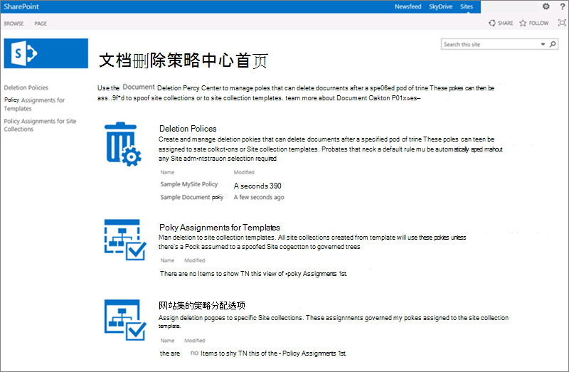
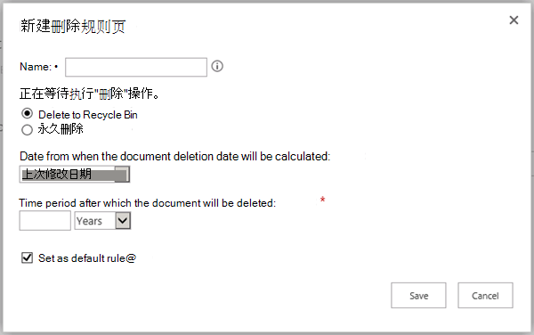
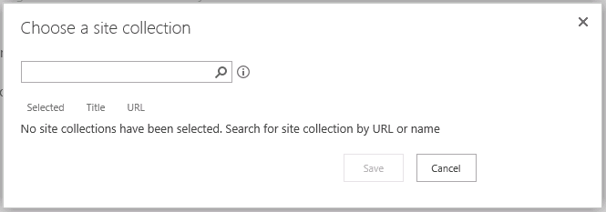
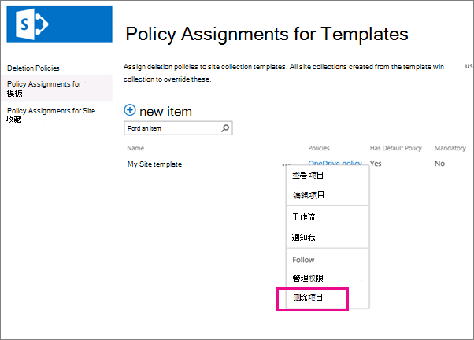

# 创建文档删除策略

> [!IMPORTANT]
> 向前移动时，我们建议使用保留策略或在 Microsoft 365 合规性中心、Microsoft 365 安全中心或安全&amp;合规中心（而不是文档删除策略）中创建的保留标签。 文档删除策略将继续与保留策略一起工作，但如果您需要保留或删除 Office 365 中任何位置的内容，我们建议使用保留策略。 有关详细信息，请参阅[使用保留策略而不是这些功能](retention-policies.md#use-a-retention-policy-instead-of-these-features)。 
  
为了体现合规性以及遵守法律或其他法规，组织通常必须在一定期限内保留文档。不过，如果文档的保留时间长于要求时间，则会给组织带来法律风险。
  
使用文档删除策略，您可以通过在特定时间段后删除网站中的文档来主动降低风险，例如，在创建文档五年后，可以在用户的 OneDrive for Business 网站中删除文档。 
  
创建文档删除策略后，您便可以将它分配到网站集模板，这样便可以将它应用于使用此模板创建的所有网站集。您还可以将策略分配到特定的网站集，这样会覆盖可能已分配到该网站集模板的任何策略。
  

  
## 策略模板

您可以从头开始创建文档删除策略，也可以使用示例策略之一。合规性策略中心中包括了您可以原样使用的示例策略，您还可以将其作为起点，然后进行重命名或修改。
  

  
## 示例

可以向网站集或网站集模板分配一个或多个策略，每个策略都可以包含一个或多个规则。 但是，每个站点只能有一个处于活动状态的策略，并且网站中的库在任何时候都只能有一个活动的删除规则。
  

  
此外，您还可以选择一个策略作为强制策略或默认策略，并选择一个删除规则作为默认规则： 
  
- **强制策略**将策略标记为必需时，只能向网站集或模板分配一个策略。 必须将策略标记为默认策略，并将其应用于所有网站。 网站所有者不能选择退出该策略。
    
- **默认策略**如果将策略设置为默认值，策略将自动在其分配的所有网站中处于活动状态，网站所有者无需任何操作。
    
- **默认规则**如果将删除规则设置为默认值，则该规则会自动应用到使用该策略的站点中的所有库。
    
下面的示例介绍了可能需要使用强制策略或默认策略和规则的情况。
  
### 示例 1：将一个包含单一规则的策略应用于网站集模板

您不妨将文档删除策略强制应用于广泛存在的未结构化内容，如所有 OneDrive for Business 站点或所有团队网站。如果您要确保在使用网站集模板创建的所有站点上只有一个文档删除策略处于活动状态，则可以：
  
1. 创建一个包含单一默认删除规则的策略。
    
2. 将此策略设置为强制策略和默认策略。
    
3. 将此策略分配到网站集模板。
    
在本示例中，默认删除规则会应用于使用此模板创建的所有网站集中的全部库，且站点所有者无法选择取消应用该策略。这是广泛、严格地强制应用文档删除策略的最简单方法。
  

  
### 示例2：将具有多个规则的单个策略应用于网站集模板

由于站点所有者通常最清楚他们的站点包含何种类型的内容，因此您可以选择让站点所有者来选择最适用于其站点的删除规则。您还不妨允许站点所有者取消应用整个策略。
  
与此同时，您仍可以集中创建和管理策略。您还可以选择一个默认策略和规则，这样在站点所有者选择其他策略或选择取消应用策略之前，此策略会一直有效。如果您希望站点所有者能够这样灵活操作，则可以：
  
1. 创建一个包含多个删除规则的策略，并将其中一个规则设置为默认规则。
    
2. 将此策略设置为默认策略。
    
3. 将此策略分配到网站集模板。
    
站点所有者可以从备用删除规则中选择一个、选择取消应用此策略，也可以不执行任何操作而采用默认策略和规则。
  

  
### 示例 3：将多个包含一个或多个规则的策略应用于网站集

本示例为站点所有者带来了最大灵活性，因为他们可以从多个策略中进行选择，而且在选择策略后通常还能从多个规则中进行选择。您可以设置一个默认策略和规则，这样在站点所有者选择其他策略或选择取消应用策略之前，此策略会一直有效。请注意，如果您没有设置默认的策略和规则，则在站点所有者选择并应用策略和规则之前，站点中的文档库没有活动的策略和规则。
  
与上述两个示例不同，此类策略是分配到特定的网站集，而不是网站集模板。也就是说，可以为特定网站集中的内容定制更具体的策略。
  
策略和规则具有继承性。站点所有者可以为他们的站点选择一个策略和规则，这样所有子站点都能够从父站点继承此策略。不过，子站点的所有者可以通过选择其他策略和规则来中断继承，这样会在继承再次中断之前将此策略和规则应用于所有子站点。
  
若要设置此方案，您可以：
  
1. 创建多个策略，每个策略都包含一个或多个规则。
    
2. 设置默认的策略和规则。
    
3. 将这些策略分配到特定的网站集。
    
此外，还可以为特定的网站集定制这些策略和规则，在这种情况下，站点所有者可以通过选择最适用于其站点的策略和规则来中断继承。
  

  
## 创建文档删除策略

1. 在 Office 365Security &amp;合规性中心中，导航到 "**数据管理** \> **保留**"。 在 "**删除**" 下，单击 "**管理 SharePoint Online 和 OneDrive for business 的文档删除策略**"。 此时，系统会在新的浏览器标签页中打开“文档删除策略中心”。
    
    当您第一次从安全&amp;合规中心导航到文档删除策略中心时，将自动为您创建策略中心。 或者，您可以通过[创建网站集](https://go.microsoft.com/fwlink/p/?LinkID=404342)并在 "**企业**" 选项卡上选择 "**合规性策略中心**" 来手动创建策略中心。 
    
2. 选择 "**删除策略**"。
    
    
  
3. 单击“新建项目”****。
    
4. 输入策略名称和说明。由于站点所有者可能会根据此名称和说明来为其站点选择策略，因此请添加足够多的信息，以便站点所有者能够选择正确的策略。
    
5. 若要创建规则，请单击“新建”****。
    
6. 输入名称，然后选择以下选项：
    
  - 选择允许此规则永久删除文档还是将删除的文档放入回收站。 在您将项目从站点中永久删除之前，回收站提供了第二道安全屏障。 有关回收站的详细信息，请参阅[清空回收站或还原文件](https://go.microsoft.com/fwlink/p/?LinkID=404348)。
    
  - 选择删除日期是从文档的创建日期还是最后一次修改日期开始计算。
    
  - 输入在删除文档之前保留的天数、月数或年数。
    
  - 选择是否将此规则设置为默认规则。系统自动将您创建的第一个规则设置为默认规则。默认规则会自动应用于使用此策略的站点中的所有库。
    

  
7. 单击“**保存**”。
    
8. 如果您希望站点所有者能够选择不同的规则应用于其站点，请创建其他规则。如果站点所有者没有执行任何操作，则系统会应用默认规则（如有）。
    
9. 若要从策略中删除规则，请选择该规则，单击 "**删除**"，然后单击 **"确定"**。
    
    > [!NOTE]
    > 如果您删除某个规则，并且该策略不包含默认规则，则该策略的规则将不起作用，也就是说，将不会删除任何文档。 
  

  
## 将文档删除策略分配到网站集模板

通过将策略分配到网站集模板，您可以将此策略应用于使用该模板创建的所有网站集，包括现有网站集和今后创建的网站集。
  
请务必了解为文档删除策略指定的时间段是指自创建或修改文档以来的时间，而不是分配该策略以来的时间。 当您首次分配策略时，将对网站中的所有文件进行计算，满足删除条件的文件将被删除。 这适用于所有现有文件，而不仅仅针对分配策略后新建的文件。
  
1. 在安全&amp;合规性中心中，导航到 "**数据管理** \> **保留**"。 在 "**删除**" 下，单击 "**管理 SharePoint Online 和 OneDrive for business 的文档删除策略**"。 此时，系统会在新的浏览器标签页中打开“文档删除策略中心”。
    
2. 选择“模板的策略分配”****。
    
    
  
3. 单击“新建项目”****。
    
4. 请执行下列操作之一：
    
  - 要将策略分配至网站集模板（例如团队站点模板），请选择“分配至网站集模板”****，然后选择网站集模板。
    
  - 若要将策略分配给用户的一个驱动器以供企业选择，请选择 "**分配到 OneDrive for Business 模板**"，突出显示如下。
    
    > [!NOTE]
    > 如果您将策略分配到网站集模板，则此策略可应用于使用该模板创建的现有网站集和今后创建的网站集。 
  

  
5. 单击“**保存**”。
    
    > [!NOTE]
    > 每个模板只能分配一组策略。 如果您看到一个错误，指出此模板已分配策略，请选择左侧导航栏\>中的 "**取消** \> **分配到网站集**"。选择一个网站集以查看和管理已分配的策略集。 
  
6. 单击“管理已分配的策略”****，选择要分配的策略，然后选择是否将其中一个策略设置为默认策略。 如果您设置默认策略，那么在所分配到的全部站点上，此策略会自动处于活动状态，无需站点所有者执行任何操作。
    
    
  
7. 单击“**保存**”。
    
8. 若要在所有站点上强制应用此策略且不允许站点所有者取消应用，请单击“将策略标记为强制策略”****。如果您设置强制策略，那么只有这一个策略能够分配到网站集模板。此外，还必须将该策略标记为默认策略。
    
    如果此选项灰显，请单击“管理已分配的策略”****，并确保至少已分配一个策略并将其设置为默认策略。 
    
9. 单击“**保存**”。
    
## 将文档删除策略分配到网站集

通过将策略分配到特定的网站集，您只能将此策略应用于相应的特定网站集。也就是说，您可以定制更贴近网站集中内容的策略。此外，分配到特定网站集的策略会覆盖分配到该网站集模板的所有策略。例如，分配到销售部门网站集（使用团队网站模板创建）的策略将覆盖分配到团队网站模板的所有策略。
  
请务必了解为文档删除策略指定的时间段是指自创建或修改文档以来的时间，而不是分配该策略以来的时间。 当您首次分配策略时，将对网站中的所有文件进行计算，满足删除条件的文件将被删除。 这适用于所有现有文件，而不仅仅针对分配策略后新建的文件。
  
1. 在安全&amp;合规性中心中，导航到 "**数据管理** \> **保留**"。 在 "**删除**" 下，选择 "**管理 SharePoint Online 和 OneDrive for business 的文档删除策略**"。 此时，系统会在新的浏览器标签页中打开“文档删除策略中心”。
    
2. 选择“网站集的策略分配”****。
    
    
  
3. 单击“新建项目”****。
    
4. 选择 "**选择网站集**"。 按名称或 URL 搜索网站集，选择网站集，然后单击 "**保存**"。
    
    > [!NOTE]
    > 每个网站集只能分配一组策略。 如果您看到一个错误，指出此网站集已分配了策略，请选择 "**取消** \> **分配到网站集**"，然后选择一个网站集以查看和管理已分配的策略集。 
  

  
5. 单击“管理已分配的策略”****，选择要分配的策略，然后选择是否将其中一个策略设置为默认策略。 如果您设置默认策略，那么在所分配到的全部站点上，此策略会自动处于活动状态，无需站点所有者执行任何操作。
    
    
  
6. 单击“**保存**”。
    
7. 若要在所有站点上强制应用此策略且不允许站点所有者取消应用，请单击“将策略标记为强制策略”****。如果您设置强制策略，那么只有这一个策略能够分配到网站集。此外，还必须将该策略标记为默认策略。
    
    如果此选项灰显，请单击“管理已分配的策略”****，并确保至少已分配一个策略并将其设置为默认策略。 
    
8. 单击“**保存**”。
    
## 删除策略分配关系

如果您删除策略分配关系，则已分配的策略将不再应用于网站集或网站集模板中的任何站点。
  
1. 在安全&amp;合规性中心中，导航到 "**数据管理** \> **保留**"。 在 "**删除**" 下，选择 "**管理 SharePoint Online 和 OneDrive for business 的文档删除策略**"。 此时，系统会在新的浏览器标签页中打开“文档删除策略中心”。
    
2. 选择“模板的策略分配”**** 或“网站集的策略分配”****。
    
3. 选择工作分配项目，然后单击 "**删除项目**"。
    
    
  
## 删除策略

您不能删除正在使用的策略。 在删除策略之前，首先需要删除包含该策略的网站集和网站集模板的所有分配—请参阅上一节。
  
1. 在安全&amp;合规性中心\>中，在左侧导航\>中选择 "**删除** \> **管理 SharePoint Online 和 OneDrive for business 的文档删除策略**" 中的 "**数据管理** \> **保留**"。 此时，系统会在新的浏览器标签页中打开“文档删除策略中心”。
    
2. 选择 "* * 删除策略" * *。
    
    
  
3. 选择策略。
    
4. 在 "功能\>区**项目**" 选项卡\>上**删除策略**。
    
    
  
5. 如果正在使用该策略，则系统会询问您是否要从使用该策略的所有网站集中删除该策略。 如果确定，请选择 **"确定"**。
    
    
  
## 另请参阅

[文档删除策略的概述](document-deletion-policies.md)

[应用或删除网站的文件删除策略](apply-or-remove-a-document-deletion-policy-for-a-site.md)
 

