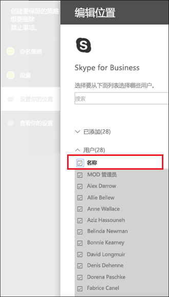
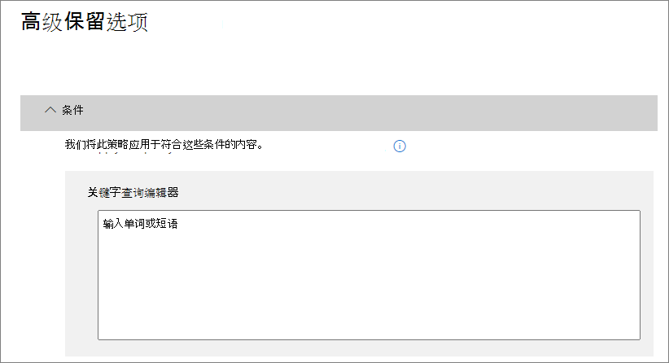

# 创建和配置保留策略

>*[Microsoft 365 安全性与合规性许可指南](https://aka.ms/ComplianceSD)。*

使用保留策略来主动决定是保留内容还是删除内容 — 亦或是先保留再删除内容。 

有关保留策略工作方式的信息，请参阅[了解保留策略](retention-policies.md)。

## 准备工作

负责创建和管理保留策略的合规性团队成员必须有权访问 [Microsoft 365 合规中心](https://compliance.microsoft.com/)。 默认情况下，租户管理员（全局管理员）有权访问此位置，并可向合规专员和其他人提供访问权限，而不为其提供租户管理员的所有权限。若要授予实现此有限管理的权限，建议将用户添加到**合规性管理员**管理角色组。 有关说明，请参阅[向用户授予对安全与合规中心的访问权限](https://docs.microsoft.com/microsoft-365/security/office-365-security/grant-access-to-the-security-and-compliance-center)。

只有在创建和应用保留策略时才需要这些权限。 配置保留策略的人员不需要访问该内容。

## 创建和配置保留策略

1. 从 [Microsoft 365 合规中心](https://compliance.microsoft.com/)中，选择“**策略**” > “**保留**”。

2. 选择“**新保留策略**”或编辑现有保留策略。

3. 对于“**设置**”，请先指定用于保留和删除内容的配置选项。 你可以创建一个保留策略，指明仅保留而不删除内容、将内容保留指定的时间段后删除，或者仅在指定的时间段后删除内容。 有关详细信息，请参阅本页上的[保留和删除内容的设置](#settings-for-retaining-and-deleting-content)：
    
    然后，确定应将保留策略应用于所有内容还是满足特定条件的内容。 有关这些高级保留设置的详细信息，请参阅本页上的[用于识别满足特定条件的内容的高级设置](#advanced-settings-to-identify-content-that-meets-specific-conditions)。 

4. 对于“**选择位置**”页面，选择应将保留策略应用到组织中的所有受支持位置，还是想要指定位置。 如果选择特定位置，还可以指定包括和排除项。 
    
    对于 Microsoft Teams： 
    - 如果想要删除或保留 Teams 频道消息或 Teams 聊天，则必须选择可供选择特定位置的选项。 如果选择这些选项之一作为位置，则其他位置将被自动排除，因为包含此 Teams 数据的保留策略不能包含其他位置。 
    - 请注意，对于 **Teams 频道消息**，将包括来自标准频道的消息，但不包括来自[专用频道](https://docs.microsoft.com/microsoftteams/private-channels)的消息。 当你选择“**Teams 聊天**”位置时，将以群组聊天方式为用户提供来自专用频道的消息。
    
    有关在组织或特定位置的保留策略之间进行选择的详细信息，请参阅本页上的[将保留策略应用于整个组织或特定位置](#applying-a-retention-policy-to-an-entire-organization-or-specific-locations)。
    
    有关 **Office 365 组**和 **Skype for Business** 的特定信息，请参阅以下部分 [Microsoft 365 组的配置信息](#configuration-information-for-microsoft-365-groups)和 [Skype for Business 的配置信息](#configuration-information-for-skype-for-business)。

5. 完成向导以保存设置。

当你有多个保留策略时，请参阅[保留原则或优先原则？](retention-policies.md#the-principles-of-retention-or-what-takes-precedence)

### Microsoft 365 组的配置信息

若要保留或删除 Microsoft 365 组（以前称为 Office 365 组）的内容，请在选择保留策略的位置时，选择“**Office 365 组**”位置。 即使 Microsoft 365 组有 Exchange 邮箱，涵盖整个 **Exchange 电子邮件**位置的保留策略也不会包含 Microsoft 365 组邮箱中的内容。 此外，尽管 **Exchange 电子邮件**位置最初允许你指定包括或排除组邮箱，但在尝试保存保留策略时，你将收到一条错误消息，表明“RemoteGroupMailbox”不是有效的 Exchange 位置选项。

应用于 Microsoft 365 组的保留策略包含组的邮箱和网站。 应用于 Microsoft 365 组的保留策略将保护由 Microsoft 365 组（包括 Microsoft Teams）创建的资源。

### Skype for Business 的配置信息

与 Exchange 电子邮件不同，将 Skype 位置的状态切换为“开”并不能添加所有用户，但启用相应位置后，就可以手动选择要保留哪些用户的对话：

  
选择“选择用户”时，选择列标题中的“名称”**** 框可快速包含所有用户****。 但是，请务必了解每个用户在策略中都被算作一个特定的包含内容。 因此，当包括的用户超过 1,000 位时，会应用上一部分中所述的限制。 这里所说的选择所有 Skype 用户不同于组织范围的策略在默认情况下包含所有 Skype 用户。 
  

  
Note that **Conversation History**, a folder in Outlook, is a feature that has nothing to do with Skype archiving. **Conversation History** can be turned off by the end user, but archiving for Skype is done by storing a copy of Skype conversations in a hidden folder that is inaccessible to the user but available to eDiscovery.

## 保留和删除内容的设置

通过在保留策略中选择保留和删除内容的设置，保留策略将在指定的时间段内具有以下配置之一：

- 仅保留
- 保留后删除
- 仅删除

### 将内容保留一段特定时间

配置保留策略时，可选择无限期地保留内容，也可将内容保留特定天数、月数或年限。 内容的保留期限是从内容创建的时间开始计算，而不是从应用保留策略的时间开始计算。 可以选择根据内容创建的时间或（针对 OneDrive 和 SharePoint）最后一次修改内容的时间来计算保留期限。

示例：
  
- SharePoint：如果希望将某个网站集中的内容自上次修改以来保留七年，并且该网站集中的某个文档在六年内未进行修改，则该文档在不修改的情况下将仅再保留 1 年。 如果再次对该文档进行编辑，则会根据最新修改日期计算文档期限，并将再保留 7 年。
  
- Exchange：如果想将邮箱中的内容保留七年，而有封邮件是六年前发送的，则该邮件将只再保留一年。 对于 Exchange 内容，期限基于传入电子邮件的接收日期或传出电子邮件的发送日期。 根据最后一次修改的时间来保留内容这一方式只适用于 OneDrive 和 SharePoint 中的网站内容。
  
保留期结束后，选择是否要永久删除内容：
  

  
### 删除超过特定年限的内容

保留策略既可以先保留再删除内容，也可以删除旧内容，而不保留它。
  
如果保留策略删除内容，请务必了解为保留策略指定的时间期限是从文件创建或修改时开始计算，而不是从策略分配时开始计算。
  

  
例如，假设创建了一个保留策略 - 该策略会在三年后删除内容，然后将该策略分配到所有 OneDrive 帐户，这些帐户中含有许多四五年前创建的内容。 在这种情况下，第一次分配保留策略后将会有许多内容被删除。 为此，请务必了解删除内容的保留策略会对内容造成重大影响。 
  
Therefore, before you assign a retention policy to a site collection for the first time, you should first consider the age of the existing content and how the policy may impact that content. You may also want to communicate the new policy to your users before assigning it, to give them time to assess the possible impact. Note this warning that appears when you review the settings for your retention policy just before creating it.
  

  
## 用于识别满足特定条件的内容的高级设置

保留策略可应用于其中所含位置上的全部内容，你也可以选择将保留策略只应用于包含特定关键字或[特定类型敏感信息](what-the-sensitive-information-types-look-for.md)的内容。
  

  
### 识别包含特定关键字的内容

可以只对满足特定条件的内容应用保留策略，然后只对这些内容执行保留操作。 可用的条件支持将保留策略应用于包含特定字词或短语的内容。 你可以使用 AND、OR 和 NOT 等搜索运算符优化查询。 有关这些运算符的详细信息，请参阅[内容搜索的关键字查询和搜索条件](keyword-queries-and-search-conditions.md)。
  
即将支持添加可搜索属性（例如，**subject:**）。
  
基于查询的保留策略使用搜索索引来标识内容。
  

  
### 识别包含敏感信息的内容

You can also apply a retention policy only to content that contains [specific types of sensitive information](what-the-sensitive-information-types-look-for.md). For example, you can choose to apply unique retention requirements only to content that contains personally identifiable information (PII) such as taxpayer identification numbers, social security numbers, or passport numbers.
  

  
注意：
  
- 敏感信息的高级保留设置不适用于 Exchange 公用文件夹或 Skype for Business，因为这些位置不支持敏感信息类型。
    
- Exchange Online 使用邮件流规则（也称为传输规则）来识别敏感信息，因此这种方式仅适用于传输过程中的邮件，而不适用于已存储在邮箱中的所有邮件。 对于 Exchange Online，这意味着保留策略可以识别敏感信息，并且只对邮箱应用策略**之后**收到的邮件执行保留操作。 上一部分所述的基于查询的保留不受此限制，因为它是通过使用搜索索引来识别内容的。 
    
## 将保留策略应用于整个组织或特定位置

可以将保留策略轻松地应用于整个组织、位置整体，或只应用于特定位置或用户。
  
### 组织范围策略

保留策略的最强大功能之一是，它可以应用于 Microsoft 365 中的所有位置，包括：
  
- Exchange 电子邮件
    
- SharePoint 网站集
    
- OneDrive 帐户
    
- Microsoft 365 组（应用于组的邮箱和相关 SharePoint 网站中的内容。）
    
- Exchange 公用文件夹
    

组织范围保留策略的其他重要功能包括：
  
- 策略可包含任意多个邮箱或网站。
    
- 对于 Exchange，在保留策略应用后新建的任何邮箱都会自动继承策略。
  
### 应用于位置整体的策略

选择位置时，可以轻松包含或排除整体位置，例如 Exchange 电子邮件或 OneDrive 帐户。 若要执行此操作，将该位置的“**状态**”切换为开或者关。 
  
与组织范围的策略相同，如果策略应用到任意组合的整体位置，则可应用策略的邮箱数或网站数不存在限制。 

例如，如果对所有的 Exchange 电子邮件和所有的 SharePoint 网站应用策略，则无论网站和邮箱的数量有多少，都会对其应用策略。 并且对于 Exchange，在应用策略后创建的任何新邮箱都将自动继承该策略。

### 包含或排除特定位置、用户或组的策略

你还可以将保留策略应用于特定用户、特定 Microsoft 365 组或特定网站。 若要执行此操作，请将该位置的“**状态**”切换为开，然后使用链接来包含或排除特定用户、Microsoft 365 组或者网站。 
  
但是，如果保留策略包括或排除的特定位置超过 1,000 个，则使用此配置会有一些限制：
  
- 保留策略的最大数量：
    - 1,000 个邮箱
    - 1,000 个 Microsoft 365 组
    - 1000 个用户的 Teams 私人聊天
    - 100 个网站（OneDrive 或 SharePoint）

租户支持的最大策略数：10,000。 这些项目包括保留策略、保留标签策略和自动应用保留策略。

如果你的保留策略可能受到这些限制，请选择适用于整个位置的配置选项，或使用组织范围的策略。

## 更新保留策略

如果你编辑保留策略，并且内容已遵循保留策略中的原始设置，则除了新识别的内容之外，更新后的设置将自动应用于此内容。

此更新通常非常快，但可能需要数天。 完成跨 Microsoft 365 位置的策略复制后，你将看到 Microsoft 365 合规中心中的保留策略状态从“**打开（挂起）**”变为“**打开（成功）**”。

## 查找保留策略的 PowerShell cmdlet

使用“保留策略” cmdlet：
  
1. [连接到 Office 365 安全与合规中心 Powershell](https://docs.microsoft.com/powershell/exchange/office-365-scc/connect-to-scc-powershell/connect-to-scc-powershell)
    
2. 使用这些 Office 365 安全与合规中心 cmdlet：
    
    - [Get-RetentionCompliancePolicy](https://docs.microsoft.com/powershell/module/exchange/get-retentioncompliancepolicy)
    
    - [New-RetentionCompliancePolicy](https://docs.microsoft.com/powershell/module/exchange/new-retentioncompliancepolicy)
    
    - [Remove-RetentionCompliancePolicy](https://docs.microsoft.com/powershell/module/exchange/remove-retentioncompliancepolicy)
    
    - [Set-RetentionCompliancePolicy](https://docs.microsoft.com/powershell/module/exchange/set-retentioncompliancepolicy)
    
    - [Get-RetentionComplianceRule](https://docs.microsoft.com/powershell/module/exchange/get-retentioncompliancerule)
    
    - [New-RetentionComplianceRule](https://docs.microsoft.com/powershell/module/exchange/new-retentioncompliancerule)
    
    - [Remove-RetentionComplianceRule](https://docs.microsoft.com/powershell/module/exchange/remove-retentioncompliancerule)
    
    - [Set-RetentionComplianceRule](https://docs.microsoft.com/powershell/module/exchange/set-retentioncompliancerule)

## 使用 PowerShell 锁定保留策略

如果需要使用“[保留锁定](retention-policies.md#use-preservation-lock-to-comply-with-regulatory-requirements)”来满足法规要求，则必须使用 PowerShell。

1. [连接到 Office 365 安全与合规中心 PowerShell](https://docs.microsoft.com/powershell/exchange/office-365-scc/connect-to-scc-powershell/connect-to-scc-powershell?view=exchange-ps)。

2. 运行 `Get-RetentionCompliancePolicy`，列出保留策略并查找要锁定的策略的名称。
    
    
    
3. 若要在保留策略上启用保留锁定，请运行 `Set-RetentionCompliancePolicy` 并将 `RestrictiveRetention` 参数设置为 true。 例如：
    
        Set-RetentionCompliancePolicy -Identity "<Name of Policy>" – RestrictiveRetention $true
    
    
    
    运行该 cmdlet 后，请选择“**全是**”：
    
    

现在，为保留策略提供了“保留锁定”功能。 如果运行 `Get-RetentionCompliancePolicy`，则 `RestrictiveRetention` 参数将设置为 true。 例如：

`Get-RetentionCompliancePolicy -Identity "<Name of Policy>" |Fl`

  

