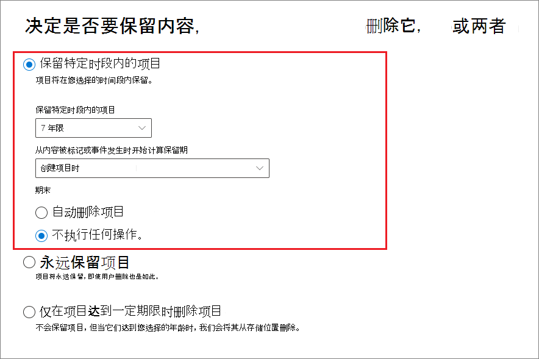

# 创建和配置保留策略

>*[Microsoft 365 安全性与合规性许可指南](/office365/servicedescriptions/microsoft-365-service-descriptions/microsoft-365-tenantlevel-services-licensing-guidance/microsoft-365-security-compliance-licensing-guidance)。*

使用保留策略通过主动决定是保留内容、删除内容还是保留然后删除内容来管理组织的数据。

保留策略在容器级别分配相同的保留设置，以通过该容器中的内容自动继承，使你能够高效率地完成这一操作。 例如，SharePoint 网站中的所有项目、用户的 Exchange 邮箱中的所有电子邮件、用于 Microsoft Teams 的团队的所有频道邮件。 如果不确定是使用容器级别的保留策略，还是使用项级别的保留标签，请参阅保留 [和保留标签](retention.md#retention-policies-and-retention-labels)。

若要深入了解保留策略以及 Microsoft 365 中保留的工作原理，请参阅 [保留策略和保留标签](retention.md)。

> [!NOTE]
> 本页上的信息适用于合规性管理员。 如果你不是管理员，并且希望了解为使用的应用配置保留策略的信息，请联系技术支持、IT 部门或管理员。 如果在 Teams 聊天和频道消息中看见保留策略消息，可能会发现查看 [Teams 中有关保留策略的消息](https://support.microsoft.com/office/teams-messages-about-retention-policies-c151fa2f-1558-4cf9-8e51-854e925b483b)。

## 准备工作

组织的全局管理员具有创建和编辑保留策略的完全权限。 如果你未以全局管理员的身份登录，请参阅[创建和管理保留策略和保留标签所需的权限](get-started-with-retention.md#permissions-required-to-create-and-manage-retention-policies-and-retention-labels)。

## 创建和配置保留策略

虽然保留策略可以支持在保留策略中标识为"位置"的多个服务，但无法创建包含所有受支持位置的单个保留策略：

- Exchange 电子邮件
- SharePoint 网站
- OneDrive 帐户
- Microsoft 365 组
- Skype for Business
- Exchange 公用文件夹
- Teams 通道消息
- Teams 聊天
- yammer 社区消息
- Yammer 用户消息

如果你在创建保留策略时选择 Teams 或 Yammer 位置，其他位置将被自动排除。 这意味着遵循的说明取决于你需要包括 Teams 还是 Yammer 位置：

- [有关 Teams 位置的保留策略的说明](#retention-policy-for-teams-locations)
- [有关 Yammer 位置的保留策略的说明](#retention-policy-for-yammer-locations)
- [有关 Teams 和 Yammer 以外位置的保留策略的说明](#retention-policy-for-locations-other-than-teams-and-yammer)

如果你有多个保留策略，但同时你又有使用保留标签，请参阅[保留原则或优先原则？](retention.md#the-principles-of-retention-or-what-takes-precedence)了解多个保留设置应用于同一内容时的结果。

### Teams 位置的保留策略

1. 从 [Microsoft 365 合规中心](https://compliance.microsoft.com/)中，选择 **策略** > **保留**。

2. 选择“**新保留策略**”来开始“创建保留策略向导”，并命名新的保留策略。

3. 对于 **选择要应用策略的位置** 页面，请为 Teams 选择任何或所有位置:
    - **Teams 频道消息**: 来自标准频道聊天和标准频道会议的消息，但不包括来自具有其自己策略位置的 [私人频道](/microsoftteams/private-channels)。
    - **Teams 聊天**: 来自私人 1:1 聊天、群组聊天和会议聊天的消息。
    - **Teams 专用频道消息**: 来自私人频道聊天和私人频道会议的消息。 此选项当前以预览版推出，如果未显示，请在几天后重试。
    
   默认情况下，[选择所有团队和所有用户](#a-policy-that-applies-to-entire-locations)，但你可以通过选择“**编辑**”选项来优化此设置，以为 [特定包含项或排除项](#a-policy-with-specific-inclusions-or-exclusions) 配置保留策略。 但是，在更改默认设置之前，请注意保留策略在配置为包含或排除邮件时删除邮件的下列影响：
    
    - 对于群组聊天信息和私人频道信息，由于信息的副本保存在每个参加聊天的用户的邮箱中，所以在 eDiscovery 结果中会继续返回未分配策略用户的信息副本。
    - 对于未分配策略的用户，已删除的邮件将返回其 Teams 搜索结果中，但不会显示邮件内容，因为从分配给用户的策略被永久删除。

4. 有关 **保留内容、删除内容，还是同时删除** 向导的页面，请指定保留和删除内容的配置选项。

   你可以创建一个保留策略，指明仅保留而不删除内容、将内容保留指定的时间段后删除，或者仅在指定的时间段后删除内容。 有关详细信息，请参阅本页上的[保留和删除内容的设置](#settings-for-retaining-and-deleting-content)。

5. 完成向导以保存设置。

有关何时对 Teams 使用保留策略并了解最终用户体验的指南，请参阅 [管理 Microsoft Teams](/microsoftteams/retention-policies) 保留策略。

有关保留对 Teams 的工作原理的技术详细信息，包括通过演练确定保留和计时信息时支持哪些邮件元素，请参阅 [了解 Microsoft Teams](retention-policies-teams.md)。

#### 已知的配置问题

- 虽然可以选择从上次修改项目时开始保留期的选项，但始终使用 **从项目创建时** 的值。 对于已编辑的邮件，将保存一份带有原始时间戳的原始邮件副本，以标识创建此预编辑邮件的时间，并且该编辑后邮件具有较新的时间戳。

- 为 **Teams 频道消息** 位置选择“**编辑**”时，你可能会看到不属于团队的 Microsoft 365 组。 不要选择这些组。

- 在为 Teams 聊天位置选择“**编辑**”时，可能看到来宾和非邮箱用户。 保留策略并非专为这些用户设计，因此请不要选择他们。

#### 支持团队所需的其他保留策略

Teams 不只是聊天和频道消息。 如果你有从 Microsoft 365 组（以前称为 Office 365 组）创建的团队，则应使用 **Microsoft 365 组** 位置来额外配置一个包括该 Microsoft 365 组的保留策略。 此保留策略适用于组的邮箱、网站和文件中的内容。

如果你有团队网站未连接到 Microsoft 365 组，则需要一个包括 **SharePoint 网站** 或 **OneDrive 帐户** 位置的保留策略来保留和删除 Teams 中的文件：

- 聊天中共享的文件存储在共享文件的用户的 OneDrive 帐户中。

- 上传到频道的文件存储在团队的 SharePoint 网站中。

> [!TIP]
> 当特定团队未连接到 Microsoft 365 组时，可以将保留策略应用于该特定团队的文件，方法是选择该团队的 SharePoint 网站以及该团队中用户的 OneDrive 帐户。

应用于 Microsoft 365 组、SharePoint 网站或 OneDrive 帐户的保留策略可能会先删除在 Teams 聊天或频道消息中引用的文件，然后再删除这些消息。 在这种情况下，该文件仍显示在 Teams 消息中，但当用户选择该文件时，将收到“找不到文件”错误。 此行为并非特定于保留策略，用户从 SharePoint 或 OneDrive 中手动删除文件时，也可能发生这种情况。

### Yammer 位置的保留策略

> [!NOTE]
> Yammer 的保留策略处于预览状态，当前不会在由于保留策略而删除消息时通知用户。
>
> 若要使用此功能，Yammer 网络必须为[“本机模式”](/yammer/configure-your-yammer-network/overview-native-mode)，而不是“混合模式”。

1. 从 [Microsoft 365 合规中心](https://compliance.microsoft.com/)中，选择 **策略** > **保留**。

2. 选择 **新保留策略** 创建新的保留策略。

3. 对于 **选择位置以应用策略** 页面，请切换 Yammer 的一个或两个位置：**Yammer 社区邮件**，**Yammer 用户邮件**。
    
    > [!IMPORTANT]
    > 虽然可以创建仅限于 Yammer 用户邮件的保留策略，但此位置的保留策略可以从 Yammer 应用中删除所有社区成员的社区邮件。
    > 
    > 如果选择此选项，并且保留策略将配置为删除用户邮件，请确保你已了解这一含义。 有关详细信息，请参阅 [Yammer 如何使用保留](retention-policies-yammer.md#how-retention-works-with-yammer)。
    
    默认情况下，将选中所有社区和用户，但你可以通过指定要包括或排除的社区和用户来优化此设置。
    
    对于 Yammer 用户消息： 
    - 如果你保留 **“所有”** 默认值，则不包含 Azure B2B 来宾用户。 
    - 如果为 **包含** 列选择“**编辑**”，则可以向外部用户应用保留策略（如果你知道其帐户）。

4. 有关 **保留内容、删除内容，还是同时删除** 向导的页面，请指定保留和删除内容的配置选项。 
    
    你可以创建一个保留策略，指明仅保留而不删除内容、将内容保留指定的时间段后删除，或者仅在指定的时间段后删除内容。 有关详细信息，请参阅本页上的[保留和删除内容的设置](#settings-for-retaining-and-deleting-content)。

5. 完成向导以保存设置。

有关 Yammer 的保留策略工作方式的详细信息，请参阅[了解 Yammer 的保留](retention-policies-yammer.md)。

#### 支持 Yammer 所需的其他保留策略

Yammer 不仅仅是社区消息和私人消息。 若要保留和删除 Yammer 网络的电子邮件，请使用 **Microsoft 365 组** 位置来配置额外的保留策略，该策略包括任何用于 Yammer 的 Microsoft 365 组。 

如需保留和删除存储在 Yammer 中的文件，则需要一个包括 **SharePoint 网站** 或 **OneDrive 帐户** 位置的保留策略：

- 私人消息中共享的文件存储在共享文件的用户的 OneDrive 帐户中。 

- 上传到社区的文件存储在 Yammer 社区的 SharePoint 网站中。

应用于 SharePoint 网站或 OneDrive 帐户的保留策略可能会先删除在 Yammer 消息中引用的文件，然后再删除这些消息。 在这种情况下，该文件仍显示在 Yammer 消息中，但当用户选择该文件时，将收到“找不到文件”错误。 此行为并非特定于保留策略，用户从 SharePoint 或 OneDrive 中手动删除文件时，也可能发生这种情况。

### Teams 和 Yammer 之外的位置保留策略

对于适用于以下任何服务的保留策略，请按照以下说明进行操作：

- Exchange：电子邮件和公共文件夹
- SharePoint：网站
- OneDrive：帐户
- Microsoft 365 组
- Skype for Business

1. 从 [Microsoft 365 合规中心](https://compliance.microsoft.com/)中，选择 **策略** > **保留**。

2. 选择“**新保留策略**”来开始“创建保留策略向导”，并命名新的保留策略。

3. 在“**选择位置以应用策略**”页面，切换打开或关闭除 Teams 位置之外的任何位置。 对于每个位置，可将其保持为默认的“[将策略应用到整个位置](#a-policy-that-applies-to-entire-locations)”，或者“[指定所包含的和所排除的](#a-policy-with-specific-inclusions-or-exclusions)”。

    特定于位置的信息：
    - [交换电子邮件和交换公共文件夹](#configuration-information-for-exchange-email-and-exchange-public-folders)
    - [SharePoint 网站和 OneDrive 账户](#configuration-information-for-sharepoint-sites-and-onedrive-accounts)
    - [Microsoft 365 组](#configuration-information-for-microsoft-365-groups)
    - [Skype for Business](#configuration-information-for-skype-for-business)

4. 有关 **保留内容、删除内容，还是同时删除** 向导的页面，请指定保留和删除内容的配置选项。

    你可以创建一个保留策略，指明仅保留而不删除内容、将内容保留指定的时间段后删除，或者仅在指定的时间段后删除内容。 有关详细信息，请参阅本页上的[保留和删除内容的设置](#settings-for-retaining-and-deleting-content)。

5. 完成向导以保存设置。

#### Exchange 电子邮件和 Exchange 公用文件夹的配置信息

通过在邮箱级别应用保留设置，**Exchange 电子邮件** 位置支持用户的电子邮件、日历和其他邮箱项的保留。 还支持共享邮箱。

将保留设置应用于 **所有收件人** 时，将包括所有 [非活动邮箱](create-and-manage-inactive-mailboxes.md)。 但是，如果更改此默认值并配置 [特定包含或排除](#a-policy-with-specific-inclusions-or-exclusions)，则不支持非活动邮箱，并且不会在这些邮箱中应用或排除保留设置。

此外，资源邮箱和 Microsoft 365 组邮箱不支持 **所有收件人** 默认设置，也不支持特定包含或排除。 对于 Microsoft 365 群组邮箱，请选择 **Microsoft 365 群组** 位置。

如果确实选择了要包括或排除的收件人，则可以选择通讯组和启用电子邮件的安全组。 在后台，这些组会在配置时自动展开，以选择组内用户的邮箱。 如果这些组的成员身份稍后发生更改，也不会自动更新现有保留策略。

有关在为 Exchange 配置保留设置时包括和排除哪些邮箱项目的详细信息，请参阅[保留和删除哪些内容](retention-policies-exchange.md#whats-included-for-retention-and-deletion)

**Exchange 公用文件夹** 位置将保留设置应用于所有公共文件夹，并且不能在文件夹或邮箱级别应用。

#### SharePoint 网站的配置信息和 OneDrive 帐户

选择 **SharePoint 网站** 位置时，保留策略可以保留和删除 SharePoint 通信网站、未通过 Microsoft 365 组连接的团队网站以及经典网站中的文档。 因为此选项不支持通过 Microsoft 365 组连接的团队网站，所以请改用 **Microsoft 365 组** 位置，该位置适用于该组的邮箱、网站和文件中的内容。

尽管保留策略应用于站点级别，但只有文档具有应用于其的保留设置。 有关在配置 SharePoint 和 OneDrive 的保留设置时应包含和排除哪些内容的详细信息，请参阅[保留和删除哪些内容](retention-policies-sharepoint.md#whats-included-for-retention-and-deletion)。 

如果为 SharePoint 网站或 OneDrive 账户指定位置，无需网站访问权限，且在 **编辑位置** 页上指定 URL 时不会进行任何验证。 不过，系统会检查你指定的 SharePoint 网站是否在向导结束时存在。 如果此检查失败，你会看到一条消息，指明无法验证你所输入的 URL，且只有在验证检查通过后，向导才会创建保留策略。 如果你看到此消息，请返回到向导，以更改 URL 或删除保留策略中的网站。

若要指定单个 OneDrive 帐户包含或排除的，URL 具有以下格式：`https://<tenant name>-my.sharepoint.com/personal/<user_name>_<tenant name>_com`

例如，对于 contoso 租户中用户名为“rsimone”的用户：`https://contoso-my.sharepoint.com/personal/rsimone_contoso_onmicrosoft_com`

要验证租户的语法并标识用户的 URL，请参阅[获取组织中所有用户 OneDrive URL 的列表](/onedrive/list-onedrive-urls)。

### Microsoft 365 组的配置信息

若要保留或删除 Microsoft 365 组（以前称为 Office 365 组）的内容，请使用 **Microsoft 365 组** 位置。 即使 Microsoft 365 组有 Exchange 邮箱，涵盖整个 **Exchange 电子邮件** 位置的保留策略也不会包含 Microsoft 365 组邮箱中的内容。 此外，尽管 **Exchange 电子邮件** 位置最初允许你指定包括或排除组邮箱，但在尝试保存保留策略时，仍将收到一条错误消息，表明“RemoteGroupMailbox”不是 Exchange 位置的有效选择内容。

默认情况下，应用于 Microsoft 365 组的保留策略包含组邮箱和 SharePoint 团队网站。 存储在 SharePoint 团队网站中的文件与此位置有关，但 Teams 聊天或 Teams 频道与此位置无关，它们拥有自己的保留策略位置。

因为你希望保留策略仅应用于 Microsoft 365 邮箱或已连接的 SharePoint 团队网站，若要更改默认设置，请使用带有值为以下之一的参数 *应用程序* 的 [Set-RetentionCompliancePolicy](/powershell/module/exchange/set-retentioncompliancepolicy) PowerShell cmdlet：

- `Group:Exchange` 仅适用于已连接到组的 Microsoft 365 邮箱。
- `Group:SharePoint` 仅适用于已连接到组的 SharePoint 网站。

若要返回到所选 Microsoft 365 组的邮箱和 SharePoint 网站的默认值，请指定 `Group:Exchange,SharePoint`。

### Skype for Business 的配置信息

与其他位置不同，无法将 Skype 位置的状态切换为自动包含所有用户。 相反，当您打开该位置时，您必须选择 **“编辑”** 选项以手动选择要保留其对话的用户：

选择此 **编辑** 选项后，在 **Skype for Business** 窗格中，您可以通过选择 **名称** 列前的隐藏框快速包含所有用户。 但是，请务必了解每个用户在策略中都被算作一个特定的包含内容。 因此，如果通过选中此框包括 1，000 个用户，这与手动选择要包括的 1，000 个用户相同，这是 Skype for Business 支持的最大数量。

请注意，Outlook 中的“**对话历史记录**”文件夹是一个与 Skype 存档没有任何关系的功能。 最终用户可以关闭“**对话历史记录**”，但是 Skype 的存档功能是将 Skype 对话的副本存储到隐藏的文件夹。电子数据展示可以访问该文件夹，但用户不可以。

## 保留和删除内容的设置

通过在保留策略中选择保留和删除内容的设置，保留策略将在指定的时间段内具有以下配置之一：

- 仅保留

    对于此配置，请选择“**将项目保留至特定时间段**”和“**保留期结束：不执行任何操作**”。 或者，选择“**永久保留项目**”。

- 保留后删除

    对于此配置，请选择“**将项目保留至特定时间段**”和“**保留期结束：自动删除项目**”。

- 仅删除

    对于此配置，请选择“**仅在达到特定年龄时删除项目”**。

### 将内容保留一段特定时间

配置保留策略时，可选择将内容保留至特定天数、月数或年限。 或者，永久保留项目。

配置保留策略时，可选择无限期地保留内容，也可将内容保留特定天数、月数或年限。 保留期限是从内容创建的时间开始计算，而不是从应用保留策略的时间开始计算。

针对保留期的开始，你还可以选择内容创建的时间，或者上次修改内容的时间（仅支持文件和 SharePoint、OneDrive 和 Microsoft 365 组）。

示例：

- SharePoint：如果希望将某个网站集中的项目自上次修改以来保留七年，并且该网站集中的某个文档在六年内未进行修改，则该文档在不修改的情况下将仅再保留一 年。如果再次对该文档进行编辑，则会根据最新修改日期计算文档期限，并将再保留七年。

- Exchange：如果想将邮箱中的项目保留七年，而有封邮件是六年前发送的，则该邮件将只再保留一年。对于 Exchange 项目，期限基于传入电子邮件的接收日期或传出电子邮件的发送日期。根据最后一次修改的时间来保留项目这一方式只适用于 OneDrive 和 SharePoint 中的网站内容。

保留期结束后，选择是否要永久删除内容：

### 删除超过特定年限的内容

保留策略既可以先保留再删除项目，也可以不保留即删除旧项目。

在这两种情况下，如果保留策略删除项目，请务必了解为保留策略指定的时间期限是从项目创建或修改时开始计算，而不是从策略分配时开始计算。

因此首次分配保留策略前，尤其是当该策略会删除项目时，请先考虑现有内容的年龄，以及该策略对该内容有何影响。在分配策略之前，你还需要与用户就新的策略进行沟通，以便其有时间评估可能的影响。

### 应用于位置整体的策略

选择位置时（Skype for Business 除外），当位置的状态是“**开启**”时，默认设置是“**全部**”。

如果将保留策略应用于整个位置的任意组合，则不会限制该策略可以包含的收件人、网站、帐户和组等数量。

例如，如果对所有的 Exchange 电子邮件和所有的 SharePoint 网站应用策略，则无论网站和收件人的数量有多少，都会对其应用策略。并且对于 Exchange，在应用策略后创建的任何新邮箱都将自动继承该策略。

### 包含或排除特定位置、用户或组的策略

注意，当使用可选配置将保留设置搜索范围缩小到特定用户、特定 Microsoft 365 组或特定网站时，才需要注意每个策略的限制。 有关详细信息，请参阅《[保留策略和保留标签策略的限制](retention-limits.md)》。 

若要使用可选配置限定保留设置的范围，请确保该位置的“**状态**”为“**开启**”，然后使用链接来包含或排除特定用户、Microsoft 365 组或者网站。

> [!WARNING]
> 如果你配置了包含项，然后删除了最后一项，则配置会将位置的设置还原为“**所有**”。  保存策略之前，请确保这是你期望的配置。
>
> 例如，如果你指定了一个 要在根据配置删除数据的保留策略中包含的 SharePoint 网站，然后删除了这个网站，那么默认情况下，所有 SharePoint 网站都将受到永久删除数据的保留策略的约束。 这同样适用于针对 Exchange 收件人、OneDrive 帐户和 Teams 聊天用户等进行包含设置。
>
> 在这种情况下，如果不希望“**所有**”这一位置设置受制于保留策略，请关闭位置。 或者，指定将不受该策略约束的排除项。

## 更新保留策略

某些设置无法在创建并保存保留策略后更改，包括：
- 保留策略名称和保留期以外的其他保留设置以及何时开始保留期。

如果你编辑保留策略，并且项目已遵循保留策略中的原始设置，则除了新识别的项目之外，更新后的设置将自动应用于此项目。

此更新通常非常快，但可能需要数天。 完成跨 Microsoft 365 位置的策略复制后，你将看到 Microsoft 365 合规中心中的保留策略状态从“**打开（挂起）**”变为“**打开（成功）**”。

## 锁定策略以防止更改

如果需要确保任何人都无法关闭策略、删除策略或降低其限制性，请参阅[使用保留锁定来限制对保留策略和保留标签策略的更改](retention-preservation-lock.md)。
