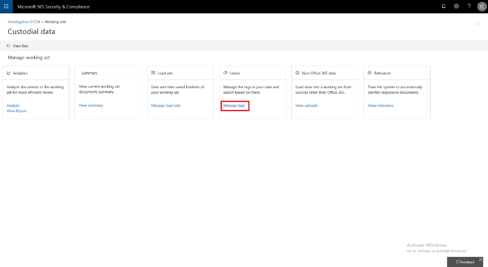

# 创建标记组Create tag groups

必须先创建标记，您或其他人员才能标记审阅集内的文档。Before you or other people can tag documents in a review set, the tags must be created. 您可以通过创建包含子标记的标记组来这样做。You can do this by creating tag groups that contain child tags. 在审阅审阅集内的文档时，标记将显示在标记面板中。Tags are displayed in the tagging panel when reviewing documents in a review set.

创建标记组：To create a tag group:

1.  在审阅集内，单击"**管理审阅集"。**In a review set, click **Manage review set**.

    

2.  在"标记 **"** 磁贴中，单击"**管理标记"。**In the **Tags** tile, click **Manage tags**.

    

进入标记管理后，就可以创建标记以满足你的案例的要求。Once inside the tag management, tags can be created to meet the requirements of your case. 你可以先创建一个标记组。You can start by creating a tag group.

1.  单击 **"添加"部分**。Click **Add section**.

    

    保存时预览屏幕将更新，以便你可以预览标记面板，而无需关闭标记管理屏幕并返回到工作集。The preview screen will update when you save so you can preview the tag panel without having to close the tag management screen and go back to the working set.

2. 输入标题和可选说明。Enter a title and optional description. 

3. 若要在该组内创建标记，请单击新标记组上的省略号以在此新部分中创建标记。To create a tag within that group, click the ellipses on the new tag group to create tags in that new section.
    
    

   - **选项** 标记将强制用户从一组标记中选择一个标记。**Option tags** will force users to select one tag from a group of tags.
   
   - **复选框标记** 将允许用户选择任何标记组合。**Check box tags** will allow users to select any combination of tags. |

## 嵌套标记Nested tags

若要嵌套标记，请单击标记旁边的省略号，然后选择要添加的新标记。To nest tags, click the ellipses next to a tag and then select a new tag to add.

