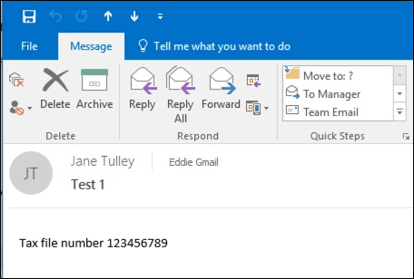

# 创建、测试和优化 DLP 策略

数据丢失防护（DLP）是一种合规性功能，旨在帮助您的组织防止将敏感信息有意或无意地暴露给不需要的团体。 DLP 的根在 Exchange Server 和 Exchange Online 中，也适用于 SharePoint Online 和 OneDrive for Business。

DLP 使用内容分析引擎检查电子邮件和文件的内容，查找敏感信息，如信用卡号和个人身份信息（PII）。 敏感信息通常不应通过电子邮件发送，也不应包含在文档中，而无需执行其他步骤，如加密电子邮件或文件。 使用 DLP 可以检测敏感信息，并采取如下操作：

- 记录事件的审核目的
- 向发送电子邮件或共享文件的最终用户显示警告
- 主动阻止电子邮件或文件共享发生

有时客户会关闭 DLP，因为他们不会认为自己需要保护的数据类型。 假定敏感数据（例如医疗记录或财务信息）仅适用于卫生保健行业或运行在线商店的公司。 但任何企业都可以定期处理敏感信息，即使他们不知道也是如此。 员工姓名和出生日期的电子表格与客户名称和信用卡详细信息的电子表格一样敏感。 此外，这种类型的信息可能会像你预期的那样浮动，因为员工不知不觉地转到日常任务，而不考虑从系统中导出 CSV 文件并向某人发送电子邮件的任何内容。 如果员工在不考虑结果的情况下发送包含信用卡或银行详细信息的电子邮件，您可能还会感到吃惊。

## DLP 如何检测敏感信息

敏感信息通过正则表达式（RegEx）模式匹配来标识，并与其他指示符（如特定关键字与匹配模式的接近程度）相结合。 这是信用卡号的一个示例。 签证信用卡号有16位数字。 但是，可以用不同的方式（例如，1111-1111-1111-1111、1111 1111 1111 1111 或1111111111111111）编写这些数字。

任何16个数字字符串不一定是信用卡号，它可以是来自技术支持系统的票证号，也可以是一段硬件的序列号。 若要说明信用卡号和无害的16位字符串之间的区别，请执行计算（校验和），以确认这些号码与各种信用卡品牌中的已知模式相匹配。

此外，关键字（如 "签证" 或 "AMEX"）以及可能是信用卡到期日期的最接近日期值的临近也被认为是决定数据是否是信用卡号的决定。

换句话说，DLP 通常非常智能，足以识别电子邮件中这两个文本之间的差异：

- "可以定购我一个新的便携式计算机。 使用我的签证号码1111-1111-1111-1111，到期日期为11/22，并在你拥有它时向我发送估计的交货日期。
- "我的膝上型电脑序列号是2222-2222-2222-2222，它是在11/2010 购买的。 顺便说，我的出差签证是否已批准？ "

有关 "保持书签" 的一个很有用的参考是[关于敏感信息类型的主题，这些信息类型](what-the-sensitive-information-types-look-for.md)解释了如何检测每种信息类型。

## 从何处开始使用数据丢失防护

如果数据泄露风险不是完全显而易见的，则很难确切地使用实现 DLP 时应开始的情况。 幸运的是，可以在 "测试模式" 下运行 DLP 策略，这样您就可以在将其转换为前评估其有效性和准确性。

可以通过 Exchange 管理中心管理 Exchange Online 的 DLP 策略。 但您可以通过安全 & 合规性中心为所有工作负载配置 DLP 策略，因此这正是我将在本文中用到的演示。 在安全 & 合规性中心中，你将在**数据丢失防护** > **策略**下找到 DLP 策略。 单击 "**创建要启动的策略**"。

Microsoft 365 提供了一系列可用于创建 DLP 策略的[dlp 策略模板](what-the-dlp-policy-templates-include.md)。 假设你是澳大利亚的商业版。 您可以筛选策略模板以仅显示与澳大利亚相关的人员，这些模板属于财务、医疗和运行状况的一般类别和隐私。

在本演示中，我将选择澳大利亚个人身份信息（PII）数据，其中包括澳大利亚税收文件编号（TFN）和驾驶执照号码的信息类型。

为新的 DLP 策略命名。 默认名称将与 DLP 策略模板相匹配，但您应选择一个更具描述性的名称，因为可以从同一个模板中创建多个策略。

选择策略将应用于的位置。 DLP 策略可应用于 Exchange Online、SharePoint Online 和 OneDrive for Business。 我打算将此策略配置为应用于所有位置。

在第一个 "**策略设置**" 步骤中，只接受 "现在" 的默认值。 您可以在 DLP 策略中进行大量的自定义，但默认值是一个很好的启动位置。

单击 "**下一步**" 后，将显示其他具有更多自定义选项的**策略设置**页。 对于您刚测试的策略，可以从这里开始进行一些调整。

- 我已经关闭了现在的策略提示，如果只是在测试并不想向用户显示任何内容，这是一项合理的步骤。 策略提示向用户显示即将违反 DLP 策略的警告。 例如，Outlook 用户将看到一条警告，指出他们所附加的文件包含信用卡号码，并将导致拒绝其电子邮件。 策略提示的目标是在发生不兼容的行为之前将其停止。
- 我还将10的实例数从10减少到1，以便此策略将检测所有的澳大利亚 PII 数据共享，而不只是批量共享数据。
- 我还向事件报告电子邮件添加了另一个收件人。

最后，我已将此策略配置为先在测试模式下运行。 请注意，在下面的选项中，还提供了在测试模式下禁用策略提示的选项。 这使您可以灵活地在策略中启用策略提示，但在测试过程中决定是显示还是隐藏它们。

在最终审阅屏幕上，单击 "**创建**" 以完成策略的创建。

## 测试 DLP 策略

新的 DLP 策略将在大约1小时内开始生效。 可以坐下来等待，等待正常的用户活动触发，也可以尝试自己触发它。 之前我已链接到有关[敏感信息类型](what-the-sensitive-information-types-look-for.md)的本主题，其中提供了有关如何触发 DLP 匹配的信息。

例如，我为本文创建的 DLP 策略将检测澳大利亚税文件编号（TFN）。 根据文档，匹配项基于以下条件。

 
为了以一种不钝的方式展示 TFN 检测，使用词语 "税收 file number" 和一个接近接近的9位字符串的电子邮件将 sail，而不会出现任何问题。 不触发 DLP 策略的原因是，9位数的字符串必须传递指示它是有效的 TFN 而不只是无害的数字字符串的校验和。

相比之下，带有 "税收 file number" 一词的电子邮件和传递校验和的有效 TFN 将触发该策略。 对于此处的记录，使用的 TFN 是从生成有效但不是正版的 TFNs 的网站获取的。 此类网站非常有用，因为测试 DLP 策略时最常见的错误之一是使用无效的虚设号码，而不会传递校验和（因此不会触发策略）。

事件报告电子邮件包括检测到的敏感信息类型、检测到的实例数以及检测的可信度。

如果您将 DLP 策略保留在测试模式中并分析事件报告电子邮件，则可以开始了解 DLP 策略的准确性以及强制实施它的效率。 除了事件报告之外，您还可以[使用 DLP 报告](view-the-dlp-reports.md)查看整个租户中策略匹配的聚合视图。

## 优化 DLP 策略

在分析策略命中率时，您可能希望对策略的行为方式进行一些调整。 作为一个简单的示例，您可以确定电子邮件中的一个 TFN 不是问题（我认为它仍然是，但为了便于演示，我们可以使用它），但两个或更多的实例是一个问题。 多个实例可能是一种危险方案，例如员工通过电子邮件将 CSV 导出从 HR 数据库发送到外部方，例如外部会计服务。 一定要检测并阻止的内容。

在安全 & 合规性中心中，可以编辑现有策略以调整行为。

 
您可以调整位置设置，以便仅将策略应用于特定工作负载或特定网站和帐户。

您还可以调整策略设置并编辑规则，以更好地满足您的需求。

在 DLP 策略中编辑规则时，您可以更改：

- 条件，包括将触发规则的敏感数据的实例的类型和数量。
- 执行的操作，例如限制对内容的访问。
- 用户通知，这是在其电子邮件客户端或 web 浏览器中向用户显示的策略提示。
- 用户覆盖，用于确定用户是否可以选择继续进行电子邮件或文件共享。
- 事件报告，通知管理员。

在本演示中，我向策略添加了用户通知（在没有充分的用户意识培训的情况下，请注意这样做），并允许用户通过业务理由或将其标记为误报来替代策略。 请注意，如果您想要包括有关组织策略的任何其他信息，则还可以自定义电子邮件和策略提示文本，如果有问题，则提示用户联系支持人员。

策略包含两个用于处理高容量和低音量的规则，因此请务必使用所需的操作来编辑。 这是根据其特征对事例进行不同处理的机会。 例如，您可能允许对较少的卷冲突（但不允许对高批量冲突的重写）进行重写。

此外，如果要实际阻止或限制对违反策略的内容的访问权限，则需要对规则配置操作以执行此操作。

在将这些更改保存到策略设置后，我还需要返回到策略的主设置页，并启用在策略处于测试模式时向用户显示策略提示的选项。 这是将 DLP 策略引入到最终用户并进行用户意识培训的有效方法，而不会导致影响其工作效率的误报过多。

在服务器端（如果需要，则为云端）上，由于各种处理间隔，更改可能不会立即生效。 如果要进行 DLP 策略更改，以向用户显示新的策略提示，则用户可能看不到这些更改会立即在 Outlook 客户端中生效，这将检查每24小时进行的策略更改。 如果要加快测试速度，可以使用此注册表修补程序[从 PolicyNudges 项中清除上次下载时间戳](https://support.microsoft.com/en-au/help/2823261/changes-to-a-data-loss-prevention-policy-don-t-take-effect-in-outlook?__hstc=18650278.46377037dc0a82baa8a30f0ef07a7b2f.1538687978676.1538693509953.1540315763430.3&__hssc=18650278.1.1540315763430&__hsfp=3446956451)。 Outlook 将在您下次重新启动时下载最新的策略信息，并开始撰写一封电子邮件。

如果启用了策略提示，则用户将开始在 Outlook 中看到提示，并且可以在发生时向您报告误报。

## 调查误报

DLP 策略模板不能完全直接从盒中得到。 您可能会发现环境中出现误报，这就是为什么要轻松实现 DLP 部署的重要原因，这就是充分测试和调整策略的时间。

下面是误报的一个示例。 此电子邮件非常无害。 用户向某人提供自己的移动电话号码，并包括他们的电子邮件签名。

 
但用户会看到策略提示警告他们，电子邮件包含敏感信息，尤其是澳大利亚驾驶执照号码。

用户可以报告误报，管理员可以查看它发生的原因。 在事件报告电子邮件中，将电子邮件标记为误报。

此驱动程序的许可证是深入研究的一个很有用的示例。 出现这种误报的原因是，在300个字符与关键字 "悉尼新南威尔士" （不区分大小写）的任何9位数的字符串（甚至是10个数字字符串的一部分）中将触发 "澳大利亚 Driver License" 类型。 因此，它是由电话号码和电子邮件签名触发的，仅因为用户在悉尼中的情况下。

一种方法是从策略中删除澳大利亚 driver 的许可证信息类型。 由于它是 DLP 策略模板的一部分，因此不会强制使用该模板。 如果只对税文件号而不是驱动程序的许可证感兴趣，则可以将其删除。 例如，您可以从策略中的 "低容量" 规则中删除它，但将其保留在高容量规则中，以便仍检测到多个驱动程序许可证的列表。

 
另一种方法是简单地增加实例计数，以便仅在有多个实例时，才会检测到较小数量的驱动程序许可证。

除了更改实例计数之外，还可以调整匹配精度（或置信度）。 如果您的敏感信息类型有多种模式，则可以调整规则中的匹配精度，以便您的规则只匹配特定模式。 例如，若要帮助减少误报，可以设置规则的匹配精度，使其仅与具有最高可信度的模式相匹配。 了解如何计算可信度是有点棘手的（超出此文章的范围），但下面是[有关如何使用可信度调整规则](data-loss-prevention-policies.md#match-accuracy)的一个很有用的说明。

最后，如果您想要更多地获取更多的信息，可以自定义任何敏感信息类型-例如，可以从[澳大利亚驾照](what-the-sensitive-information-types-look-for.md#australia-drivers-license-number)的关键字列表中删除 "悉尼新南威尔士"，以消除上述误报。 若要了解如何使用 XML 和 PowerShell 执行此操作，请参阅本主题关于[自定义内置的敏感信息类型](customize-a-built-in-sensitive-information-type.md)。

## 启用 DLP 策略

当您感到您的 DLP 策略准确而有效地检测敏感信息类型，并且最终用户准备好处理这些策略时，您可以启用该策略。

 
如果你正在等待查看策略将生效的时间，请[连接到 Security & 合规性中心 PowerShell](https://docs.microsoft.com/powershell/exchange/office-365-scc/connect-to-scc-powershell/connect-to-scc-powershell?view=exchange-ps) ，然后运行[DlpCompliancePolicy cmdlet](https://docs.microsoft.com/powershell/module/exchange/policy-and-compliance-dlp/get-dlpcompliancepolicy?view=exchange-ps) ，以查看 DistributionStatus。

打开 DLP 策略后，您应运行自己的一些最终测试，以确保预期的策略操作正在发生。 如果你尝试测试信用卡数据之类的内容，则会有一些网站联机，其中包含有关如何生成示例信用卡或其他个人信息的信息，这些信息将传递校验和并触发策略。

允许用户替代的策略将作为策略提示的一部分向用户显示该选项。

限制内容的策略将以策略提示的一部分向用户显示警告，并阻止他们发送电子邮件。

## 总结

数据丢失防护策略对于所有类型的组织都很有用。 由于您对策略提示、最终用户覆盖和事件报告等的控制，测试某些 DLP 策略是一个低风险的实践。 您可以安静地测试一些 DLP 策略，以查看组织中已发生的冲突类型，然后使用较低的误报率手工创建策略，向用户介绍允许和不允许的内容，然后将您的 DLP 策略部署到组织中。
