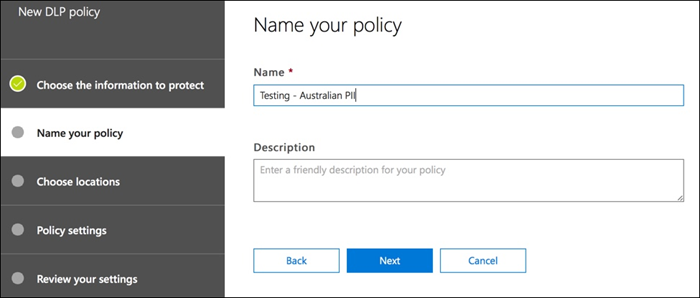

# 创建、测试和优化 DLP 策略

DLP (数据丢失) 可帮助您防止意外或意外共享敏感信息。

DLP 检查电子邮件和文件，以查找敏感信息，如信用卡号。 使用 DLP 可以检测敏感信息，并采取措施，例如：

- 记录事件以用于审核
- 向发送电子邮件或共享文件的最终用户显示警告
- 主动阻止电子邮件或文件共享发生

## 权限

创建 DLP 策略的合规性团队成员需要具有对合规中心的访问权限。 默认情况下，租户管理员将具有访问权限，可授予合规部官员和其他人员访问权限。 请按以下步骤操作：
  
1. 在 Microsoft 365 中创建组并向其添加合规部主管。
    
2. 在安全 &amp; 合规中心的“**权限**”页面上创建一个角色组。 

3. 创建角色组时，请使用" **选择** 角色"部分将以下角色添加到角色组 **：DLP Compliance Management**。
    
4. 使用“**选择成员**”部分，将先前创建的 Microsoft 365 组添加到角色组中。

使用" **仅查看 DLP 合规性管理** "角色创建具有 DLP 策略和 DLP 报告仅查看权限的角色组。

有关详细信息，请访问[向用户授予对 Office 365 合规中心的访问权限](../security/defender-365-security/grant-access-to-the-security-and-compliance-center.md)。
  
创建和应用 DLP 策略时需要这些权限，才能不强制执行策略。

## DLP 如何检测敏感信息

DLP 通过正则表达式 (RegEx) 模式匹配，以及其他指示器（如某些关键字与匹配模式的邻近度）查找敏感信息。 例如，VISA 信用卡号有 16 个数字。 但是，可以不同方式写入这些数字，例如 1111-1111-1111-1111、1111 1111 1111 1111 或 1111111111111。

任何 16 位字符串不一定是信用卡号，它可以是技术支持系统的票证号或硬件的序列号。 为了区分信用卡号和无害的 16 位数字字符串，将执行 (校验和) ，以确认数字与各种信用卡品牌的已知模式匹配。

如果 DLP 找到关键字（如"VISA"或"AMEX"，即可能是信用卡到期日期的接近日期值）时，DLP 还会使用该数据来帮助其确定字符串是否是信用卡号。

换句话说，DLP 足够智能，可以识别电子邮件中这两个文本字符串的区别：

- "能否为我订购一台新笔记本电脑。 使用我的 VISA 号码 1111-1111-1111-1111（2012 年 11 月 22 日到期）并将估计的送达日期发送给我。"
- "我的笔记本电脑序列号为 2222-2222-2222-2222，于 2010 年 11 月 11 日购买。 路过一下，我的旅行护照是否获得批准？

请参阅 [敏感信息类型实体定义](sensitive-information-type-entity-definitions.md) ，该定义说明了如何检测每个信息类型。

## 从数据丢失防护开始

当数据泄露的风险并不明显时，很难确定应从何处开始实施 DLP。 幸运的是，DLP 策略可以在"测试模式"中运行，从而允许您在启用它们之前评估其有效性和准确性。

可以通过 Exchange 管理中心管理 Exchange Online 的 DLP 策略。 但是，可以通过安全与合规中心配置所有& DLP 策略，以便本文中将使用此策略进行演示。 在安全&合规中心，您可以在数据丢失防护策略下 **找到** DLP  >  **策略**。 选择 **"创建策略** "开始。

Microsoft 365 提供了一系列可用于创建策略的 [DLP](what-the-dlp-policy-templates-include.md) 策略模板。 假设你是澳大利亚企业。 可以筛选澳大利亚上的模板，然后选择"财务、医疗与健康"和"隐私"。

对于本演示，我将选择澳大利亚个人身份信息 (PII) 数据，其中包括澳大利亚税号 (TFN) 和驾驶证号码的信息类型。

为新的 DLP 策略命名。 默认名称将匹配 DLP 策略模板，但您应该选择您自己的更具描述性的名称，因为可以从同一模板创建多个策略。

选择策略将应用于的位置。 DLP 策略可应用于 Exchange Online、SharePoint Online 和 OneDrive for Business。 我将保留此策略的配置，以应用于所有位置。

第一 **个"策略设置"** 步骤中，现在只需接受默认值。 您可以自定义 DLP 策略，但默认设置是很好的开始。

单击下一步后，**你将看到一个包含更多自定义 **选项的其他策略** 设置页面。 对于你刚刚测试的策略，你可以在这里开始进行一些调整。

- 我目前已关闭策略提示，如果你只是测试了一些内容，并且还不想向用户显示任何内容，这是一个合理的步骤。 策略提示向用户显示即将违反 DLP 策略的警告。 例如，Outlook 用户会看到一条警告，提示他们附加的文件包含信用卡号，并会导致其电子邮件被拒绝。 策略提示的目标是在不符合行为发生之前停止该行为。
- 我还将实例数量从 10 个减少为 1 个，以便此策略将检测澳大利亚 PII 数据的任何共享，而不只是批量共享数据。
- 我还将另一个收件人添加到事件报告电子邮件中。

最后，我最初已配置此策略以在测试模式下运行。 请注意，此处还有一个在测试模式下禁用策略提示的选项。 这样，您便能够灵活地在策略中启用策略提示，然后决定在测试期间是显示还是禁止显示它们。

在最终审阅屏幕上，单击 **"创建** "以完成策略创建。

## 测试 DLP 策略

新的 DLP 策略将在大约 1 小时内开始生效。 你可以坐在一起等待正常用户活动触发它，也可以尝试自己触发它。 之前我链接到 ["敏感信息类型"实体](sensitive-information-type-entity-definitions.md)定义，其中提供了有关如何触发 DLP 匹配的信息。

例如，我为本文创建的 DLP 策略将检测澳大利亚税号 (TFN) 。 根据文档，匹配基于以下条件。

 
为了以相当大的方式演示 TFN 检测，字词为"税务文件编号"且邻近使用 9 个数字字符串的电子邮件将经过，而没有任何问题。 不触发 DLP 策略的原因是，9 位字符串必须传递校验和，以指示它是有效的 TFN，而不只是一个无害的数字字符串。

相比之下，包含单词"Tax file number"和通过校验和的有效 TFN 的电子邮件将触发策略。 对于此处的记录，我使用的 TFN 来自生成有效（但不是正版）TFN 的网站。 此类网站非常有用，因为测试 DLP 策略时最常见的错误之一是使用 无效 的假数，并且不会传递校验和 (因此不会触发策略) 。

事件报告电子邮件包括检测到的敏感信息类型、检测到的实例数以及检测的可信度。

如果您将 DLP 策略保留为测试模式并分析事件报告电子邮件，您可以开始了解 DLP 策略的准确性以及强制执行策略时它的有效度。 除了事件报告之外，您还可以使用 [DLP](view-the-dlp-reports.md) 报告查看整个租户内策略匹配项的聚合视图。

## 调整 DLP 策略

在分析策略命中时，可能需要对策略的行为方式进行一些调整。 作为一个简单的示例，你可能会确定电子邮件中的一个 TFN 不是问题 (我认为它仍然是问题，但为了演示) ，让我们使用它，但两个或多个实例是一个问题。 多个实例可能是一个风险场景，例如员工通过电子邮件发送从 HR 数据库到外部方（例如外部会计服务）的 CSV 导出。 当然，你更希望检测和阻止某些内容。

在安全&合规中心，可以编辑现有策略以调整行为。

 
您可以调整位置设置，以便仅将策略应用于特定工作负荷或特定站点和帐户。

还可以调整策略设置并编辑规则以更好地满足你的需求。

在 DLP 策略中编辑规则时，可以更改：

- 条件，包括将触发规则的敏感数据实例的类型和数量。
- 采取的操作，例如限制对内容的访问。
- 用户通知，这是在用户的电子邮件客户端或 Web 浏览器中显示的策略提示。
- 用户替代，确定用户是否可以选择继续其电子邮件或文件共享。
- 事件报告，以通知管理员。

对于本演示，我向策略添加了用户通知 (在没有足够用户意识培训) 的情况下执行此操作，并且允许用户使用业务理由或将策略标记为误报来替代策略。 请注意，如果要包含有关组织策略的其他任何信息，也可以自定义电子邮件和策略提示文本，或者提示用户联系支持人员（如果他们有疑问）。

该策略包含用于处理高容量和低音量的两个规则，因此请确保使用您想要的操作编辑这两个规则。 这是根据其特征以不同方式处理事例的机会。 例如，你可能允许针对低音量冲突进行覆盖，但不允许覆盖高音量冲突。

此外，如果要实际阻止或限制对违反策略的内容的访问，则需要对规则配置操作以执行该操作。

将这些更改保存为策略设置后，我还需要返回到策略的主设置页面，并启用在策略在测试模式下向用户显示策略提示的选项。 这是向最终用户介绍 DLP 策略以及进行用户意识培训的有效方式，而不会冒太多影响其工作效率的误报的风险。

在服务器端 (或云端（如果) ，由于处理间隔不同，更改可能不会立即生效。 如果要进行向用户显示新策略提示的 DLP 策略更改，用户可能不会看到更改立即在 Outlook 客户端中生效，从而每 24 小时检查一次策略更改。 如果你想要加快测试速度，可以使用此注册表修补程序从 [PolicyNudges](https://support.microsoft.com/en-au/help/2823261/changes-to-a-data-loss-prevention-policy-don-t-take-effect-in-outlook?__hstc=18650278.46377037dc0a82baa8a30f0ef07a7b2f.1538687978676.1538693509953.1540315763430.3&__hssc=18650278.1.1540315763430&__hsfp=3446956451)项中清除上次下载时间戳。 下次重新启动 Outlook 并开始撰写电子邮件时，Outlook 将下载最新策略信息。

如果已启用策略提示，用户将开始在 Outlook 中看到这些提示，并且可以在出现误报时向用户报告误报。

## 调查误报

DLP 策略模板并非开箱即用。 您可能发现环境中出现一些误报，这就是为什么轻松进入 DLP 部署非常重要的原因，因此请花时间充分测试和调整策略。

下面是一个误报示例。 此电子邮件是无害的。 用户向某人提供其移动电话号码，并包括其电子邮件签名。

 
但是，用户会看到一条策略提示，警告他们电子邮件包含敏感信息，特别是澳大利亚驾驶证号码。

用户可以报告误报，管理员可以查看发生误报的原因。 在事件报告电子邮件中，电子邮件被标记为误报。

此驱动程序的许可证案例是一个很好的示例来深入了解。 出现此误报的原因是，"澳大利亚驾驶证"类型由任何 9 位字符串 (（即使是 10 位字符串) 的一部分）触发，该字符串类型与关键字"driver nsw" (不区分大小写的) 接近 300 个字符。 因此，它由电话号码和电子邮件签名触发，仅仅是因为用户恰好位于北京。

一个选项是从策略中删除澳大利亚驾驶证信息类型。 它就在那里，因为它是 DLP 策略模板的一部分，但不强制我们使用它。 如果你只对税务文件编号（而不是驱动程序许可证）感兴趣，则只需将其删除。 例如，你可以将其从策略中的低容量规则中删除，但将其保留为高容量规则，以便仍检测到多个驱动程序许可证的列表。

 
另一个选项是只需增加实例计数，以便仅在存在多个实例时检测到低容量的驱动程序许可证。

除了更改实例计数之外，还可以调整匹配准确度 (可信度) 。 如果您的敏感信息类型具有多个模式，您可以调整规则中的匹配准确度，以便规则仅匹配特定模式。 例如，为了帮助减少误报，你可以设置规则的匹配准确度，以便它仅匹配可信度最高的模式。 了解可信度的计算方式有点复杂 (超出本文) 的范围，但下面详细说明了如何使用可信度调整 [规则](data-loss-prevention-policies.md#match-accuracy)。

最后，如果你希望更高级一点，可以自定义任何敏感信息类型，例如，可以从澳大利亚驾驶证号码的关键字列表中删除"澳大利亚 NSW"，以消除上面触发的误报。  若要了解如何使用 XML 和 PowerShell 执行此操作，请参阅自定义内置 [敏感信息类型](customize-a-built-in-sensitive-information-type.md)。

## 启用 DLP 策略

如果您满意您的 DLP 策略准确有效地检测敏感信息类型，并且您的最终用户已准备好处理已制定的策略，您可以启用该策略。

 
如果你正在等待查看策略何时生效，请连接到安全与合规& [PowerShell](/powershell/exchange/connect-to-scc-powershell) 并运行 [Get-DlpCompliancePolicy cmdlet](/powershell/module/exchange/get-dlpcompliancepolicy) 以查看 DistributionStatus。

启用 DLP 策略后，应运行您自己的一些最终测试，以确保发生预期的策略操作。 如果你尝试测试信用卡数据等内容，则有一些在线网站包含如何生成示例信用卡或其他个人信息的信息，这些信息将传递校验和并触发策略。

允许用户替代的策略将在策略提示中向用户显示该选项。

限制内容的策略将在策略提示中向用户显示警告，并阻止他们发送电子邮件。

## 摘要

数据丢失防护策略对于所有类型的组织都很有用。 测试某些 DLP 策略是一项低风险练习，因为您可以控制策略提示、最终用户替代和事件报告等内容。 您可以静默测试某些 DLP 策略以查看组织中已经发生哪种类型的冲突，然后制定低误报率的策略，就允许和不允许的情况向用户进行指导，然后将 DLP 策略推出到组织。