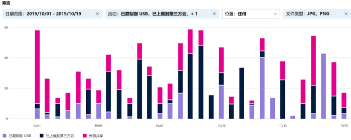

# 活动资源管理器（预览版）入门Get started with activity explorer (preview)

数据分类概述和内容浏览器选项卡使你可以查看已发现和已标记的内容以及该内容的位置。The data classification overview and content explorer tabs give you visibility into what content has been discovered and labeled, and where that content is. 活动资源管理器通过允许你监视对已标记内容所执行的操作来完善此功能套件。Activity explorer rounds out this suite of functionality by allowing you to monitor what's being done with your labeled content. 活动资源管理器提供历史视图。Activity explorer provides a historical view.

可通过以下方式筛选数据：You can filter the data by:

- 日期范围date range
- 活动类型activity type
- 位置location
- 用户user
- 敏感度标签sensitivity label
- 保留标签retention label

可以以列表或条形图的形式查看数据。You can view the data either as a list or a bar graph.

## 先决条件Prerequisites

访问和使用活动资源管理器的每个帐户，都必须拥有从以下之一订阅向其分配的许可证：Every account that accesses and uses activity explorer must have a license assigned to it from one of these subscriptions:

- Microsoft 365 (E5)Microsoft 365 (E5)
- Office 365 (E5)Office 365 (E5)
- 高级合规性（E5）加载项Advanced Compliance (E5) add-on
- 高级威胁智能（E5）加载项Advanced Threat Intelligence (E5) add-on

## 活动类型Activity type

Microsoft 365 监视和报告跨 SharePoint Online、OneDrive 和终结点的 12 种活动类型。Microsoft 365 monitors and reports on 12 types of activities across SharePoint Online, OneDrive and endpoints. 终结点是运行 Windows 10 的用户设备。Endpoints are user devices running Windows 10.

- 已创建文件File created
- 已修改文件File modified
- 已重命名文件File renamed
- 已复制到云的文件File copied to cloud
- 不允许应用访问的文件File accessed by unallowed app
- 已打印的文件File printed
- 已复制到可移动媒体的文件File copied to removable media
- 已复制到网络共享的文件File copied to network share
- 已读文件File read
- 已复制到剪贴板的文件file copied to clipboard
- 已应用的标签Label applied
- 已更改（已升级、已降级或已删除）的标签Label changed (upgraded, downgraded, or removed)

了解对敏感的已标记内容采取何种措施的价值在于，你可以查看已经实施的控件（例如[数据丢失防护策略](data-loss-prevention-policies.md)）是否有效。The value of understanding what actions are being taken with your sensitive labeled content is that you can see if the controls that you have already put into place, such as [data loss prevention policies](data-loss-prevention-policies.md) are effective or not. 如果无效，或者发现某项意外内容（如大量项目被标记为`highly confidential`并降级为`general`），则可管理各种策略并采取新操作来限制意外行为。If not, or if you discover something unexpected, such as a large number of items that are labeled `highly confidential` and are downgraded `general`, you can manage your various policies and take new actions to restrict the undesired behavior.

设置筛选器后，可以执行以下操作：Once your filters are set, you can:

- 将鼠标悬停在条形图的某一部分，可查看属于该类别“”的项目数。hover over a segment of the bar chart to see the number of items that fall into that category 
- 导出数据export the data
- 从列表中选择任何给定项，并在弹出菜单中查看操作的详细信息select any given item from the list and view the details of the action in the fly-out

## 另请参阅See also
- [敏感度标签Sensitivity labels](sensitivity-labels.md)
- [保留标签Retention labels](labels.md)
- [敏感信息类型查找的内容What the sensitive information types look for](what-the-sensitive-information-types-look-for.md)
- [保留策略概述Overview of retention policies](retention-policies.md)
