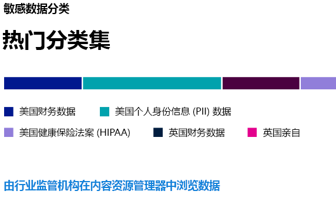
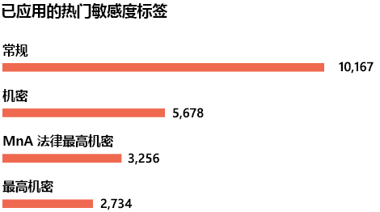
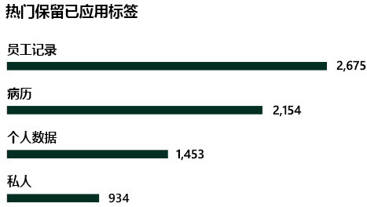

# 了解你的数据 - 数据分类概述Know your data - data classification overview

作为 Microsoft 365 管理员或合规性管理员，你可以评估并标记组织中的内容，以便控制其去向，随时随地提供保护，并确保根据组织的需要保留和删除该内容。As a Microsoft 365 administrator or compliance administrator, you can evaluate and then tag content in your organization in order to control where it goes, protect it no matter where it is and to ensure that it is preserved and deleted according to your organizations needs. 你可以通过应用[敏感度标签](sensitivity-labels.md)、[保留标签](retention.md#retention-labels)和敏感信息类型分类来实现这一目标。You do this through the application of [sensitivity labels](sensitivity-labels.md), [retention labels](retention.md#retention-labels), and sensitive information type classification. 可通过多种方法进行发现、评估和标记，但最终的结果是，你可能拥有大量的文档和电子邮件，它们使用其中一个或两个标签进行了标记和分类。There are various ways to do the discovery, evaluation and tagging, but the end result is that you may have very large number of documents and emails that are tagged and classified with one or both of these labels. 应用保留标签和敏感度标签后，你希望了解如何在租户中使用这些标签以及对这些项目所执行的操作。After you apply your retention labels and sensitivity labels, you'll want to see how the labels are being used across your tenant and what is being done with those items. 数据分类页面提供了对内容主体的可见性，具体如下：The data classification page provides visibility into that body of content, specifically:

- 已分类为敏感信息类型的项目数量以及这些分类是什么the number items that have been classified as a sensitive information type and what those classifications are
- Microsoft 365 和 Azure 信息保护中应用最多的敏感度标签the top applied sensitivity labels in both Microsoft 365 and Azure Information Protection
- 应用最多的保留标签the top applied retention labels
- 用户对敏感内容所执行的操作的摘要a summary of activities that users are taking on your sensitive content
- 敏感数据和已保留数据的位置the locations of your sensitive and retained data

此外，还可在数据分类页面上管理以下功能：You also manage these features on the data classification page:
- [可训练的分类器trainable classifiers](classifier-learn-about.md)
- [敏感信息类型sensitive information types](./sensitive-information-type-entity-definitions.md)

可以在“**Microsoft 365 合规中心**”或“**Microsoft 365 安全中心**” > “**分类**” > “**数据分类**”中找到数据分类。You can find data classification in the **Microsoft 365 compliance center** or **Microsoft 365 security center** > **Classification** > **Data Classification**.

获取介绍我们的数据分类功能的视频教程。Take a video tour of our data classification features.

> [!VIDEO https://www.microsoft.com/videoplayer/embed/RE4vx8x]

创建任何策略前，数据分类将先扫描敏感内容和标记内容。Data classification will scan your sensitive content and labeled content before you create any policies. 这称为 **零变更管理**。This is called **zero change management**. 这样，你就可以看到你环境中所有保留和灵敏度标签的影响，并使你能够开始评估你的保护和治理策略需求。This lets you see the impact that all the retention and sensitivity labels are having in your environment and empower you to start assessing your protection and governance policy needs.

## 先决条件Prerequisites

许多不同的订阅都支持终结点 DLP。A number of different subscriptions support Endpoint DLP. 若要查看终结点 DLP 的许可选项，请参阅[信息保护许可指南](/office365/servicedescriptions/microsoft-365-service-descriptions/microsoft-365-tenantlevel-services-licensing-guidance/microsoft-365-security-compliance-licensing-guidance#information-protection)。To see licensing options for Endpoint DLP see [Information Protection licensing for guidance](/office365/servicedescriptions/microsoft-365-service-descriptions/microsoft-365-tenantlevel-services-licensing-guidance/microsoft-365-security-compliance-licensing-guidance#information-protection). 

### 权限Permissions

 为了访问数据分类页面，必须在以下任一角色或角色组中向帐户分配成员身份。In order to get access to the data classification page, an account must be assigned membership in any one of these roles or role groups.

**Microsoft 365 角色组****Microsoft 365 role groups**

- 全局管理员Global administrator
- 合规性管理员Compliance administrator
- 安全管理员Security administrator
- 合规性数据管理员Compliance data administrator

## 内容中的最常用敏感信息类型Sensitive information types used most in your content

Microsoft 365 附带了许多敏感信息类型的定义，例如包含社会安全号码或信用卡号的项目。Microsoft 365 comes with many definitions of sensitive information types, such as an item containing a social security number or a credit card number. 有关敏感信息类型的详细信息，请参阅[敏感信息类型实体定义](sensitive-information-type-entity-definitions.md)。For more information on sensitive information types, see [Sensitive information type entity definitions](sensitive-information-type-entity-definitions.md).

敏感信息类型卡片显示了在整个组织中找到并标记的最常用敏感信息类型。The sensitive information type card shows the top sensitive information types that have been found and labeled across your organization.

若要了解任何给定分类类别中的项目数量，请将鼠标悬停在该类别的栏上。To find out how many items are in any given classification category, hover over the bar for the category.

> [!NOTE]
> 如果卡片上显示消息“找不到包含敏感信息的数据”。If the card displays the message "No data found with sensitive information". 这表示你的组织中没有任何项目归类为敏感信息类型，也没有对任何项目进行爬网。It means that there are no items in your organization that have been classified as being a sensitive information type or no items that have been crawled. 要开始使用标签，请参阅：To get started with labels, see:
>- [开始使用敏感度标签Get started with sensitivity labels](get-started-with-sensitivity-labels.md)
>- [开始使用保留策略和保留标签Get started with retention policies and retention labels](get-started-with-retention.md)
>- [敏感信息类型属性定义Sensitive information type entity definitions](sensitive-information-type-entity-definitions.md)

## 应用于内容的最常用敏感度标签Top sensitivity labels applied to content

通过 Microsoft 365 或 Azure 信息保护 (AIP) 将敏感度标签应用于项目时，会出现两种情况：When you apply a sensitivity label to an item either through Microsoft 365 or Azure Information Protection (AIP), two things happen:

- 指示项目对组织的价值的标记已嵌入到文档中，可随时随地进行跟踪a tag that indicates the value of the item to your org is embedded in the document and will follow it everywhere it goes
- 标记的存在将实现各种保护行为，例如强制性水印或加密。the presence of the tag enables various protective behaviors, such as mandatory watermarking or encryption. 如果启用了终结点保护，你甚至还可阻止项目脱离组织控制。With end point protection enabled you can even prevent an item from leaving your organizational control.

有关敏感度标签的详细信息，请参阅[了解敏感度标签](sensitivity-labels.md)。For more information on sensitivity labels, see: [Learn about sensitivity labels](sensitivity-labels.md)

必须为 SharePoint 和 OneDrive 中的文件启用灵敏度标签，以使相应的数据出现在数据分类页面中。Sensitivity labels must be enabled for files that are in SharePoint and OneDrive in order for the corresponding data to surface in the data classification page. 有关详细信息，请参阅[启用 SharePoint 和 OneDrive 中 Office 文件的敏感度标签](sensitivity-labels-sharepoint-onedrive-files.md)。For more information, see [Enable sensitivity labels for Office files in SharePoint and OneDrive](sensitivity-labels-sharepoint-onedrive-files.md).

敏感度标签卡片按敏感度级别显示项目（电子邮件或文档）的数量。The sensitivity label card shows the number of items (email or document) by sensitivity level.

> [!NOTE]
> 如果尚未创建或发布任何敏感度标签，或者任何内容均未应用敏感度标签，则此卡片将显示消息“未检测到任何敏感度标签”。If you haven't created or published any sensitivity labels or no content has had a sensitivity label applied, this card will display the message "No sensitivity labels detected". 若要开始使用敏感度标签，请参阅：To get started with sensitivity labels, see:
>- [开始使用敏感度标签](get-started-with-sensitivity-labels.md)或[配置 Azure 信息保护策略](/azure/information-protection/configure-policy)（对于 AIP）[Get started with sensitivity labels](get-started-with-sensitivity-labels.md) or for AIP [Configure the Azure information protection policy](/azure/information-protection/configure-policy)

## 应用于内容的最常用保留标签Top retention labels applied to content

保留标签用于管理组织中的内容的保留和处置方式。Retention labels are used to manage the retention and disposition of content in your organization. 应用后，它们可用于控制项目在删除之前的保留方式，是否应在删除之前对其进行评审，保留期何时到期以及是否应将其标记为记录。When applied, they can be used to control how an item will be kept before deletion, whether it should be reviewed prior to deletion, when its retention period expires, and whether it should be marked as a record. 有关详细信息，请参阅[了解保留策略和保留标签](retention.md)。For more information, see [Learn about retention policies and retention labels](retention.md).

“应用最多的保留标签”卡片显示具有给定保留标签的项目数量。The top applied retention labels card shows you how many items have a given retention label.

> [!NOTE]
> 如果此卡片显示消息“未检测到任何保留标签”，则表示尚未创建或发布任何保留标签，或者任何内容均未应用保留标签。If this card displays the message, "No retention labels detected", it means you haven't created or published any retention labels or no content has had a retention label applied. 要开始使用保留标签，请参阅：To get started with retention labels, see:
>- [开始使用保留策略和保留标签Get started with retention policies and retention labels](get-started-with-retention.md)

## 检测到的热门活动Top activities detected

此卡片提供用户对具有敏感度标签的项目执行的最常见操作的快速摘要。This card provides a quick summary of the most common actions that users are taking on the sensitivity labeled items. 可使用[活动资源管理器](data-classification-activity-explorer.md)深入了解 Microsoft 365 对位于 Windows 10 终结点上的已标记内容进行跟踪的八种不同活动。You can use the [Activity explorer](data-classification-activity-explorer.md) to drill deep down on eight different activities that Microsoft 365 tracks on labeled content and content that is located on Windows 10 endpoints.

> [!NOTE]
> 如果此卡片显示消息“未检测到任何活动”，则表示未对文件执行任何操作，或者未启用用户和管理员审核功能。If this card displays the message, "No activity detected" it means that there's been no activity on the files or that user and admin auditing isn't turned on. 若要打开审核日志，请参阅：To turn the audit logs on , see:
>- [在安全与合规中心搜索审核日志Search the audit log in security & compliance center](search-the-audit-log-in-security-and-compliance.md)

## 按位置列出的敏感度和保留标签数据Sensitivity and retention labeled data by location

数据分类报告的重点是让用户了解具有标签的项目数量及其位置。The point of the data classification reporting is to provide visibility into the number of items that have which label as well as their location. 通过这些卡片，你可以了解在 Exchange、SharePoint 和 OneDrive 等应用中具有标签的项目数量。These cards let you know how many labeled items the are in Exchange, SharePoint, and OneDrive etc.

> [!NOTE]
> 如果此卡片显示消息“未检测到任何位置”，则表示尚未创建或发布任何敏感度标签，或者任何内容均未应用保留标签。If this card displays the message, "No locations detected, it means you haven't created or published any sensitivity labels or no content has had a retention label applied. 若要开始使用敏感度标签，请参阅：To get started with sensitivity labels, see:
>- [敏感度标签Sensitivity labels](sensitivity-labels.md)

## 另请参阅See also

- [查看标签活动View label activity](data-classification-activity-explorer.md)
- [查看带标签的内容View labeled content](data-classification-content-explorer.md)
- [了解敏感度标签Learn about sensitivity labels](sensitivity-labels.md)
- [了解保留策略和保留标签Learn about retention policies and retention labels](retention.md)
- [敏感信息类型属性定义Sensitive information type entity definitions](sensitive-information-type-entity-definitions.md)
- [了解可训练的分类器（预览版）Learn about trainable classifiers (preview)](classifier-learn-about.md)