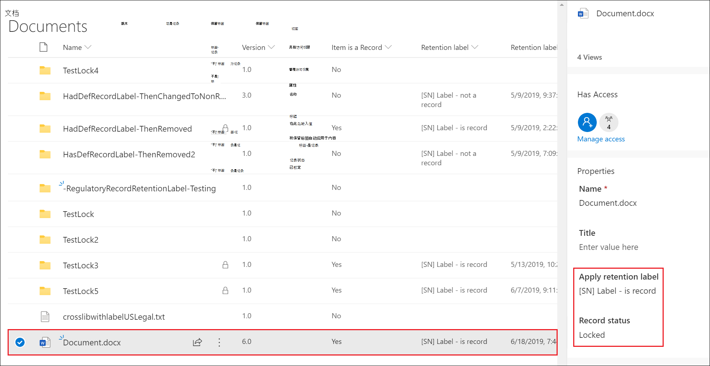

# <a name="declare-records-by-using-retention-labels"></a><span data-ttu-id="35539-103">使用保留标签声明记录</span><span class="sxs-lookup"><span data-stu-id="35539-103">Declare records by using retention labels</span></span>

><span data-ttu-id="35539-104">*[Microsoft 365 安全性与合规性许可指南](https://aka.ms/ComplianceSD)。*</span><span class="sxs-lookup"><span data-stu-id="35539-104">*[Microsoft 365 licensing guidance for security & compliance](https://aka.ms/ComplianceSD).*</span></span>

<span data-ttu-id="35539-105">如需将文档和电子邮件声明为 [记录](records-management.md#records)，请使用 [保留标签](retention.md#retention-labels) 将内容标记为 **记录** 或 **合规性记录**。</span><span class="sxs-lookup"><span data-stu-id="35539-105">To declare documents and emails as [records](records-management.md#records), you use [retention labels](retention.md#retention-labels) that mark the content as a **record** or a **regulatory record**.</span></span>

<span data-ttu-id="35539-106">如果不确定要使用记录还是合规性记录，请参阅[允许或禁止行为的对比限制](records-management.md#compare-restrictions-for-what-actions-are-allowed-or-blocked)。</span><span class="sxs-lookup"><span data-stu-id="35539-106">If you're not sure whether to use a record or a regulatory record, see [Compare restrictions for what actions are allowed or blocked](records-management.md#compare-restrictions-for-what-actions-are-allowed-or-blocked).</span></span> <span data-ttu-id="35539-107">如果需要使用合规性记录，必须首先运行 PowerShell 命令，如下一节中所述。</span><span class="sxs-lookup"><span data-stu-id="35539-107">If you need to use regulatory records, you must first run a PowerShell command, as described in the next section.</span></span>

<span data-ttu-id="35539-108">然后，你可以将这些标签发布到保留标签策略中，以便用户和管理员可将其应用到内容，或将项目标记为记录（而不是合规性记录）的标签，将这些标签自动应用到你想要声明记录的内容。</span><span class="sxs-lookup"><span data-stu-id="35539-108">You can then either publish those labels in a retention label policy so that users and administrators can apply them to content, or for labels that mark items as records (but not regulatory records), auto-apply those labels to content that you want to declare a record.</span></span>

## <a name="how-to-display-the-option-to-mark-content-as-a-regulatory-record"></a><span data-ttu-id="35539-109">如何显示将内容标记为合规性记录的选项</span><span class="sxs-lookup"><span data-stu-id="35539-109">How to display the option to mark content as a regulatory record</span></span>

>[!NOTE] 
> <span data-ttu-id="35539-110">以下过程是可审核的操作，在审核日志的 [保留策略和保留标签活动](search-the-audit-log-in-security-and-compliance.md#retention-policy-and-retention-label-activities)部分中，记录 **为保留标签启用的合规性记录选项**。</span><span class="sxs-lookup"><span data-stu-id="35539-110">The following procedure is an auditable action, logging **Enabled regulatory record option for retention labels** in the [Retention policy and retention label activities](search-the-audit-log-in-security-and-compliance.md#retention-policy-and-retention-label-activities) section of the audit log.</span></span>

<span data-ttu-id="35539-111">默认情况下，保留标签向导中不显示用于将内容标记为合规性记录的保留标签选项。</span><span class="sxs-lookup"><span data-stu-id="35539-111">By default, the retention label option to mark content as a regulatory record isn't displayed in the retention label wizard.</span></span> <span data-ttu-id="35539-112">如需显示此选项，须首先运行 PowerShell 命令：</span><span class="sxs-lookup"><span data-stu-id="35539-112">To display this option, you must first run a PowerShell command:</span></span>

1. <span data-ttu-id="35539-113">[连接到 Office 365 安全与合规中心 Powershell](https://docs.microsoft.com/powershell/exchange/office-365-scc/connect-to-scc-powershell/connect-to-scc-powershell)。</span><span class="sxs-lookup"><span data-stu-id="35539-113">[Connect to the Office 365 Security & Compliance Center Powershell](https://docs.microsoft.com/powershell/exchange/office-365-scc/connect-to-scc-powershell/connect-to-scc-powershell).</span></span>

2. <span data-ttu-id="35539-114">运行以下 cmdlet：</span><span class="sxs-lookup"><span data-stu-id="35539-114">Run the following cmdlet:</span></span>
    
    ```powershell
    Set-RegulatoryComplianceUI -Enabled $true
    ````
    <span data-ttu-id="35539-115">系统不会提示你进行确认，并且设置会立即生效。</span><span class="sxs-lookup"><span data-stu-id="35539-115">There is no prompt to confirm and the setting takes effect immediately.</span></span>

<span data-ttu-id="35539-116">如果你想改变保留标签向导中有关查看此选项的设置，可通过运行相同的 cmdlet 和 **false** 值来将其再次隐藏： `Set-RegulatoryComplianceUI -Enabled $false`</span><span class="sxs-lookup"><span data-stu-id="35539-116">If you change your mind about seeing this option in the retention label wizard, you can hide it again by running the same cmdlet with the **false** value: `Set-RegulatoryComplianceUI -Enabled $false`</span></span> 

## <a name="configuring-retention-labels-to-declare-records"></a><span data-ttu-id="35539-117">配置保留标签以声明记录</span><span class="sxs-lookup"><span data-stu-id="35539-117">Configuring retention labels to declare records</span></span>

<span data-ttu-id="35539-118">从 Microsoft 365 合规中心的 **记录管理** 解决方案中创建或编辑保留标签时，可选择将项目标记为记录。</span><span class="sxs-lookup"><span data-stu-id="35539-118">When you create or edit a retention label from the **Records Management** solution in the Microsoft 365 compliance center, you have the option to mark items as a record.</span></span> <span data-ttu-id="35539-119">如果按照上一节运行 PowerShell 命令，可将项目标记为合规性记录。</span><span class="sxs-lookup"><span data-stu-id="35539-119">If you ran the PowerShell command from the previous section, you can alternatively mark items as a regulatory record.</span></span>

<span data-ttu-id="35539-120">例如：</span><span class="sxs-lookup"><span data-stu-id="35539-120">For example:</span></span>


<span data-ttu-id="35539-122">根据需要，将保留标签应用于 SharePoint 或 OneDrive 文档和 Exchange 电子邮件。</span><span class="sxs-lookup"><span data-stu-id="35539-122">Using this retention label, you can now apply it to SharePoint or OneDrive documents and Exchange emails, as needed.</span></span> 

<span data-ttu-id="35539-123">有关完整说明：</span><span class="sxs-lookup"><span data-stu-id="35539-123">For full instructions:</span></span>

- [<span data-ttu-id="35539-124">创建保留标签并在应用中应用它们</span><span class="sxs-lookup"><span data-stu-id="35539-124">Create retention labels and apply them in apps</span></span>](create-apply-retention-labels.md)

- <span data-ttu-id="35539-125">[将保留标签自动应用到内容](apply-retention-labels-automatically.md) （不支持合规性记录）</span><span class="sxs-lookup"><span data-stu-id="35539-125">[Apply a retention label to content automatically](apply-retention-labels-automatically.md) (not supported for regulatory records)</span></span>


## <a name="applying-the-configured-retention-label-to-content"></a><span data-ttu-id="35539-126">将已配置保留标签应用到内容</span><span class="sxs-lookup"><span data-stu-id="35539-126">Applying the configured retention label to content</span></span>

<span data-ttu-id="35539-127">当将项目标记为记录或合规性记录的保留标签可供用户在应用程序中应用时：</span><span class="sxs-lookup"><span data-stu-id="35539-127">When retention labels that mark items as a record or regulatory record are made available for users to apply them in apps:</span></span>

- <span data-ttu-id="35539-128">对于 Exchange，任何拥有邮箱写入权限的用户均可应用这些标签。</span><span class="sxs-lookup"><span data-stu-id="35539-128">For Exchange, any user with write-access to the mailbox can apply these labels.</span></span> 
- <span data-ttu-id="35539-129">对于 SharePoint 和 OneDrive，默认“成员”组（“参与”权限级别）中的任何用户均可应用这些标签。</span><span class="sxs-lookup"><span data-stu-id="35539-129">For SharePoint and OneDrive, any user in the default Members group (the Contribute permission level) can apply these labels.</span></span>

<span data-ttu-id="35539-130">使用保留标签标记为记录的文档示例：</span><span class="sxs-lookup"><span data-stu-id="35539-130">Example of a document marked as record by using a retention label:</span></span>



## <a name="next-steps"></a><span data-ttu-id="35539-132">后续步骤</span><span class="sxs-lookup"><span data-stu-id="35539-132">Next steps</span></span>

<span data-ttu-id="35539-133">有关记录管理支持的方案的列表，请参阅[记录管理常见方案](get-started-with-records-management.md#common-scenarios-for-records-management)。</span><span class="sxs-lookup"><span data-stu-id="35539-133">For a list of scenarios supported by records management, see [Common scenarios for records management](get-started-with-records-management.md#common-scenarios-for-records-management).</span></span>
