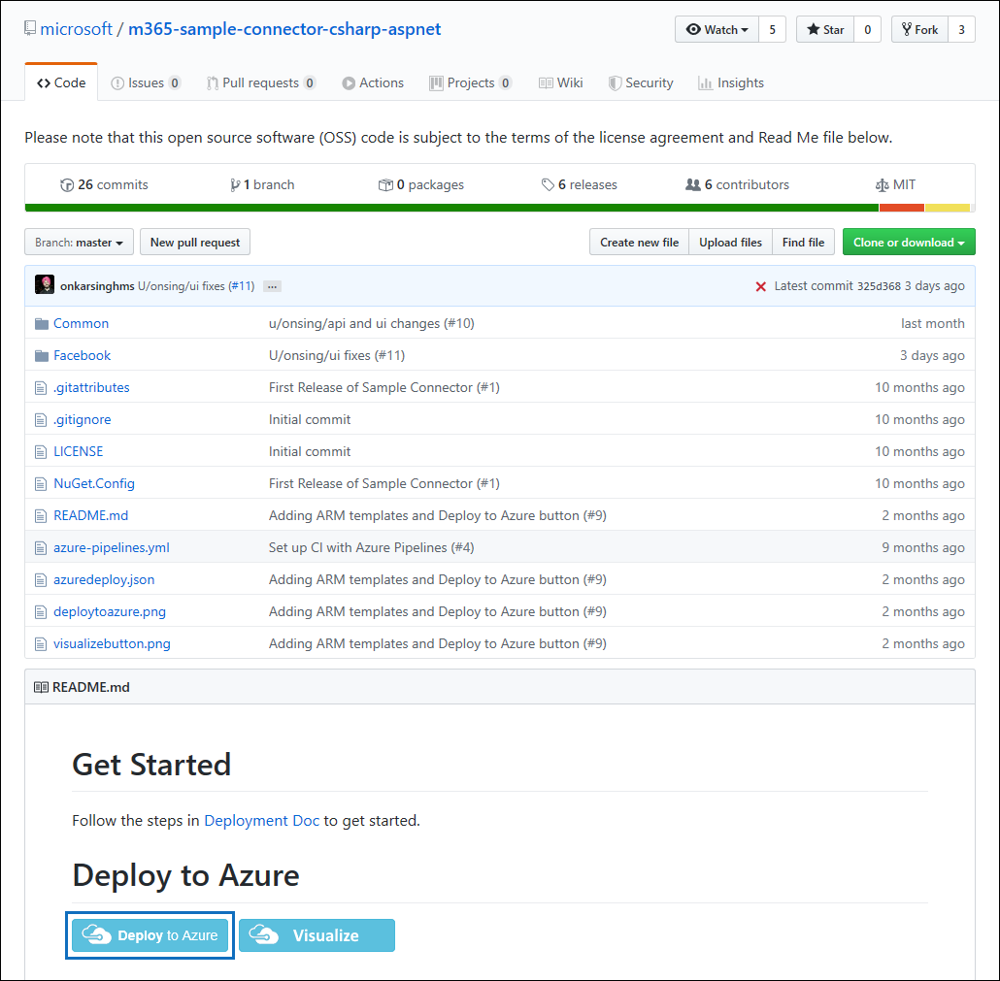

# 部署连接器以存档 Facebook 商业页面数据

本文包含了部署使用 Office 365 导入服务将数据从 Facebook 商业页面导入到 Microsoft 365 的连接器的分步过程。 有关此过程的简要概述以及部署 Facebook 连接器所需的先决条件列表，请参阅[Set up a connector to Archive facebook data](archive-facebook-data-with-sample-connector.md)。 

## 步骤1：在 Azure Active Directory 中创建应用程序

1. 转到<https://portal.azure.com>并使用全局管理员帐户的凭据登录。

    

2. 在左侧导航窗格中，单击 " **Azure Active Directory**"。

    

3. 在左侧导航窗格中，单击 "**应用程序注册（预览）** "，然后单击 "**新建注册**"。

    

4. 注册应用程序。 在 "重定向 URI" 下，选择 "应用程序类型" 下拉<https://portal.azure.com>列表中的 "Web"，然后为 URI 键入相应的框。

   

5. 复制**应用程序（客户端） id**和**目录（租户） id** ，并将其保存到文本文件或其他安全位置。 可在后续步骤中使用这些 Id。

   

6. 转到**证书 & 新应用程序的密码。**

   

7. 单击 "**新建客户端密码**"

   

8. 创建新的机密。 在 "说明" 框中，键入密码，然后选择一个过期时间段。 

    

9. 复制密码的值，并将其保存到文本文件或其他存储位置。 这是您在后续步骤中使用的 AAD 应用程序密码。

   

## 步骤2：将来自 GitHub 的连接器 web 服务部署到你的 Azure 帐户

1. 转到[此 GitHub 网站](https://github.com/microsoft/m365-sample-connector-csharp-aspnet)，然后单击 "**部署到 Azure**"。

    

2. 单击 "**部署到 Azure**" 后，您将被重定向到具有自定义模板页面的 Azure 门户。 填写 "**基础知识**" 和 "**设置**详细信息"，然后单击 "**购买**"。

    - **订阅：** 选择要将 Facebook 商业页面连接器 web 服务部署到的 Azure 订阅。
    
    - **资源组：** 选择或创建新的资源组。 资源组是保留 Azure 解决方案的相关资源的容器。

    - **位置：** 选择一个位置。

    - **Web 应用名称：** 为连接器 web 应用提供一个唯一的名称。 Th 名称的长度必须介于3到18个字符之间。 此名称用于创建 Azure 应用服务 URL;例如，如果提供 Web 应用程序名称**fbconnector** ，则 Azure 应用服务 URL 将为**fbconnector.azurewebsites.net**。
    
    - **tenantId：** 在步骤1中创建 Azure Active Directory 中的 Facebook 连接器应用之后复制的 Microsoft 365 组织的租户 ID。
    
   - **APISecretKey：** 您可以键入任何值作为密码。 这用于在步骤5中访问连接器 web 应用。
   
     

3. 部署成功后，页面外观将类似于以下屏幕截图：

     

## 步骤3：注册 Facebook 应用程序

1. 转到<https://developers.facebook.com>，使用组织的 Facebook 商业版页面的帐户登录，然后单击 "**添加新应用**"。

   

2. 创建新的应用程序 ID。

   

3. 在左侧导航窗格中，单击 "**添加产品**"，然后单击 " **Facebook 登录**磁贴" 中的 "**设置**"。

   

4. 在 "集成 Facebook 登录" 页上，单击 " **Web**"。

   

5. 添加 Azure 应用服务 URL;例如`https://fbconnector.azurewebsites.net`。

   

6. 完成 Facebook 登录设置的快速入门部分。

   

7. 在 " **Facebook Login**" 下的左侧导航窗格中，单击 "**设置**"，然后在 "**有效 OAuth 重定向 Uri** " 框中添加 OAuth 重定向 uri。 使用格式** \<connectorserviceuri>/views/facebookoauth**，其中 connectorserviceuri 的值是您的组织的 Azure 应用服务 URL;例如， `https://fbconnector.azurewebsites.net`。

   

8. 在左侧导航窗格中，单击 "**添加产品**"，然后单击 " **webhook"。** 在 "**页面**" 下拉菜单中，单击 "**页面**"。 

   

9. 添加 Webhook 回调 URL 并添加验证令牌。 回调 URL 的格式，使用格式** <connectorserviceuri>/api/FbPageWebhook**，其中 connectorserviceuri 的值是您的组织的 Azure 应用服务 URL;例如`https://fbconnector.azurewebsites.net`。 

    验证令牌应类似于强密码。 将验证令牌复制到文本文件或其他存储位置。

        

10. 测试并订阅源终结点。

    

11. 添加隐私 URL、应用程序图标和业务使用。 此外，将应用程序 ID 和应用程序密码复制到文本文件或其他存储位置。

    

12. 将应用程序公开。

    

13. 将用户添加到 "管理员" 或 "测试人员" 角色。

    

14. 添加**页面公共内容访问**权限。

    

15. 添加 "管理页面" 权限。

    

16. 获取由 Facebook 审阅的应用程序。

    

## 步骤4：配置连接器 web 应用程序

1. 转到 https://\<AzureAppResourceName> azurewebsites.net （其中 AzureAppResourceName 是您在步骤4中命名的 Azure 应用程序资源的名称）例如，如果名称为**fbconnector**，请转到`https://fbconnector.azurewebsites.net`。 该应用程序的主页看起来将类似于以下屏幕截图：

   

2. 单击 "**配置**" 以显示登录页。
 
   

3. 在 "租户 Id" 框中，键入或粘贴您在步骤2中获取的租户 Id。 在 "密码" 框中，键入或粘贴 APISecretKey （您在步骤2中获取），然后单击 "**设置配置设置**" 以显示 "配置详细信息" 页。

    

4. 输入以下配置设置 

   - **Facebook 应用程序 ID：** 您在步骤3中获取的 Facebook 应用程序的应用程序 ID。
   
   - **Facebook 应用程序密码：** 您在步骤3中获取的 Facebook 应用程序的应用程序密码。
   
   - **Facebook webhook 验证令牌：** 您在步骤3中创建的验证令牌。
   
   - **AAD 应用程序 ID：** 您在步骤1中创建的 Azure Active Directory 应用程序的应用程序 ID。
   
   - **AAD 应用程序密码：** 您在步骤1中创建的 APISecretKey 密码的值。

5. 单击 "**保存**" 以保存连接器设置。

## 步骤5：在 Microsoft 365 合规性中心中设置 Facebook 连接器

1. 转到[https://compliance.microsoft.com](https://compliance.microsoft.com) ，然后单击左侧导航中的 "**数据连接器**"。

2. 在 " **Facebook 商业页面**" 下的 "**数据连接器（预览）** " 页上，单击 "**查看**"。

3. 在 " **Facebook 商业页面**" 页面上，单击 "**添加连接器**"。

4. 在 "**服务条款**" 页上，单击 "**接受**"。

5.  在 "**为连接器应用添加凭据**" 页上，输入以下信息，然后单击 "**验证连接**"。

    

    - 在 "**名称**" 框中，键入连接器的名称，例如 " **Facebook 新闻" 页面**。
    
    - 在 "**连接 URL** " 框中，键入或粘贴 Azure 应用服务 URL;例如`https://fbconnector.azurewebsites.net`。
    
    - 在 "**密码**" 框中，键入或粘贴您在步骤2中添加的 APISecretKey 的值。
    
    - 在 " **Azure 应用 ID** " 框中，键入或粘贴应用程序（客户端） id 的值也称为您在步骤1中创建的 AAD 应用程序 id。
 
6. 成功验证连接后，单击 "**下一步**"。

7. 在 "**授权 Microsoft 365 导入数据**" 页上，再次键入或粘贴 APISecretKey，然后单击 "**登录 web 应用**"。

8. 在 "**配置 Facebook 连接器应用程序**" 页上，单击 "**使用 facebook 登录**"，然后使用组织的 Facebook 商业版页面帐户的凭据登录。 确保您登录到的 Facebook 帐户已分配给您组织的 Facebook 商业页面的管理员角色。

   

9. 将显示您登录到的 Facebook 帐户所管理的商业页面的列表。 选择要存档的页面，然后单击 "**下一步**"。

    

10. 单击 "**继续**" 退出连接器服务应用程序的设置。

11. 在 "**设置筛选器**" 页上，您可以将筛选器应用于最初导入特定年龄的项目。 选择年龄，然后单击 "**下一步**"。

12. 在 "**选择存储位置**" 页上，键入将向其导入 Facebook 项的 Microsoft 365 邮箱的电子邮件地址，然后单击 "**下一步**"。

13. 在 "**提供管理员同意**" 中，单击 "**提供许可**"，然后按照步骤操作。 您必须是全局管理员，才能同意 Office 365 导入服务以访问组织中的数据。

14. 单击 "**下一步**" 查看连接器设置，然后单击 "**完成**" 以完成连接器设置。

15. 在 "合规性中心" 中，转到 "**数据连接器**" 页，然后单击 "**连接器**" 选项卡以查看导入过程的进度。
