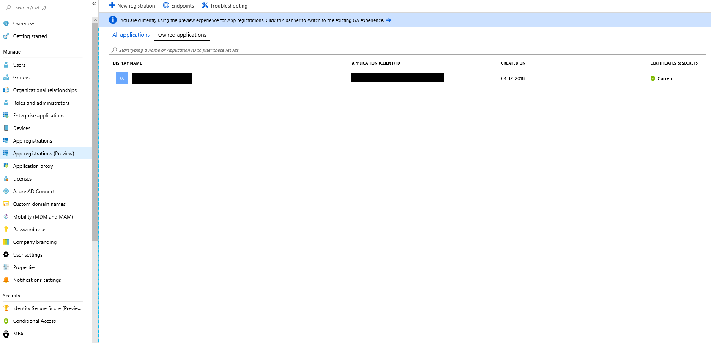
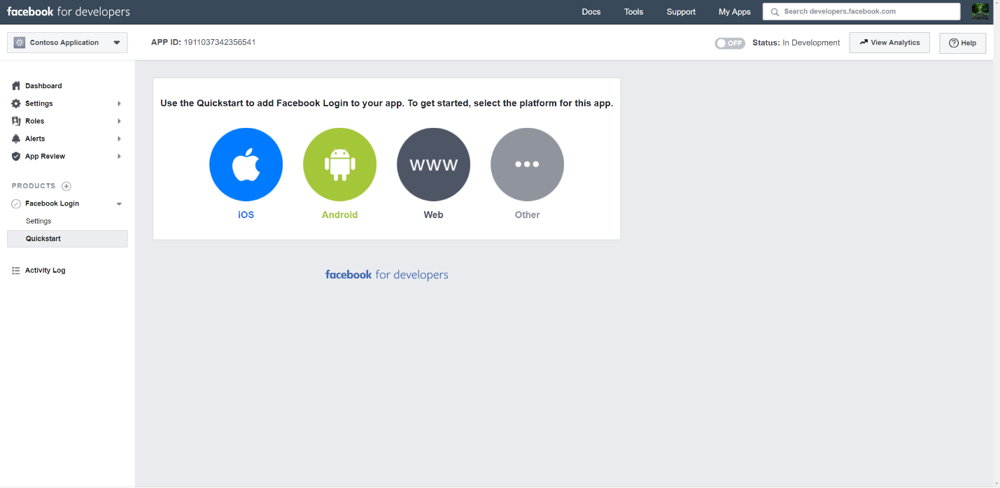
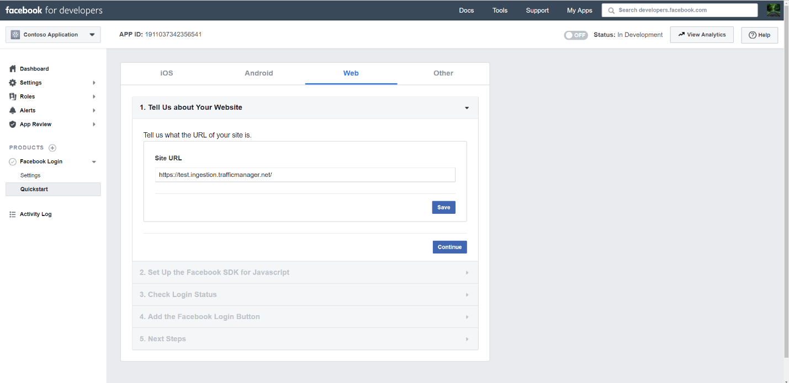
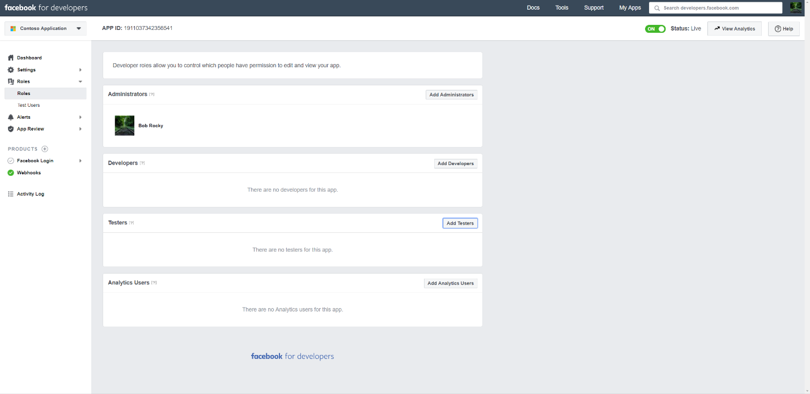

# 部署连接器以存档 Facebook 业务页面数据Deploy a connector to archive Facebook Business pages data

本文包含部署连接器的分步过程，该连接器使用 Office 365 导入服务将数据从 Facebook 商业页面导入到 Microsoft 365。This article contains the step-by-step process to deploy a connector that uses the Office 365 Import service to import data from Facebook Business pages to Microsoft 365. 有关此过程的简要概述以及部署 Facebook 连接器所需的先决条件列表，请参阅"设置连接器以存档[Facebook 数据"。](archive-facebook-data-with-sample-connector.md)For a high-level overview of this process and a list of prerequisites required to deploy a Facebook connector, see [Set up a connector to archive Facebook data](archive-facebook-data-with-sample-connector.md).

## 步骤 1：在 Azure Active Directory 中创建应用Step 1: Create an app in Azure Active Directory

1. 转到 <https://portal.azure.com> 全局管理员帐户的凭据并登录。Go to <https://portal.azure.com> and sign in using the credentials of a global admin account.

    

2. 在左侧导航窗格中，单击 **Azure Active Directory。**In the left navigation pane, click **Azure Active Directory**.

    

3. 在左侧导航窗格中，单击 **"预览 (应用**) ，然后单击"新建 **注册"。**In the left navigation pane, click **App registrations (Preview)** and then click **New registration**.

    

4. 注册应用程序。Register the application. 在"重定向 URI"下，在"应用程序类型"下拉列表中选择"Web"，然后在框中键入 <https://portal.azure.com> URI。Under Redirect URI, select Web in the application type dropdown list and then type <https://portal.azure.com> in the box for the URI.

   

5. 将 **应用程序 (客户端) ID** 和目录 (租户) **ID，** 并将其保存到文本文件或其他安全位置。Copy the **Application (client) ID** and **Directory (tenant) ID** and save them to a text file or other safe location. 在稍后的步骤中使用这些 ID。You use these IDs in later steps.

   

6. 转到 **新&证书和密码。**Go to **Certificates & secrets for the new app.**

   

7. 单击 **"新建客户端密码"**Click **New client secret**

   

8. 创建新密码。Create a new secret. 在描述框中，键入密码，然后选择过期期限。In the description box, type the secret and then choose an expiration period.

    

9. 复制密码的值并将其保存到文本文件或其他存储位置。Copy the value of the secret and save it to a text file or other storage location. 这是在稍后步骤中使用的 AAD 应用程序密码。This is the AAD application secret that you use in later steps.

   

## 步骤 2：将连接器 Web 服务从 GitHub 部署到 Azure 帐户Step 2: Deploy the connector web service from GitHub to your Azure account

1. 转到 [此 GitHub 网站，然后单击](https://github.com/microsoft/m365-sample-connector-csharp-aspnet)**"部署到 Azure"。**Go to [this GitHub site](https://github.com/microsoft/m365-sample-connector-csharp-aspnet) and click **Deploy to Azure**.

    

2. 单击" **部署到 Azure"** 后，将重定向到具有自定义模板页的 Azure 门户。After you click **Deploy to Azure**, you will be redirected to an Azure portal with a custom template page. 填写"**基础知识"和**"**设置"** 详细信息，然后单击"购买 **"。**Fill in the **Basics** and **Settings** details and then click **Purchase**.

   - **订阅：** 选择要将 Facebook 业务页面连接器 Web 服务部署到的 Azure 订阅。**Subscription:** Select your Azure subscription that you want to deploy the Facebook Business pages connector web service to.

   - **资源组：** 选择或创建新的资源组。**Resource group:** Choose or create a new resource group. 资源组是一个容器，用于保存 Azure 解决方案的相关资源。A resource group is a container that holds related resources for an Azure solution.

   - **位置：** 选择一个位置。**Location:** Choose a location.

   - **Web 应用名称：** 为连接器 Web 应用提供唯一的名称。**Web App Name:** Provide a unique name for the connector web app. 第 th 个名称的长度必须介于 3 到 18 个字符之间。Th name must be between 3 and 18 characters in length. 此名称用于创建 Azure 应用服务 URL;例如，如果你提供 **fbconnector** 的 Web 应用名称，则 Azure 应用服务 URL **将** fbconnector.azurewebsites.net。This name is used to create the Azure app service URL; for example, if you provide the Web app name of **fbconnector** then the Azure app service URL  will be **fbconnector.azurewebsites.net**.

   - **tenantId：** 在步骤 1 中的 Azure Active Directory 中创建 Facebook 连接器应用后复制的 Microsoft 365 组织的租户 ID。**tenantId:** The tenant ID of your Microsoft 365 organization that you copied after creating the Facebook connector app in Azure Active Directory in Step 1.

   - **APISecretKey：** 你可以键入任何值作为密码。**APISecretKey:** You can type any value as the secret. 这用于访问步骤 5 中的连接器 Web 应用。This is used to access the connector web app in Step 5.

     

3. 部署成功后，页面将类似于以下屏幕截图：After the deployment is successful, the page will look similar to the following screenshot:

   

## 步骤 3：注册 Facebook 应用Step 3: Register the Facebook app

1. 转到，使用您组织的 Facebook 商业页面的帐户凭据登录，然后单击"添加新 <https://developers.facebook.com> **应用"。**Go to <https://developers.facebook.com>, log in using the credentials for the account for your organization's Facebook Business pages, and then click **Add New App**.

   

2. 创建新的应用 ID。Create a new app ID.

   

3. 在左侧导航窗格中，单击 **"添加产品** "，然后在 Facebook **登录** 磁贴中 **单击** "设置"。In the left navigation pane, click **Add Products** and then click **Set Up** in the **Facebook Login** tile.

   

4. 在"集成 Facebook 登录"页上，单击 **"Web"。**On the Integrate Facebook Login page, click **Web**.

   

5. 添加 Azure 应用服务 URL;例如 `https://fbconnector.azurewebsites.net` 。Add the Azure app service URL; for example `https://fbconnector.azurewebsites.net`.

   

6. 完成 Facebook 登录设置的"快速入门"部分。Complete the QuickStart section of the Facebook Login setup.

   

7. 在 Facebook **登录的左侧** 导航窗格中，**单击"** 设置"，在"有效 OAuth 重定向 URI"框中添加 **OAuth 重定向 URI。**In the left navigation pane under **Facebook Login**, click **Settings**, and add the OAuth redirect URI in the **Valid OAuth Redirect URIs** box. 使用 **\<connectorserviceuri> /Views/FacebookOAuth** 格式，其中 connectorserviceuri 的值为组织的 Azure 应用服务 URL;例如 `https://fbconnector.azurewebsites.net` 。Use the format **\<connectorserviceuri>/Views/FacebookOAuth**, where the value for connectorserviceuri is the Azure app service URL for your organization; for example, `https://fbconnector.azurewebsites.net`.

   

8. 在左侧导航窗格中，单击 **"添加产品** "，然后单击 **"Webhook"。**In the left navigation pane, click **Add Products** and then click **Webhooks.** 在 **"页面**"下拉菜单中，单击"**页面"。**In the **Page** pull-down menu, click **Page**.

   

9. 添加 Webhook 回调 URL 并添加验证令牌。Add Webhooks Callback URL and add a verify token. 回调 URL 的格式，使用 **<connectorserviceuri> /api/FbPageWebhook** 格式，其中 connectorserviceuri 的值为组织的 Azure 应用服务 URL;例如 `https://fbconnector.azurewebsites.net` 。The format of the callback URL, use the format **<connectorserviceuri>/api/FbPageWebhook**, where the value for connectorserviceuri is the Azure app service URL for your organization; for example `https://fbconnector.azurewebsites.net`.

   验证令牌应类似于强密码。The verify token should similar to a strong password. 将验证令牌复制到文本文件或其他存储位置。Copy the verify token to a text file or other storage location.

   

10. 测试和订阅订阅源的终结点。Test and subscribe to the endpoint for feed.

    

11. 添加隐私 URL、应用图标和业务用途。Add a privacy URL, app icon, and business use. 此外，将应用 ID 和应用密码复制到文本文件或其他存储位置。Also, copy the app ID and app secret to a text file or other storage location.

    

12. 将应用公开。Make the app public.

    

13. 将用户添加到管理员或测试人员角色。Add user to the admin or tester role.

    

14. 添加 **页面公共内容访问权限** 。Add the **Page Public Content Access** permission.

    

15. 添加"管理页面"权限。Add Manage Pages permission.

    

16. 获取 Facebook 审查的应用程序。Get the application reviewed by Facebook.

    

## 步骤 4：配置连接器 Web 应用Step 4: Configure the connector web app

1. 转到 `https://<AzureAppResourceName>.azurewebsites.net` (其中 AzureAppResourceName 是你在步骤 4 中指定的 Azure 应用资源) 。Go to `https://<AzureAppResourceName>.azurewebsites.net` (where AzureAppResourceName is the name of your Azure app resource that you named in Step 4). 例如，如果名称为 **fbconnector，** 请转到 `https://fbconnector.azurewebsites.net` 。For example, if the name is **fbconnector**, go to `https://fbconnector.azurewebsites.net`. 应用程序的主页将如以下屏幕截图所示：The home page of the app will look like the following screenshot:

   

2. 单击 **"** 配置"以显示登录页。Click **Configure** to display a sign in page.

   

3. 在"租户 ID"框中，键入或 (步骤 2 中获取的租户 ID) 。In the Tenant Id box, type or paste your tenant Id (that you obtained in Step 2). 在密码框中，键入或粘贴在步骤 2 (中获取的 APISecretKey) ，然后单击"设置 **配置** 设置"以显示配置详细信息页。In the password box, type or paste the APISecretKey (that you obtained in Step 2), and then click **Set Configuration Settings** to display the configuration details page.

    

4. 输入以下配置设置Enter the following configuration settings

   - **Facebook 应用程序 ID：** 在步骤 3 中获取的 Facebook 应用程序的应用程序 ID。**Facebook application ID:** The app ID for the Facebook application that you obtained in Step 3.

   - **Facebook 应用程序密码：** 你在步骤 3 中获取的 Facebook 应用程序的应用程序密码。**Facebook application secret:** The app secret for the Facebook application that you obtained in Step 3.

   - **Facebook webhook 验证令牌：** 在步骤 3 中创建的验证令牌。**Facebook webhooks verify token:** The verify token that you created in Step 3.

   - **AAD 应用程序 ID：** 你在步骤 1 中创建的 Azure Active Directory 应用的应用程序 ID。**AAD application ID:** The application ID for the Azure Active Directory app that you created in Step 1.

   - **AAD 应用程序密码：** 在步骤 1 中创建的 APISecretKey 密码的值。**AAD application secret:** The value for the APISecretKey secret that you created in Step 1.

5. 单击 **"** 保存"保存连接器设置。Click **Save** to save the connector settings.

## 步骤 5：在 Microsoft 365 合规中心设置 Facebook 连接器Step 5: Set up a Facebook connector in the Microsoft 365 compliance center

1. 转到 [https://compliance.microsoft.com](https://compliance.microsoft.com) 左侧导航中 **，** 然后单击"数据连接器"。Go to [https://compliance.microsoft.com](https://compliance.microsoft.com) and then click **Data connectors** in the left nav.

2. 在 Facebook **业务页面** 下的"数据连接器"**页上，单击\*\*\*\*"查看"。**On the **Data connectors** page under **Facebook Business pages**, click **View**.

3. 在 **Facebook 业务页面页面上**，单击"**添加连接器"。**On the **Facebook business pages** page, click **Add connector**.

4. 在"**服务条款"页上**，单击"**接受"。**On the **Terms of service** page, click **Accept**.

5. 在 **"为连接器应用程序添加** 凭据"页上，输入以下信息，然后单击"**验证连接"。**On the **Add credentials for your connector app** page, enter the following information and then click **Validate connection**.

   

   - 在 **"名称** "框中，键入连接器的名称，如 Facebook **新闻页面**。In the **Name** box, type a name for the connector, such as **Facebook news page**.

   - 在 **"连接 URL"** 框中，键入或粘贴 Azure 应用服务 URL;例如 `https://fbconnector.azurewebsites.net` 。In the **Connection URL** box, type or paste the Azure app service URL; for example `https://fbconnector.azurewebsites.net`.

   - 在 **"密码** "框中，键入或粘贴在步骤 2 中添加的 APISecretKey 的值。In the **Password** box, type or paste the value of the APISecretKey that you added in Step 2.

   - 在"Azure 应用 **ID"** 框中，键入或粘贴 Application (客户端) ID（也称为在步骤 1 中创建的 AAD 应用程序 ID）。In the **Azure App ID** box, type or paste the value of the Application (client) ID also called as AAD Application ID that you created in Step 1.

6. 成功验证连接后，单击"下一 **步"。**After the connection is successfully validated, click **Next**.

7. 在"**授权 Microsoft 365** 导入数据"页上，再次键入或粘贴 APISecretKey，然后单击"登录 **Web 应用"。**On the **Authorize Microsoft 365 to import data** page, type or paste the APISecretKey again and then click **Login web app**.

8. 在 **"配置 Facebook 连接器应用程序** "页上，单击 **"使用 Facebook** 登录"，然后使用您组织的 Facebook 业务页面帐户的凭据登录。On the **Configure Facebook connector app** page, click **Login with Facebook** and log in using the credentials for the account for your organization's Facebook Business pages. 确保为登录的 Facebook 帐户分配了组织的 Facebook 商业版页面的管理员角色。Make sure the Facebook account that you logged in to is assigned the admin role for your organization's Facebook Business pages.

   

9. 将显示由您登录的 Facebook 帐户管理的业务页面列表。A list of the business pages managed by the Facebook account that you logged in to is displayed. 选择要存档的页面，然后单击"下一 **步"。**Select the page to archive and then click **Next**.

   

10. 单击 **"** 继续"退出连接器服务应用程序的设置。Click **Continue** to exit the setup of the connector service app.

11. 在 **"设置筛选器** "页上，可以应用筛选器以初始导入具有特定年龄的项目。On the **Set filters** page, you can apply a filter to initially import items that are a certain age. 选择一个年龄，然后单击"下 **一步"。**Select an age, and then click **Next**.

12. 在 **"选择存储位置**"页上，键入 Facebook 项目将导入到的 Microsoft 365 邮箱的电子邮件地址，然后单击"下一 **步"。**On the **Choose storage location** page, type the email address of Microsoft 365 mailbox that the Facebook items will be imported to, and then click **Next**.

13. 单击 **"** 下一步"查看连接器设置，然后单击" **完成** "以完成连接器设置。Click **Next** to review the connector settings and then click **Finish** to complete the connector setup.

14. 在合规中心，转到"数据连接器 **"页，** 然后单击"连接器 **"选项卡以查看** 导入过程的进度。In the compliance center, go to the **Data connectors** page, and click the **Connectors** tab to see the progress of the import process.
