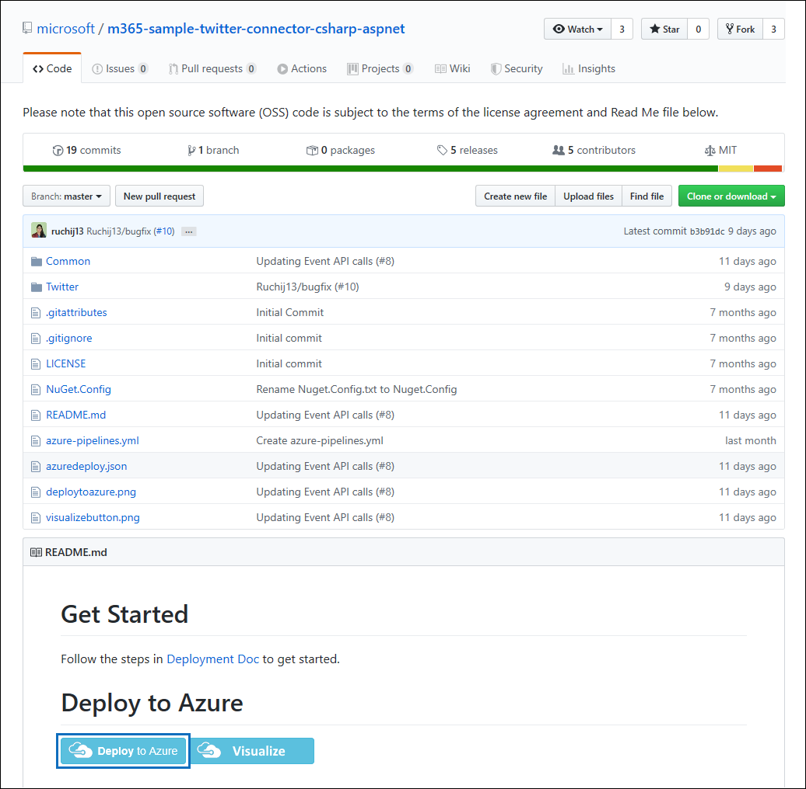
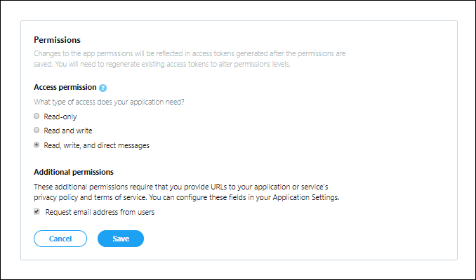

# 部署连接器以存档 Twitter 数据Deploy a connector to archive Twitter data

本文包含的分步过程可部署使用 Office 365 导入服务将数据从组织的 Twitter 帐户导入 Microsoft 365 的连接器。This article contains the step-by-step process to deploy a connector that uses the Office 365 Import service to import data from your organization's Twitter account to Microsoft 365. 有关此过程的高级概述以及部署 Twitter 连接器所需的先决条件列表，请参阅[Set up a connector to Archive twitter data ](archive-twitter-data-with-sample-connector.md)。For a high-level overview of this process and a list of prerequisites required to deploy a Twitter connector, see [Set up a connector to archive Twitter data ](archive-twitter-data-with-sample-connector.md). 

## 步骤1：在 Azure Active Directory 中创建应用程序Step 1: Create an app in Azure Active Directory

1. 转到<https://portal.azure.com>并使用全局管理员帐户的凭据登录。Go to <https://portal.azure.com> and sign in using the credentials of a global admin account.

   

2. 在左侧导航窗格中，单击 " **Azure Active Directory**"。In the left navigation pane, click **Azure Active Directory**.

   

3. 在左侧导航窗格中，单击 "**应用程序注册（预览）** "，然后单击 "**新建注册**"。In the left navigation pane, click **App registrations (Preview)** and then click **New registration**.

   

4. 注册应用程序。Register the application. 在 "**重定向 URI （可选）**" 下，选择 "应用程序类型" 下拉`https://portal.azure.com`列表中的 " **WEB** "，然后在 URI 框中键入 uri。Under **Redirect URI (optional)**, select **Web** in the application type dropdown list and then type `https://portal.azure.com` in the box for the URI.

   

5. 复制**应用程序（客户端） id**和**目录（租户） id** ，并将其保存到文本文件或其他安全位置。Copy the **Application (client) ID** and **Directory (tenant) ID** and save them to a text file or other safe location. 可在后续步骤中使用这些 Id。You use these IDs in later steps.

    

6. 转到**证书 & 新应用程序的证书**，并在 "**客户端密码**" 下，单击 "**新建客户端密码**"。Go to **Certificates & secrets for the new app** and under **Client secrets** click **New client secret**.

   

7. 创建新的机密。Create a new secret. 在 "说明" 框中，键入密码，然后选择一个过期时间段。In the description box, type the secret and then choose an expiration period. 

   

8. 复制密码的值，并将其保存到文本文件或其他存储位置。Copy the value of the secret and save it to a text file or other storage location. 这是您在后续步骤中使用的 AAD 应用程序密码。This is the AAD application secret that you use in later steps.

   

## 步骤2：将来自 GitHub 的连接器 web 服务部署到你的 Azure 帐户Step 2: Deploy the connector web service from GitHub to your Azure account

1. 转到[此 GitHub 网站](https://github.com/microsoft/m365-sample-twitter-connector-csharp-aspnet)，然后单击 "**部署到 Azure**"。Go to [this GitHub site](https://github.com/microsoft/m365-sample-twitter-connector-csharp-aspnet) and click **Deploy to Azure**.

    

2. 单击 "**部署到 Azure**" 后，您将被重定向到具有自定义模板页面的 Azure 门户。After you click **Deploy to Azure**, you will be redirected to an Azure portal with a custom template page. 填写 "**基础知识**" 和 "**设置**详细信息"，然后单击 "**购买**"。Fill in the **Basics** and **Settings** details and then click **Purchase**.

   

    - **订阅：** 选择要将 Twitter 连接器 web 服务部署到的 Azure 订阅。**Subscription:** Select your Azure subscription that you want to deploy the Twitter connector web service to.
    
    - **资源组：** 选择或创建新的资源组。**Resource group:** Choose or create a new resource group. 资源组是保留 Azure 解决方案的相关资源的容器。A resource group is a container that holds related resources for an Azure solution.

    - **位置：** 选择一个位置。**Location:** Choose a location.

    - **Web 应用名称：** 为连接器 web 应用提供一个唯一的名称。**Web App Name:** Provide a unique name for the connector web app. Th 名称的长度必须介于3到18个字符之间。Th name must be between 3 and 18 characters in length. 此名称用于创建 Azure 应用服务 URL;例如，如果提供 Web 应用程序名称**twitterconnector** ，则 Azure 应用服务 URL 将为**twitterconnector.azurewebsites.net**。This name is used to create the Azure app service URL; for example, if you provide the Web app name of **twitterconnector** then the Azure app service URL  will be **twitterconnector.azurewebsites.net**.
    
    - **tenantId：** 在步骤1中创建 Azure Active Directory 中的 Facebook 连接器应用之后复制的 Microsoft 365 组织的租户 ID。**tenantId:** The tenant ID of your Microsoft 365 organization that you copied after creating the Facebook connector app in Azure       Active Directory in Step 1.
    
   - **APISecretKey：** 您可以键入任何值作为密码。**APISecretKey:** You can type any value as the secret. 这用于在步骤5中访问连接器 web 应用。This is used to access the connector web app in Step 5.

3. 部署成功后，页面外观将类似于以下屏幕截图：After the deployment is successful, the page will look similar to the following screenshot:

    

## 步骤3：创建 Twitter 应用Step 3: Create the Twitter app

1. 转到https://developer.twitter.com，使用组织的开发人员帐户的凭据登录，然后单击 "**应用**"。Go to https://developer.twitter.com, log in using the credentials for the developer account for your organization, and then click **Apps**.

   
2. 单击 "**创建应用程序**"。Click **Create an app**.
   
   

3. 在 "**应用程序详细信息**" 下，添加有关应用程序的信息。Under **App details**, add information about the application.

   

4. 在 Twitter 开发人员仪表板上，选择刚创建的应用程序，并复制显示的应用 ID 并将其保存到文本文件或其他存储位置。On the Twitter developer dashboard, select the app that you just created and copy the App ID that's displayed  and save it to a text file or other storage location. 然后单击 "**详细信息**"。Then click **Details**.
   
   

5. 在 "**密钥和标记**" 选项卡上的 "**使用者 api 密钥**" 下，复制 api 密钥并将其保存到文本文件或其他存储位置。On the **Keys and tokens** tab, under **Consumer API keys** copy the API secret key and save it to a text file or other storage location. 然后，单击 "**创建**" 以生成访问令牌和访问令牌机密，并将它们复制到文本文件或其他存储位置。Then click **Create** to generate an access token and an access token secret, and copy these to a text file or other storage location.
   
   

   然后，单击 "**创建**" 以生成访问令牌和访问令牌机密，并将它们复制到文本文件或其他存储位置。Then click **Create** to generate an access token and an access token secret, and copy these to a text file or other storage location.

6. 单击 "**权限**" 选项卡并配置权限，如以下屏幕截图所示：Click the **Permissions** tab and configure the permissions as shown in the following screenshot:

   

7. 保存权限设置后，单击 "**应用程序详细信息**" 选项卡，然后单击 "编辑" > "编辑**详细信息**"。After you save the permission settings, click the **App details** tab, and then click **Edit > Edit details**.

   

8. 执行以下任务：Do the following tasks:

   - 选中此复选框可允许连接器应用登录 Twitter。Select the checkbox to allow the connector app to sign in to Twitter.
   
   - 使用以下格式添加 OAuth 重定向 Uri： \*\* \<connectorserviceuri>/views/twitteroauth\**，其中*connectorserviceuri\*的值为您的组织的 Azure 应用服务 URL;例如， https://twitterconnector.azurewebsites.net/Views/TwitterOAuth。Add the OAuth redirect Uri using the following format: **\<connectorserviceuri>/Views/TwitterOAuth**, where the value of *connectorserviceuri* is the Azure app service URL for your organization; for example, https://twitterconnector.azurewebsites.net/Views/TwitterOAuth.

    

现在可以使用 Twitter 开发人员应用。The Twitter developer app is now ready to use.

## 步骤4：配置连接器 web 应用程序Step 4: Configure the connector web app 

1. 转到 https://\<AzureAppResourceName> azurewebsites.net （其中**AzureAppResourceName**是您在步骤4中命名的 Azure 应用程序资源的名称）。Go to https://\<AzureAppResourceName>.azurewebsites.net (where **AzureAppResourceName** is the name of your Azure app resource that you named in Step 4). 例如，如果名称为**twitterconnector**，请转到https://twitterconnector.azurewebsites.net。For example, if the name is **twitterconnector**, go to https://twitterconnector.azurewebsites.net. 该应用程序的主页如以下屏幕截图所示：The home page of the app looks like the following screenshot:

   

2. 单击 "**配置**" 以显示登录页。Click **Configure** to display a sign in page.

   

3. 在 "租户 Id" 框中，键入或粘贴您在步骤2中获取的租户 Id。In the Tenant Id box, type or paste your tenant Id (that you obtained in Step 2). 在 "密码" 框中，键入或粘贴 APISecretKey （您在步骤2中获取），然后单击 "**设置配置设置**" 以显示 "配置详细信息" 页。In the password box, type or paste the APISecretKey (that you obtained in Step 2), and then click **Set Configuration Settings** to display the configuration details page.

   

4. 输入以下配置设置Enter the following configuration settings 

   - **Twitter Api 密钥：** 您在步骤3中创建的 Twitter 应用程序的应用 ID。**Twitter Api Key:** The app ID for the Twitter application that you created in Step 3.
   
   - **Twitter Api 密钥：** 您在步骤3中创建的 Twitter 应用程序的 API 密钥。**Twitter Api Secret Key:** The API secret key for the Twitter application that you created in Step 3.
   
   - **Twitter 访问令牌：** 您在步骤3中创建的访问令牌。**Twitter Access Token:** The access token that you created in Step 3.
   
   - **Twitter 访问令牌机密：** 您在步骤3中创建的访问令牌密码。**Twitter Access Token Secret:** The access token secret that you created in Step 3.
   
   - **AAD 应用程序 ID：** 您在步骤1中创建的 Azure Active Directory 应用程序的应用程序 ID**AAD Application ID:** The application ID for the Azure Active Directory app that you created in Step 1
   
   - **AAD 应用程序密码：** 您在步骤1中创建的 APISecretKey 密码的值。**AAD Application Secret:** The value for the APISecretKey secret that you created in Step 1.

5. 单击 "**保存**" 以保存连接器设置。Click **Save** to save the connector settings.

## 步骤5：在 Microsoft 365 合规性中心中设置 Twitter 连接器Step 5: Set up a Twitter connector in the Microsoft 365 compliance center

1. 转到[https://compliance.microsoft.com](https://compliance.microsoft.com) ，然后单击左侧导航中的 "**数据连接器**"。Go to [https://compliance.microsoft.com](https://compliance.microsoft.com) and then click **Data connectors** in the left nav.

2. 在 " **Twitter**" 下的 "**数据连接器（预览）** " 页上，单击 "**查看**"。On the **Data connectors (preview)** page under **Twitter**, click **View**.

3. 在**Twitter**页面上，单击 "**添加连接器**"。On the **Twitter** page, click **Add connector**.

4. 在 "**服务条款**" 页上，单击 "**接受**"。On the **Terms of service** page, click **Accept**.

5. 在 "**为连接器应用添加凭据**" 页上，输入以下信息，然后单击 "**验证连接**"。On the **Add credentials for your connector app** page, enter the following information and then click **Validate connection**.

   

    - 在 "**名称**" 框中，键入连接器的名称，如**Twitter 帮助句柄**。In the **Name** box, type a name for the connector, such as **Twitter help handle**.
    
    - 在 "**连接器 URL** " 框中，键入或粘贴 Azure 应用服务 URL;例如`https://twitterconnector.azurewebsites.net`。In the **Connector URL** box, type or paste the Azure app service URL; for example `https://twitterconnector.azurewebsites.net`.
    
    - 在 "**密码**" 框中，键入或粘贴您在步骤2中创建的 APISecretKey 的值。In the **Password** box, type or paste the value of the APISecretKey that you created in Step 2.
    
    - 在 " **Azure 应用 ID** " 框中，键入或粘贴您在步骤1中获取的 Azure 应用程序应用程序 id （也称为 "*客户端 id*"）的值。In the **Azure App ID** box, type or paste the value of the Azure Application App Id (also called the *client ID*) that you obtained in Step 1.

6. 成功验证连接后，单击 "**下一步**"。After the connection is successfully validated, click **Next**.

7. 在 "**授权 Microsoft 365 导入数据**" 页上，再次键入或粘贴 APISecretKey，然后单击 "**登录 web 应用**"。On the **Authorize Microsoft 365 to import data** page, type or paste the APISecretKey again and then click  **Login web app**.

8. 单击 "**使用 Twitter 登录**"。Click **Login with Twitter**.

9. 在 Twitter 登录页面上，使用您的组织的 Twitter 帐户的凭据进行登录。On the Twitter sign in page, sign in using the credentials for your organization's Twitter account.

   

   登录后，Twitter 页面将显示以下消息： "已成功设置 Twitter 连接器作业"。After you sign in, the Twitter page will display the following message, "Twitter Connector Job Successfully set up."

10. 单击 "**继续**" 以完成 Twitter 连接器的设置。Click **Continue** to complete setting up the Twitter connector.

11. 在 "**设置筛选器**" 页上，您可以将筛选器应用于最初导入特定年龄的项目。On the **Set filters** page, you can apply a filter to initially import items that are a certain age. 选择年龄，然后单击 "**下一步**"。Select an age, and then click **Next**.

12. 在 "**选择存储位置**" 页上，键入要将 Twitter 项目导入到其中的 Microsoft 365 邮箱的电子邮件地址，然后单击 "**下一步**"。On the **Choose storage location** page, type the email address of Microsoft 365 mailbox that the Twitter items will be imported to, and then click **Next**.

13. 在 "**提供管理员同意**" 中，单击 "**提供许可**"，然后按照步骤操作。On the **Provide admin consent**, click **Provide consent** and then follow the steps. 您必须是全局管理员，才能同意 Office 365 导入服务以访问组织中的数据。You must be a global admin to provide consent for the Office 365 Import service to access data in your organization.

14. 单击 "**下一步**" 查看连接器设置，然后单击 "**完成**" 以完成连接器设置。Click **Next** to review the connector settings and then click **Finish** to complete the connector setup.

15. 在 "合规性中心" 中，转到 "**数据连接器**" 页，然后单击 "**连接器**" 选项卡以查看导入过程的进度。In the compliance center, go to the **Data connectors** page, and click the **Connectors** tab to see the progress of the import process.
