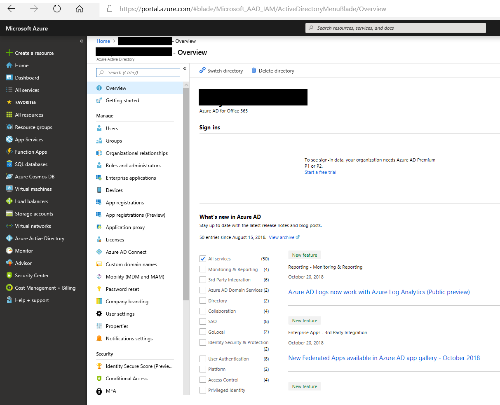

# 部署连接器以存档 Twitter 数据

本文包含的分步过程可部署使用 Office 365 导入服务将数据从组织的 Twitter 帐户导入 Microsoft 365 的连接器。 有关此过程的高级概述以及部署 Twitter 连接器所需的先决条件列表，请参阅[Set up a connector to Archive twitter data ](archive-twitter-data-with-sample-connector.md)。 

## 步骤1：在 Azure Active Directory 中创建应用程序

1. 转到<https://portal.azure.com>并使用全局管理员帐户的凭据登录。

   

2. 在左侧导航窗格中，单击 " **Azure Active Directory**"。

   

3. 在左侧导航窗格中，单击 "**应用程序注册（预览）** "，然后单击 "**新建注册**"。

   

4. 注册应用程序。 在 "**重定向 URI （可选）**" 下，选择 "应用程序类型" 下拉`https://portal.azure.com`列表中的 " **WEB** "，然后在 URI 框中键入 uri。

   

5. 复制**应用程序（客户端） id**和**目录（租户） id** ，并将其保存到文本文件或其他安全位置。 可在后续步骤中使用这些 Id。

    

6. 转到**证书 & 新应用程序的证书**，并在 "**客户端密码**" 下，单击 "**新建客户端密码**"。

   

7. 创建新的机密。 在 "说明" 框中，键入密码，然后选择一个过期时间段。 

   

8. 复制密码的值，并将其保存到文本文件或其他存储位置。 这是您在后续步骤中使用的 AAD 应用程序密码。

   

## 步骤2：将来自 GitHub 的连接器 web 服务部署到你的 Azure 帐户

1. 转到[此 GitHub 网站](https://github.com/microsoft/m365-sample-twitter-connector-csharp-aspnet)，然后单击 "**部署到 Azure**"。

    

2. 单击 "**部署到 Azure**" 后，您将被重定向到具有自定义模板页面的 Azure 门户。 填写 "**基础知识**" 和 "**设置**详细信息"，然后单击 "**购买**"。

   

    - **订阅：** 选择要将 Twitter 连接器 web 服务部署到的 Azure 订阅。
    
    - **资源组：** 选择或创建新的资源组。 资源组是保留 Azure 解决方案的相关资源的容器。

    - **位置：** 选择一个位置。

    - **Web 应用名称：** 为连接器 web 应用提供一个唯一的名称。 Th 名称的长度必须介于3到18个字符之间。 此名称用于创建 Azure 应用服务 URL;例如，如果提供 Web 应用程序名称**twitterconnector** ，则 Azure 应用服务 URL 将为**twitterconnector.azurewebsites.net**。
    
    - **tenantId：** 在步骤1中创建 Azure Active Directory 中的 Facebook 连接器应用之后复制的 Microsoft 365 组织的租户 ID。
    
   - **APISecretKey：** 您可以键入任何值作为密码。 这用于在步骤5中访问连接器 web 应用。

3. 部署成功后，页面外观将类似于以下屏幕截图：

    

## 步骤3：创建 Twitter 应用

1. 转到https://developer.twitter.com，使用组织的开发人员帐户的凭据登录，然后单击 "**应用**"。

   
2. 单击 "**创建应用程序**"。
   
   

3. 在 "**应用程序详细信息**" 下，添加有关应用程序的信息。

   

4. 在 Twitter 开发人员仪表板上，选择刚创建的应用程序，并复制显示的应用 ID 并将其保存到文本文件或其他存储位置。 然后单击 "**详细信息**"。
   
   

5. 在 "**密钥和标记**" 选项卡上的 "**使用者 api 密钥**" 下，复制 api 密钥并将其保存到文本文件或其他存储位置。 然后，单击 "**创建**" 以生成访问令牌和访问令牌机密，并将它们复制到文本文件或其他存储位置。
   
   

   然后，单击 "**创建**" 以生成访问令牌和访问令牌机密，并将它们复制到文本文件或其他存储位置。

6. 单击 "**权限**" 选项卡并配置权限，如以下屏幕截图所示：

   

7. 保存权限设置后，单击 "**应用程序详细信息**" 选项卡，然后单击 "编辑" > "编辑**详细信息**"。

   

8. 执行以下任务：

   - 选中此复选框可允许连接器应用登录 Twitter。
   
   - 使用以下格式添加 OAuth 重定向 Uri： ** \<connectorserviceuri>/views/twitteroauth**，其中*connectorserviceuri*的值为您的组织的 Azure 应用服务 URL;例如， https://twitterconnector.azurewebsites.net/Views/TwitterOAuth。

    

现在可以使用 Twitter 开发人员应用。

## 步骤4：配置连接器 web 应用程序 

1. 转到 https://\<AzureAppResourceName> azurewebsites.net （其中**AzureAppResourceName**是您在步骤4中命名的 Azure 应用程序资源的名称）。 例如，如果名称为**twitterconnector**，请转到https://twitterconnector.azurewebsites.net。 该应用程序的主页如以下屏幕截图所示：

   

2. 单击 "**配置**" 以显示登录页。

   

3. 在 "租户 Id" 框中，键入或粘贴您在步骤2中获取的租户 Id。 在 "密码" 框中，键入或粘贴 APISecretKey （您在步骤2中获取），然后单击 "**设置配置设置**" 以显示 "配置详细信息" 页。

   

4. 输入以下配置设置 

   - **Twitter Api 密钥：** 您在步骤3中创建的 Twitter 应用程序的应用 ID。
   
   - **Twitter Api 密钥：** 您在步骤3中创建的 Twitter 应用程序的 API 密钥。
   
   - **Twitter 访问令牌：** 您在步骤3中创建的访问令牌。
   
   - **Twitter 访问令牌机密：** 您在步骤3中创建的访问令牌密码。
   
   - **AAD 应用程序 ID：** 您在步骤1中创建的 Azure Active Directory 应用程序的应用程序 ID
   
   - **AAD 应用程序密码：** 您在步骤1中创建的 APISecretKey 密码的值。

5. 单击 "**保存**" 以保存连接器设置。

## 步骤5：在 Microsoft 365 合规性中心中设置 Twitter 连接器

1. 转到[https://compliance.microsoft.com](https://compliance.microsoft.com) ，然后单击左侧导航中的 "**数据连接器**"。

2. 在 " **Twitter**" 下的 "**数据连接器（预览）** " 页上，单击 "**查看**"。

3. 在**Twitter**页面上，单击 "**添加连接器**"。

4. 在 "**服务条款**" 页上，单击 "**接受**"。

5. 在 "**为连接器应用添加凭据**" 页上，输入以下信息，然后单击 "**验证连接**"。

   

    - 在 "**名称**" 框中，键入连接器的名称，如**Twitter 帮助句柄**。
    
    - 在 "**连接器 URL** " 框中，键入或粘贴 Azure 应用服务 URL;例如`https://twitterconnector.azurewebsites.net`。
    
    - 在 "**密码**" 框中，键入或粘贴您在步骤2中创建的 APISecretKey 的值。
    
    - 在 " **Azure 应用 ID** " 框中，键入或粘贴您在步骤1中获取的 Azure 应用程序应用程序 id （也称为 "*客户端 id*"）的值。

6. 成功验证连接后，单击 "**下一步**"。

7. 在 "**授权 Microsoft 365 导入数据**" 页上，再次键入或粘贴 APISecretKey，然后单击 "**登录 web 应用**"。

8. 单击 "**使用 Twitter 登录**"。

9. 在 Twitter 登录页面上，使用您的组织的 Twitter 帐户的凭据进行登录。

   

   登录后，Twitter 页面将显示以下消息： "已成功设置 Twitter 连接器作业"。

10. 单击 "**继续**" 以完成 Twitter 连接器的设置。

11. 在 "**设置筛选器**" 页上，您可以将筛选器应用于最初导入特定年龄的项目。 选择年龄，然后单击 "**下一步**"。

12. 在 "**选择存储位置**" 页上，键入要将 Twitter 项目导入到其中的 Microsoft 365 邮箱的电子邮件地址，然后单击 "**下一步**"。

13. 在 "**提供管理员同意**" 中，单击 "**提供许可**"，然后按照步骤操作。 您必须是全局管理员，才能同意 Office 365 导入服务以访问组织中的数据。

14. 单击 "**下一步**" 查看连接器设置，然后单击 "**完成**" 以完成连接器设置。

15. 在 "合规性中心" 中，转到 "**数据连接器**" 页，然后单击 "**连接器**" 选项卡以查看导入过程的进度。
