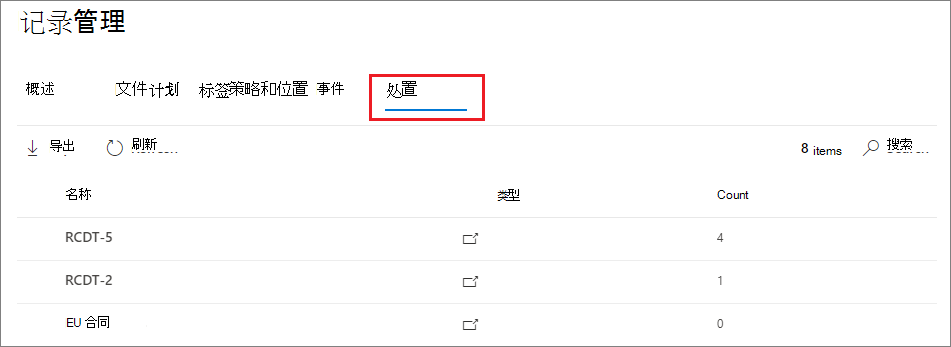
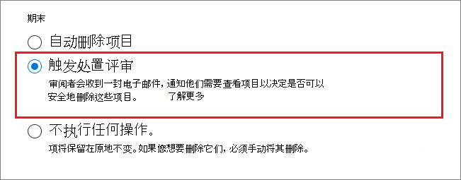

# 内容的处置Disposition of content

>*[Microsoft 365 安全性与合规性的许可指南](/office365/servicedescriptions/microsoft-365-service-descriptions/microsoft-365-tenantlevel-services-licensing-guidance/microsoft-365-security-compliance-licensing-guidance)。**[Microsoft 365 licensing guidance for security & compliance](/office365/servicedescriptions/microsoft-365-service-descriptions/microsoft-365-tenantlevel-services-licensing-guidance/microsoft-365-security-compliance-licensing-guidance).*

使用 Microsoft 365 合规中心中 **记录管理** 中的 **处置** 选项卡来管理处置评审，并查看在保留期结束时自动删除 [记录](records-management.md#records)。Use the **Disposition** tab from **Records Management** in the Microsoft 365 compliance center to manage disposition reviews and view [records](records-management.md#records) that have been automatically deleted at the end of their retention period. 

## 查看内容处置的前提条件Prerequisites for viewing content dispositions

若要管理处置评审并确认已删除记录，必须具有足够的权限，并且必须启用审核。To manage disposition reviews and confirm that records have been deleted, you must have sufficient permissions and auditing must be enabled.

### 处置权限Permissions for disposition

若要成功访问 Microsoft 365 合规中心中的 **处置** 选项卡，用户必须拥有 **处置管理** 管理员角色。To successfully access the **Disposition** tab in the Microsoft 365 compliance center, users must have the **Disposition Management** admin role. 从2020年12月起，该角色现已纳入 **记录管理** 默认管理员角色组中。From December 2020, this role is now included in the **Records Management** default admin role group.

> [!NOTE]
> 默认情况下，不将全局管理员授予为 **处置管理** 角色。By default, a global admin isn't granted the **Disposition Management** role. 

若要仅为用户授予处置审阅所需的权限，而不授予他们查看和配置保留和记录管理其他功能的权限，请创建一个自定义角色组（例如，命名为 “处置审阅员”），并授予该组处置管理角色。To grant users just the permissions they need for disposition reviews without granting them permissions to view and configure other features for retention and records management, create a custom role group (for example, named "Disposition Reviewers") and grant this group the Disposition Management role.

此外，若要在处置过程中查看项目的内容，可将用户添加到以下两个角色组： **"内容资源管理器内容查看器"** 和 **"内容资源管理器列表查看器"**。Additionally, to view the contents of items during the disposition process, add users to the following two role groups: **Content Explorer Content Viewer** and **Content Explorer List Viewer**. 如果用户没有这些角色组的权限，他们仍可选择处置审阅操作来完成处置评审，但执行此操作无法在合规中心查看项目的内容。If users don't have the permissions from these role groups, they can still select a disposition review action to complete the disposition review, but must do so without being able to view the item's contents from the compliance center.

有关配置这些权限的说明，请参阅[允许用户访问Office 365安全与合规中心](../security/office-365-security/grant-access-to-the-security-and-compliance-center.md)。For instructions to configure these permissions, see [Give users access to the Office 365 Security & Compliance Center](../security/office-365-security/grant-access-to-the-security-and-compliance-center.md).

### 启用审核Enable auditing

确保至少在第一次处置操作之前一天已启用审核。Make sure that auditing is enabled at least one day before the first disposition action. 有关详细信息，请参阅[在 Office 365 安全&amp;合规中心](search-the-audit-log-in-security-and-compliance.md)内搜索审核日志。For more information, see [Search the audit log in the Office 365 Security &amp; Compliance Center](search-the-audit-log-in-security-and-compliance.md). 

## 处置评审Disposition reviews

当内容达到保留期限结束时，你可能会希望查看该内容并确认是否可以永久删除（"处置"）有多种原因。When content reaches the end of its retention period, there are several reasons why you might want to review that content and confirm whether it can be permanently deleted ("disposed"). 例如，你可能需要：For example, instead of deleting the content, you might need to:
  
- 在诉讼或审计的事件中，暂停对相关内容的删除。Suspend the deletion of relevant content in the event of litigation or an audit.

- 为内容指定不同的保留期，可能是因为原始保留设置是临时或暂时的解决方案。Assign a different retention period to the content, perhaps because the original retention settings were a temporary or provisional solution.

- 将内容从现有位置移动到存档位置，例如当内容具有研究或历史价值时。Move the content from its existing location to an archive location, for example, if that content has research or historical value.

在保持期结束时触发处置评审时：When a disposition review is triggered at the end of the retention period:
  
- 你选择的人员将收到一封电子邮件通知，告知他们有内容需要审查。The people you choose receive an email notification that they have content to review. 这些审阅者可以是单个用户或启用了邮件的安全组。These reviewers can be individual users or mail-enabled security groups. 注意，通知是每周发送一次。Note that notifications are sent on a weekly basis.
    
- 审阅者转到 Microsoft 365 合规中心的 **处置** 选项卡审查内容，并决定是否要将其永久删除、延长其保留期或应用不同的保留标签。The reviewers go to the **Disposition** tab in the Microsoft 365 compliance center to review the content and decide whether to permanently delete it, extend its retention period, or apply a different retention label.

处置评审可以包括Exchange邮箱、SharePoint网站、OneDrive账户和Microsoft 365组中的内容。A disposition review can include content in Exchange mailboxes, SharePoint sites, OneDrive accounts, and Microsoft 365 groups. 仅在审阅者选择永久删除内容后，才会删除在这些位置等候处置审核的内容。Content awaiting a disposition review in those locations is deleted only after a reviewer chooses to permanently delete the content.

> [!NOTE]
> 一个邮箱必须有至少10MB的数据来支持处置评审。A mailbox must have at least 10 MB data to support disposition reviews.

可在 **概述** 选项卡中查看所有待处置的概述。例如：You can see an overview of all pending dispositions in the **Overview** tab. For example:

选择 **查看所有待处置** 后，则转到 **处置** 页面。When you select the **View all pending dispositions**, you're taken to the **Disposition** page. 例如：For example:

### 处置评审的工作流Workflow for a disposition review

下图显示了发布保留标签后再由用户手动应用时处置评审的基本工作流。The following diagram shows the basic workflow for a disposition review when a retention label is published and then manually applied by a user. 此外，为处置评审配置的保留标签可自动运用于内容。Alternatively, a retention label configured for a disposition review can be auto-applied to content.
  

  
保持期结束时触发处置评审是一个配置选项，仅保留标签才能使用。Triggering a disposition review at the end of the retention period is a configuration option that's available only with a retention label. 此选项在保留策略中不可用。This option is not available for a retention policy. 有关这两种保留解决方案的详细信息，请参阅[了解保留策略和保留标签](retention.md)。For more information about these two retention solutions, see [Learn about retention policies and retention labels](retention.md).

来自 **定义保留标签的保留设置** 页面：From the **Define retention settings** page for a retention label:

 
选择此 **触发处置审核** 选项后，可在向导的下一页上指定处置审阅者：After you select this **Trigger a disposition review** option, you specify the disposition reviewers on the next page of the wizard:

对审阅者指定一个用户或邮件启用安全组。For the reviewers, specify a user or mail-enabled security group. 此选项不支持 Microsoft 365 组（[原 Office 365 组](https://techcommunity.microsoft.com/t5/microsoft-365-blog/office-365-groups-will-become-microsoft-365-groups/ba-p/1303601)）。Microsoft 365 groups ([formerly Office 365 groups](https://techcommunity.microsoft.com/t5/microsoft-365-blog/office-365-groups-will-become-microsoft-365-groups/ba-p/1303601)) are not supported for this option.

### 查看和处置内容Viewing and disposing of content

通过电子邮件通知审阅者已准备好所需评论的内容时，他们将转到 Microsoft 365 合规中心中 **记录管理** 中的 **处置** 选项卡。When a reviewer is notified by email that content is ready to review, they go to the **Disposition** tab from **Records Management** in the Microsoft 365 compliance center. 审阅者可以查看每个保留标签中有多少项正在等待处置，然后选择一个保留标签即可查看带有该标签的所有内容。The reviewers can see how many items for each retention label are awaiting disposition, and then select a retention label to see all content with that label.

选择保留标签后，可在 **待处置** 选项卡中查看带有该标签的所有待处置。选择一个或多个项目，然后可以在其中选择一个操作并输入评论理由：After you select a retention label, you then see all pending dispositions for that label from the **Pending disposition** tab. Select one or more items where you can then choose an action and enter a justification comment:

从图中可以看出，支持的操作如下：As you can see from the picture, the actions supported are: 
  
- 永久删除项目Permanently delete the item
- 延长保留期Extend the retention period
- 应用不同的保留标签Apply a different retention label

提供对位置和内容的权限，可使用 **位置** 列中的链接查看原始位置中的文档。Providing you have permissions to the location and the content, you can use the link in the **Location** column to view documents in their original location. 在处置评审过程中，内容永远不会从其原始位置移动，并且在审阅者选择执行此操作之前，永远不会删除该内容。During a disposition review, the content never moves from its original location, and it's never deleted until the reviewer chooses to do so.

每周都会自动向审核者发送电子邮件通知。The email notifications are sent automatically to reviewers on a weekly basis. 此计划流程表示当内容到达其保留期末尾时，审阅者可能需要长达7天的时间才能收到内容正在等待处置的电子邮件通知。This scheduled process means that when content reaches the end of its retention period, it might take up to seven days for reviewers to receive the email notification that content is awaiting disposition.
  
可对所有处置操作进行审核，审阅者输入的理由文本将保存并显示在 **已处置项目** 页面上的 **评论** 列中。All disposition actions can be audited and the justification text entered by the reviewer is saved and displayed in the **Comment** column on the **Disposed items** page.
  
### 永久删除处置的内容需要多长时间How long until disposed content is permanently deleted

仅在审阅者选择永久删除内容后，才会删除等候处置审核的内容。Content awaiting a disposition review is deleted only after a reviewer chooses to permanently delete the content. 审阅者选择此选项时，SharePoint 网站或 OneDrive 帐户中的内容将符合[保留设置如何与内容配合到位](retention.md#how-retention-settings-work-with-content-in-place)中所描述的标准清理流程的条件。When the reviewer chooses this option, the content in the SharePoint site or OneDrive account becomes eligible for the standard cleanup process described in [How retention settings work with content in place](retention.md#how-retention-settings-work-with-content-in-place).

## 处置记录Disposition of records

使用“**记录管理**”页面的“**处置**”选项卡识别：Use the **Disposition** tab from the **Records Management** page to identify:

- 处置审阅后删除的项目。Items deleted as a result of a disposition review.
- 标记为保留期限结束后自动删除的记录或法规记录的项目。Items marked as a record or regulatory record that were automatically deleted at the end of their retention period.

这些项目在 **类型** 列中的 **已处置记录** 里显示。These items display **Records Disposed** in the **Type** column. 例如：For example:

在“**已处置项目**”选项卡中显示的项目将在处置后最多保留 7 年，在此期间，每条记录的上限为一百万个项目。Items that are shown in the **Disposed Items** tab are kept for up to seven years after the item was disposed, with a limit of one million items per record for that period. 如果看到 **计数** 数字接近一百万这一限制，并且需要对记录进行处置证明，请联系 [Microsoft 支持](/office365/admin/contact-support-for-business-products)。If you see the **Count** number nearing this limit of one million, and you need proof of disposition for your records, contact [Microsoft Support](/office365/admin/contact-support-for-business-products).

> [!NOTE]
> 此功能使用 [统一审核日志](search-the-audit-log-in-security-and-compliance.md) 中的信息，因此需要允许审核以使其 [启动且可搜索](turn-audit-log-search-on-or-off.md)，以便捕获相应的事件。This functionality uses information from the [unified audit log](search-the-audit-log-in-security-and-compliance.md) and therefore requires auditing to be [enabled and searchable](turn-audit-log-search-on-or-off.md) so the corresponding events are captured.

要审核标记为记录或法规记录的已删除项目，请在“**文件和页面活动**”类别中搜索“**已删除的标记为记录的文件**”。For auditing of deleted items that were marked as records or regulatory records, search for **Deleted file marked as a record** in the **File and page activities** category. 此审核事件适用于文档和电子邮件。This audit event is applicable to documents and emails.

## 筛选和导出视图Filter and export the views

从 **处置** 页面选择保留标签时，**待处置** 选项卡（如果适用）和 **已处置项目** 选项卡可用于筛选视图，帮助更轻松地查找项目。When you select a retention label from the **Disposition** page, the **Pending disposition** tab (if applicable) and the **Disposed items** tab let you filter the views to help you more easily find items. 

对于待处置的，时间范围以终止日期为准。For pending dispositions, the time range is based on the expiration date. 对于已处置的项目，时间范围以删除日期为准。For disposed items, the time range is based on the deletion date.
  
可将任意视图中的项目的信息导出为 .csv 文件，然后即可使用 Excel 对其进行排序和管理：You can export information about the items in either view as a .csv file that you can then sort and manage using Excel:

