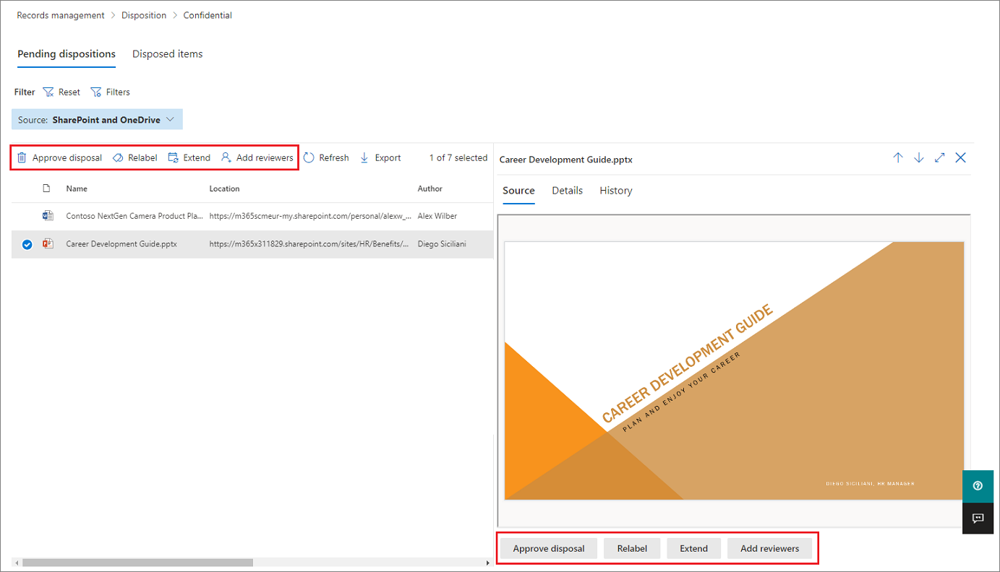

# 内容的处置

>*[Microsoft 365 安全性与合规性许可指南](https://aka.ms/ComplianceSD)。*

使用 Microsoft 365 合规性中心中的**记录管理**中的 "**处置**" 选项卡来管理处置评审并查看保留期结束时自动删除的[记录](records.md)。 

## 查看内容处置的先决条件

若要管理处置评审并确认已删除记录，您必须具有足够的权限，并且必须启用审核。

### 处置权限

若要成功访问 Microsoft 365 合规性中心中的 "**处置**" 选项卡，用户必须具有 "**处置管理**" 角色和 "**仅查看审核日志**" 角色。 虽然标准建议是将用户添加到默认角色组，在这种情况下，我们建议您创建一个名为 "**处置审阅者**" 的新角色组，该角色组具有这两个角色，并根据需要向该组添加用户。 用于处置的单个角色组可减少管理开销，并使用户能够更轻松地拥有所需的组合权限。

> [!NOTE]
> 即使是全局管理员也需要授予**处置管理**角色。 因此，如果全局管理员需要访问 "处置审阅者" 角色组的成员，则将其作为 "处置**审阅者**" 角色组的成员。 

特定于**仅查看审核日志**角色：

- 由于用于搜索审核日志的基础 cmdlet 是 Exchange Online cmdlet，因此您必须使用 exchange [online 中的 exchange 管理中心](https://docs.microsoft.com/Exchange/exchange-admin-center)（而不是使用 Security & 合规性中心中的 "**权限**" 页）为用户分配此角色。 有关说明，请参阅[在 Exchange Online 中管理角色组](https://docs.microsoft.com/Exchange/permissions-exo/role-groups)。

- 此角色不支持 Microsoft 365 组（[以前称为 "Office 365 组](https://techcommunity.microsoft.com/t5/microsoft-365-blog/office-365-groups-will-become-microsoft-365-groups/ba-p/1303601)"）。 而是分配用户邮箱、邮件用户或启用邮件的安全组。

有关向用户授予**处置管理**角色和创建新的**处置审阅者**角色的说明，请参阅[向用户授予对 Office 365 安全 &amp; 合规中心的访问权限](../security/office-365-security/grant-access-to-the-security-and-compliance-center.md)。

### 启用审核

确保至少已在第一个处置操作之前的一天内启用审核。 有关详细信息，请参阅[在 Office 365 安全 &amp; 合规中心中搜索审核日志](search-the-audit-log-in-security-and-compliance.md)。 

## 处置评审

当内容到达其保留期结束时，您可能需要查看内容以决定是否可以安全地删除（"已释放"），这有几个原因。 例如，您可能需要执行以下操作：
  
- 在诉讼或审核事件中，挂起对相关内容的删除。
    
- 如果内容具有信息检索或历史值，则从处置列表中移除要存储在存档中的内容。
    
- 为内容分配不同的保留期，可能是因为原始保留设置是临时或临时的解决方案。
    
- 将内容返回给客户端或将其转移到其他组织。

在保留期结束时触发处置评审时：
  
- 您选择的人会收到一封电子邮件通知，告知他们有要审阅的内容。 这些审阅者可以是单独的用户、分发或安全组，也可以是 Microsoft 365 组（[以前称为 Office 365 组](https://techcommunity.microsoft.com/t5/microsoft-365-blog/office-365-groups-will-become-microsoft-365-groups/ba-p/1303601)）。 请注意，每周会发送通知。
    
- 审阅者转到 Microsoft 365 合规性中心中的 "**处置**" 选项卡，以查看内容并决定是永久删除它、延长保留期还是应用不同的保留标签。

处置评审可以包含 Exchange 邮箱、SharePoint 网站、OneDrive 帐户和 Microsoft 365 组中的内容。 在这些位置中等待处置评审的内容仅在审阅者选择永久删除内容后才会被删除。

> [!NOTE]
> 邮箱必须至少有 10 MB 数据才能支持处置评审。

您可以在 "**概述**" 选项卡中看到所有待处理的处置的概述。例如：

当您选择 "**查看所有待处理的处理**" 时，您将转到 "**处置**" 页面。 例如：

### 用于处置评审的工作流

下图显示了在发布保留标签并随后由用户手动应用时进行处置评审的基本工作流。 此外，还可以将为处置评审配置的保留标签自动应用于内容。
  

  
在保留期结束时触发处置评审是一个仅可用于保留标签的配置选项。 此选项不适用于保留策略。 有关这两种保留解决方案的详细信息，请参阅[了解保留策略和保留标签](retention.md)。
  

 
> [!NOTE]
> 当您选择 "**当有准备好查看的项目时通知这些人**" 选项时，请指定一个用户或已启用邮件的安全组。 此选项不支持 Microsoft 365 组（[以前称为 "Office 365 组](https://techcommunity.microsoft.com/t5/microsoft-365-blog/office-365-groups-will-become-microsoft-365-groups/ba-p/1303601)"）。

### 查看和处置内容

当通过电子邮件通知审阅者可以查看内容时，他们会从 Microsoft 365 合规性中心的**记录管理**转到 "**处置**" 选项卡。 审阅者可以查看每个保留标签的项目数正在等待处置，然后选择保留标签以查看具有该标签的所有内容。

选择保留标签后，您将看到 "**挂起处置**" 选项卡中该标签的所有待定的处置。选择一个或多个项目，您可以在其中选择操作并输入理由注释：

正如您可以从图片中看到的，受支持的操作是： 
  
- 永久删除项目
- 延长保留期
- 应用不同的保留标签

为您提供对位置和内容的权限，您可以使用**位置**列中的链接查看其原始位置中的文档。 在处置评审过程中，内容永远不会从其原始位置移动，并且在审阅者选择执行此操作之前永远不会删除。

电子邮件通知将在每周的基础上自动发送给审阅者。 此计划的过程意味着，当内容到达其保留期的末尾时，审阅者可能需要长达七天的时间，审阅者收到内容正在等待处置的电子邮件通知。
  
可以审核所有处置操作，并将审阅者输入的调整文本保存并显示在 "已**释放项目**" 页上的 "**注释**" 列中。
  
### 在永久删除已释放内容之前的时间

等待处置评审的内容仅在审阅者选择永久删除内容后才会被删除。 当审阅者选择此选项时，SharePoint 网站或 OneDrive 帐户中的内容将成为符合[保留设置如何与内容配合](retention.md#how-retention-settings-work-with-content-in-place)使用的标准清理过程。

## 记录的处置

> [!NOTE]
> 若要查看在没有处置评审的情况下自动删除的记录，可以在四月份和5月2020之间逐步向租户推出租户，因此您可能无法立即看到此体验。

使用 "**记录管理**" 页上的 "**处置**" 选项卡来标识自动删除的记录。 这些项目在 "**类型**" 列中显示已**处置的记录**。 例如：

在 "已**释放的项目**" 选项卡中显示的记录标签的项目在项目被释放前最长为7年，在该时间段中每条记录的项目数限制为1000000。 如果您看到 "**计数**数量" 接近此限制1000000，并且您需要对记录进行处置证明，请与[Microsoft 支持](https://docs.microsoft.com/office365/admin/contact-support-for-business-products)部门联系。

> [!NOTE]
> 此功能基于[统一审核日志](search-the-audit-log-in-security-and-compliance.md)中的信息，因此需要[启用和可搜索](turn-audit-log-search-on-or-off.md)审核，以便捕获相应的事件。
    
## 筛选和导出视图

当您从 "**处置**" 页面中选择保留标签时，"**挂起的处置**" 选项卡（如果适用）和 "已**释放的项目**" 选项卡允许您筛选视图以帮助更轻松地查找项目。 

对于挂起的处置，时间范围基于到期日期。 对于已释放的项目，时间范围基于删除日期。
  
您可以将任一视图中项目的相关信息导出为 .csv 文件，然后可以使用 Excel 进行排序和管理：

  

