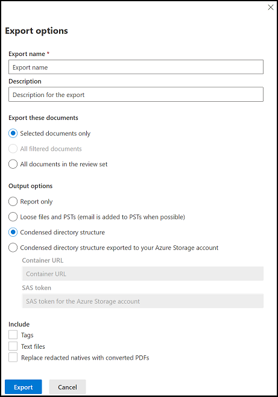

# 从审阅集中导出文档Export documents from a review set

导出允许用户自定义下载包中包含的内容。Export allows users to customize the content that is included in the download package. 导出工具提供了具有以下设置的配置页：The Export tool provides a configuration page with the following settings:

## 导出选项Export options

- 导出名称：导出作业的名称。Export name: Name of the export job.

- 说明：用于添加说明的自由文本字段。Description: Free-text field for you to add a description.

- 导出这些文档：Export these documents:

  - 仅选定文档-仅导出当前选定的文档。Selected documents only - Exports only the documents that are currently selected.
  
  - 审阅集内的所有文档-导出审阅集中的所有文档All documents in the review set - Exports all documents in the review set

- 元数据Metadata
  
  - 加载文件-此文件包含每个文件的元数据。Load file - This file contains metadata for each file. 有关包含哪些字段的详细信息，请参阅 [高级电子数据展示中的文档元数据字段](document-metadata-fields-in-Advanced-eDiscovery.md) 。see [Document metadata fields in Advanced eDiscovery](document-metadata-fields-in-Advanced-eDiscovery.md) for more information about what fields are included. 此文件通常可由第三方电子数据展示工具引入。This file can typically be ingested by third-party eDiscovery tools.
  
  - 标记-如果选择此选项，则会将标记信息包含在加载文件中。Tags - When selected, tagging information will be included in the load file.

- 内容Content
  
  - 本机文件-选中此复选框可包含本机文件。Native files - Select this checkbox to include the native files.
  
  - 对话选项Conversation options
    
    - 会话文件-导出会重建聊天消息。Conversation files - Export reconstructed chat messages. 此格式以类似于用户在本机应用程序中看到的内容的形式显示对话。This format presents conversations in a form that resembles what users see in the native application.
    
    - 单个聊天邮件-在 Microsoft 365 中存储原始对话文件时将其导出。Individual chat messages - Export the original conversation files as they are stored in Microsoft 365.

- 选项Options

  - 文本文件-包括已提取的本机文件的文本版本。Text files - Include extracted text versions of native files.
  
  - 将编辑 natives 替换为转换后的 Pdf-如果在审阅过程中生成编辑 PDF 文件，则可使用这些文件进行导出。Replace redacted natives with converted PDFs - If redacted PDF files are generated during review, these files are available for export. 您可以选择仅导出编辑 (的本机文件，而不选择此选项) 也可以选择此选项导出包含实际密文的 PDF 文件。You can choose to export only the native files that were redacted (by not selecting this option) or you can select this option to export the PDF files that contain the actual redactions.

-  (导出内容的输出选项可通过 web 浏览器直接下载，也可发送到 Azure 存储帐户。Output options (Exported content is either available for download directly through a web browser or can be sent to an Azure Storage account. 前两个选项启用直接下载。 ) The first two options enable direct download.)
  
  - 如果可能) 文件以用户的本机应用程序中显示的原始目录结构的格式导出，则会将松散文件和 Pst (电子邮件添加到 Pst。Loose files and PSTs (email is added to PSTs when possible) - Files are exported in a format that resembles the original directory structure seen by users in their native applications.  有关详细信息，请参阅 " [松散文件和 PST 导出结构](#loose-files-and-pst-export-structure) " 部分。For more information, see the [Loose files and PST export structure](#loose-files-and-pst-export-structure) section.
  
  - 紧缩目录结构-导出文件并将其包含在下载内容中。Condensed directory structure - Files are exported and included in the download.
  
  - 导出到 Azure 存储帐户的紧缩目录结构-文件将导出到您的组织的 Azure 存储 accouunt。Condensed directory structure exported to your Azure Storage account - Files are exported to your organization's Azure Storage accouunt.

## 松散文件和 PST 导出结构Loose files and PST export structure

如果选择此导出选项，则导出的内容将按以下结构进行组织：If you select this export option, the exported content is organized in the following structure:

- 根文件夹–命名 ExportName.zip 中的此文件夹Root folder – This folder in named ExportName.zip
  
  - Export_load_file.csv 元数据文件。Export_load_file.csv - Metadata file.
  
  - Summary.csv-也包含导出统计信息的摘要文件。Summary.csv - A summary file that also contains export statistics.
  
  - Exchange-此文件夹包含本机文件格式的 Exchange 中的所有内容。Exchange - This folder contains all content from Exchange in native file format. 如果选择 "将 **编辑 Natives 替换为转换的 pdf** " 选项，Natives 文件将被替换为编辑 pdf。Natives files are replaced with redacted PDFs if you selected the **Replace redacted natives with converted PDFs** option.
  
  - SharePoint = 此文件夹以本机文件格式包含来自 SharePoint 的所有本机内容。SharePoint = This folder contains all native content from SharePoint in a native file format. 如果选择 "将 **编辑 Natives 替换为转换的 pdf** " 选项，Natives 文件将被替换为编辑 pdf。Natives files are replaced with redacted PDFs if you selected the **Replace redacted natives with converted PDFs** option.

## 紧缩目录结构Condensed directory structure

- 根文件夹-此文件夹命名为 ExportName.zipRoot folder - This folder is named ExportName.zip
  
  - Export_load_file.csv 元数据文件。Export_load_file.csv - Metadata file.
  
  - Summary.txt-也包含导出统计信息的摘要文件。Summary.txt - A summary file that also contains export statistics.
  
  - Input_or_native_files-此文件夹包含导出的所有本机文件。Input_or_native_files - This folder contains all the native files that were exported. 如果您导出编辑 PDF 文件，则它们不会放入 PST 文件中。If you export redacted PDF files, they are not put in PST files. 相反，它们将被添加到一个单独的文件夹中。Instead, they're added to a separated folder.
  
  - Error_files-此文件夹包含以下错误文件（如果导出中包含这些文件）：Error_files - This folder contains the following error files, if they are included in the export:
    
    - ExtractionError.ExtractionError. 一个 CSV 文件，其中包含未从父文件正确提取的任何可用的文件元数据。A CSV file that contains any available metadata of files that weren't properly extracted from parent files.
    
    - ProcessingError –此文件包含有处理错误的文档列表。ProcessingError – This file contains a list of documents with processing errors. 此内容是项目级的，这意味着如果附件导致处理错误，则包含附件的电子邮件将包含在此文件夹中。This content is item-level, meaning if an attachment resulted in a processing error, the email message that contains the attachment is included in this folder.
  
  - Extracted_text_files-此文件夹包含在处理过程中生成的所有提取的文本文件。Extracted_text_files - This folder contains all of the extracted text files that were generated at processing.

> [!NOTE]
> 导出作业在案例的生命周期内保留，并且在不删除该事例的情况下可进行下载。Export jobs are retained for the life of the case and can be downloaded as long as the case isn't deleted.
