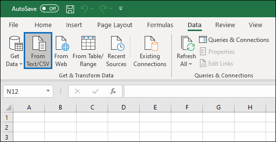

# <a name="export-configure-and-view-audit-log-records"></a>导出、配置和查看审核日志记录

在搜索审核日志将搜索结果下载到 CSV 文件后，该文件包含一个名为 **AuditData** 的列，其中包含有关每个事件的其他信息。 此列中的数据的格式设置为 JSON 对象，该对象包含多个配置为 *property：value* 对的属性，用逗号分隔。 可以使用 Excel Power Query Editor 中的 JSON 转换功能将 **AuditData** 列中 JSON 对象中的每个属性拆分为多个列，以便每个属性都有自己的列。 这允许您对一个或多个属性进行排序和筛选，这可以帮助您快速找到要查找的特定审核数据。

## <a name="step-1-export-audit-log-search-results"></a>步骤 1：导出审核日志搜索结果

第一步是搜索审核日志，然后将结果以逗号分隔的值导出 (CSV) 文件导出到本地计算机。
  
1. 运行审核日志 [搜索](search-the-audit-log-in-security-and-compliance.md#search-the-audit-log) 并根据需要修改搜索条件，直到获得所需结果。

2. 单击 **"导出结果"，** 然后选择 **"下载所有结果"。** 

   

   此选项可从步骤 1 中审核日志搜索导出所有审核记录，将原始数据从 审核日志下载到 CSV 文件。 

   窗口底部将显示一条消息，提示您打开或保存 CSV 文件。 

3. 单击 **">另存** 为"，将 CSV 文件保存到本地计算机。 下载许多搜索结果需要一段时间。 搜索所有活动或广泛日期范围时，通常会发生此情况。 当 CSV 文件完成下载时，窗口底部将显示一条消息。

   

> [!NOTE]
  > 你可以将最多 50,000 个条目从单个审核日志搜索中下载到 CSV 文件。 如果下载了 50,000 个条目到 CSV 文件，则可以假定可能存在超过 50,000 个符合搜索条件的事件。 若要导出超过此限制，请尝试使用日期范围来减少记录审核日志的数量。 你可能需要使用更小日期范围运行多个搜索来导出超过 50,000 个条目。

## <a name="step-2-format-the-exported-audit-log-using-the-power-query-editor"></a>步骤 2：使用 Power Query 编辑器审核日志导出的查询

下一步是使用 Excel Power Query Editor 中的 JSON 转换功能将 **AuditData** 列中 JSON 对象的每个属性拆分为其自己的列。 然后，筛选列以根据特定属性的值查看记录。 这可以帮助您快速找到要查找的特定审核数据。

1. 在 Excel for Office 365、Excel 2019 或 Excel 2016 中打开空白工作簿。

2. 在"**数据"** 选项卡上的"&**转换数据** 功能区组中，单击 **"自文本/CSV"。**

    

3. 打开在步骤 1 中下载的 CSV 文件。

4. 在显示的窗口中，单击"**转换数据"。**

   

   CSV 文件在查询编辑器 **中打开**。 有四列：CreationDate、UserIds、Operations和 **AuditData。**   **AuditData** 列是包含多个属性的 JSON 对象。 下一步是为 JSON 对象中的每个属性创建一列。

5. 右键单击 **AuditData** 列中的标题，单击 **"转换**"，然后单击 **JSON。** 

   

6. 在 **AuditData** 列的右上角，单击展开图标。

   

   将显示 **AuditData** 列中 JSON 对象中的属性部分列表。

7. 单击 **"加载更多** "以显示 **AuditData** 列中 JSON 对象的所有属性。

   

   可以取消选中不想包含的任何属性旁边的复选框。 消除对调查没有用处的列是减少数据展示中审核日志。 

   > [!NOTE]
   > 单击"加载更多) "后，上一个屏幕截图中显示的 J  (SON 属性) 这些属性基于 CSV 文件中前 1，000 行的 **AuditData** 列中的属性。 如果前 1，000 行后的记录中有不同的 JSON 属性，则当 **AuditData** 列拆分为多个列时，这些属性 (和相应的列) 将不包含。 为了帮助防止这种情况，请考虑重新运行审核日志并缩小搜索条件范围，以便返回的记录更少。 另一个解决方法是筛选"操作"列中的项，以减少 (行数，然后再在 **AuditData** 列中转换 JSON 对象之前执行) 上的步骤 5。

   > [!TIP]
   > 若要查看列表（如 AuditData.AffectedItems）中的属性，请单击要拉取属性的列右上角的"展开"图标，然后选择"展开到 **新建行"。**  在这里，它将是一条记录，您可以单击列右上角的"展开"图标，查看属性，然后选择要查看或提取的属性。

8. 执行下列操作之一，设置为所选每个 JSON 属性添加的列标题的格式。

    - 取消选择"使用原始 **列名称作为** 前缀"复选框，以使用 JSON 属性的名称作为列名称;例如 **，RecordType** 或 **SourceFileName。**

    - 保留 **选中"使用原始列名称作为前缀**"复选框以将 AuditData 前缀添加到列名称中;例如 **，AuditData.RecordType** 或 **AuditData.SourceFileName。**

9. 单击“确定”。

    **AuditData** 列拆分为多个列。 每个新列对应于 AuditData JSON 对象中的一个属性。 列的每一行都包含属性的值。 如果属性不包含值，则显示 *空* 值。 在 Excel 中，值为 null 的单元格为空。
  
10. 在 **"主页** "选项卡 **上** ，&加载以关闭 Power Query 编辑器，并打开 Excel 工作簿中转换后的 CSV 文件。

## <a name="use-powershell-to-search-and-export-audit-log-records"></a>使用 PowerShell 搜索和导出审核日志记录

您可以使用 Exchange Online PowerShell 中的 [Search-UnifiedAuditLog](https://docs.microsoft.com/powershell/module/exchange/search-unifiedauditlog) cmdlet 将 审核日志 搜索的结果导出到 CSV 文件，而不是使用安全与合规中心中的 审核日志 & 搜索工具。 然后，可以按照步骤 2 中所述的相同过程，审核日志 Power Query 编辑器设置数据格式。 使用 PowerShell cmdlet 的一个优点是，可以使用 RecordType 参数从特定 *服务搜索* 事件。 下面是几个使用 PowerShell 将审核记录导出到 CSV 文件的示例，以便您可以使用 Power Query 编辑器转换 **AuditData** 列中的 JSON 对象，如步骤 2 中所述。

本示例中，运行以下命令以返回与 SharePoint 共享操作相关的所有记录。

```powershell
$auditlog = Search-UnifiedAuditLog -StartDate 06/01/2019 -EndDate 06/30/2019 -RecordType SharePointSharingOperation
```

```powershell
$auditlog | Select-Object -Property CreationDate,UserIds,RecordType,AuditData | Export-Csv -Path c:\AuditLogs\PowerShellAuditlog.csv -NoTypeInformation
```

搜索结果将导出到名为 *PowerShellAuditlog* 的 CSV 文件，该文件包含四列：CreationDate、UserIds、RecordType、AuditData) 。

您还可以将记录类型的名称或枚举值用作 *RecordType* 参数的值。 有关记录类型名称及其对应的枚举值的列表，请参阅 [Office 365](https://docs.microsoft.com/office/office-365-management-api/office-365-management-activity-api-schema#enum-auditlogrecordtype---type-edmint32)管理活动 API 架构中的 *AuditLogRecordType* 表。

只能包含 *RecordType* 参数的单个值。 若要搜索其他记录类型的审核记录，必须再次运行上述两个命令以指定不同的记录类型，将这些结果追加到原始 CSV 文件。 例如，您将运行以下两个命令，将 SharePoint 文件活动从同一日期范围添加到PowerShellAuditlog.csv文件。

```powershell
$auditlog = Search-UnifiedAuditLog -StartDate 06/01/2019 -EndDate 06/30/2019 -RecordType SharePointFileOperation
```

```powershell
$auditlog | Select-Object -Property CreationDate,UserIds,RecordType,AuditData | Export-Csv -Append -Path c:\AuditLogs\PowerShellAuditlog.csv -NoTypeInformation
```

## <a name="tips-for-exporting-and-viewing-the-audit-log"></a>导出和查看视图的审核日志

下面是使用 JSON 转换功能将 **AuditData** 列拆分为多个审核日志之前和之后导出和查看列的一些提示和示例。

- 筛选 **RecordType** 列，以仅显示特定服务或功能区域中的记录。 例如，若要显示与 SharePoint 共享相关的事件，请选择 **14** (SharePoint 共享活动触发的记录的枚举) 。 有关与 **RecordType** 列中显示的枚举值对应的服务列表，请参阅 "记录类型"[列中审核日志。](detailed-properties-in-the-office-365-audit-log.md)

- 筛选 **"操作** "列以显示特定活动的记录。 有关与安全 & 合规中心 审核日志 搜索工具中的可搜索活动对应的大多数操作的列表，请参阅安全与合规中心的 审核日志 中的"审核的活动 [&"部分](search-the-audit-log-in-security-and-compliance.md#audited-activities)。
