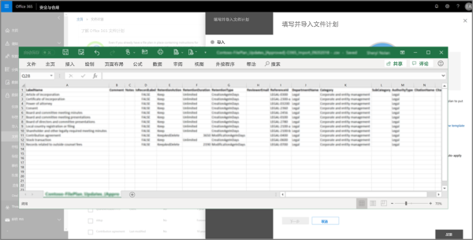
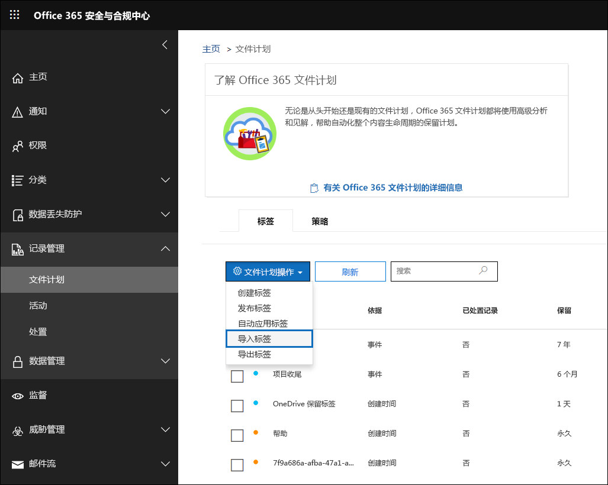
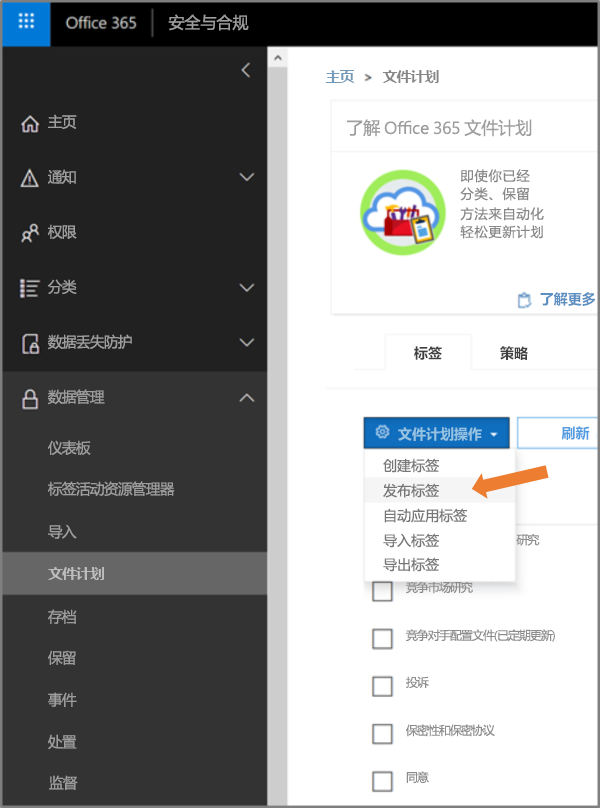

# 文件计划管理器概述Overview of file plan manager

文件计划管理器提供了对保留标签和保留标签策略的高级管理功能，并提供了便于遍历整个内容生存期（从创建、协作、记录声明、保留到最终处置）中的标签活动和标签到内容活动的集成方式。File plan manager provides advanced management capabilities for retention labels, retention label policies, and provides an integrated way to traverse label and label-to-content activity for your entire content lifecycle – from creation, through collaboration, record declaration, retention, and finally disposition. 

若要访问安全与合规中心中的文件计划管理器，请转到“**记录管理**” > “**文件计划**”。To access file plan manager in the security and compliance center, go to **Records management** > **File plan**.

## 访问文件计划管理器Accessing file plan manager

若要访问文件计划管理器，需要满足以下两项要求：There are two requirements to access file plan manager, they are:

- 拥有 Office 365 企业版 E5 订阅。An Office 365 Enterprise E5 subscription.

- 在安全与合规中心，已为用户分配了以下角色之一：The user has been in assigned one of the following roles in the security and compliance center:
    
    - 保留管理者Retention Manager
    
    - 仅拥有查看权限的保留管理者View-only Retention Manager

## 默认保留标签和标签策略Default retention labels and label policy

如果“安全与合规中心”没有保留标签，则第一次在左侧导航栏中选择**文件计划**时，将创建名为**默认数据治理发布策略**的标签策略。If there are no retention labels in the Security & Compliance Center, the first time you choose **File plan** in the left nav, this creates a label policy called **Default Data Governance Publishing Policy**. 

此标签策略包含三个保留标签：This label policy contains three retention labels:

- **操作过程****Operational procedure**
- **业务常规****Business general**
- **合同协议****Contract agreement**

这些保留标签仅为保留内容，而非为删除内容而配置。These retention labels are configured only to retain content, not delete content. 此标签策略将发布到整个公司，可以禁用或删除。This label policy will be published to the entire organization and can be disabled or removed. 

可以通过查看保留策略的**创建的保留策略**和**创建的保留配置**活动的审核日志来判断谁打开了文件计划管理器并启动了首次运行体验。You can determine who opened file plan manager and kicked off the first-run experience by reviewing the audit log for the activities **Created retention policy** and **Created retention configuration for a retention policy**.

> [!NOTE]
> 因客户反馈，我们已删除创建上述默认保留标签和保留标签策略的功能。Due to customer feedback, we have removed this feature that creates the default retention labels and retention label policy mentioned above. 如果你在 2019 年 4 月 11 日之前打开文件计划管理器，则将只能看到这些保留标签和保留标签策略。You will only see these retention labels and retention label policy if you opened file plan manager before April 11, 2019.

## 浏览文件计划Navigating your file plan

使用文件计划管理器，可以更轻松地在一个视图中查看所有保留标签和保留策略的设置。File plan manager makes it easier see into and across the settings of all your retention labels and policies from one view.

请注意，文件计划中包含在文件计划内外创建的保留标签。Note that retention labels created outside of the file plan will be available in the file plan and vice versa.

文件计划“**标签**”选项卡提供了以下附加信息和功能：On the file plan **Labels** tab, the following additional information and capabilities are available:

### “标签设置”列Label settings columns

- “依据”\*\*\*\* 列指明将启动保留期的触发器类型。有效值为：**Based on** identifies the type of trigger that will start the retention period. Valid values are:
    - 事件Event
    - 创建时间When created
    - 上次修改时间When last modified
    - 标记时间When labeled
- “记录”\*\*\*\* 列指明项是否在标签应用时成为已声明记录。有效值为：**Record** identifies if the item will become a declared record when the label is applied. Valid values are:
    - 否No
    - 是Yes
    - 是(法规)Yes(Regulatory)
- “保留”\*\*\*\* 列指明保留类型。有效值为：**Retention** identifies the retention type. Valid values are:
    - 保留Keep
    - 保留和删除Keep and delete
    - 删除Delete
- “处置”\*\*\*\* 列指明在保留期到期时如何处置内容。有效值为：**Disposition** identifies what will happen to the content at the end of the retention period. Valid values are:
    - Nullnull
    - 无操作No action
    - 自动删除Auto-delete
    - 需要评审(亦称为“处置评审”)Review required (aka Disposition review)

### 保留标签文件计划描述符列Retention label file plan descriptors columns

现在可以在保留标签的配置中添加更多信息。You can now include more information in the configuration of your retention labels. 将文件计划描述符插入保留标签，可提升文件计划的可管理性和条理性。Inserting file plan descriptors into retention  labels will improve the manageability and organization of your file plan.

为了便于用户上手，文件计划管理器提供了一些现成值：“功能/部门”、“类别”、“权限类型”和“预配/引文”。To get you started, file plan manager provides some out-of-box values for: Function/department, Category, Authority type and Provision/citation. 可以在创建或编辑保留标签时，添加新的文件计划描述符值。You can add new file plan descriptor values when creating or editing a retention label. 你也可以在将保留标签导入文件计划时指定文件计划描述符。You can also specify file plan descriptors when importing retention labels into your file plan. 

下图展示了创建或编辑保留标签时有关文件计划描述符的步骤。Here's a view of the file plan descriptors step when creating or editing a retention label.

下图展示了文件计划管理器的“**标签**”选项卡上的文件计划描述符列。Here's a view of the file plan descriptors columns on the **Labels** tab of file plan manager.

## 导出所有现有保留标签以分析和/或执行离线评审Export all existing retention labels to analyze and/or perform offline reviews

在文件计划管理器中，可以将所有保留标签的详细信息都导出到 .csv 文件中，这样做有助于推动定期与组织中数据管理利益干系人一起执行合规性评审。From file plan manager, you can export the details of all retention labels into a .csv file to assist you in facilitating periodic compliance reviews with data governance stakeholders in your organization.

若要导出所有保留标签，请在“**文件计划**”页面上，依次选择“**文件计划操作**”\>“**导出标签**”。To export all retention labels: On the **File plan** page, **File plan actions** \> **Export labels**.

此时，包含所有现有保留标签的 \*.csv 文件打开。A \*.csv file containing all existing retention labels will open.

## 向文件计划导入保留标签Import retention labels into your file plan

在文件计划管理器中，可以批量导入新保留标签，并能修改现有保留标签。In the File plan manager, you can bulk import new retention labels and modify existing retention labels.

若要导入新的保留标签和修改现有保留标签，请执行以下操作：To import new retention labels and modify existing retention labels: 

1. 在“**文件计划**”页面上，转到“**文件计划操作**” > “**导入标签**”。On the **File plan** page, go to **File plan actions** > **Import labels**.

   

   

2. 下载空白模板以导入新的保留标签。Download a blank template to import new retention labels. 或者，你也可以从导出组织中的现有保留标签时导出的 .csv 文件开始。Alternatively, you can start with the .csv file that is exported when you export the existing retention labels in your organization.

   

3. 填写模板。Fill-out the template. 下文介绍了文件计划模板中每个属性的属性和有效值。The following describes the properties and valid values for each property in the file plan template. 

   |**Property****Property**|**类型****Type**|**有效值****Valid values**|
   |:-----|:-----|:-----|
   |LabelNameLabelName|字符串String|此属性指定保留标签的名称。This property specifies the name of the retention label.|
   |评论Comment|字符串String|使用此属性可以添加有关管理员的保留标签的说明。Use this property to add a description about the retention label for admins. 此说明仅对在安全与合规中心管理标签的管理员显示。This description appears only to admins who manage the label in the security and compliance center.|
   |备注Notes|字符串String|使用此属性可以添加有关用户的保留标签的说明。Use this property to add a description about the retention label for users. 当用户将鼠标悬停在 Outlook、SharePoint 和 OneDrive 等应用的标签上时，将显示此说明。This description appears when users hover over the label in apps like Outlook, SharePoint, and OneDrive. 如果将此属性保留为空白，则会显示默认说明，用于说明标签的保留设置。If you leave this property blank, a default description is displayed, which explains the label's retention settings. |
   |IsRecordLabelIsRecordLabel|字符串String|此属性指定标签是否为记录标签。This property specifies whether the label is a record label. 带有记录标签的项目声明为记录。Items tagged with a record label are declared as records. 有效值为：Valid values are: **TRUE**：标签是记录标签。**TRUE**: The label is a record label. 请注意，无法删除声明为记录的项目。Note that items that are declared as a record can't be deleted.  **FALSE**：标签不是记录标签。**FALSE**: The label isn't a record label. 此值为默认值。This is the default value.|
   |RetentionActionRetentionAction|字符串String|此属性指定在 RetentionDuration 属性指定的值到期后要采取的操作。This property specifies what action to take after the value specified by the RetentionDuration property expires. 有效值为：Valid values are: **Delete**：早于 RetentionDuration 属性指定的值的项目将被删除。**Delete**: Items older than the value specified by the RetentionDuration property are deleted. **Keep**：在 RetentionDuration 属性指定的保留期内保留项目，然后在保留期到期时不执行任何操作。**Keep**: Retain items for the duration specified by the RetentionDuration property and then doing nothing when the duration period expires.  **KeepAndDelete**：在 RetentionDuration 属性指定的保留期内保留项目，然后在保留期到期时删除这些项目。**KeepAndDelete**: Retain items for the duration specified by the RetentionDuration property and then delete them when the duration period expires.   |
   |RetentionDurationRetentionDuration|StringString|此属性指定内容保留的天数。This property specifies the number of days to retain the content. 有效值为：Valid values are: **Unlimited**：项目将无限期保留。**Unlimited**: Items will be retained indefinitely.  ***n***：正整数，例如 **365**。***n***: A positive integer; for example, **365**. 
   |RetentionTypeRetentionType|字符串String|此属性指定保留期限是从内容创建日期、事件日期、标记的日期还是从上次修改日期开始计算。This property specifies whether the retention duration is calculated from the content creation date, event date, labeled (tagged) date, or last modified date. 有效值为：Valid values are: **CreationAgeInDays****CreationAgeInDays** **EventAgeInDays****EventAgeInDays** **TaggedAgeInDays****TaggedAgeInDays** **ModificationAgeInDays****ModificationAgeInDays** |
   |ReviewerEmailReviewerEmail|SmtpAddressSmtpAddress|填充此属性后，在保留期到期时将触发处置评审。When this property is populated, a disposition review will be triggered when the retention duration expires. 此属性指定 **Delete** 和 **KeepAndDelete** 保留操作的审阅者的电子邮件地址。This property specifies the email address of a reviewer for **Delete** and **KeepAndDelete** retention actions. 可包含单个用户、分发或安全组或 Office 365 组的电子邮件地址。You can include the email address of individual users, distribution or security groups, or Office 365 groups. 可以指定多个电子邮件地址，中间用逗号分隔。You can specify multiple email addresses separated by commas.|
   |ReferenceIdReferenceId|字符串String|该属性指定在 **参考 ID** 文件计划描述符中显示的值。This property specifies the value that's displayed in the **Reference Id** file plan descriptor.| 
   |DepartmentnameDepartmentName|字符串String|该属性指定在**功能/部门**文件计划描述符中显示的值。This property specifies the value that's displayed in the **Function/department** file plan descriptor.|
   |类别Category|字符串String|该属性指定在**类别**文件计划描述符中显示的值。This property specifies the value that's displayed in the **Category** file plan descriptor.|
   |SubCategorySubCategory|字符串String|该属性指定在**子类别**文件计划描述符中显示的值。This property specifies the value that's displayed in the **Sub category** file plan descriptor.|
   |AuthorityTypeAuthorityType|字符串String|该属性指定在**权限类型**文件计划描述符中显示的值。This property specifies the value that's displayed in the **Authority type** file plan descriptor.|
   |CitationNameCitationName|字符串String|该属性指定在**预配/引文**文件计划描述符中显示的引文名称；例如“2002 年萨班斯-奥克斯利法案”。This property specifies the name of the citation displayed in the **Provision/citation** file plan descriptor; for example "Sarbanes-Oxley Act or 2002". |
   |CitationUrlCitationUrl|字符串String|该属性指定在**预配/引文**文件计划描述符中显示的 URL。This property specifies the URL that's displayed in the **Provision/citation** file plan descriptor.|
   |CitationJurisdictionCitationJurisdiction|字符串String|该属性指定在**预配/引文**文件计划描述符中显示的管辖权地或机构；例如“美国证券交易委员会 (SEC)”。This property specifies the jurisdiction or agency that's displayed in the **Provision/citation** file plan descriptor; for example, "U.S. Securities and Exchange Commission (SEC)".|
   |RegulatoryRegulatory|字符串String|保留为空白。Leave blank. 此属性目前不可用。This property isn't used at this time.|
   |EventTypeEventType|StringString|此属性指定与标签关联的保留规则。This property specifies the retention rule that's associated with the label. 可以使用唯一标识该规则的任何值。You can use any value that uniquely identifies the rule. 例如：For example: **名称****Name** **可分辨名称 (DN)****Distinguished name (DN)** **GUID****GUID**  可使用 [Get-RetentionComplianceRule](https://docs.microsoft.com/powershell/module/exchange/policy-and-compliance-retention/get-retentioncompliancerule?view=exchange-ps) cmdlet 来查看可用的保留规则。You can use the [Get-RetentionComplianceRule](https://docs.microsoft.com/powershell/module/exchange/policy-and-compliance-retention/get-retentioncompliancerule?view=exchange-ps) cmdlet to view the available retention rules. 请注意，如果从某个 Office 365 组织导出标签，则将该标签导入其他 Office 365 组织时，不能使用该组织中的 EventType 属性值。Note that if you export labels from one Office 365 organization, you can't use the values for the EventType  property from that organization when importing labels to a different Office 365 organization. 这是因为 EventType 值对于组织是唯一的。That because the EventType values are unique to an organization. |
   |||

   下面是包含有关保留标签的信息的模板示例。Here's an example the template containing the information about retention labels.

   

4. 在“导入文件计划向导”页面的“步骤 3”下，单击“**浏览文件**”以上传已填写的模板。Under step 3 on the import file plan wizard page, click **Browse for files** to upload the filled-out template. 

   文件计划管理器会验证条目，并显示导入统计信息。File plan manager will validate the entries and display the import statistics.

   

   如果出现验证错误，文件计划导入将继续验证导入文件中的每个条目，并显示导入文件中引用行/行编号的所有错误，复制显示的错误结果，以便能够轻松返回导入文件并更正错误。In the event there is a validation error, file plan import will continue to validate every entry in the import file and display all errors referencing line/row numbers in the import file, copy the displayed error results so that you can easily return to the import file and correct the errors.

5. 导入完成后，返回到文件计划管理器，以将新保留标签与新的或现有的保留标签策略相关联。When the import is complete, return to file plan manager to associate the new retention labels to new or existing retention label policies.

   
