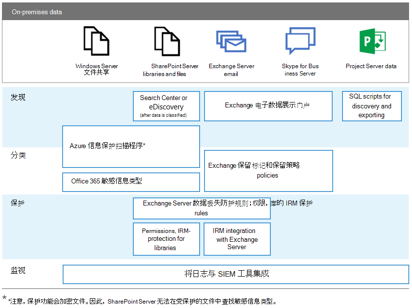

# 用于本地 Office 服务器的 GDPRGDPR for Office on-premises Servers

一般数据保护条例 (GDPR) 为组织提供了保护个人数据和适当回应数据主体请求的要求。本系列文章为本地工作负载提供了推荐的方法：The General Data Protection Regulation (GDPR) introduces requirements for organizations to protect personal data and respond appropriately to data subject requests. This series of articles provides recommended approaches for on-premises workloads:

- [SharePoint ServerSharePoint Server](gdpr-for-sharepoint-server.md)

- [Exchange ServerExchange Server](gdpr-for-exchange-server.md)

- [Skype for Business ServerSkype for Business Server](gdpr-for-skype-for-business-server.md)

- [Project ServerProject Server](gdpr-for-project-server.md)

- [Office Web Apps Server 和 Office Online ServerOffice Web Apps Server and Office Online Server](gdpr-for-office-online-server.md)

- [本地文件共享On-premises file shares](gdpr-for-on-premises-file-shares.md)

有关 GDPR 以及 Microsoft 如何为你提供帮助的详细信息，请参阅 [Microsoft 信任中心](https://www.microsoft.com/trust-center/privacy/gdpr-overview
)。For more information about the GDPR and how Microsoft can help you, see the [Microsoft Trust Center](https://www.microsoft.com/trust-center/privacy/gdpr-overview
).

在开展有关本地数据的任何工作之前，请咨询你的法律和合规性团队以寻求指导并了解现有分类架构和处理个人数据的方法。Microsoft 提供了有关在 Microsoft GDPR 数据发现工具包（位于 [https://aka.ms/gdprpartners](<https://aka.ms/gdprpartners>)）中开发和扩展分类架构的建议。此工具包还介绍了将本地数据移动到云的方法，可以使用更复杂的数据治理功能（如果需要）。该部分中的文章提供了有关保留在本地的数据的建议。Before doing any work with on-premises data, consult with your legal and compliance teams to seek guidance and to learn about existing classification schemas and approaches to working with personal data. Microsoft provides recommendations for developing and extending classifications schemas in the Microsoft GDPR Data Discovery Toolkit at [https://aka.ms/gdprpartners](<https://aka.ms/gdprpartners>). This toolkit also describes approaches for moving on-premises data to the cloud where you can use more sophisticated data governance capabilities, if this is desired. The articles in this section provide recommendations for data that is intended to remain on premises.

下图列出了在各个工作负载中使用的推荐功能，用于发现、保护和监视个人数据并对其进行分类。有关更多信息，请参阅该部分中的文章。The following illustration lists recommended capabilities to use across each of these workloads to discover, classify, protect, and monitor personal data. See the articles in this section for more information.

## 图示说明Illustration description

为便于访问，下表提供了上图中的相同示例。For accessibility, the following table provides the same examples in the illustration.

****

|操作Action|Windows Server 文件共享Windows Server file shares|SharePoint ServerSharePoint Server|Exchange ServerExchange Server|Skype for BusinessSkype for Business|Project ServerProject Server|
|---|---|---|---|---|---|
|发现Discover|Azure 信息保护扫描程序\*Azure Information Protection scanner\*|搜索中心或电子数据展示（对数据进行分类后）Search Center or eDiscovery (after data is classified)    Azure 信息保护扫描程序\*Azure Information Protection scanner\*|Exchange 电子数据展示门户Exchange eDiscovery Portal|Exchange 电子数据展示门户Exchange eDiscovery portal|用于发现和导出的 SQL 脚本SQL scripts for discovery and exporting|
|分类Classify|Azure 信息保护扫描程序\*Azure Information Protection scanner\*    Office 365 敏感信息类型Office 365 sensitive information types|Azure 信息保护扫描程序\*Azure Information Protection scanner\*    Office 365 敏感信息类型Office 365 sensitive information types|Exchange 保留标记和保留策略Exchange retention tags and retention policies|Exchange 保留标记和保留策略Exchange retention tags and retention policies||
|保护Protect||Exchange Server 数据丢失防护规则Exchange Server data loss prevention rules    权限、库 IRM-保护Permissions, IRM-protection for libraries|Exchange Server 数据丢失防护规则Exchange Server data loss prevention rules    IRM 与 Exchange Server 的集成IRM integration with Exchange Server|||
|监视Monitor|将日志与 SIEM 工具集成Integrate logs with SIEM tools|将日志与 SIEM 工具集成Integrate logs with SIEM tools|将日志与 SIEM 工具集成Integrate logs with SIEM tools|将日志与 SIEM 工具集成Integrate logs with SIEM tools|将日志与 SIEM 工具集成Integrate logs with SIEM tools|
|

\*注意，保护功能会加密文件。\* Note that protection encrypts the file. 因此，SharePoint Server 无法在受保护的文件中查找敏感信息类型。Consequently, SharePoint Server can't find the sensitive information types in protected files.
